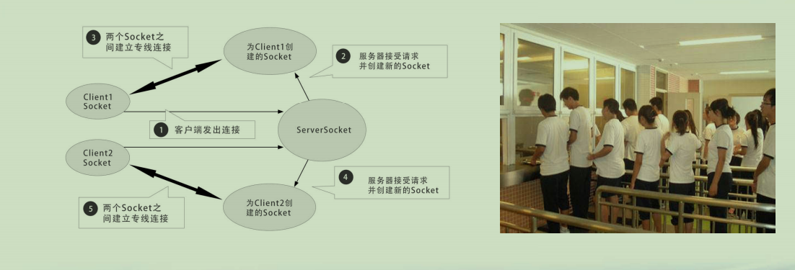
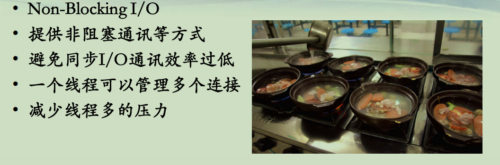
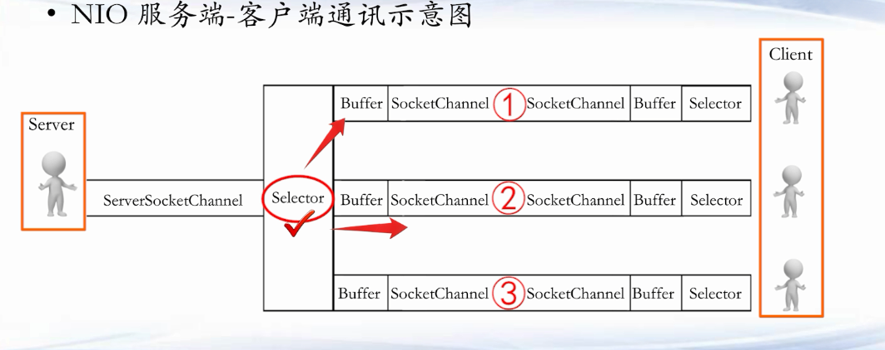

## Java NIO 编程

**BIO(1)**  
**• 传统的TCP和UDP通讯：Blocking I/O**  


**BIO(2)**




**NIO(1)**  
**• Non-Blocking I/O**  
**• 提供非阻塞通讯等方式**  
**• 避免同步I/O通讯效率过低**  
**• 一个线程可以管理多个连接**  
**• 减少线程多的压力**  




**NIO(2)**  
**• Non-Blocking I/O, 非阻塞I/O, (又名New I/O)**  
**• JDK 1.4引入，1.7升级NIO 2.0 (包括了AIO)**  
**• 主要在java.nio包中**  
**• 主要类**  
**– Buffer 缓存区(数据的容器)**  
**– Channel 通道(数据是在通道里面进行流动)**  
**– Selector多路选择器**  


**NIO(3)**  
**• NIO 服务端-客户端通讯示意图**  




**NIO(4)**  
**• Buffer 缓冲区，一个可以读写的内存区域**  
**– <u>ByteBuffer, CharBuffer</u>, DoubleBuffer, IntBuffer, LongBuffer, ShortBuffer ~~(StringBuffer 不是Buffer缓冲区)~~**  
**• 四个主要属性**  
**– capacity 容量， position 读写位置**  
**– limit 界限， mark 标记，用于重复一个读/写操作**  


**NIO(5)**  
**• Channel 通道**  
**– 全双工的，支持读/写(<u>而Stream流是单向的</u>)**  
**– 支持异步读写**  
**– 和Buffer配合，提高效率**  
**– <u>ServerSocketChannel 服务器TCP Socket 接入通道，接收客户端</u>**  
**– <u>SocketChannel TCP Socket通道，可支持阻塞/非阻塞通讯</u>**  
**– DatagramChannel UDP 通道**  
**– FileChannel 文件通道**  


**NIO(5)**  
**• Selector多路选择器**  
**– 每隔一段时间，不断轮询注册在其上的Channel**  
**– 如果有一个Channel有接入、读、写操作，就会被轮询出来**  
**– 根据SelectionKey可以获取相应的Channel，进行后续IO操作**  
**– 避免过多的线程**  
**– SelectionKey四种类型**  
**• OP_CONNECT(有人连接)**  
**• OP_ACCEPT（连接成功）**  
**• OP_READ（读）**  
**• OP_WRITE （写）** 


```java
package nio;

import java.io.IOException;
import java.net.InetSocketAddress;
import java.nio.ByteBuffer;
import java.nio.channels.SelectionKey;
import java.nio.channels.Selector;
import java.nio.channels.ServerSocketChannel;
import java.nio.channels.SocketChannel;
import java.util.Iterator;
import java.util.Set;

public class NioServer {

    public static void main(String[] args) throws IOException {
    	int port = 8001;
    	Selector selector = null;
    	ServerSocketChannel servChannel = null;
    	
    	try {
			selector = Selector.open();
			servChannel = ServerSocketChannel.open();
			servChannel.configureBlocking(false);
			servChannel.socket().bind(new InetSocketAddress(port), 1024);
			/*
			 * SelectionKey.OP_ACCEPT —— 接收连接进行事件，表示服务器监听到了客户连接，那么服务器可以接收这个连接了
			 * 
			 * SelectionKey.OP_CONNECT —— 连接就绪事件，表示客户与服务器的连接已经建立成功
			 * 
			 * SelectionKey.OP_READ  —— 读就绪事件，表示通道中已经有了可读的数据，可以执行读操作了（通道目前有数据，可以进行读操作了）
			 * 
			 * SelectionKey.OP_WRITE —— 写就绪事件，表示已经可以向通道写数据了（通道目前可以用于写操作）
			 */
			
			servChannel.register(selector, SelectionKey.OP_ACCEPT);
			System.out.println("服务器在8001端口守候");
		} catch (IOException e) {
			e.printStackTrace();
			System.exit(1);
		}
    	
    	while(true)
    	{
    		try {
    			//选择一组其相应通道准备好进行I / O操作的键 timeout:1000 milliseconds(毫秒)
    			selector.select(1000);
    			Set<SelectionKey> selectedKeys = selector.selectedKeys();
    			//每个Channel向Selector注册时,都将会创建一个selectionKey
    			Iterator<SelectionKey> it = selectedKeys.iterator();
    			SelectionKey key = null;
    			while (it.hasNext()) {
    				key = it.next();
    				it.remove();
    				try {
    					handleInput(selector,key);
    				} catch (Exception e) {
    					if (key != null) {
    						key.cancel();
    						if (key.channel() != null)
    							key.channel().close();
    					}
    				}
    			}
    		} 
    		catch(Exception ex)
    		{
    			ex.printStackTrace();    			
    		}
    		
    		try
    		{
    			Thread.sleep(500);
    		}
    		catch(Exception ex)
    		{
    			ex.printStackTrace();    			
    		}
    	}
    }
    
    public static void handleInput(Selector selector, SelectionKey key) throws IOException {

    	//告知这个key是否有效。 
		if (key.isValid()) {
			// 处理新接入的请求消息
			if (key.isAcceptable()) {//连接刚刚进来的
				// Accept the new connection
				ServerSocketChannel ssc = (ServerSocketChannel) key.channel();
				SocketChannel sc = ssc.accept();
				sc.configureBlocking(false);
				// Add the new connection to the selector
				sc.register(selector, SelectionKey.OP_READ);
			}
			if (key.isReadable()) {//处理已经可读的
				// Read the data
				SocketChannel sc = (SocketChannel) key.channel();
				ByteBuffer readBuffer = ByteBuffer.allocate(1024);
				int readBytes = sc.read(readBuffer);
				if (readBytes > 0) {
					readBuffer.flip();
					byte[] bytes = new byte[readBuffer.remaining()];
					readBuffer.get(bytes);
					String request = new String(bytes, "UTF-8"); //接收到的输入
					System.out.println("client said: " + request);
					
					String response = request + " 666";
					doWrite(sc, response);
				} else if (readBytes < 0) {
					// 对端链路关闭
					key.cancel();
					sc.close();
				} else
					; // 读到0字节，忽略
			}
		}
	}

	public static void doWrite(SocketChannel channel, String response) throws IOException {
		if (response != null && response.trim().length() > 0) {
			byte[] bytes = response.getBytes();
			ByteBuffer writeBuffer = ByteBuffer.allocate(bytes.length);
			writeBuffer.put(bytes);
			writeBuffer.flip();
			channel.write(writeBuffer);
		}
	}
}

```

```java
package nio;

import java.io.IOException;
import java.net.InetSocketAddress;
import java.nio.ByteBuffer;
import java.nio.channels.SelectionKey;
import java.nio.channels.Selector;
import java.nio.channels.SocketChannel;
import java.util.Iterator;
import java.util.Set;
import java.util.UUID;

public class NioClient {

	public static void main(String[] args) {

		String host = "127.0.0.1";
		int port = 8001;

		Selector selector = null;
		SocketChannel socketChannel = null;

		try 
		{
			selector = Selector.open();
			socketChannel = SocketChannel.open();
			socketChannel.configureBlocking(false); // 非阻塞

			// 如果直接连接成功，则注册到多路复用器上，发送请求消息，读应答
			if (socketChannel.connect(new InetSocketAddress(host, port))) 
			{
				socketChannel.register(selector, SelectionKey.OP_READ);
				doWrite(socketChannel);
			} 
			else 
			{
				socketChannel.register(selector, SelectionKey.OP_CONNECT);
			}

		} catch (IOException e) {
			e.printStackTrace();
			System.exit(1);
		}

		while (true) 
		{
			try 
			{
				selector.select(1000);
				Set<SelectionKey> selectedKeys = selector.selectedKeys();
				Iterator<SelectionKey> it = selectedKeys.iterator();
				SelectionKey key = null;
				while (it.hasNext()) 
				{
					key = it.next();
					it.remove();
					try 
					{
						//处理每一个channel
						handleInput(selector, key);
					} 
					catch (Exception e) {
						if (key != null) {
							key.cancel();
							if (key.channel() != null)
								key.channel().close();
						}
					}
				}
			} 
			catch (Exception e) 
			{
				e.printStackTrace();
			}
		}
	

		// 多路复用器关闭后，所有注册在上面的Channel资源都会被自动去注册并关闭
//		if (selector != null)
//			try {
//				selector.close();
//			} catch (IOException e) {
//				e.printStackTrace();
//			}
//
//		}
	}

	public static void doWrite(SocketChannel sc) throws IOException {
		byte[] str = UUID.randomUUID().toString().getBytes();
		ByteBuffer writeBuffer = ByteBuffer.allocate(str.length);
		writeBuffer.put(str);
		writeBuffer.flip();
		sc.write(writeBuffer);
	}

	public static void handleInput(Selector selector, SelectionKey key) throws Exception {

		if (key.isValid()) {
			// 判断是否连接成功
			SocketChannel sc = (SocketChannel) key.channel();
			if (key.isConnectable()) {
				if (sc.finishConnect()) {
					sc.register(selector, SelectionKey.OP_READ);					
				} 				
			}
			if (key.isReadable()) {
				ByteBuffer readBuffer = ByteBuffer.allocate(1024);
				int readBytes = sc.read(readBuffer);
				if (readBytes > 0) {
					readBuffer.flip();
					byte[] bytes = new byte[readBuffer.remaining()];
					readBuffer.get(bytes);
					String body = new String(bytes, "UTF-8");
					System.out.println("Server said : " + body);
				} else if (readBytes < 0) {
					// 对端链路关闭
					key.cancel();
					sc.close();
				} else
					; // 读到0字节，忽略
			}
			Thread.sleep(3000);
			doWrite(sc);
		}
	}
}
```

**总结**  
**• 了解BIO和NIO的区别**  
**• 掌握NIO三大组件Buffer/Channel/Selector的编程使用**  