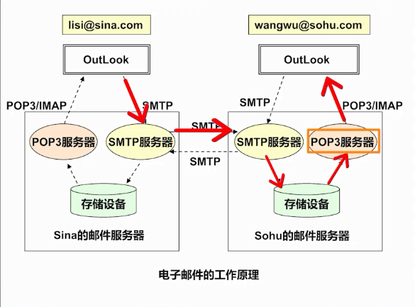

## 邮件基础知识

**邮件使用**  
**• 注册一个电子信箱帐号(唯一)**  
**– test@abc.com**  
**• Web邮件管理界面**  
**• 邮件客户端软件(Outlook/Foxmail等)**  

**邮件基本知识(1)**  
**• 邮件：一封信，包括发件人/收件人/文本/图片/附件等**  
**• 邮件客户端**  
**• 邮件服务端**  
**– 发送邮件服务器**  
**– 接受邮件服务器**  

**邮件基本知识(2)**  
**• 邮件客户端**  
**– Foxmail**  
**– OutLook(Express, Microsoft Outlook)**  
**– Thunderbird (linux平台)**  
**• 邮件服务端**  
**– Microsoft Exchange Server**  
**– IBM Lotus Notes**  
**– SendMail, Qmail, James**  

**邮件基本知识(3)**  
**• 主要协议(发送端口25, 接收端口110)**  
**– 发送, SMTP, Simple Mail Transfer Protocol**  
**– 接收, Pop3, Post Office Protocol 3, (POP)**  
**– 接收, IMAP, Internet Message Access Protocol, IMAP4**  
**• 摘要浏览**  
**• 选择下载附件**  
**• 多文件夹**  
**• 网络硬盘**  

**邮件基本知识(4)**  
**• 邮件格式**  
**– RFC822邮件格式：邮件头，文字邮件正文**  
**– MIME(MultiPurpose Internet Mail Extension) 图片/音频/视频等等**  
**• 邮件编码**  
**– 纯英文邮件, ASCII编码，7Bit**  
**– 8Bit编码**  
**– BASE64，6个bit, A-Za-z0-9+/**  
**– Quoted-printable,对每个非ASCII字符用“=“加上这个字符的十六进制编码.**  

**邮件基本知识(5)**  
**• 邮件中继：通过别人的邮件服务器(中继服务器)将你的邮件系统的邮件送到目标地址**  
**• 垃圾邮件(Spam)**  
**• 邮件和邮件服务器的安全**  
**• 邮件防火墙，垃圾邮件判定**  
**• 推荐材料**  
**– http://baike.baidu.com/view/5450.html?tp=0_11**  
**– http://en.wikipedia.org/wiki/Open_mail_relay  **  

**邮件基本知识(6)**  
**• 总结**  
**– 了解邮件的基础知识**  
**– 为进一步邮件编程应用奠定基础 ** 