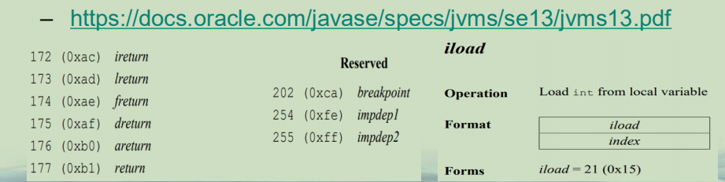
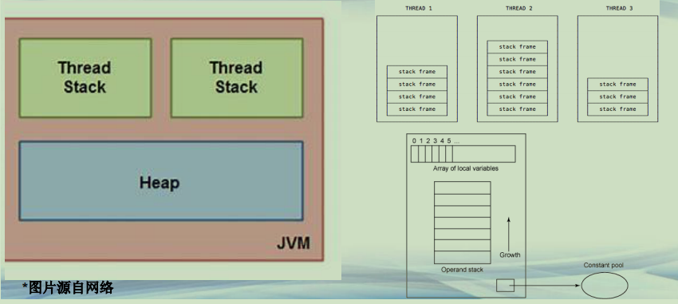
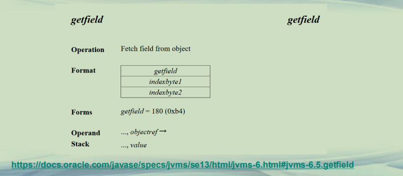
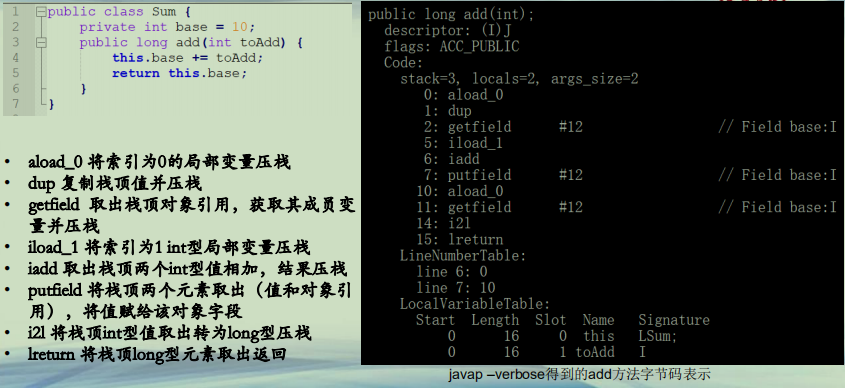
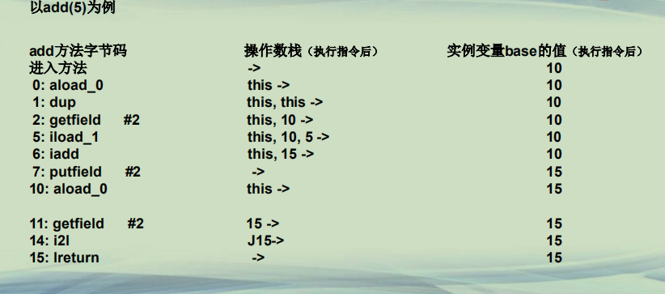

## Java 字节码指令分类

**Java字节码**  
**• class文件被JVM加载后，就执行其代码**  
**• 每一个Java字节码指令，是一个byte数字，也有一个对应的助记符(opcode)**  
**• 目前总数200多个**  
**– https://docs.oracle.com/javase/specs/jvms/se13/jvms13.pdf**  




**JVM 基础（Heap、Stack、Frame）**




**字节码分类(1)**  
**• 加载和存储指令**  
**– 用于将数据在栈帧中的局部变量表和操作数栈之间来回传输**  
**– 将一个局部变量加载到操作栈：iload、lload、fload、dload、aload等**  
**– 将一个数值从操作数栈存储到局部变量表：istore、lstore、fstore、dstore、astore等**  
**– 将一个常量加载到操作数栈：bipush、sipush、ldc、ldc_w、ldc2_w、aconst_null、iconst_m1等**  


**字节码分类(2)**  
**• 运算指令**  
**– iadd、isub、imul、idiv等**  
**• 类型转换指令**  
**– i2b、i2l、i2s等**  
**• 对象/数组创建与访问指令**  
**– new、newarray、getfield等**  
**• 操作数栈管理指令**  
**– pop、dup等**  


**字节码分类(3)**  
**• 控制转移指令**  
**– Ifeq、goto等**  
**• 方法调用和返回指令**  
**– invokevirtual、ireturn等**  
**• 异常处理指令**  
**– athrow**  
**• 同步控制指令**  
**– monitorenter、monitorexit**  


**字节码指令简介**  
**• JVM指令由操作码和零至多个操作数组成**  
**–操作码（OpCode，代表着某种特定操作含义的数字）**  
**–操作数（Operand，操作所需参数）**  
**• JVM的指令集是基于栈而不是寄存器**  
**–字节码指令控制的是JVM操作数栈**  


**字节码指令示例(1)**




**字节码指令示例(2)**   

```java

public class Sum {
	private int base = 10;
	
	public long add(int toAdd) {
		this.base += toAdd; 
		return this.base;
	}

}
```

 

**• aload_0 将索引为0的局部变量压栈**  
**• dup 复制栈顶值并压栈**
**• getfield 取出栈顶对象引用，获取其成员变量并压栈**  
**• iload_1 将索引为1 int型局部变量压栈**  
**• iadd 取出栈顶两个int型值相加，结果压栈**  
**• putfield 将栈顶两个元素取出（值和对象引用），将值赋给该对象字段**  
**• i2l 将栈顶int型值取出转为long型压栈**  
**• lreturn 将栈顶long型元素取出返回**  


**字节码指令示例(3)**  




**总结**  
**• 了解字节码指令及其执行过程**  
**• 学会查阅JVM规范了解相关指令**  


