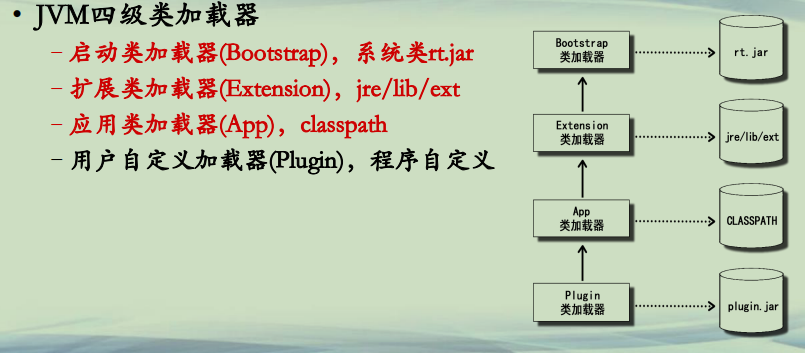
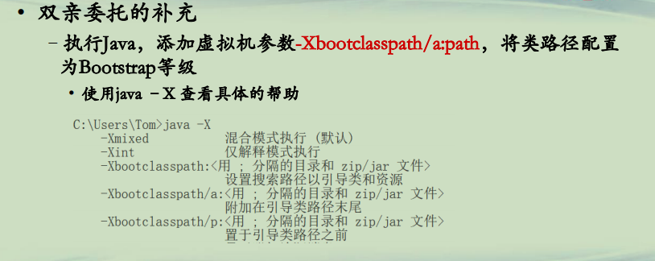
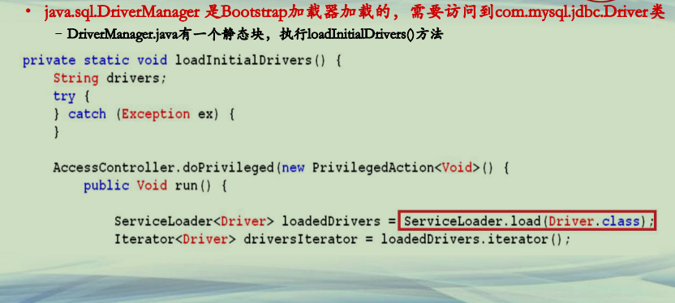
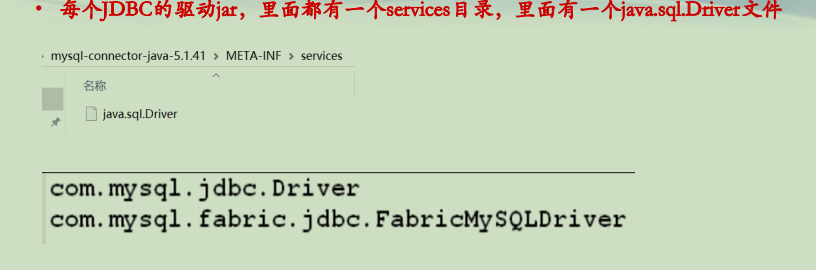
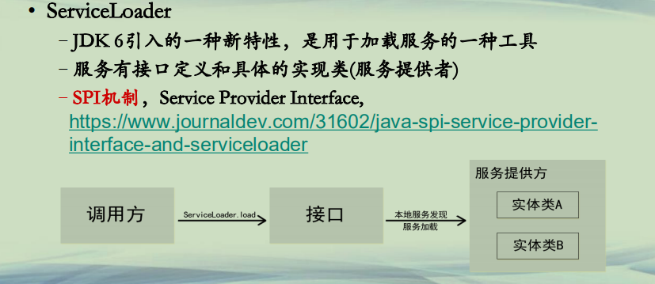

## Java 类双亲委托加载扩展

**Java类加载机制(1)**  
**• JVM四级类加载器**  
**–启动类加载器(Bootstrap)，系统类rt.jar**  
**–扩展类加载器(Extension)，jre/lib/ext**  
**–应用类加载器(App)，classpath**  
**–用户自定义加载器(Plugin)，程序自定义**  





**Java类加载机制(2)**  
**• Java严格执行双亲委托机制**  
**–类会由最顶层的加载器来加载，如没有，才由下级加载器加载**  
**–委托是单向的，确保上层核心的类的正确性**  
**–<u>但是上级类加载器所加载的类，无法访问下级类加载器所加载的类</u>**  
**• 例如，java.lang.String 无法访问自定义的一个Test类**  
**• Java是一个遵循契约设计的程序语言，核心类库提供接口，应用层提供实现**  
**• 核心类库是BootstrapClassLoader加载**  
**• 应用层是AppClassLoader加载**  
**• 典型例子是JDBC和XML Parser等**  


**Java类双亲委托加载扩展(1)**  
**• 双亲委托的补充**  
**–执行Java，添加虚拟机参数-Xbootclasspath/a:path，将类路径配置为Bootstrap等级**  
**• 使用java –X 查看具体的帮助**  




**Java类双亲委托加载扩展(2)**  
**• 双亲委托的补充**  
**–使用[ServiceLoader.load]()方法，来加载(底层加载器所加载的类)**  
**–以JDBC加载为例**  

```java
Class.forName("com.mysql.jdbc.Driver");
String url="jdbc:mysql://localhost:3306/163course";  
Connection conn = null;
//构建Java和数据库之间的桥梁：URL，用户名，密码
conn = DriverManager.getConnection(url, "root", "123456");
```

**–java.sql.DriverManager 是Bootstrap加载器加载的，需要访问到com.mysql.jdbc.Driver类**  


**Java类双亲委托加载扩展(3)**  
**• java.sql.DriverManager 是Bootstrap加载器加载的，需要访问到com.mysql.jdbc.Driver类**  
**–DriverManager.java有一个静态块，执行loadInitialDrivers()方法**  




**Java类双亲委托加载扩展(4)**  
**• 每个JDBC的驱动jar，里面都有一个services目录，里面有一个java.sql.Driver文件**  




**Java类双亲委托加载扩展(5)**  
**• ServiceLoader**  
**–JDK 6引入的一种新特性，是用于加载服务的一种工具**  
**–服务有接口定义和具体的实现类(服务提供者)**  
**–SPI机制，Service Provider Interface,**  
**https://www.journaldev.com/31602/java-spi-service-provider-interface-and-serviceloader**  





**Java类双亲委托加载扩展(6)**  
**• ServiceLoader**  
**–一个服务提供者会在jar包中有META-INF/services目录，里面放一个文件，名字同接口名字。内容的每一行都是接口的一个实现类。**  
**• https://docs.oracle.com/javase/8/docs/api/java/util/ServiceLoader.html**  
**–load方法，可以用当前线程的类加载器来获取某接口的所有实现，当然也都是转为接口类来使用**  
**–注意：此服务和Java 9模块系统的服务略有差别，但是都能通过ServiceLoader进行加载**  


**总结**  
**• JVM四级类加载器严格遵循从上到下的加载机制**  
**• 利用Xbootclasspath参数将某路径配置为Bootstrap加载器加载**  
**• 利用ServiceLoader机制可以提供上层加载器的类来访问下层加载器的类**  


