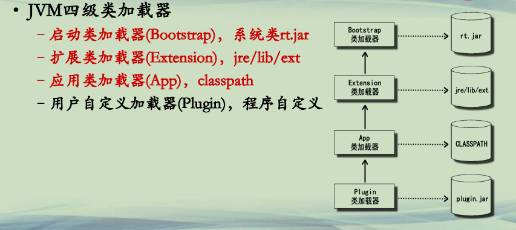
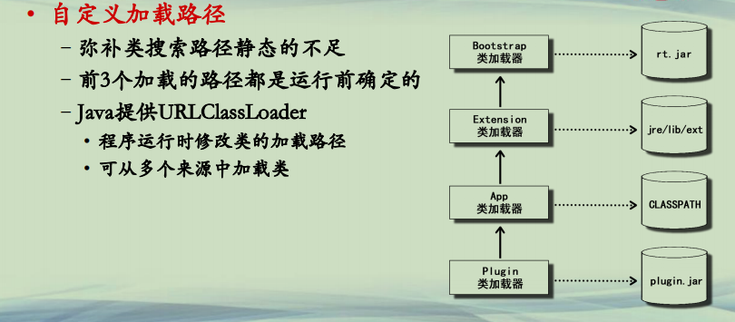

## 自定义类加载路径

**Java类加载机制**  
**• JVM四级类加载器**  
**–启动类加载器(Bootstrap)，系统类rt.jar**  
**–扩展类加载器(Extension)，jre/lib/ext**  
**–应用类加载器(App)，classpath**  
**–用户自定义加载器(Plugin)，程序自定义**  




**自定义类加载器**  
**• <u>自定义加载路径</u>**  
**–<u>弥补类搜索路径静态的不足</u>**  
**–<u>URLClassLoader, 从多个URL(jar或者目录)中加载类</u>**  
**• 自定义类加载器**  
**–继承ClassLoader类**  
**–重写findClass(String className)方法**  


**自定义类加载路径(1)**  
**• 自定义加载路径**  
**–弥补类搜索路径静态的不足**  
**–前3个加载的路径都是运行前确定的**  
**–Java提供URLClassLoader**  
**• 程序运行时修改类的加载路径**  
**• 可从多个来源中加载类**    




**自定义类加载路径(2)**  
**• URLClassLoader**  
**–继承于ClassLoader**  
**–程序运行时增加新的类加载路径**  
**–可从多个来源中加载类**  
**• 目录**  
**• jar包**  
**• 网络**  
**–addURL添加路径**  
**–close方法关闭**  

- - | Constructor and Description                                  |
    | ------------------------------------------------------------ |
    | `URLClassLoader(URL[] urls)`  使用默认委托父级 `ClassLoader`为指定的URL构造一个新的  `ClassLoader` 。 |
    | `URLClassLoader(URL[] urls, ClassLoader parent)`  为给定的URL构造一个新的URLClassLoader。 |
    | `URLClassLoader(URL[] urls, ClassLoader parent, URLStreamHandlerFactory factory)`   为指定的URL，父类加载器和URLStreamHandlerFactory构造一个新的URLClassLoader。 |


目录：

```java
├─PMOOC11-03-First
│  │              
│  └─src
│      └─edu
│          └─ecnu
│                  Hello.java
│                  
├─PMOOC11-03-Second             
│  └─src
│      └─edu
│          └─ecnu
│                  Hello.java
│                  
└─PMOOC11-03-Test      
    └─src
            HelloTest.java
            HelloThread.java
```


PMOOC11-03-First:

```java
package edu.ecnu;

public class Hello {
	public void say()
	{
		System.out.println("Hello 11111-1"); 
	}
}

```


PMOOC11-03-Second:

```java
package edu.ecnu;

public class Hello {
	public void say()
	{
		System.out.println("Hello 22222-2"); 
	}
}

```


PMOOC11-03-Test：

```java
import java.lang.reflect.Method;
import java.net.URL;
import java.net.URLClassLoader;

public class HelloThread extends Thread{
	private ClassLoader loader;
	
	public HelloThread(String file, ClassLoader outerLoader)
	{
		try {
			URL url = new URL(file);
			this.loader = new URLClassLoader(new URL[]{url},outerLoader);
			
		} catch (Exception e) {
			e.printStackTrace();
		}
		
	}
	public void run()
	{
		Class<?> c;
		try {
			c = loader.loadClass("edu.ecnu.Hello");
			//采用反射调用
			Object obj = c.newInstance();
			Method m = c.getMethod("say");
			
			while(true)
			{
				m.invoke(obj);
				Thread.sleep(1000);
			}
		} catch (Exception e) {
			e.printStackTrace();
		}				
	}
}
```


```java
import java.lang.reflect.Method;
import java.net.URL;
import java.net.URLClassLoader;

import com.sun.org.apache.xalan.internal.xsltc.compiler.sym;

public class HelloTest {

	public static void main(String[] args) throws Exception {
		//test1和test2展示URLClassLoader加载
//		test1();
//		test2();
		
		//展示不同线程使用不同的URLClassLoader
		//加载不同路径下同名的类
//		test3();
		
		//展示jar文件热部署
		test4();
	}
	
	public static void test1() throws Exception
	{
		//URL支持http, https, file, jar 四种协议 D:\eclipseWorkspaceIcourse163\PMOOC11-03\
		URL url = new URL("file:D:/eclipseWorkspaceIcourse163/PMOOC11-03/PMOOC11-03-First/bin/");
		
		//程序运行时，添加一个classpath路径
		URLClassLoader loader = new URLClassLoader(new URL[]{url});
		Class<?> c = loader.loadClass("edu.ecnu.Hello");
		
		//采用反射调用
		Method m = c.getMethod("say");
        m.invoke(c.newInstance());
        //用户自定义的classLoader
        System.out.println(c.getClassLoader());
        System.out.println(c.getClassLoader().getParent());
	}
	public static void test2() throws Exception
	{
		URL url = new URL("file:C:\\Users\\YuXiangKaoChi\\Desktop\\PMOOC11-03-First.jar");
		
		//程序运行时，添加一个classpath路径
		URLClassLoader loader = new URLClassLoader(new URL[]{url});
		Class<?> c = loader.loadClass("edu.ecnu.Hello");
		System.out.println("----test2----");
		//采用反射调用
		Method m = c.getMethod("say");
        m.invoke(c.newInstance());
        System.out.println(c.getClassLoader());
        System.out.println(c.getClassLoader().getParent());
      
	}
	
    
	public static void test3() throws Exception
	{
		String project1 = "file:D:/eclipseWorkspaceIcourse163/PMOOC11-03/PMOOC11-03-First/bin/";
		String project2 = "file:D:/eclipseWorkspaceIcourse163/PMOOC11-03/PMOOC11-03-Second/bin/";
		
		new HelloThread(project1, Thread.currentThread().getContextClassLoader()).start();
		new HelloThread(project2, Thread.currentThread().getContextClassLoader()).start();
	}
	
	public static void test4() throws Exception{
		String file = "file:C:\\\\Users\\\\YuXiangKaoChi\\\\Desktop\\PMOOC11-03.jar";
		URL url = new URL(file);
		URLClassLoader loader = new URLClassLoader(new URL[]{url});
		int count = 0;
		while(true){
			Class<?> c = loader.loadClass("edu.ecnu.Hello");
			Method m = c.getMethod("say");
	        m.invoke(c.newInstance());
			Thread.sleep(1000);
			if(++count%5==0){
				System.out.println("reload");
				loader.close();
				loader = new URLClassLoader(new URL[]{url});
			}
		}

	}
}

```


**总结**  
**• 程序动态增加类加载路径，克服静态路径的缺点**  
**• 不同程序/线程可以有不同的加载路径，互相隔离**  
**• 重复加载某一个路径，实现程序热部署**  


