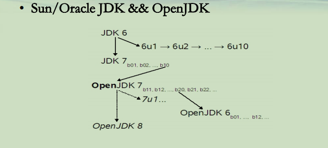
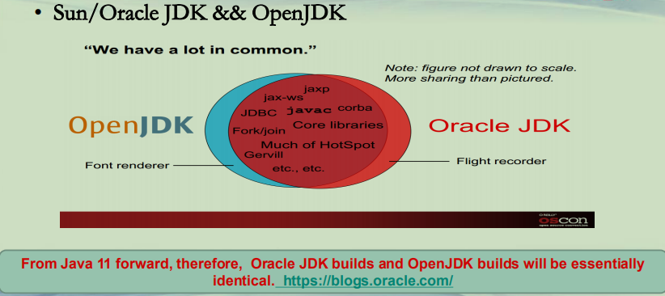
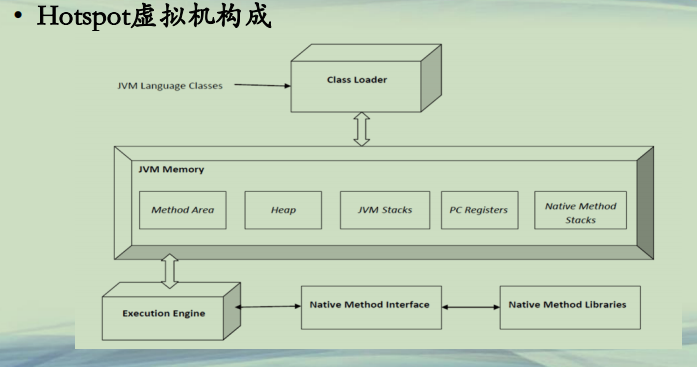

## JVM概述

**虚拟机**  
**• 虚拟机：VM, Virtual Machine**  
**–逻辑上，一台虚拟的计算机**  
**–实际上，一个软件，能够执行一系列虚拟的计算指令**  
**–系统虚拟机**  
**• 对物理计算机的仿真**  
**• 如VMWare，Oracle VirtualBox等**  
**–软件虚拟机**  
**• 专门为单个计算程序而设计**  
**• 如JVM等**  

**JVM虚拟机(1)**  
**• Java官方虚拟机发展历程**  
**–1996年JDK1.0包含一款Classic VM**  
**–1997年JDK收购一家Longview Technologies公司，获得Hotspot VM**  
**–2000年JDK1.3发布，Hotspot VM成为默认的虚拟机**  
**–2002年JDK1.4发布，Classic VM退出历史舞台**  
**–2006年JDK1.6发布，同年Java开源建立OpenJDK(基于Hotspot VM)**  
**–2008年Oracle收购BEA，得到JRockit VM**  
**–2010年Oracle收购Sun，获得Hotspot VM**  
**–2014年JDK1.8发布，Hotspot 融合了JRockit**  

**JVM虚拟机(2)**   
**• Java虚拟机**  
**–Sun/Oracle: Classic VM/Hotspot VM/JRockit VM**  
**–IBM/Eclipse: J9 VM, https://www.eclipse.org/openj9/**  
**–OpenJDK: 开源的虚拟机, http://openjdk.java.net/**  
**• 衍生很多大公司特定的虚拟机，如Alibaba JVM等**  
**–Apache Harmony，已消亡， http://harmony.apache.org/**  
**–Google Android Dalvik VM，已消亡，被ART虚拟机顶替**  
**–更多http://en.wikipedia.org/wiki/List_of_Java_virtual_machines**  

**JVM虚拟机(3)**   
**• Sun/Oracle JDK && OpenJDK**  

**VM虚拟机(4)**   
**• Sun/Oracle JDK && OpenJDK**  

**JVM虚拟机(5)**   
**• Sun/Oracle JDK**  
**– 从9开始，分成LTS(Long Term Support)和non-LTS版本**  
**• https://www.oracle.com/technetwork/java/java-se-support-roadmap.html**  
**–Oracle 11 是LTS，是稳定版本**  
**–OTN协议，个人免费使用，生产环境商用收费+长期更新**  
**• OpenJDK**  
**–GPL V2协议**  
**–可以免费使用**  

**JVM虚拟机(6)**   
**• Hotspot虚拟机构成**  

**进一步学习**  
**• VM规范**  
**– https://www.oracle.com/technetwork/java/javase/tech/index-jsp-136373.html**  
**– https://www.oracle.com/technetwork/java/hotspotfaq-138619.html**  
**– https://docs.oracle.com/javase/specs/jvms/se11/jvms11.pdf**  
**• JVM源码编译和探索**  
**–https://www.iteye.com/blog/rednaxelafx-362738**  
**–深入理解Java虚拟机, 周志明著**  
**–实战Java虚拟机，葛一鸣著**  
**–其他书籍… …**  

**总结**  
**• JVM是Java运行载体**  
**• JVM是不断发展前进的**  
**• JVM的组成结构**  

