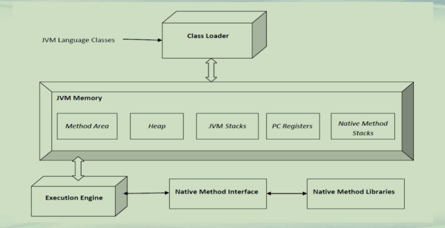
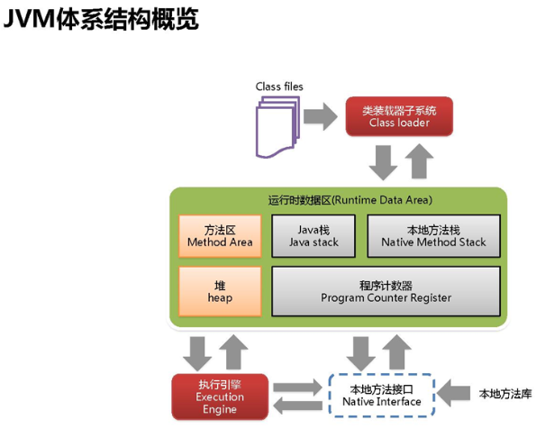

## JVM内存分类

**Java自动内存管理**  
**• 传统程序语言：由程序员手动内存管理**  
**–C/C++，malloc申请内存和free释放内存**  
**–由于程序员疏忽或程序异常，导致内存泄露**  
**• 现代程序语言：自动内存管理**  
**–Java/C#，采用内存自动管理**  
**–程序员只需要申请使用，系统会检查无用的对象并回收内存**  
**–系统统一管理内存，内存使用相对高效，但也会出现异常**  

**JVM概览**

**JVM内存(1)**  
**• 线程私有内存**  
**–程序计数器(Program Counter Register)**  
**–Java虚拟机栈(JVM Stack)**  
**–本地方法栈(Native Method Stack)**  
**• 多线程共享内存**  
**–堆(Heap)**  
**–方法区(Method Area)**  
**• 运行时常量池**  

**JVM内存(2)**  
**• 程序计数器**  
**–Program Counter Register, 一块小内存，每个线程都有**  
**–PC存储当前方法**  
**• 线程正在执行的方法称为该线程的当前方法**  
**–当前方法为本地(native)方法时, pc值未定义(undefined)**  
**–当前方法为非本地方法时，pc包含了当前正在执行指令的地址**  
**–当前唯一一块不会引发OutOfMemoryError异常**  

**JVM内存(3)**  
**• JVM 栈(JVM Stack，Java 栈)**  
**–每个线程有自己独立的Java虚拟机栈，*线程私有***  
***–-Xss设置每个线程堆栈大小***  
**• Java方法的执行基于栈**  
**–每个方法从调用到完成对应一个栈帧在栈中入栈、出栈的过程**  
**• 栈帧存储局部变量表、操作数栈等**  
***• 局部变量表存放方法中存在“栈”里面的东西***  
**• 引发的异常**  
**–栈的深度超过虚拟机规定深度，StackOverflowError异常**  
**–无法扩展内存，OutOfMemoryError异常  **

**JVM内存(4)**  
**• 本地方法栈(Native Method Stacks)**  
**• 存储native方法的执行信息，*线程私有***  
**• *VM规范没有对本地方法栈做明显 规定***  
**• 引发的异常**  
**–栈的深度超过虚拟机规定深度，StackOverflowError异常**  
**–无法扩展内存，OutOfMemoryError异常**  

**JVM内存(5)**  
**• 堆(Heap)**  
**–虚拟机启动时创建，*所有线程共享，占地最大***  
**–<u>对象实例和数组都是在堆上分配内存</u>**  
**–<u>垃圾回收的主要区域</u>**  
**–<u>设置大小</u>**  
**• <u>-Xms 初始堆值，-Xmx最大堆值</u>**  
**–引发的异常**  
**• 无法满足内存分配要求，OutOfMemoryError异常**  

**JVM内存(6)**  
**• 方法区(Method Area)**  
**–存储JVM已经加载类的结构，*所有线程共享***  
**• 运行时常量池、类信息、常量、静态变量等**  
**–JVM启动时创建，逻辑上属于堆(Heap)的一部分**  
**–很少做垃圾回收**  
**–引发的异常**  
**• 无法满足内存分配要求， OutOfMemoryError异常**  

**JVM内存(7)**  
**• 运行时常量池(Run-Time Constant Pool)**  
**–Class文件中常量池的运行时表示**  
**–属于方法区的一部分**  
**–动态性**  
**• Java语言并不要求常量一定只有在编译期产生**  
**• 比如String.intern方法**  
**–引发的异常**  
**• 无法满足内存分配要求，OutOfMemoryError异常**  

| 名称         | 线程私有/共享 | 功能                     | 大小                      | 异常                                |
| ------------ | ------------- | ------------------------ | ------------------------- | ----------------------------------- |
| 程序计数器   | 私有          | 保存当前线程执行方法     | 通常固定大小              | 不会                                |
| JVM栈        | 私有          | 方法的栈帧               | -Xss                      | StackOverflowError,OutOfMemoryError |
| 本地方法栈   | 私有          | 存储native方法信息       | 通常固定大小              | StackOverflowError,OutOfMemoryError |
| 堆           | 共享          | 存储对象和数组           | -Xms 初始堆值-Xmx最大堆值 | OutOfMemoryError                    |
| 方法区       | 共享          | 存储类结构/常量/静态变量 | -XX参数设置               | OutOfMemoryError                    |
| 运行时常量池 | 共享          | 常量池运行时表示         | 从属于方法区              | OutOfMemoryError                    |

**总结**  
**• 厘清JVM内存分类**  
**• 对照class文件，理解JVM各部分内存的作用**  

