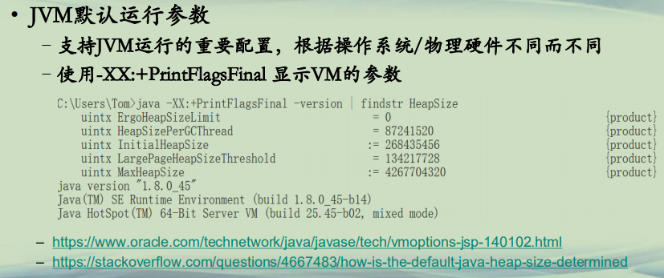
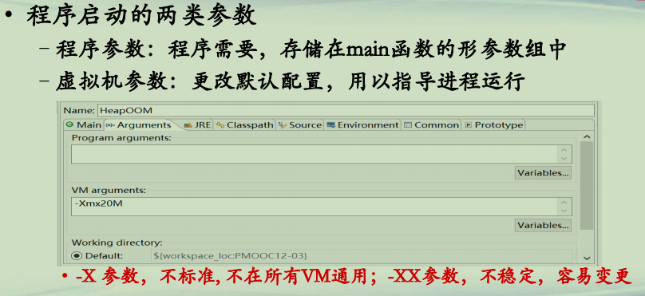
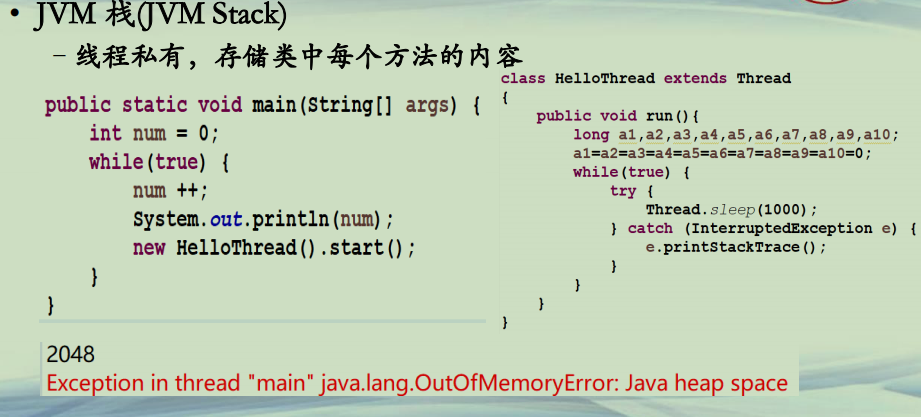
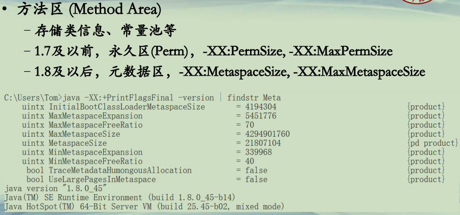

## JVM内存参数

**JVM内存**   

| 名称         | 线程私有/共享 | 功能                     | 大小                      | 异常                                |
| ------------ | ------------- | ------------------------ | ------------------------- | ----------------------------------- |
| 程序计数器   | 私有          | 保存当前线程执行方法     | 通常固定大小              | 不会                                |
| JVM栈        | 私有          | 方法的栈帧               | -Xss                      | StackOverflowError,OutOfMemoryError |
| 本地方法栈   | 私有          | 存储native方法信息       | 通常固定大小              | StackOverflowError,OutOfMemoryError |
| 堆           | 共享          | 存储对象和数组           | -Xms 初始堆值-Xmx最大堆值 | OutOfMemoryError                    |
| 方法区       | 共享          | 存储类结构/常量/静态变量 | -XX参数设置               | OutOfMemoryError                    |
| 运行时常量池 | 共享          | 常量池运行时表示         | 从属于方法区              | OutOfMemoryError                    |


**JVM参数(1)**  
**• JVM默认运行参数**  
**–支持JVM运行的重要配置，根据操作系统/物理硬件不同而不同**  
**–使用-XX:+PrintFlagsFinal 显示VM的参数**  




**JVM参数(2)**  
**• 程序启动的两类参数**  
**–程序参数：程序需要，存储在main函数的形参数组中**  
**–虚拟机参数：更改默认配置，用以指导进程运行**  

*-X 参数，不标准, 不在所有VM通用；-XX参数，不稳定，容易变更*




```java
├─src
│      HeapOOM.java
│      JavaCompilerTask.java
│      JavaSourceFromString.java
│      JvmStackOOM.java
│      JvmStackSOF.java
│      JvmStackSOF2.java
│      MetaSpaceOOM.java
│      MyClassLoader.java
```


**JVM内存(1)**  
**• 堆(Heap)**  
**–共享，内存大户，存储所有的对象和数组**  
**–-Xms 初始堆值，-Xmx最大堆值**  

```java
import java.util.ArrayList;
import java.util.List;
/*设置的 堆内存 VM arguments 为：  -Xmx20M*/
public class HeapOOM {
	public static void main(String[] args) {
		
//		System.out.println(Runtime.getRuntime().maxMemory()/1024/1024 + "M");
		
		
		List<HeapObject> list = new ArrayList<>();

		while (true) {
			list.add(new HeapObject());
			System.out.println(list.size());
		}	
	}
}

class HeapObject {
}

/*
当List 到达 809928就报出了 OOM异常。
控制台输出的结果为： 
809927
809928Exception in thread "main" java.lang.OutOfMemoryError: GC overhead limit exceeded
	at java.nio.CharBuffer.wrap(CharBuffer.java:373)
	at sun.nio.cs.StreamEncoder.implWrite(StreamEncoder.java:265)
	at sun.nio.cs.StreamEncoder.write(StreamEncoder.java:125)
	at java.io.OutputStreamWriter.write(OutputStreamWriter.java:207)
	at java.io.BufferedWriter.flushBuffer(BufferedWriter.java:129)
	at java.io.PrintStream.newLine(PrintStream.java:545)
	at java.io.PrintStream.println(PrintStream.java:737)
	at HeapOOM.main(HeapOOM.java:14)
*/
```


**JVM内存(2)**  
**• JVM 栈(JVM Stack)**  
**–线程私有，存储类中每个方法的内容**  
**–-Xss 最大栈值**  

```java

/*
设置的java栈内存为： -Xss100K
*/
public class JvmStackSOF {
	
	private int len = 1;
	public void f1()
	{
		len ++;
		System.out.println(len);
		f1(); //递归调用
	}

	public static void main(String[] args) {
		new JvmStackSOF().f1();
	}
}

/*递归调用，控制台输出的结果：
974
975
Exception in thread "main" java.lang.StackOverflowError
	at sun.nio.cs.UTF_8.updatePositions(UTF_8.java:77)
	at sun.nio.cs.UTF_8.access$200(UTF_8.java:57)
	at sun.nio.cs.UTF_8$Encoder.encodeArrayLoop(UTF_8.java:636)
	at sun.nio.cs.UTF_8$Encoder.encodeLoop(UTF_8.java:691)
	at java.nio.charset.CharsetEncoder.encode(CharsetEncoder.java:579)
	at sun.nio.cs.StreamEncoder.implWrite(StreamEncoder.java:271)
*/

```


**JVM内存(3)**  
**• JVM 栈(JVM Stack)**  
**–线程私有，存储类中每个方法的内容**  

```java

/*
设置的java栈内存为： -Xss100K
*/
public class JvmStackSOF2 {
	
	private int len = 1;
	public void f2() {
		long a1,a2,a3,a4,a5,a6,a7,a8,a9,a10;
		a1=a2=a3=a4=a5=a6=a7=a8=a9=a10=0;
		len ++;
		System.out.println(len);
		f2(); //不仅有递归，而且有大量的变量，每个long 占 8个字节，10个就是80字节                 
	}

	public static void main(String[] args) {
		new JvmStackSOF2().f2();
	}
}

/*递归调用，控制台输出的结果：

上面没有 变量 输出到 974，975。
这里增加了 变量 输出明显骤降到 349
348
349
Exception in thread "main" java.lang.StackOverflowError
	at sun.nio.cs.UTF_8.updatePositions(UTF_8.java:77)
	at sun.nio.cs.UTF_8.access$200(UTF_8.java:57)
	at sun.nio.cs.UTF_8$Encoder.encodeArrayLoop(UTF_8.java:636)
	at sun.nio.cs.UTF_8$Encoder.encodeLoop(UTF_8.java:691)

*/

```


**JVM内存(4)**  
**• JVM 栈(JVM Stack)**  
**–线程私有，存储类中每个方法的内容**  

```java

/*设置的java栈内存为： -Xss100K*/
public class JvmStackOOM {

	public static void main(String[] args) {
		System.out.println("JvmStackOOM:");
		int num = 0;
		while(true)	{
			num ++;
			System.out.println(num);
			new HelloThread().start();
		}
	}

}

class HelloThread extends Thread
{
	public void run(){
		long a1,a2,a3,a4,a5,a6,a7,a8,a9,a10;
		a1=a2=a3=a4=a5=a6=a7=a8=a9=a10=0;
		while(true)	{
			try {
				Thread.sleep(1000);
			} catch (InterruptedException e) {
				e.printStackTrace();
			}
		}
	}
}
/*没有测试出来错误的情况，可能是电脑的性能比较好，另外会会提示 
The stack size specified is too small, Specify at least 108k 至少要设置到108k
*/
```




**JVM内存(5)**  
**• 方法区 (Method Area)**  
**–存储类信息、常量池等**  
**–1.7及以前，永久区(Perm)，-XX:PermSize, -XX:MaxPermSize**  
**–1.8及以后，元数据区，-XX:MetaspaceSize, -XX:MaxMetaspaceSize**  




**JVM内存(6)**  
**• 方法区 (Method Area)**  
**–存储类信息、常量池等**  
**–-XX:MaxMetaspaceSize=9M**  

```java

import java.io.File;
import java.io.UnsupportedEncodingException;
import java.lang.reflect.Method;
import java.net.URISyntaxException;
import java.util.Arrays;

import javax.tools.Diagnostic;
import javax.tools.DiagnosticCollector;
import javax.tools.JavaCompiler;
import javax.tools.JavaFileObject;
import javax.tools.StandardJavaFileManager;
import javax.tools.ToolProvider;

/*设置的参数为 -XX:MaxMetaspaceSize=9M*/
public class JavaCompilerTask {

	public static void main(String[] args) {

		compileJavaFromString();
	}

	
	public static void compileJavaFromString() {
		
		StringBuilder sb = new StringBuilder();
		
		String className = "Hello";		
		for(int i=0;i<10000;i++)
		{
			System.out.println(i);
			String realClassName = className + i;
			sb.append("public class " + realClassName + "{\n");
			sb.append("public static void main(String[]args){\n");
			sb.append("System.out.print(\"hello world\"); \n");
			sb.append("}\n");
			sb.append("}");

			Class<?> c = compile(realClassName, sb.toString());			
			sb = new StringBuilder();
		}
		
		

	}

	private static Class<?> compile(String className, String javaCodes) {
		
		//将字符串包装为SimpleJavaFileObject对象
		JavaSourceFromString srcObject = new JavaSourceFromString(className, javaCodes);		
		//System.out.println(srcObject.getCode());
		Iterable<? extends JavaFileObject> fileObjects = Arrays.asList(srcObject);
		
		
		JavaCompiler compiler = ToolProvider.getSystemJavaCompiler();
		StandardJavaFileManager fileManager = compiler.getStandardFileManager(null, null, null);
		DiagnosticCollector<JavaFileObject> diagnosticCollector = new DiagnosticCollector<JavaFileObject>();  
		
		//设置编译的输出目录，并包装在options中
		String flag = "-d";
		String outDir = "";
		try {
			File classPath = new File(Thread.currentThread().getContextClassLoader().getResource("").toURI());
			outDir = classPath.getAbsolutePath() + File.separator;
			//System.out.println(outDir);
		} catch (URISyntaxException e1) {
			e1.printStackTrace();
		}		
		Iterable<String> options = Arrays.asList(flag, outDir);
		
		//JavaCompiler.getTask方法：以future的任务形式(多线程)，来执行编译任务
		
		// 第一个参数：额外输出流，null表示默认使用system.err
		// 第二个参数：文件管理器，null表示编译器标准文件管理器
		// 第三个参数：诊断监听器，null表示使用编译器默认方法来报告诊断信息
		// 第四个参数：编译器参数，null表示无参数
		// 第五个参数：需要经过annotation处理的类名，null表示没有类需要annotation处理
		// 第六个参数：待编译的类
		
		JavaCompiler.CompilationTask task = 
				compiler.getTask(null, fileManager, diagnosticCollector, options, null, fileObjects);
		
		//等待编译结束
		boolean result = task.call();
		if (result == true) {
			try {
				return Class.forName(className);
			} catch (ClassNotFoundException e) {
				e.printStackTrace();
			}
		}
		else			
		{
			//print the Diagnostic's information   
            for  (Diagnostic diagnostic : diagnosticCollector  
                    .getDiagnostics())  
            {  
                System.out.println("Error on line: "   
                        + diagnostic.getLineNumber() + "; URI: "   
                        + diagnostic.getSource().toString());  
            }  
		}
		return null;
	}
}

/*
只加载到第11个类的时候，就报异常了。
控制台输出的结果为：
0
1
2
3
4
5
6
7
8
9
10
Exception in thread "main" java.lang.OutOfMemoryError: Metaspace

*/

```


pom.xml

```java
<project xmlns="http://maven.apache.org/POM/4.0.0" xmlns:xsi="http://www.w3.org/2001/XMLSchema-instance" xsi:schemaLocation="http://maven.apache.org/POM/4.0.0 http://maven.apache.org/xsd/maven-4.0.0.xsd">
  <modelVersion>4.0.0</modelVersion>
  <groupId>PMOOC12-03</groupId>
  <artifactId>PMOOC12-03</artifactId>
  <version>0.0.1-SNAPSHOT</version>
  <dependencies>
	  	<!-- https://mvnrepository.com/artifact/cglib/cglib-nodep -->
<dependency>
    <groupId>cglib</groupId>
    <artifactId>cglib-nodep</artifactId>
    <version>3.2.4</version>
</dependency>

		<!-- https://mvnrepository.com/artifact/org.ow2.asm/asm -->
		<dependency>
			<groupId>org.ow2.asm</groupId>
			<artifactId>asm</artifactId>
			<version>7.2</version>
		</dependency>
		<!-- https://mvnrepository.com/artifact/org.ow2.asm/asm-commons -->
		<dependency>
			<groupId>org.ow2.asm</groupId>
			<artifactId>asm-commons</artifactId>
			<version>7.2</version>
		</dependency>
	</dependencies>
	
  <build>
    <sourceDirectory>src</sourceDirectory>
    <plugins>
      <plugin>
        <artifactId>maven-compiler-plugin</artifactId>
        <version>3.8.0</version>
        <configuration>
          <source>1.8</source>
          <target>1.8</target>
        </configuration>
      </plugin>
    </plugins>
  </build>
</project>
```


**总结**  
**• 了解JVM的运行参数**  
**• 分析异常信息，调节相应的内存参数，使程序正常运行**  

