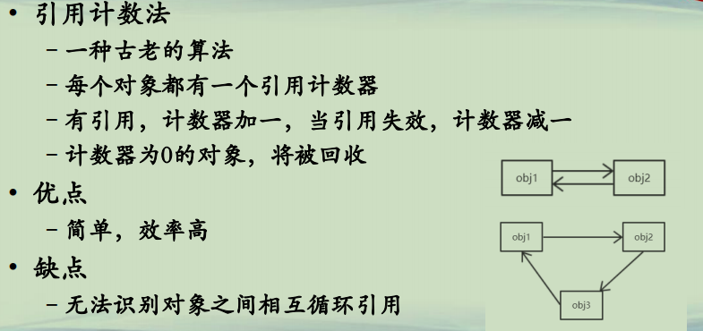
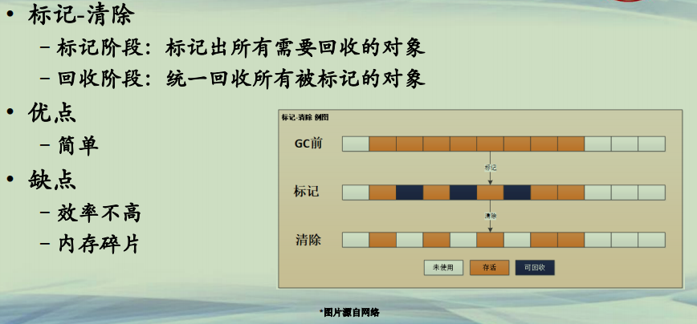
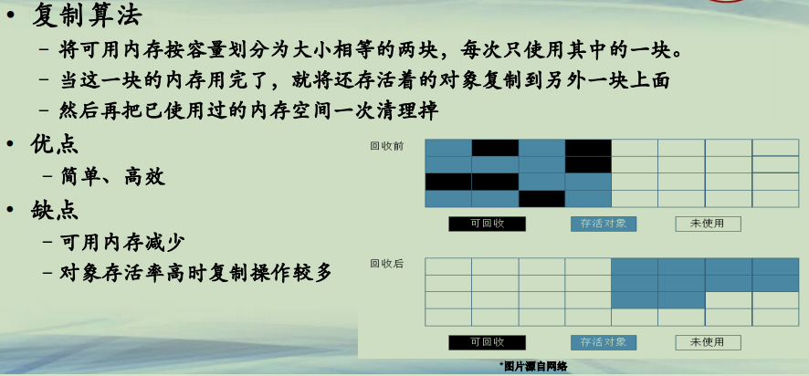
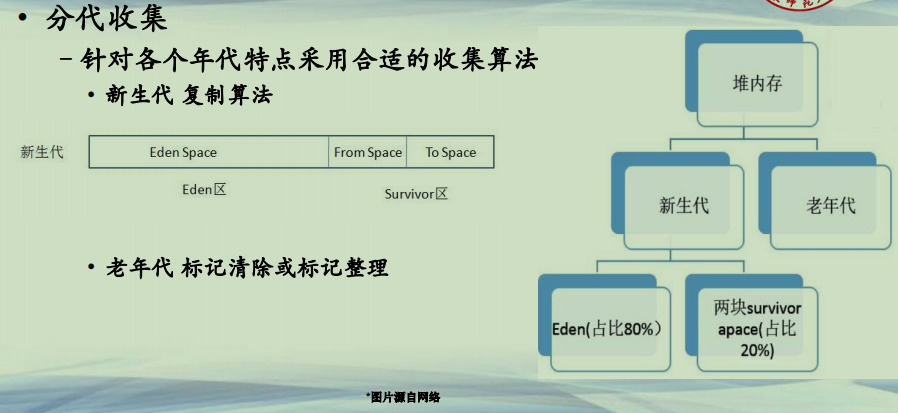

## 垃圾收集算法

**垃圾收集器**  
**• JVM内置有垃圾收集器**  
**–GC, Garbage Collector**  
**–自动清除无用的对象，回收内存**  
**• 垃圾收集器的工作职责(John McCarthy, Lisp 语言)**  
**–什么内存需要收集(判定无用的对象)**  
**–什么时候回收(何时启动，不影响程序正常运行)**  
***–如何回收(回收过程，要求速度快/时间短/影响小)***  

**垃圾收集算法(1)**  
**• 引用计数法**  
**–一种古老的算法**  
**–每个对象都有一个引用计数器**  
**–有引用，计数器加一，当引用失效，计数器减一**  
**–计数器为0的对象，将被回收**  
**• 优点**  
**–简单，效率高**  
**• 缺点**  
**–无法识别对象之间相互循环引用**  

**垃圾收集算法(2)**  
**• 标记-清除**  
**–标记阶段：标记出所有需要回收的对象**  
**–回收阶段：统一回收所有被标记的对象**  
**• 优点**  
**–简单**  
**• 缺点**  
**–效率不高**  
**–内存碎片**  

**垃圾收集算法(3)**  
**• 复制算法**  
**–将可用内存按容量划分为大小相等的两块，每次只使用其中的一块。**  
**–当这一块的内存用完了，就将还存活着的对象复制到另外一块上面**  
**–然后再把已使用过的内存空间一次清理掉**  
**• 优点**  
**–简单、高效**  
**• 缺点**  
**–可用内存减少**  
**–对象存活率高时复制操作较多**  

**垃圾收集算法(4)**  
**• 标记-整理**  
**–标记阶段：与“标记-清除”算法一样**  
**–整理阶段：让所有存活的对象都向一端移动，然后直接清理掉端边界以外的内存**  
**• 优点**  
**–避免碎片产生**  
**–无需两块相同内存**  
**• 缺点**  
**–计算代价大，标记清除+碎片整理**  
**–更新引用地址**  

**垃圾收集算法(5)**  
**• 分代收集**  
**–Java对象的生命周期不同，有长有短**  
**–根据对象存活周期，将内存划分新生代和老年代**  
**–新生代(Young Generation)**  
**• 主要存放短暂生命周期的对象**  
**• 新创建的对象都先放入新生代，大部分新建对象在第一次gc时被回收**  
**–老年代(Tenured Generation)**  
**• 一个对象经过几次gc仍存活，则放入老年代**  
**• 这些对象可以活很长时间，或者伴随程序一生，需要常驻内存的，可以减少回收次数**  

**垃圾收集算法(6)**  
**• 分代收集**  
**–针对各个年代特点采用合适的收集算法**  
**• 新生代 复制算法**  
**• 老年代 标记清除或标记整理**  

**总结**  
**• 理解各种垃圾收集方法的基本原理**  
**• 理解分代收集原理和Java堆内的结构**  

