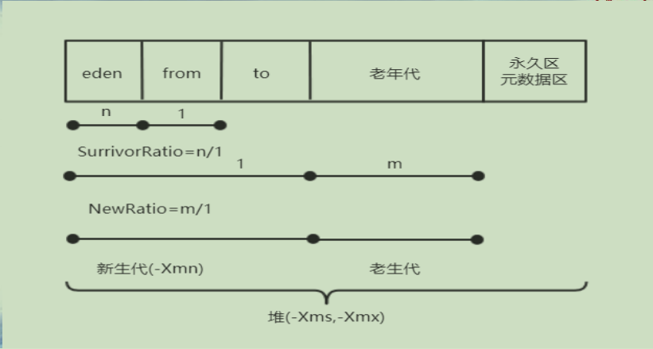

## JVM堆内存参数设置和GC跟踪

**JVM内存**  

| 名称         | 线程私有/共享 | 功能                     | 大小                             | 异常                                |
| ------------ | ------------- | ------------------------ | -------------------------------- | ----------------------------------- |
| 程序计数器   | 私有          | 保存当前线程执行方法     | 通常固定大小                     | 不会                                |
| JVM栈        | 私有          | 方法的栈帧               | -Xss                             | StackOverflowError,OutOfMemoryError |
| 本地方法栈   | 私有          | 存储native方法信息       | 通常固定大小                     | StackOverflowError,OutOfMemoryError |
| <u>堆</u>    | <u>共享</u>   | <u>存储对象和数组</u>    | <u>-Xms 初始堆值-Xmx最大堆值</u> | <u>OutOfMemoryError</u>             |
| 方法区       | 共享          | 存储类结构/常量/静态变量 | -XX参数设置                      | OutOfMemoryError                    |
| 运行时常量池 | 共享          | 常量池运行时表示         | 从属于方法区                     | OutOfMemoryError                    |


**分代垃圾收集(1)**  
**• 分代垃圾收集**  
**–Java对象的生命周期不同，有长有短**  
**–根据对象存活周期，将内存划分新生代和老年代**  
**–新生代(Young Generation)**  
**• 主要存放短暂生命周期的对象 ** 
**• 新创建的对象都先放入新生代，大部分新建对象在第一次GC时被回收**  
**–老年代(Tenured Generation)**  
**• 一个对象经过几次GC仍存活，则放入老年代**  
**• 这些对象可以活很长时间，或者伴随程序一生，需要常驻内存的，可以减少回收次数**  


**分代垃圾收集(2)**  


  

**堆内存参数(1)**  
**• -Xms初始堆大小**  
**• -Xmx最大堆大小**  
**• -Xmn新生代大小**  
**• -XX:SurvivorRatio设置eden区/from(to)的比例**  
**• -XX:NewRatio设置老年代/新生代比例**  
**• -XX:+PrintGC/-XX:+PrintGCDetails 打印GC的过程信息**  


**堆内存参数(2)**  




```java
└─src
        HeapAlloc.java
        NewSizeDemo.java
```

```java

/**
 * 来自于《实战Java虚拟机》
 * -Xms5M -Xmx20M -XX:+PrintGCDetails -XX:+PrintCommandLineFlags -XX:+UseSerialGC
 *下面的一行可以保存到  F:\gc1.log路径下
 * -Xms5M -Xmx20M -XX:+PrintGCDetails -XX:+PrintCommandLineFlags -XX:+UseSerialGC -Xloggc:F:\gc1.log
 * @author Tom
 *
 */
public class HeapAlloc {

	public static void main(String[] args) {
		
		printMemoryInfo();
		byte[] b = new byte[1*1024*1024];
		System.out.println("分配1MB空间");
		
		printMemoryInfo();
		b = new byte[4*1024*1024];
		System.out.println("分配4MB空间");

		printMemoryInfo();
	}
	
	public static void printMemoryInfo()
	{
		System.out.print("maxMemory=");
		System.out.println(Runtime.getRuntime().maxMemory()/1024.0/1024.0 + " MB");
		System.out.print("freeMemory=");
		System.out.println(Runtime.getRuntime().freeMemory()/1024.0/1024.0 + " MB");
		System.out.print("totalMemory=");
		System.out.println(Runtime.getRuntime().totalMemory()/1024.0/1024.0 + " MB");
	}

}

/*
控制台输出为：
-XX:InitialHeapSize=5242880 -XX:MaxHeapSize=20971520 -XX:+PrintCommandLineFlags -XX:+PrintGCDetails -XX:+UseCompressedClassPointers -XX:+UseCompressedOops -XX:-UseLargePagesIndividualAllocation -XX:+UseSerialGC 
maxMemory=19.375 MB
freeMemory=5.00579833984375 MB
totalMemory=5.8125 MB
[GC (Allocation Failure) [DefNew: 826K->192K(1856K), 0.0012315 secs] 826K->570K(5952K), 0.0012741 secs] [Times: user=0.00 sys=0.00, real=0.00 secs] 
分配1MB空间
maxMemory=19.375 MB
freeMemory=4.2227935791015625 MB
totalMemory=5.8125 MB
[GC (Allocation Failure) [DefNew: 1249K->0K(1856K), 0.0010436 secs][Tenured: 1594K->1594K(4096K), 0.0018692 secs] 1627K->1594K(5952K), [Metaspace: 2704K->2704K(1056768K)], 0.0029887 secs] [Times: user=0.00 sys=0.00, real=0.00 secs] 
分配4MB空间
maxMemory=19.375 MB
freeMemory=4.2882843017578125 MB
totalMemory=9.87890625 MB
Heap
 def new generation   total 1920K, used 69K [0x00000000fec00000, 0x00000000fee10000, 0x00000000ff2a0000)
  eden space 1728K,   4% used [0x00000000fec00000, 0x00000000fec11480, 0x00000000fedb0000)
  from space 192K,   0% used [0x00000000fedb0000, 0x00000000fedb0000, 0x00000000fede0000)
  to   space 192K,   0% used [0x00000000fede0000, 0x00000000fede0000, 0x00000000fee10000)
 tenured generation   total 8196K, used 5690K [0x00000000ff2a0000, 0x00000000ffaa1000, 0x0000000100000000)
   the space 8196K,  69% used [0x00000000ff2a0000, 0x00000000ff82ea60, 0x00000000ff82ec00, 0x00000000ffaa1000)
 Metaspace       used 2710K, capacity 4486K, committed 4864K, reserved 1056768K
  class space    used 292K, capacity 386K, committed 512K, reserved 1048576K

*/
```

```java

/**
 * 来自于《实战Java虚拟机》
 * -Xmx20m -Xms20m -Xmn1m -XX:SurvivorRatio=2 -XX:+PrintGCDetails -XX:+UseSerialGC
 * 新生代1M，eden/s0=2, eden 512KB, s0=s1=256KB 
 * 新生代无法容纳1M，所以直接放老年代
 * 
 * -Xmx20m -Xms20m -Xmn7m -XX:SurvivorRatio=2 -XX:+PrintGCDetails -XX:+UseSerialGC
 * 新生代7M，eden/s0=2, eden=3.5M, s0=s1=1.75M
 * 所以可以容纳几个数组，但是无法容纳所有，因此发生GC
 * 
 * -Xmx20m -Xms20m -Xmn15m -XX:SurvivorRatio=8 -XX:+PrintGCDetails -XX:+UseSerialGC
 * 新生代15M，eden/s0=8, eden=12M, s0=s1=1.5M
 * 
 * -Xmx20m -Xms20m -XX:NewRatio=2 -XX:+PrintGCDetails -XX:+UseSerialGC
 * 新生代是6.6M，老年代13.3M
 * @author Tom
 *
 */
public class NewSizeDemo {

	public static void main(String[] args) {
		
		byte[] b = null;
		for(int i=0;i<10;i++)
		{
			b = new byte[1*1024*1024];
		}		
	}
}

```


**HotSpot现有垃圾收集器(JDK 13)**  
**• 串行收集器(Serial Collector)**  
**• 并行收集器(Parallel Collector)**  
**• CMS收集器(Concurrent Mark Sweep Collector)**  
**• G1收集器(Garbage-First Collector)**  
**• Z收集器(Z Garbage Collector)**  

• https://docs.oracle.com/en/java/javase/13/gctuning/introduction-garbage-collection-tuning.html


**总结**  
**• 理解堆内存的各个区域内容**  
**• 掌握堆内存的参数设置，理解GC过程**  

