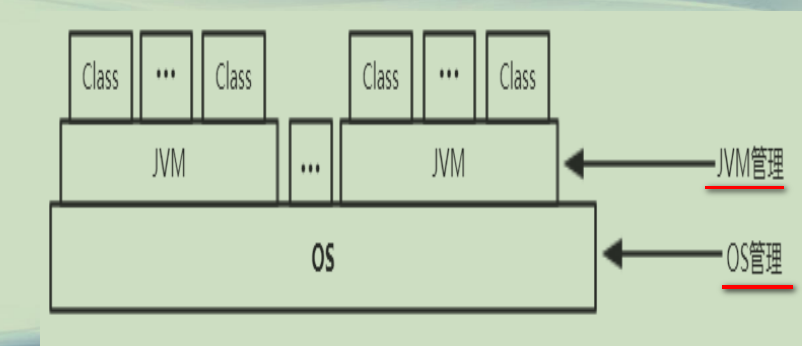
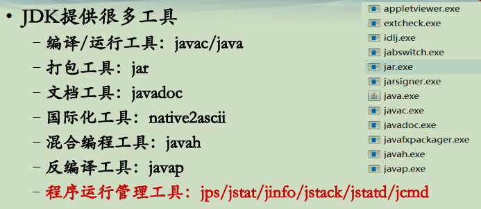
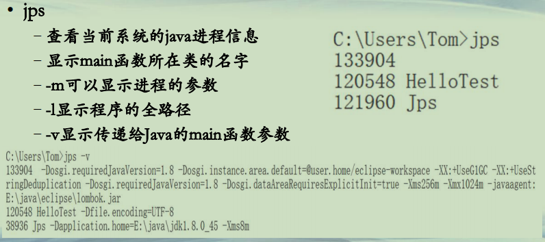
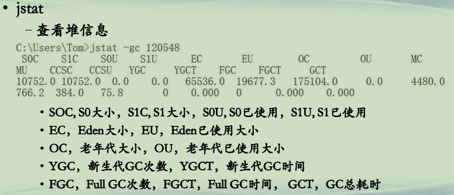
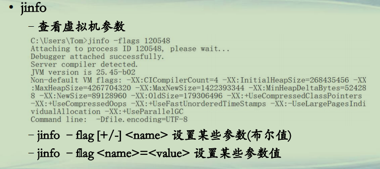
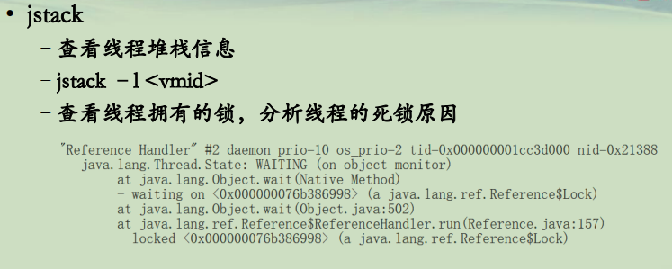
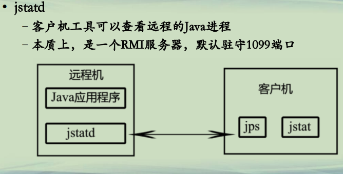
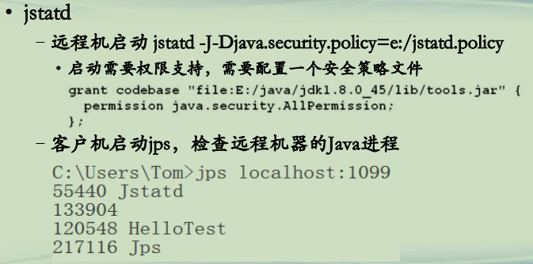
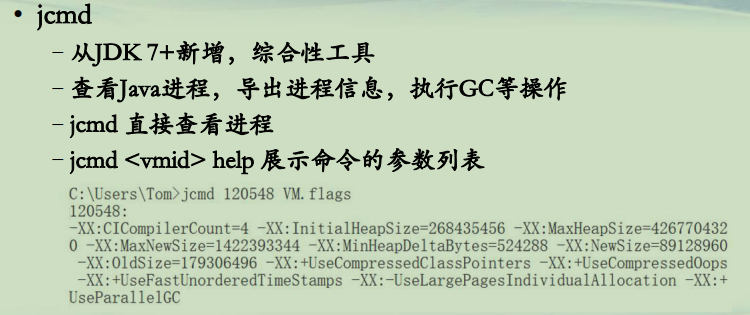

## JDK管理工具

**Java运行管理**  

**JDK工具集**  
**• JDK提供很多工具**  
**–编译/运行工具：javac/java**  
**–打包工具：jar**  
**–文档工具：javadoc**  
**–国际化工具：native2ascii**  
**–混合编程工具：javah**  
**–反编译工具：javap**  
**–程序运行管理工具：jps/jstat/jinfo/jstack/jstatd/jcmd**  

**JDK管理工具(1)**  
**• jps**  
**–查看当前系统的java进程信息**  
**–显示main函数所在类的名字**  
**–-m可以显示进程的参数**   
**–-l显示程序的全路径 **  
**–-v显示传递给Java的main函数参数**  

**JDK管理工具(2)**  
**• jstat**  
**–查看堆信息 ** 

• SOC, S0大小，S1C, S1大小，S0U, S0已使用，S1U, S1已使用
• EC，Eden大小，EU，Eden已使用大小
• OC，老年代大小，OU，老年代已使用大小
• YGC，新生代GC次数，YGCT，新生代GC时间
• FGC，Full GC次数，FGCT，Full GC时间， GCT，GC总耗时

**JDK管理工具(3)**  
**• jinfo**  
**–查看虚拟机参数**  
**–jinfo –flag [+/-] <name> 设置某些参数(布尔值) **  
**–jinfo –flag <name>=<value> 设置某些参数值**  

**JDK管理工具(4)**  
**• jstack**  
**–查看线程堆栈信息**  
**–jstack –l <vmid> **  
**–查看线程拥有的锁，分析线程的死锁原因**  

**JDK管理工具(5)**  
**• jstatd**  
**–客户机工具可以查看远程的Java进程**  
**–本质上，是一个RMI服务器，默认驻守1099端口**   

**JDK管理工具(6)**  
**• jstatd**  
**–远程机启动 jstatd -J-Djava.security.policy=e:/jstatd.policy**   
**• 启动需要权限支持，需要配置一个安全策略文件**  
**–客户机启动jps，检查远程机器的Java进程**  

**JDK管理工具(7)**  
**• jcmd**  
**–从JDK 7+新增，综合性工具**  
**–查看Java进程，导出进程信息，执行GC等操作**  
**–jcmd 直接查看进程**  
**–jcmd <vmid> help 展示命令的参数列表 **  

**总结**  
**• 了解Java运行管理的内容**  
**• 掌握JDK管理工具、命令参数及其相关用法**  

