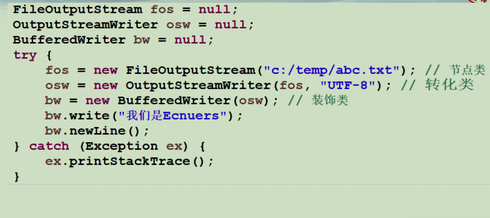
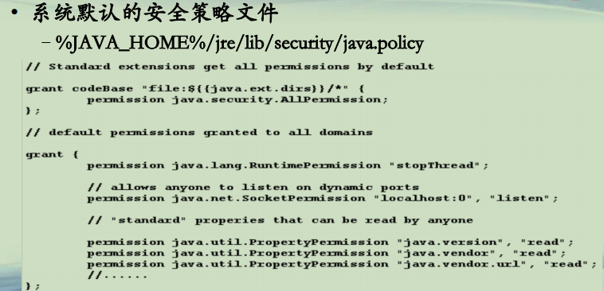

## Java运行安全

**一个文件写的例子**  

**Java程序运行安全(1)**  
**• Java程序来源繁杂**  
**–自定义的类**  
**–第三方Jar包**  
**–网络下载(Applet， RMI等)**  
**• Java程序运行**  
**–非法访问某些目录**  
**–打开Socket链接**  
**–退出虚拟机 ** 
**–。。。。。。**  

**Java程序运行安全(2)**  
**• Java提供*安全管理器***  
**–对程序的行为进行安全判定，如违反，报错**  
**–加载安全策略文件**  
**• 一个权限集合，包含各种权限，规定哪些程序可以做哪些功能**  
**–默认情况，普通程序不加载安全管理器**  
**–*启用安全管理器***  
**• System.setSecurityManager(new SecurityManager());**  
**• java –Djava.security.manager –Djava.security.policy=My.policy HelloWorld**  

**Java程序运行安全(3)**  
**• 安全策略文件**  
**–建立代码来源和访问权限的关系**  
**–代码来源**  
**• 代码位置**  
**• 证书集**  
**–权限**  
**• 由安全管理器负责加载的安全属性**  
**• permission java.io.FilePermission “/tmp/*”, “read, write”  
• FilePermission p = new FilePermission(“/tmp/*”，“read,write”);**   

**Java程序运行安全(4)**  
**• 系统默认的安全策略文件**  
**–%JAVA_HOME%/jre/lib/security/java.policy**  

**Java程序运行安全(5)**  
**• 进一步学习**  
**–了解JDK自带的Permission类**  
**• https://docs.oracle.com/javase/8/docs/technotes/guides/security/permissions.html**  
**–自定义权限类，继承Permission类**  
**–JAAS，将用户和权限联系起来**  
**–数字签名，确保类文件正确**  
**–Java加解密**  

代码包，在本目录下：PMOOC13-07.zip

**总结**  
**• 了解程序的运行安全概念 ** 
**• 掌握使用策略文件限制程序的运行功能 ** 