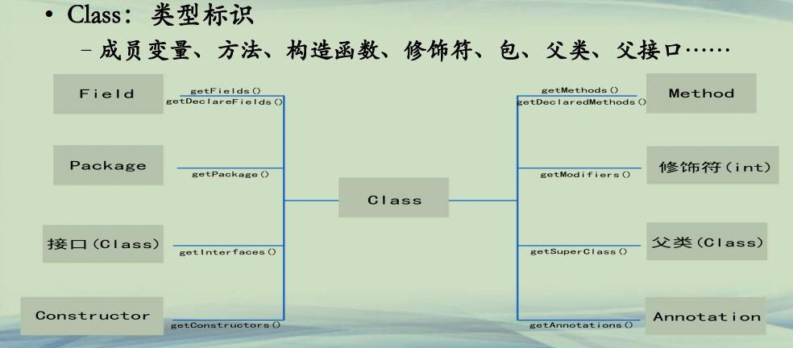

## 反射关键类

**反射(1)**  
**• 反射：reflection**  
**–程序可以访问、检测和修改它本身状态或行为的能力，即自描述和自控制。**  
**–可以在运行时加载、探知和使用编译期间完全未知的类。**  
**–给Java插上动态语言特性的翅膀，弥补强类型语言的不足。**  
**–java.lang.reflect包，在Java 2时代就有，在Java 5得到完善**  


**反射(2)**  
**• 反射：reflection**  
**–在运行中分析类的能力**  
**–在运行中查看和操作对象**  
**• 反射构建出无法直接访问的类**  
**• set或者get到无法访问的成员变量**  
**• 调用不可访问的方法**  
**–实现通用的数组操作代码**  
**–类似函数指针的功能**  


**关键类(1)**  
**• Class：类型标识**  
**–JVM为每个对象都保留其类型标识信息(Runtime Type Identification)**  
**–三种获取方式**  

```java
String s1 = "abc";
Class c1 = s1.getClass();
System.out.println(c1.getName());

Class c2 = Class.forName("java.lang.String");
System.out.println(c2.getName());

Class c3 = String.class;
System.out.println(c3.getName());	

```

**关键类(2)**  
**• Class：类型标识**  
**–成员变量、方法、构造函数、修饰符、包、父类、父接口……**  




**getMethods():返回本类和所有父类所有的public方法；**    

**getDeclaredMethods():返回本类自己定义的方法，包括private的方法，但不包括父类方法。**  

**getFields(),和getDeclaredFields()的区别和上述的区别差不多。**  


**关键类(3)**  
**• Field：成员变量(见下面代码)**  

**关键类(4)**  
**• Method：成员方法(见下面代码)**  

**关键类(5)**  
**• Constructor：构造函数(见下面代码)**  

**关键类(6)**  
**• 父类/父接口(见下面代码)**  

```java
└─src
        ClassTest.java
        ConstructorTest.java
        FieldTest.java
        MethodTest.java
        SuperTest.java
```

```java

public class ClassTest {

	public static void main(String[] args) throws ClassNotFoundException {		
		
		String s1 = "abc";
		Class c1 = s1.getClass();
		System.out.println(c1.getName());
		
		Class c2 = Class.forName("java.lang.String");
		System.out.println(c2.getName());
		
		Class c3 = String.class;
		System.out.println(c3.getName());	

	}

}
```

```java
import java.lang.reflect.Field;

public class FieldTest {

	public static void main(String[] args) throws IllegalArgumentException, IllegalAccessException {
		A obj = new A(20, "Tom");
		Class c = obj.getClass();
		
		//获取本类及父类所有的public字段
		Field[] fs = c.getFields(); 
		System.out.println(fs[0].getName() + ":" + fs[0].get(obj));
		
		//获取本类所有声明的字段
		Field[] fs2 = c.getDeclaredFields();
		for(Field f : fs2)
		{
			f.setAccessible(true);//使当前的private属性临时变成 public
			System.out.println(f.getName() + ":" + f.get(obj));
		}
		
	}

}

class A
{
	public int age;
	private String name;
	
	public A(int age, String name)
	{
		this.age = age;
		this.name = name;
	}
}
```

```java
import java.lang.reflect.InvocationTargetException;
import java.lang.reflect.Method;
import static java.lang.System.out;

public class MethodTest {

	public static void main(String[] args)
			throws IllegalAccessException, IllegalArgumentException, InvocationTargetException {
		B obj = new B();
		Class c = obj.getClass();

		// 获取public方法 包括父类和父接口
		Method[] ms = c.getMethods();
		for (Method m : ms) {
			if ("f1".equals(m.getName())) {
				m.invoke(obj, null);
			}
		}

		// 获得该类的所有方法
		Method[] ms2 = c.getDeclaredMethods();
		for (Method m : ms2) {
			if ("f2".equals(m.getName())) {
				m.setAccessible(true);
				String result = (String) m.invoke(obj, "abc");
				out.println(result);
			}
		}
	}

}

class B {
	public void f1() {
		out.println("B.f1()...");
	}

	private String f2(String s) {
		out.println("B.f2()...");
		return s;
	}
}

```

```java
import java.lang.reflect.Constructor;
import java.lang.reflect.InvocationTargetException;

public class ConstructorTest {

	@SuppressWarnings("rawtypes")
	public static void main(String[] args)
			throws InstantiationException, IllegalAccessException, IllegalArgumentException, InvocationTargetException {
		D d = new D();
		Class c = d.getClass();

		Constructor[] cons = c.getConstructors();
		for (Constructor con : cons) {
			if (con.getParameterCount() > 0) {
				// 有参构造函数
				D obj = (D) con.newInstance(100);
				obj.printNum();
			} else {
				// 无参构造函数
				D obj = (D) con.newInstance();
				obj.printNum();
			}
		}
	}
}

class D {
	private int num;

	public D() {
		this.num = 10;
	}

	public D(int num) {
		this.num = num;
	}

	public void printNum() {
		System.out.println(this.num);
	}
}

```

```java

public class SuperTest {

	public static void main(String[] args) {
		Son son = new Son();
		Class c = son.getClass();
		
		Class father = c.getSuperclass();
		System.out.println(father.getName());
		
		Class[] inters = c.getInterfaces();
		for(Class inter : inters)
		{
			System.out.println(inter.getName());
		}

	}

}

class Father { }

class Son extends Father 
  implements Cloneable, Comparable
{
	protected Object clone() throws CloneNotSupportedException
	{
		return super.clone();
	}

	public int compareTo(Object o) {
		return 0;
	}
}

```

**总结**  
**• 了解Java反射的关键类Class**  
**• 根据反射分析类的内容**  

