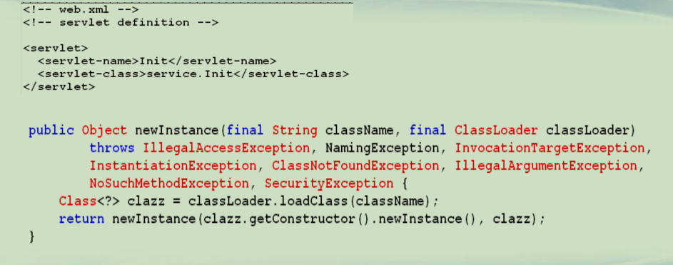
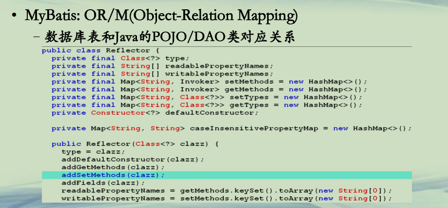
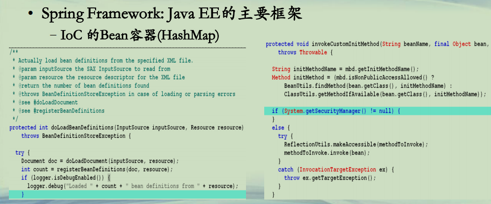

## 反射应用

**概要**  
**• 数据库连接**  
**• 数组扩充器**  
**• 动态执行方法**  
**• Json和Java对象互转**  
**• Tomcat的Servlet对象创建**  
**• MyBatis的OR/M**  
**• Spring的Bean容器**  
**• org.reflections包介绍**  


**数据库连接**  
**• JDBC**  
**–Connection，连接到各个不同数据库**  

```java
import java.sql.*;

public class ConnectionTest {

public static void main(String[] args){
    	
    	//构建Java和数据库之间的桥梁介质
        try{            
            Class.forName("com.mysql.jdbc.Driver");
            //Class.forName(className, true, currentLoader) 
            //通知类加载器加载此类的class文件
            System.out.println("注册驱动成功!");
        }catch(ClassNotFoundException e1){
            System.out.println("注册驱动失败!");
            e1.printStackTrace();
            return;
        }
        
        String url="jdbc:mysql://localhost:3306/test";        
        Connection conn = null;
        try {
        	//构建Java和数据库之间的桥梁：URL，用户名，密码
            conn = DriverManager.getConnection(url, "root", "123456");
            //DriverManager将会挑选加载合适的驱动类，并采用getConnection方法连接
            
            //构建数据库执行者
            Statement stmt = conn.createStatement(); 
            System.out.println("创建Statement成功！");      
            
            //执行SQL语句并返回结果到ResultSet
            ResultSet rs = stmt.executeQuery("select bookid, bookname, price from t_book order by bookid");
                        
            //开始遍历ResultSet数据
            while(rs.next())
            {
            	System.out.println(rs.getInt(1) + "," + rs.getString(2) + "," + rs.getInt("price"));
            }
            
            rs.close();
            stmt.close();
            
        } catch (SQLException e){
            e.printStackTrace();
        }
        finally
        {
        	try
        	{
        		if(null != conn)
        		{
            		conn.close();
            	}
        	}
        	catch (SQLException e){
                e.printStackTrace();
        	}        	
        }
    }

}
```


**数组扩充**  
**• 给定一个数组(任意类型)，将其长度扩大一倍**  
**–Java的数组一旦创建，其长度是不再更改的**  
**–新建一个大数组(相同类型)，然后将旧数组的内容拷贝过去**  

```java
import java.lang.reflect.Array;

public class ArrayTest {

	public static void main(String[] args) {
		int[] a = { 1, 2, 3, 4, 5 };
		a = (int[]) goodCopy(a, 10);
		for (int i : a) {
			System.out.println(i);
		}
	}

	public static Object goodCopy(Object oldArray, int newLength) {
		// Array类型
		Class c = oldArray.getClass();

		// 获取数组中的单个元素类型
		Class componentType = c.getComponentType();

		// 旧数组长度
		int oldLength = Array.getLength(oldArray);

		// 新数组
		Object newArray = Array.newInstance(componentType, newLength);

		// 拷贝旧数据
		System.arraycopy(oldArray, 0, newArray, 0, oldLength);
		return newArray;
	}

}
```


**动态执行方法**  
**• 给定类名、方法名，即可执行**  
**–加上定时器，即可做定时任务执行**  

```java

import java.lang.reflect.Method;
import java.util.Calendar;
import java.util.Date;
import java.util.Timer;
import java.util.TimerTask;

public class MethodTest {

	public static void main(String[] args) throws InterruptedException {
		Timer timer = new Timer();

		Calendar now = Calendar.getInstance();
		now.set(Calendar.SECOND, 
				now.get(Calendar.SECOND) + 1);
		Date runDate = now.getTime();

		MyTask task2 = new MyTask();
		timer.scheduleAtFixedRate(task2, runDate, 3000); 
		// 固定速率

		Thread.sleep(15000);
		timer.cancel(); // 取消定时器
	}
}

class MyTask extends TimerTask {
	public void run() {
		try {
			Method m = Class.forName("Worker")
					.getClass().getMethod("hello");
			m.invoke(null);// 静态方法可以不用new对象
		} catch (Exception e) {
			e.printStackTrace();
		}
	}
}

class Worker {
	public static void hello() {
		System.out.println("Hello java!");
	}
}

```


**Json和Java对象互转**  

```java
import com.google.gson.Gson;

public class JsonToObject {

	public static void main(String[] args) {
		Gson gson = new Gson();
		String s =  "{\"name\":\"Jo\""
				+ ",\"email\":\"a@b.com\"}";
		Person p = gson.fromJson(s, Person.class);
		
		System.out.println(p.getName());
		System.out.println(p.getEmail());
	}

}

class Person
{
	private String name;
	private String email;
	public String getName() {
		return name;
	}
	public String getEmail() {
		return email;
	}
}

```

pom.xml

```java
<project xmlns="http://maven.apache.org/POM/4.0.0" xmlns:xsi="http://www.w3.org/2001/XMLSchema-instance" xsi:schemaLocation="http://maven.apache.org/POM/4.0.0 http://maven.apache.org/xsd/maven-4.0.0.xsd">
  <modelVersion>4.0.0</modelVersion>
  <groupId>com.test</groupId>
  <artifactId>PMOOC03-03</artifactId>
  <version>0.0.1-SNAPSHOT</version>
  
  <dependencies>
  	<dependency>
            <groupId>com.google.code.gson</groupId>
            <artifactId>gson</artifactId>
            <version>2.8.5</version>
        </dependency>
  </dependencies>
  <build>
    <sourceDirectory>src</sourceDirectory>
    <plugins>
      <plugin>
        <artifactId>maven-compiler-plugin</artifactId>
        <version>3.8.0</version>
        <configuration>
          <release>11</release>
        </configuration>
      </plugin>
    </plugins>
  </build>
</project>
```


**Tomcat的Servlet创建**  




**MyBatis的OR/M**  
**• MyBatis: OR/M(Object-Relation Mapping)**  
**–数据库表和Java的POJO/DAO类对应关系**  




**Spring Framework的Bean容器**  
**• Spring Framework: Java EE的主要框架**  
**–IoC 的Bean容器(HashMap)**  




**org.reflections**  
**• Reflection的增强工具包**  
**– https://github.com/ronmamo/reflections**  
**–Java runtime metadata analysis**   
**• 获取某类的所有子类型**  
**• 获取有特殊annotation的类型或者成员变量/方法**  
**• 根据正则表达式获取资源(类/成员变量/方法)**  
**• 根据组合条件查询相应的方法**  
**• ……**  


**总结**  
**• 了解Java反射的广泛用途**  
**• 了解反射在诸多框架的底层作用**  

