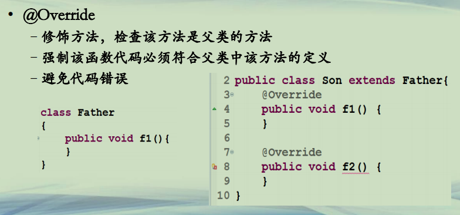
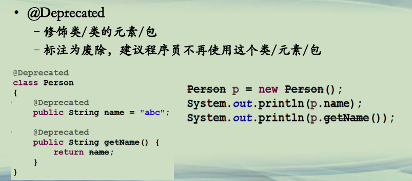

## Java预定义的普通注解

**Java预定义的注解**  
**• JDK预定义的普通注解(部分)**  
***–普通注解：为Java代码所用的注解***  
***–@Override 表示继承和覆写 自带普通注解***  
***–@Deprecated 表示废弃 自带普通注解***  
***–@SuppressWarnings 表示压制警告 自带普通注解***  
**–@SafeVarargs 不会对不定项参数做危险操作 自带普通注解**  
**–@FunctionInterface 声明功能性接口 自带普通注解**  


**普通注解(1)**  
**• @Override**  
**–修饰方法，检查该方法是父类的方法**  
**–强制该函数代码必须符合父类中该方法的定义**  
**–避免代码错误**  




**普通注解(2)**  
**• @Deprecated**  
**–修饰类/类的元素/包**  
**–标注为废除，建议程序员不再使用这个类/元素/包**  




**普通注解(3)**  
**• @ SuppressWarnings**  
**–可以修饰变量/方法/构造函数/类等**  
**–压制各种不同类型的警告信息，使得编译器不显示警告**  
**–各种不同类型是叠加，如修饰类的警告类型，和修饰方法的警告类型，对于方法来说，是叠加的。**  
**–*警告类型名称是编译器/IDE工具自己定的，Java规范没有强制要求哪些名称*。编译器厂商需要自行协商，保证同名警告类型在各个编译器上一样工作。**  
**– https://docs.oracle.com/javase/8/docs/api/java/lang/SuppressWarnings.html**  


**普通注解(4)**  
**• @ SuppressWarnings**  
**– @SuppressWarnings(“unchecked”) 忽略unchecked警告信息**  
**– @SuppressWarnings(“deprecated”) 忽略过时方法的警告信息**  
**– @SuppressWarnings({“unchecked”，“deprecated”}) 忽略两种警告信息**  
**– @ SuppressWarnings(values={“unchecked”，“deprecated”}) 同上**  
**– @ SuppressWarnings( “all”) 忽略所有的警告信息**  


**普通注解(5)**  
**• @ SuppressWarnings 常用警告类型**  
**– JLS 只规定了deprecated和unchecked两种**  
**• https://docs.oracle.com/javase/tutorial/java/annotations/predefined.html**  
**– 其他的警告类型**  
**• all，忽略所有的警告**  
**• cast，忽略类转型警告**  
**• serial，忽略实现Serializable接口的，没有定义serialVersionUID**  
**• 使用*javac -X* 可以看当前的编译器使用哪些警告类型 **  
**• https://stackoverflow.com/questions/1205995/what-is-the-list-of-validsuppresswarnings-warning-names-in-java 查看其他IDE支持的警告类型**  

```java
│      
└─src
        DeprecatedTest.java
        Son.java
        SuppressWarningDemo.java
```

```java

public class DeprecatedTest {

	public static void main(String[] args) {
		Person p = new Person();
		System.out.println(p.name);
		System.out.println(p.getName());

	}

}

@Deprecated
class Person
{
	@Deprecated
	public String name = "abc";
	@Deprecated
	public String getName()	{
		return name;
	}
}
```

```java

public class Son extends Father{
	@Override
	public void f1() {		
	}
	
//	@Override
	public void f2() {		
	}
}

class Father
{
	public void f1(){		
	}
}
```

```java
import java.util.Date;

public class SuppressWarningDemo {

	//@SuppressWarnings("all")
	//@SuppressWarnings("unchecked")
	//@SuppressWarnings({"unused"})
	//@SuppressWarnings({"unused","deprecation"})
	@SuppressWarnings(value={"unused","deprecation"})
	public static void main(String[] args) {
		int a = 5;
		
		Date d = new Date();
		System.out.println(d.getYear());	
	}

}

```


**总结**  
**• Java预定义的普通注解**  
**–普通注解都自带一定的功能的**  
**–Override标记该方法覆盖父类的方法**  
**–Deprecated标记该元素是属于过时的**  
**–SuppressWarnings来压制各种不同类型的警告信息**  


