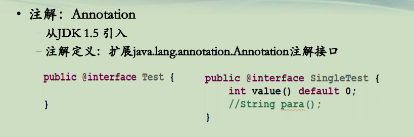
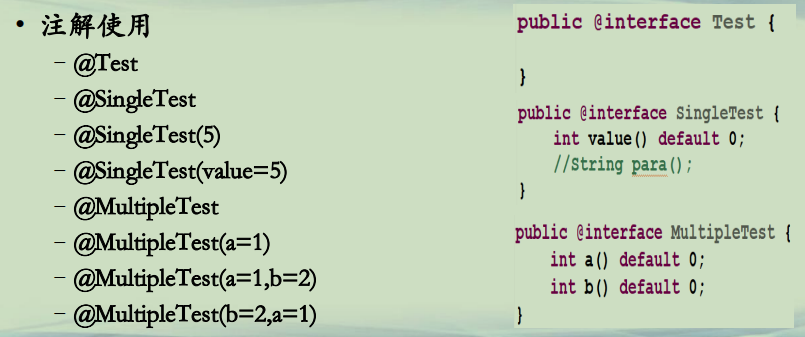
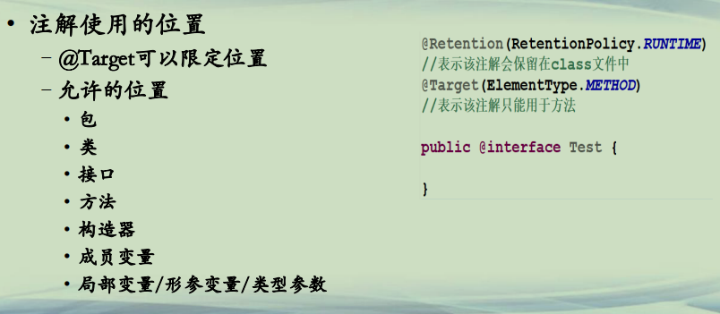

## 自定义注解

**自定义注解(1)**  
**• 注解：Annotation**  
**–从JDK 1.5 引入**  
**–注解定义：扩展java.lang.annotation.Annotation注解接口**  




**自定义注解(2)**  
**• 注解可以包括的类型**  
**–8种基本类型(int/short/long/float/double/byte/char/boolean)**  
**–String**  
**–Class**  
**–enum类型**  
**–注解类型**  
**–由前面类型组成的数组**  

如下面的代码 BugReport.java：

```

public @interface BugReport {
	enum Status {UNCONFIRMED, CONFIRMED, FIXED, NOTABUG};
	boolean showStopper() default true;
	String assiganedTo() default "[none]";
	Status status() default Status.UNCONFIRMED;
	String[] reportedBy();
}
```


**自定义注解(3)**  
**• 注解使用**  
**–@Test**  
**–@SingleTest**  
**–@SingleTest(5)**  
**–@SingleTest(value=5)**  
**–@MultipleTest**  
**–@MultipleTest(a=1)**  
**–@MultipleTest(a=1,b=2)**  
**–@MultipleTest(b=2,a=1)**  




**自定义注解(4)**  
**• 注解使用的位置**  
**–@Target可以限定位置**  
**–允许的位置**  
**• 包**  
**• 类**  
**• 接口**  
**• 方法**  
**• 构造器**  
**• 成员变量**  
**• 局部变量/形参变量/类型参数**  




```java
└─src
    │  BugReport.java
    │  
    └─annotations
        ├─marker
        │      Foo.java
        │      Main.java
        │      Test.java
        │      
        ├─multiple
        │      Foo.java
        │      Main.java
        │      MultipleTest.java
        │      
        └─single
                Foo.java
                Main.java
                SingleTest.java
```


(default package)：

```java

public @interface BugReport {
	enum Status {UNCONFIRMED, CONFIRMED, FIXED, NOTABUG};
	boolean showStopper() default true;
	String assiganedTo() default "[none]";
	Status status() default Status.UNCONFIRMED;
	String[] reportedBy();
}
```


annotations.marker:

```java
package annotations.marker;
import java.lang.annotation.*;

@Retention(RetentionPolicy.RUNTIME)
//表示该注解会保留在class文件中
@Target(ElementType.METHOD) 
//表示该注解只能用于方法

public @interface Test {

}
```

```java
package annotations.marker;

public class Foo {
	@Test
	public static void m1() {
	}

	public static void m2() {
	}

	@Test
	public static void m3() {
		throw new RuntimeException("Boom");
	}

	public static void m4() {
	}

	@Test
	public static void m5() {
	}

	public static void m6() {
	}

	@Test
	public static void m7() {
		throw new RuntimeException("Crash");
	}

	public static void m8() {
	}
}
```

```java
package annotations.marker;
import java.lang.reflect.*;

public class Main {
	public static void main(String[] args) throws Exception {
	      int passed = 0, failed = 0;
	      String className = "annotations.marker.Foo";
	      for (Method m : Class.forName(className).getMethods()) {
	         if (m.isAnnotationPresent(Test.class)) {
	            try {
	               m.invoke(null);
	               passed++;
	            } catch (Throwable ex) {
	               System.out.printf("Test %s failed: %s %n", m, ex.getCause());
	               failed++;
	            }
	         }
	      }
	      System.out.printf("Passed: %d, Failed %d%n", passed, failed);
	   }
}
```

annotations.multiple：

```java
package annotations.multiple;
import java.lang.annotation.*;

@Retention(RetentionPolicy.RUNTIME)
//表示该注解会保留在class文件中
@Target(ElementType.METHOD)   
//表示该注解只能用于方法

public @interface MultipleTest {
	int a() default 0;
	int b() default 0;
}
```

```java
package annotations.multiple;

public class Foo {
	@MultipleTest(a=1,b=1)
	public static void m1(int a, int b) {
		if(a+b<0)
		{
			throw new RuntimeException("Crash");
		}
	}

	@MultipleTest
	public static void m2(int a, int b) {
		//全部采用默认值
		if(a+b<0)
		{
			throw new RuntimeException("Broken");
		}
	}

	@MultipleTest(b=-2,a=1)
	public static void m3(int a, int b) {
		if(a+b<0)
		{
			throw new RuntimeException("Boom");
		}
	}
}

```

```java
package annotations.multiple;

import java.lang.annotation.Annotation;
import java.lang.reflect.*;

public class Main {
	public static void main(String[] args) throws Exception {
		int passed = 0, failed = 0;
		String className = "annotations.multiple.Foo";
		for (Method m : Class.forName(className).getMethods()) {
			
			if (m.isAnnotationPresent(MultipleTest.class)) {
				System.out.println(m.getName());
				MultipleTest st = m.getAnnotation(MultipleTest.class);				
				try {
					m.invoke(null,st.a(),st.b());
					passed++;
				} catch (Throwable ex) {
					System.out.printf("Test %s failed: %s %n", m, ex.getCause());
					failed++;
				}
			}
		}
		System.out.printf("Passed: %d, Failed %d%n", passed, failed);
	}
}
```


annotations.single:

```java
package annotations.single;
import java.lang.annotation.*;

@Retention(RetentionPolicy.RUNTIME)
//表示该注解会保留在class文件中
@Target(ElementType.METHOD)   
//表示该注解只能用于方法

public @interface SingleTest {
	int value() default 0;
	//String para();
}
```

```java
package annotations.single;

public class Foo {
	@SingleTest(1)
	public static void m1(int a) {
		if(a<0)
		{
			throw new RuntimeException("Crash");
		}
	}

	public static void m2() {
	}

	@SingleTest(value=-2)
	public static void m3(int a) {
		System.out.println("接收到的参数为："+a);
		if(a<0)
		{
			throw new RuntimeException("Crash");
		}
	}
}

```

```java
package annotations.single;

import java.lang.annotation.Annotation;
import java.lang.reflect.*;

public class Main {
	public static void main(String[] args) throws Exception {
		int passed = 0, failed = 0;
		String className = "annotations.single.Foo";
		for (Method m : Class.forName(className).getMethods()) {
			
			if (m.isAnnotationPresent(SingleTest.class)) {
				System.out.println(m.getName());
				SingleTest st = m.getAnnotation(SingleTest.class);				
				try {
					m.invoke(null,st.value());
					passed++;
				} catch (Throwable ex) {
					System.out.printf("Test %s failed: %s %n", m, ex.getCause());
					failed++;
				}
			}
		}
		System.out.printf("Passed: %d, Failed %d%n", passed, failed);
	}
}
```


**总结**  
**• 自定义注解**  
**–扩展于java.lang.annotation.Annotation**  
**–成员可以包括多种类型**  
**–使用时可以给注解成员赋值**  
**–用于修饰多种程序元素**  


