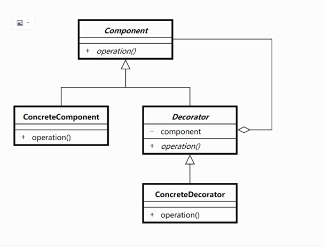

## 装饰器模式

此例子是 ,拍照加美颜，加滤镜的例子。

 

```java
    └─decorator
            Component.java
            ConcreteCompont.java
            ConcreteDecorator1.java
            ConcreteDecorator2.java
            Decorator.java
            Test.java
            装饰者类图.png
```

```java
package decorator;

/**
 * 这个是接口，不会变
 * @author 御香烤翅
 * @create 2020-01-14 20:22
 */
public interface Component {

    void operation();

}

```

```java
package decorator;

/**
 *被装饰者
 * 这个是原始的功能实现，不会变
 * @author 御香烤翅
 * @create 2020-01-14 20:22
 */
public class ConcreteCompont implements Component {
    @Override
    public void operation() {
        System.out.println("拍照");
    }
}

```

```java
package decorator;

/*
 * 装饰者
 * @author 御香烤翅
 * @create 2020-01-14 20:25
 */
public abstract class Decorator implements Component {

    Component component;//装饰者持有被装饰者的引用
    public Decorator(Component component){
        this.component=component;
    }
}

```

```java
package decorator;

/**
 * 具体的装饰者1
 * @author 御香烤翅
 * @create 2020-01-14 20:30
 */
public class ConcreteDecorator1 extends Decorator{

    public ConcreteDecorator1(Component component) {
        super(component);
    }

    @Override
    public void operation() {
        System.out.println("添加美颜...");
        component.operation();
    }
}

```

```java
package decorator;

/**
 * 具体的装饰者2
 * @author 御香烤翅
 * @create 2020-01-14 20:35
 */
public class ConcreteDecorator2 extends Decorator {
    public ConcreteDecorator2(Component component) {
        super(component);
    }

    @Override
    public void operation() {
        System.out.println("添加滤镜...");
        component.operation();
    }
}

```

```java
package decorator;

/**
 * @author 御香烤翅
 * @create 2020-01-14 20:32
 */
public class Test {

    public static void main(String[] args) {
        System.out.println("调试信息：");

        //一：执行顺序，先执行 ConcreteDecorator1 再执行 concreteDecorator2 最后执行 ConcreteCompont
        //最后输出
        //调试信息：
        //添加美颜...
        //添加滤镜...
        //拍照
//        ConcreteDecorator2 concreteDecorator2=new ConcreteDecorator2(new ConcreteCompont());
//        Component component=new ConcreteDecorator1(concreteDecorator2);

        //二：执行顺序，先执行 ConcreteDecorator2 再执行 concreteDecorator1 最后执行 ConcreteCompont
        //最后输出
        //调试信息：
        //添加滤镜...
        //添加美颜...
        //拍照
//        ConcreteDecorator1 concreteDecorator1=new ConcreteDecorator1(new ConcreteCompont());
//        Component component=new ConcreteDecorator2(concreteDecorator1);

        Component component=new ConcreteDecorator1(new ConcreteDecorator2(new ConcreteCompont()));
        component.operation();
    }
}

```

