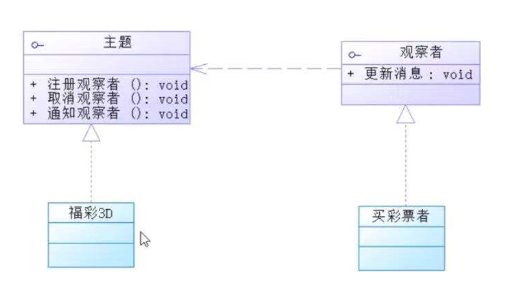

## 观察者模式1

观察者（订阅号）观察者被观察者（公众号）；

1.被观察者接口

2.被观察者实现类

3.观察者接口

4.观察者实现类



```java
└─src
    └─com
        └─vip
            └─pattern
                └─observer1
                        IObserver.java
                        ISubject.java
                        Observer1Test.java
                        ObserverPerson.java
                        Sport3d.java
```


```java
package com.vip.pattern.observer1;

/**
 * 被观察者，主题的接口（相当于是微信公众号）
 * @author 御香烤翅
 * @create 2020-01-15 11:00
 */
public interface ISubject {

    /**
     * 注册，订阅
     * @param ob
     */
     void register(IObserver ob);


    /**
     * 移除，取消订阅
     * @param ob
     */
     void remove(IObserver ob);

    /**
     * 通知消息
     */
    void notifyInfo();
}

```

```java
package com.vip.pattern.observer1;

/**
 * 观察者（相当于微信的订阅者）
 * @author 御香烤翅
 * @create 2020-01-15 11:01
 */
public interface IObserver {

    /**
     * 用于更新观察者的消息（订阅者的更新）
     */
    void update(String msg);

}

```

```java
package com.vip.pattern.observer1;

import java.util.ArrayList;
import java.util.List;

/**
 * 福彩3d主题->主题的实现者
 * @author 御香烤翅
 * @create 2020-01-15 11:08
 */
public class Sport3d implements ISubject{

    //定义一个用于存放 observer的集合用于存放订阅者
    private List<IObserver> observers=new ArrayList<>();

    //用于发送订阅的消息
    private String msg;


    /**
     * 注册福彩3d观察者（订阅福彩3d）
     * @param ob
     */
    @Override
    public void register(IObserver ob) {
        observers.add(ob);
    }

    /**
     * 移除福彩3d观察者（取消订阅福彩3d）
     * @param ob
     */
    @Override
    public void remove(IObserver ob) {
        if(observers.indexOf(ob) > 0){
            observers.remove(ob);
        }

    }

    /**
     * 通知福彩3d观察者（订阅者接收消息）
     */
    @Override
    public void notifyInfo() {
        //遍历所有的观察者，来通知消息
        for (IObserver observer : observers) {
            observer.update(msg);
        }

    }

    public void setMsg(String msg) {
        this.msg = msg;//设置消息
        notifyInfo();//设置完消息就是，通知消息
    }
}

```

```java
package com.vip.pattern.observer1;


import javax.security.auth.Subject;

/**
 * @author 御香烤翅
 * @create 2020-01-15 11:20
 */
public class ObserverPerson implements IObserver {

    private String name;

    public ObserverPerson(String name, ISubject subject){
        this.name=name;
        subject.register(this);//把自己（订阅者）注册到主题中（被观察者）
    }


    @Override
    public void update(String msg) {
        System.out.println(name+","+msg);
    }
}

```

```java
package com.vip.pattern.observer1;

/**
 * @author 御香烤翅
 * @create 2020-01-15 11:24
 */
public class Observer1Test {

    public static void main(String[] args) {

        System.out.println("观察者模式测试：");
        Sport3d subject=new Sport3d();

        ObserverPerson p1=new ObserverPerson("张三",subject);
        ObserverPerson p2=new ObserverPerson("李四",subject);
        ObserverPerson p3=new ObserverPerson("王二",subject);

        subject.remove(p2);

        subject.setMsg("本期中奖号码是：1234456789");

    }

}

```

