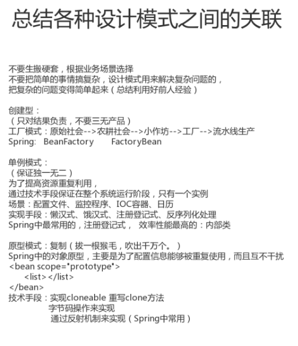
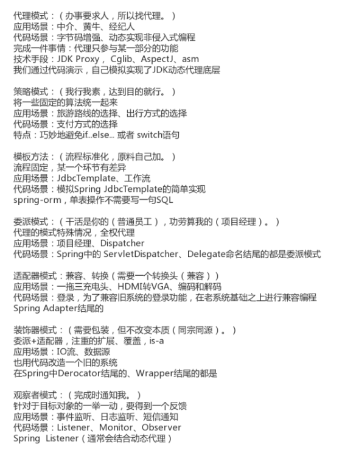
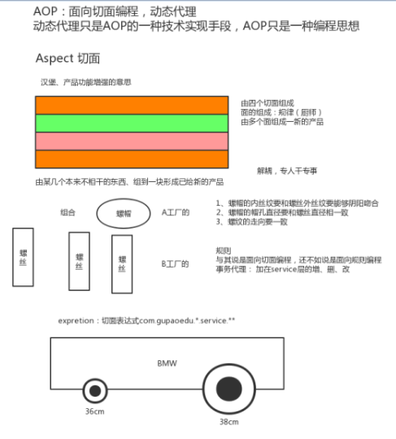
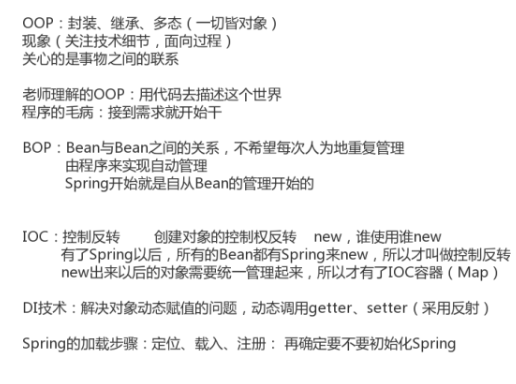

## 设计模式小结

1.12、各设计模式对比及编程思想总结
设计模式 一句话归纳
工厂模式（Factory） 只对结果负责，不要三无产品。
单例模式（Singleton） 保证独一无二。
适配器模式（Adapter） 需要一个转换头（兼容）。
装饰器模式（Decorator） 需要包装，但不改变本质(同宗同源)。
代理模式（Proxy） 办事要求人，所以找代理。
观察者模式（Observer） 完成时通知我。
策略模式（Strategy） 我行我素，达到目的就行。
模板模式（Template） 流程标准化，原料自己加。
委派模式（Delegate） 干活是你的（普通员工），功劳是我的（项目经理）。
原型模式（Prototype） 拔一根猴毛，吹出千万个。

| 设计模式                | 一句话归纳                                                   |
| ----------------------- | ------------------------------------------------------------ |
| 工厂模式（Factory）     | 只对结果负责，不要三无产品。[工厂]                           |
| 单例模式（Singleton）   | 保证独一无二。[数据源]                                       |
| 适配器模式（Adapter）   | 需要一个转换头（兼容）。                                     |
| 装饰器模式（Decorator） | 需要包装，但不改变本质(同宗同源)。[增强功能]                 |
| 代理模式（Proxy）       | 办事要求人，所以找代理。                                     |
| 观察者模式（Observer）  | 完成时通知我。[公众号]                                       |
| 策略模式（Strategy）    | 我行我素，达到目的就行。[支付的选择]                         |
| 模板模式（Template）    | 流程标准化，原料自己加。[流程规定好的，但其中的步骤可以自己定义] |
| 委派模式（Delegate）    | 干活是你的（普通员工），功劳是我的（项目经理）。[dispatch分发] |
| 原型模式（Prototype）   | 拔一根猴毛，吹出千万个。[复制]                               |

**编程思想总结**

| Spring 思想 | 应用场景（特点）                                             | 一句话归纳                   |
| ----------- | ------------------------------------------------------------ | ---------------------------- |
| AOP         | Aspect Oriented Programming(面向切面编程) 找出多个类中有一定规律的代码，开发时拆开，运行时再合并。 面向切面编程，即面向规则编程。 | 解耦，专人做专事。           |
| OOP         | Object Oriented Programming（面向对象编程） 归纳总结生活中一切事物。 | 封装、继承、多态。           |
| BOP         | Bean Oriented Programming（面向 Bean 编程） 面向 Bean（普通的 java 类）设计程序。 | 一切从 Bean 开始。           |
| IOC         | Inversion of Control（控制反转）将 new 对象的动作交给 Spring 管理， 并由 Spring 保存已创建的对象（IOC 容器）。 | 转交控制权（即控制权反转）） |
| DI/DL       | Dependency Injection（依赖注入）或者 Dependency Lookup（依赖查找） 依赖注入、依赖查找，Spring 不仅保存自己创建的对象，而且保 存对象与对象之间的关系。 注入即赋值，主要三种方式构造方法、set 方法、直接赋值。 | 先理清关系再赋值。           |