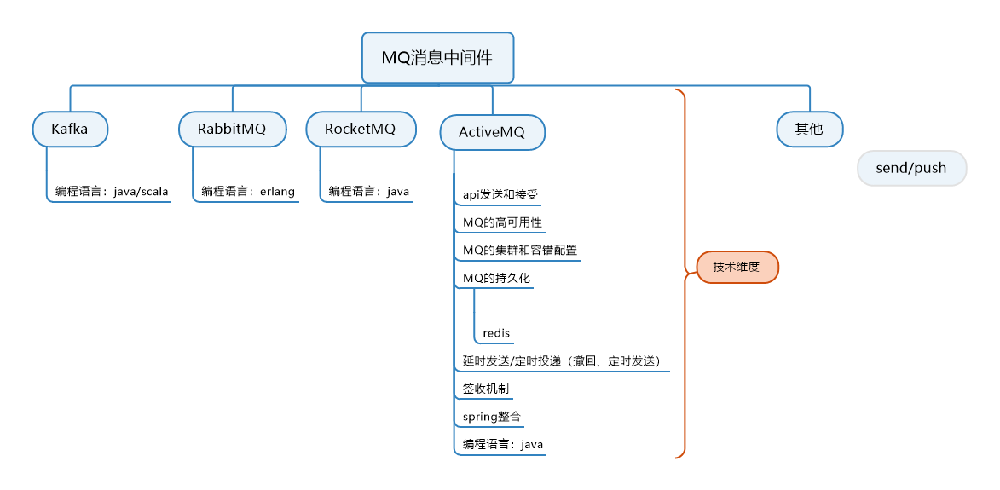

# ActiveMQ

## 1.前言概述

### 	1.1）、MQ：消息队列，消息中间件

​		消息：微信、短信、语音

​		中间件：类似于 发语音者 和接受者 中间要通过服务的关联，这个服务器，就好比中间件。

### 	1.2）、MQ产品种类

​		kafka: 

​		RabbitMQ:

​		RocketMQ:

​		ActiveMQ:



### 1.3）、从生活Case到实际生产案例

​	1）、当系统之间**直接调用**实际工程落地和存在的问题

​		A、**系统之间的耦合度比较严重：**

每新增一个下游功能，都要对上游的相关接口进行改造；
举个例子：如果系统A要发送数据给系统B和系统C，发送给每个系统的数据可能有差异，因此系统A对要发送给每个系统的数据进行了组装，然后逐一发送；
当代码上线后又新增了一个需求：
把数据也发送给D，新上了一个D系统也要接受A系统的数据，此时就需要修改A系统，让他感知到D系统的存在，同时把数据处理好再给D。在这个过程你会看到，每接入一个下游系统，都要对系统A进行代码改造，开发联调的效率很低。其整体架构如下图


​		B、**面对大流量并发时，容易被冲垮：**

每个接口模块的吞吐能力是有限的，这个上限能力如果是堤坝，当大流量（洪水）来临时，容易被冲垮。
举个例子秒杀业务：
上游系统发起**下单购买**操作，我就是下单一个操作
下游系统完成秒杀业务逻辑
**（读取订单，库存检查，库存冻结，余额检查，余额冻结，订单生产，余额扣减，库存减少，生成流水，余额解冻，库存解冻）**

​		C、**等待同步存在性能问题：**

RPC接口上基本都是同步调用，整体的服务性能遵循“木桶理论”，即整体系统的耗时取决于链路中最慢的那个接口。
比如A调用B/C/D都是50ms，但此时B又调用了B1，花费2000ms，那么直接就拖累了整个服务性能。


​	2）、如何解决上述问题？

​			根据上述的几个问题，在设计系统时可以明确要达到的目标：

​			1、要做到系统解耦，当新的模块接进来时，可以做到代码改动最小；能够**解耦**

​			2、设置流量缓冲池，可以让后端系统按照自身吞吐能力进行消费，不被冲垮；能**削峰**

​			3、强弱依赖梳理能将非关键调用链路的操作异步化并提升整体系统的吞吐能力；能够**异步**


### 1.4）、是什么？

​	1、定义：

面向消息的中间件（message-orientedmiddleware）MOM能够很好的解决以上问题，是指利用高效可靠的消息传递机制与平台无关的数据交流，并基于数据通信来进行分布式系统的集成。通过提供消息传递和消息排队模型在分布式环境下提供应用解耦，弹性伸缩，冗余存储、流量削峰，异步通信，数据同步等功能。

大致的过程是这样的：

发送者把消息发送给消息服务器，消息服务器将消息存放在若干**队列（一对一【A给B发短信】）/主题topic（一对多【微信公众号的发布和订阅】）**中，在合适的时候，消息服务器回将消息转发给接受者。在这个过程中，发送和接收是异步的，也就是发送无需等待，而且发送者和接受者的生命周期也没有必然的关系；
尤其在发布pub/订阅sub模式下，也可以完成一对多的通信，即让一个消息有多个接受者。


​	2、特点

​		2.1）、采用异步处理模式

​		2.2）、应用系统之间解耦合，例如：下图-整体架构


### 1.5）、能干嘛？(为什么要使用MQ)

​	解决了耦合调用问题、是异步模型（早上问，下午回）、抵御洪峰流量，削峰，保护主业务。

​	1、解耦

​	2、异步

​	3、削峰

### 1.6）、去哪下？

​	官网：http://activemq.apache.org/	

### 1.7）、怎么玩？

​	1）、最重要的功能：**实现高可用，高性能，可伸缩，易用和安全的企业级面向消息服务的系统**

​	2）、异步消息的消费和处理

​	3）、控制消息的消费顺序

​	4）、可以和Spring或者SpringBoot整合简化代码

​	5）、配置集群容错的MQ集群


## 2.ActiveMQ安装和控制台

### 	2.1）、安装步骤：

1.官网下载

2.ftp拷贝到/opt目录下

3.解压缩apache-activemq-5.15.9-bin.tar.gz

```shell
[root@localhost opt]# tar -xvzf apache-activemq-5.15.9-bin.tar.gz 
```

4.在根目录下新建 myactiveMQ文件夹

```shell
[root@localhost /]# mkdir /myactiveMQ
```

5.拷贝解压缩的文件夹到 myactiveMQ文件夹下

```shell
[root@localhost opt]# cp -r apache-activemq-5.15.9 /myactiveMQ/
```

### 2.2）、启动/关闭

1.普通启动

```shell
[root@localhost bin]# pwd
/myactiveMQ/apache-activemq-5.15.9/bin
[root@localhost bin]# ./activemq start
INFO: Loading '/myactiveMQ/apache-activemq-5.15.9//bin/env'
INFO: Using java '/usr/java/jdk1.8.0_65/bin/java'
INFO: Starting - inspect logfiles specified in logging.properties and log4j.properties to get details
INFO: pidfile created : '/myactiveMQ/apache-activemq-5.15.9//data/activemq.pid' (pid '2180')
[root@localhost bin]# 
```

activeMQ的默认端口是 61616

2.查看是否启动

```she
[root@localhost bin]# ps -ef | grep activemq
[root@localhost bin]# 
//过滤掉grep 显示的命令，有就有，没有就不显示。
[root@localhost bin]# ps -ef | grep activemq | grep -v grep
[root@localhost bin]# 
//查看端口的命令
[root@localhost bin]# netstat -anp | grep 61616
tcp6       0      0 :::61616                :::*                    LISTEN      2180/java           
[root@localhost bin]# 
// 列出谁在使用某个端口 如： lsof -i :3306

```

3.普通关闭

```shell
[root@localhost bin]# ./activemq stop
//查看关闭的状态方式
[root@localhost bin]# lsof -i:61616
[root@localhost bin]# netstat -anp | grep 61616
[root@localhost bin]# ps -ef | grep activemq | grep -v grep
[root@localhost bin]# 
```

4.带日志的启动

```shell
[root@localhost bin]# ./activemq start > /myactiveMQ/myrunmq.log
[root@localhost bin]# tail -f /myactiveMQ/myrunmq.log 
```

### 2.3）、Apache ActiveMQ控制台

​	1、访问http://192.168.1.102:8161/ （服务器的IP地址，ActiveMQ的访问端口是：8186） 这个url 来请求 ActiveMQ 

​	2、初始的用户名和密码为：admin/admin

备注：**ActiveMQ采用61616端口提供JMS服务**

​			**ActiveMQ采用8161端口提供管理控制台服务**


## 3.Java编码实现ActiveMQ通讯

### 	3.1）、JMS编码总体架构(类似于JDBC的步骤和mybatis编程式的步骤)：


### 	3.2）、目的地Destination队列(Queue)和主题(Topic)

1、目的地：理解为存放生产者和消费者存放的消息和主题地方

2、队列：产生的队列，这个理解为 1对1（1对1的发短息）

3、主题：产生的主题，这个理解为微信公众号和订阅者（1对多，1个微信公众号多个订阅者）


### 3.3）、入门队列queue案例

maven pom.xml

```xml
  <dependencies>
        <!--  activemq  所需要的jar 包-->
        <!-- https://mvnrepository.com/artifact/org.apache.activemq/activemq-all -->
        <dependency>
            <groupId>org.apache.activemq</groupId>
            <artifactId>activemq-all</artifactId>
            <version>5.15.9</version>
        </dependency>

        <!--  activemq 和 spring 整合的基础包 -->
        <dependency>
            <groupId>org.apache.xbean</groupId>
            <artifactId>xbean-spring</artifactId>
            <version>3.16</version>
        </dependency>
</dependencies>
```

#### ①、JmsProduce生产者类：

```java
package com.wck.activemq.queue;

import org.apache.activemq.ActiveMQConnectionFactory;

import javax.jms.*;

/**
 * @author 御香烤翅
 * @create 2020-03-18 21:47
 */
public class JmsProduce {

    public static final String ACTIVEMQ_URL="tcp://192.168.1.102:61616";
    public static final String QUEUE_NAME="queue01";

    public static void main(String[] args) throws JMSException {

        //1.创建activeMQ工厂实例，传递url，使用默认的url和密码 admin/admin
        ActiveMQConnectionFactory factory = new ActiveMQConnectionFactory(ACTIVEMQ_URL);
        //2.通过工厂，获得connection并启动访问
        Connection connection = factory.createConnection();
        connection.start();
        //3.创建会话 第一个参数：事务 ，第二个参数：签收
        Session session = connection.createSession(false, Session.AUTO_ACKNOWLEDGE);
        //4.创建目的地，队列/主题
        Queue queue = session.createQueue(QUEUE_NAME);
        //5.创建消息的生产者
        MessageProducer messageProducer = session.createProducer(queue);
        //6.使用MessageProducer生产者生产3条消息发送到MQ队列
        for (int i = 1; i <=3 ; i++) {
            //7.创建消息
            TextMessage textMessage = session.createTextMessage("msg" + i);//理解为一个字符串
            //8.发送消息
            messageProducer.send(textMessage);
        }

        //9.关闭资源
        messageProducer.close();
        session.close();
        connection.close();

        System.out.println("消息发送到MQ完毕");
    }

}

```

#### ②、ActiveMQ控制台之队列说明：

运行上面代码，控制台显示如下：


1、Number Of Pending Messages=等待消费的消息，这个是未出队列的数量，公式=总接收数-总出队列数。

2、Number Of Consumers=消费者数量，消费者端的消费者数量。

3、Messages Enqueued=进队消息数，进队列的总消息量，包括出队列的。这个数只增不减。

4、Messages Dequeued=出队消息数，可以理解为是消费者消费掉的数量。
**总结**：

当有一个消息进入这个队列时，等待消费的消息是1，进入队列的消息是1。

当消息消费后，等待消费的消息是0，进入队列的消息是1，出队列的消息是1。
当再来一条消息时，等待消费的消息是1，进入队列的消息就是2。

#### ③、JmsConsumer消费类

```java
package com.wck.activemq.queue;

import org.apache.activemq.ActiveMQConnectionFactory;

import javax.jms.*;
import java.io.IOException;

/**
 * 消息的消费者
 * @author 御香烤翅
 * @create 2020-03-19 0:37
 */
public class JmsConsumer {

    public static final String ACTIVEMQ_URL="tcp://192.168.1.102:61616";
    public static final String QUEUE_NAME="queue01";

    public static void main(String[] args) throws JMSException, IOException {
        System.out.println("---***2号消费者：");
        //1.创建activeMQ工厂实例，传递url，使用默认的url和密码 admin/admin
        ActiveMQConnectionFactory factory = new ActiveMQConnectionFactory(ACTIVEMQ_URL);
        //2.通过工厂，获得connection并启动访问
        Connection connection = factory.createConnection();
        connection.start();
        //3.创建会话 第一个参数：事务 ，第二个参数：签收
        Session session = connection.createSession(false, Session.AUTO_ACKNOWLEDGE);
        //4.创建目的地，队列/主题
        Queue queue = session.createQueue(QUEUE_NAME);
        //5.创建消费者
        MessageConsumer messageConsumer = session.createConsumer(queue);

        //6.消费消息
        /*第一种方式：
        //同步阻塞方式（receive()）
        //订阅者或接受者调用MessageConsumer的receive()方法来接收消息，
        // receive方法在能够接收到消息之前（或者超时之前）一直阻塞
        while (true){
            //一直等候
            //TextMessage textMessage= (TextMessage) messageConsumer.receive();//消费消息
            //过时不候
            TextMessage textMessage= (TextMessage) messageConsumer.receive(3000L);//消费消息
            if (textMessage != null){
                System.out.println("----***接收到的消息为："+textMessage.getText());
            }else {
                break;
            }
        }

        //7.关闭连接
        messageConsumer.close();
        session.close();
        connection.close();*/

        //第二种方式
        //  通过监听的方式来获取消息 MessageConsumer messageConsumer = session.createConsumer(queue);
        //  异步非阻塞方式（监听器onMessage（））
        //  订阅者或接受者通过MessageConsumer的setMessageListener(MessageListener listener)注册一个消息监听器
        //  当消息到达之后，系统自动调用监听器MessageListener的onMessage(Message message)方法
        messageConsumer.setMessageListener(new MessageListener() {
            @Override
            public void onMessage(Message message) {
                if(message != null && message instanceof TextMessage){
                    TextMessage textMessage= (TextMessage) message;
                    try {
                        System.out.println("----***接收到的消息为："+textMessage.getText());
                    } catch (JMSException e) {
                        e.printStackTrace();
                    }
                }
            }
        });

        // 让主线程不要结束。因为一旦主线程结束了，其他的线程（如此处的监听消息的线程）也都会被迫结束。
        // 实际开发中，我们的程序会一直运行，这句代码都会省略。
        System.in.read();
        messageConsumer.close();
        session.close();
        connection.close();

        /**
         * 1 先生产,只启动1号消费者。问题：1号消费者能消费消息吗？
         *      Y
         * 2 先生产。先启动1号消费者，再启动2号消费者。问题：2号消费者还能消费消息吗？
         *      2.1:   1号 Y
         *      2.2:   2号 N
         * 3 先启动2 个消费者，再生产6条消息，问题：消费如何？
         *      3.1 每个人都是6条
         *      3.2 先到先得
         *      3.3 每人一半 Y (这个正确)
         *
         */

    }
}


```

#### ④、队列入门总结：

##### 		4.1、两种消费方式：

**1.同步阻塞方式(receive)**
订阅者或接收者抵用MessageConsumer的receive()方法来接收消息，receive方法在能接收到消息之前（或超时之前）将一直阻塞。

**2.异步非阻塞方式（监听器onMessage()）**
订阅者或接收者通过MessageConsumer的setMessageListener(MessageListener listener)注册一个消息监听器，当消息到达之后，系统会自动调用监听器MessageListener的onMessage(Message message)方法。

##### 		4.2、队列的特点：

点对点消息传递域的特点如下：
（1）每个消息只能有一个消费者，类似于1对1的关系。好比个人快递自己领自己的。
（2）消息的生产者和消费者之间**没有时间上的相关性**。无论消费者在生产者发送消息的时候是否处于运行状态，消费者都可以提取消息。好比我们的发送短信，发送者发送后不见得接收者会即收即看。
（3）消息被消费后队列中**不会再存储**，所以消费者**不会消费到已经被消费掉的消息**。


##### 		4.3、消息消费的情况


1、情况1：只启动消费者1。

结果：消费者1会消费所有的数据。

2、情况2：先启动消费者1，再启动消费者2。

结果：消费者1消费所有的数据。消费者2不会消费到消息。

3、情况3：生产者发布6条消息，在此之前已经启动了消费者1和消费者2。

结果：消费者1和消费者2平摊了消息。各自消费3条消息。

？疑问：怎么去将消费者1和消费者2不平均分摊呢？而是按照各自的消费能力去消费。我觉得，现在activemq就是这样的机制。

### 3.4）、入门主题topic案例

#### ①、topic介绍：

1、在发布订阅消息传递域中，目的地被称为主题（topic）

2、发布/订阅消息传递域的特点如下：

（1）生产者将消息发布到topic中，每个消息可以有多个消费者，属于1：N的关系；

（2）生产者和消费者之间有时间上的相关性。订阅某一个主题的消费者只能消费自它订阅之后发布的消息。

（3）生产者生产时，topic不保存消息它是无状态的不落地，假如无人订阅就去生产，那就是一条废消息，所以，**一般先启动消费者再启动生产者**。

默认情况下如上所述，但是JMS规范允许客户创建持久订阅，这在一定程度上放松了时间上的相关性要求。持久订阅允许消费者消费它在未处于激活状态时发送的消息。一句话，好比我们的微信公众号订阅


#### ②、JmsConsumer_topic消费者类

```java
package com.wck.activemq.topic;

import org.apache.activemq.ActiveMQConnectionFactory;

import javax.jms.*;
import java.io.IOException;

/**
 * 消息的消费者
 * @author 御香烤翅
 * @create 2020-03-19 0:37
 */
public class JmsConsumer_topic {

    public static final String ACTIVEMQ_URL="tcp://192.168.1.102:61616";
    public static final String TOPIC_NAME="topic01";

    public static void main(String[] args) throws JMSException, IOException {
        System.out.println("---***3号消费者：");
        //1.创建activeMQ工厂实例，传递url，使用默认的url和密码 admin/admin
        ActiveMQConnectionFactory factory = new ActiveMQConnectionFactory(ACTIVEMQ_URL);
        //2.通过工厂，获得connection并启动访问
        Connection connection = factory.createConnection();
        connection.start();
        //3.创建会话 第一个参数：事务 ，第二个参数：签收
        Session session = connection.createSession(false, Session.AUTO_ACKNOWLEDGE);
        //4.创建目的地，队列/主题
        Topic topic = session.createTopic(TOPIC_NAME);
        //5.创建消费者
        MessageConsumer messageConsumer = session.createConsumer(topic);

        //6.消费消息
        /*第一种方式：
        //同步阻塞方式（receive()）
        //订阅者或接受者调用MessageConsumer的receive()方法来接收消息，
        // receive方法在能够接收到消息之前（或者超时之前）一直阻塞
        while (true){
            //一直等候
            //TextMessage textMessage= (TextMessage) messageConsumer.receive();//消费消息
            //过时不候
            TextMessage textMessage= (TextMessage) messageConsumer.receive(3000L);//消费消息
            if (textMessage != null){
                System.out.println("----***接收到的消息为："+textMessage.getText());
            }else {
                break;
            }
        }

        //7.关闭连接
        messageConsumer.close();
        session.close();
        connection.close();*/

        //第二种方式
        //  通过监听的方式来获取消息 MessageConsumer messageConsumer = session.createConsumer(queue);
        //  异步非阻塞方式（监听器onMessage（））
        //  订阅者或接受者通过MessageConsumer的setMessageListener(MessageListener listener)注册一个消息监听器
        //  当消息到达之后，系统自动调用监听器MessageListener的onMessage(Message message)方法
        messageConsumer.setMessageListener(new MessageListener() {
            @Override
            public void onMessage(Message message) {
                if(message != null && message instanceof TextMessage){
                    TextMessage textMessage= (TextMessage) message;
                    try {
                        System.out.println("----***接收到的消息为："+textMessage.getText());
                    } catch (JMSException e) {
                        e.printStackTrace();
                    }
                }
            }
        });

        // 让主线程不要结束。因为一旦主线程结束了，其他的线程（如此处的监听消息的线程）也都会被迫结束。
        // 实际开发中，我们的程序会一直运行，这句代码都会省略。
        System.in.read();
        messageConsumer.close();
        session.close();
        connection.close();

        /**
         * 1 先生产,只启动1号消费者。问题：1号消费者能消费消息吗？
         *      Y
         * 2 先生产。先启动1号消费者，再启动2号消费者。问题：2号消费者还能消费消息吗？
         *      2.1:   1号 Y
         *      2.2:   2号 N
         * 3 先启动2 个消费者，再生产6条消息，问题：消费如何？
         *      3.1 每个人都是6条
         *      3.2 先到先得
         *      3.3 每人一半 Y (这个正确)
         *
         */

    }
}
```

#### ③、ActiveMQ控制台之队列说明：


#### ④、JmsProduce_topic生产者类

```java
package com.wck.activemq.topic;

import org.apache.activemq.ActiveMQConnectionFactory;

import javax.jms.*;

/**
 * 消息的生产者
 * @author 御香烤翅
 * @create 2020-03-18 21:47
 */
public class JmsProduce_topic {

    public static final String ACTIVEMQ_URL="tcp://192.168.1.102:61616";
    public static final String TOPIC_NAME="topic01";

    public static void main(String[] args) throws JMSException {

        //1.创建activeMQ工厂实例，传递url，使用默认的url和密码 admin/admin
        ActiveMQConnectionFactory factory = new ActiveMQConnectionFactory(ACTIVEMQ_URL);
        //2.通过工厂，获得connection并启动访问
        Connection connection = factory.createConnection();
        connection.start();
        //3.创建会话 第一个参数：事务 ，第二个参数：签收
        Session session = connection.createSession(false, Session.AUTO_ACKNOWLEDGE);
        //4.创建目的地，队列/主题
        Topic topic = session.createTopic(TOPIC_NAME);
        //5.创建消息的生产者
        MessageProducer messageProducer = session.createProducer(topic);
        //6.使用MessageProducer生产者生产3条消息发送到MQ队列
        for (int i = 1; i <=3 ; i++) {
            //7.创建消息
            TextMessage textMessage = session.createTextMessage("TOPIC_NAME" + i);//理解为一个字符串
            //8.发送消息
            messageProducer.send(textMessage);
        }

        //9.关闭资源
        messageProducer.close();
        session.close();
        connection.close();

        System.out.println("TOPIC_NAME消息发送到MQ完毕");
    }
}

```

### 3.5）tpoic和queue对比

| 比较项目   | Topic模式队列                                                | Queue模式队列                                                |
| ---------- | ------------------------------------------------------------ | ------------------------------------------------------------ |
| 工作模式   | 订阅发布模式，如果当前没有订阅者，消息将被丢弃。如果有多个订阅者，那么这些订阅者都会收到消息。 | 负载均衡模式，如果当前没有消费者，消息也不会丢弃；如果有多个消费者，那么一条消息，也只会发送给一个消费者，并且要求消费者ack信息。 |
| 有无状态   | 无状态                                                       | Queue数据默认会在mq服务器上，以文件形式进行保存，比如ActiveMQ一般保存在t$AMQ_HOME\data\kr_store\data下面，也可以配置成DB储存。 |
| 传递完整性 | 如果没有订阅者，消息将会被丢弃                               | 消息不会丢弃                                                 |
| 处理效率   | 由于消息要按照订阅者的数量进行复制，所以处理性能会随着订阅者的增加而明显降低，并且还要结合不同消息协议自身的性能差异。 | 由于一条消息只发送给一个消费者，所以就算消费者再多，性能也不会有明显降低，当然不同消息协议的具体性能也是有差异的。 |

