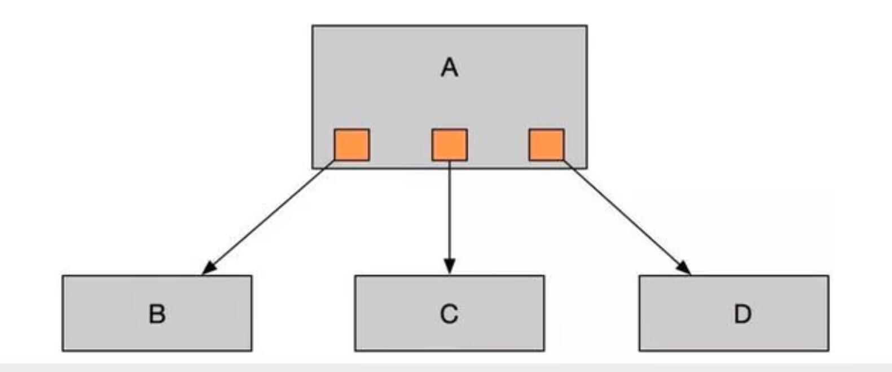
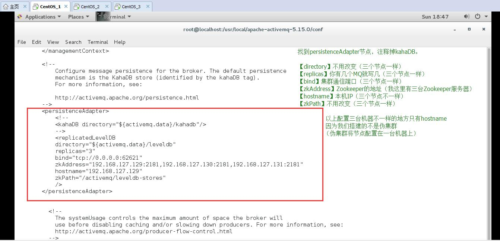
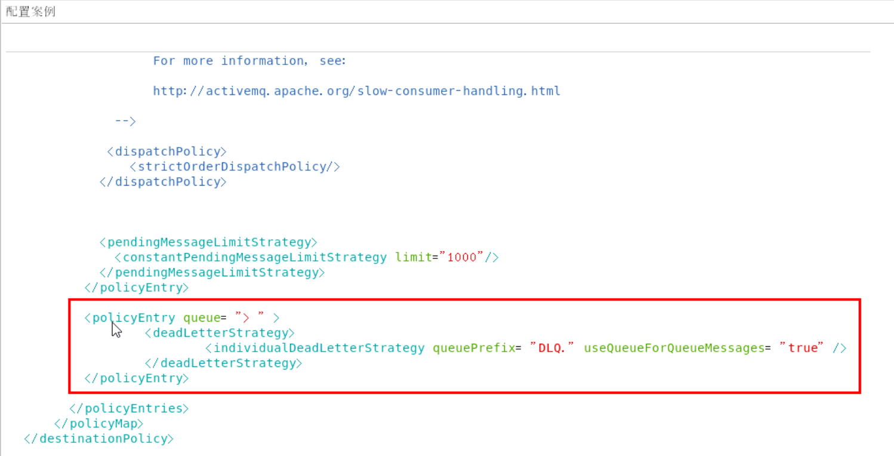

ActiveMQ

## 1.前言概述

### 	1.1）、MQ：消息队列，消息中间件

​		消息：微信、短信、语音

​		中间件：类似于 发语音者 和接受者 中间要通过服务的关联，这个服务器，就好比中间件。

### 	1.2）、MQ产品种类

​		kafka:、RabbitMQ、RocketMQ、ActiveMQ


### 1.3）、从生活Case到实际生产案例

​	1）、当系统之间**直接调用**实际工程落地和存在的问题

​		A、**系统之间的耦合度比较严重：**

每新增一个下游功能，都要对上游的相关接口进行改造；
举个例子：如果系统A要发送数据给系统B和系统C，发送给每个系统的数据可能有差异，因此系统A对要发送给每个系统的数据进行了组装，然后逐一发送；
当代码上线后又新增了一个需求：
把数据也发送给D，新上了一个D系统也要接受A系统的数据，此时就需要修改A系统，让他感知到D系统的存在，同时把数据处理好再给D。在这个过程你会看到，每接入一个下游系统，都要对系统A进行代码改造，开发联调的效率很低。其整体架构如下图




​		B、**面对大流量并发时，容易被冲垮：**

每个接口模块的吞吐能力是有限的，这个上限能力如果是堤坝，当大流量（洪水）来临时，容易被冲垮。
举个例子秒杀业务：
上游系统发起**下单购买**操作，我就是下单一个操作
下游系统完成秒杀业务逻辑
**（读取订单，库存检查，库存冻结，余额检查，余额冻结，订单生产，余额扣减，库存减少，生成流水，余额解冻，库存解冻）**

​		C、**等待同步存在性能问题：**

RPC接口上基本都是同步调用，整体的服务性能遵循“木桶理论”，即整体系统的耗时取决于链路中最慢的那个接口。
比如A调用B/C/D都是50ms，但此时B又调用了B1，花费2000ms，那么直接就拖累了整个服务性能。


​	2）、如何解决上述问题？

​			根据上述的几个问题，在设计系统时可以明确要达到的目标：

​			1、要做到系统解耦，当新的模块接进来时，可以做到代码改动最小；能够**解耦**

​			2、设置流量缓冲池，可以让后端系统按照自身吞吐能力进行消费，不被冲垮；能**削峰**

​			3、强弱依赖梳理能将非关键调用链路的操作异步化并提升整体系统的吞吐能力；能够**异步**


### 1.4）、是什么？

​	1、定义：

面向消息的中间件（message-orientedmiddleware）MOM能够很好的解决以上问题，是指利用高效可靠的消息传递机制与平台无关的数据交流，并基于数据通信来进行分布式系统的集成。通过提供消息传递和消息排队模型在分布式环境下提供应用解耦，弹性伸缩，冗余存储、流量削峰，异步通信，数据同步等功能。

大致的过程是这样的：

发送者把消息发送给消息服务器，消息服务器将消息存放在若干**队列（一对一【A给B发短信】）/主题topic（一对多【微信公众号的发布和订阅】）**中，在合适的时候，消息服务器回将消息转发给接受者。在这个过程中，发送和接收是异步的，也就是发送无需等待，而且发送者和接受者的生命周期也没有必然的关系；
尤其在发布pub/订阅sub模式下，也可以完成一对多的通信，即让一个消息有多个接受者。


​	2、特点

​		2.1）、采用异步处理模式

​		2.2）、应用系统之间解耦合，例如：下图-整体架构


### 1.5）、能干嘛？(为什么要使用MQ)

​	解决了耦合调用问题、是异步模型（早上问，下午回）、抵御洪峰流量，削峰，保护主业务。

​	1、解耦

​	2、异步

​	3、削峰

### 1.6）、去哪下？

​	官网：http://activemq.apache.org/	

### 1.7）、怎么玩？

​	1）、最重要的功能：**实现高可用，高性能，可伸缩，易用和安全的企业级面向消息服务的系统**

​	2）、异步消息的消费和处理

​	3）、控制消息的消费顺序

​	4）、可以和Spring或者SpringBoot整合简化代码

​	5）、配置集群容错的MQ集群


## 2.ActiveMQ安装和控制台

### 	2.1）、安装步骤：

1.官网下载

2.ftp拷贝到/opt目录下

3.解压缩apache-activemq-5.15.9-bin.tar.gz

```shell
[root@localhost opt]# tar -xvzf apache-activemq-5.15.9-bin.tar.gz 
```

4.在根目录下新建 myactiveMQ文件夹

```shell
[root@localhost /]# mkdir /myactiveMQ
```

5.拷贝解压缩的文件夹到 myactiveMQ文件夹下

```shell
[root@localhost opt]# cp -r apache-activemq-5.15.9 /myactiveMQ/
```

### 2.2）、启动/关闭

1.普通启动

```shell
[root@localhost bin]# pwd
/myactiveMQ/apache-activemq-5.15.9/bin
[root@localhost bin]# ./activemq start
INFO: Loading '/myactiveMQ/apache-activemq-5.15.9//bin/env'
INFO: Using java '/usr/java/jdk1.8.0_65/bin/java'
INFO: Starting - inspect logfiles specified in logging.properties and log4j.properties to get details
INFO: pidfile created : '/myactiveMQ/apache-activemq-5.15.9//data/activemq.pid' (pid '2180')
[root@localhost bin]# 
```

activeMQ的默认端口是 61616

2.查看是否启动

```she
[root@localhost bin]# ps -ef | grep activemq
[root@localhost bin]# 
//过滤掉grep 显示的命令，有就有，没有就不显示。
[root@localhost bin]# ps -ef | grep activemq | grep -v grep
[root@localhost bin]# 
//查看端口的命令
[root@localhost bin]# netstat -anp | grep 61616
tcp6       0      0 :::61616                :::*                    LISTEN      2180/java           
[root@localhost bin]# 
// 列出谁在使用某个端口 如： lsof -i :3306

```

3.普通关闭

```shell
[root@localhost bin]# ./activemq stop
//查看关闭的状态方式
[root@localhost bin]# lsof -i:61616
[root@localhost bin]# netstat -anp | grep 61616
[root@localhost bin]# ps -ef | grep activemq | grep -v grep
[root@localhost bin]# 
```

4.带日志的启动

```shell
[root@localhost bin]# ./activemq start > /myactiveMQ/myrunmq.log
[root@localhost bin]# tail -f /myactiveMQ/myrunmq.log 
```

### 2.3）、Apache ActiveMQ控制台

​	1、访问http://192.168.1.102:8161/ （服务器的IP地址，ActiveMQ的访问端口是：8186） 这个url 来请求 ActiveMQ 

​	2、初始的用户名和密码为：admin/admin

备注：**ActiveMQ采用61616端口提供JMS服务**

​			**ActiveMQ采用8161端口提供管理控制台服务**


## 3.Java编码实现ActiveMQ通讯

### 	3.1）、JMS编码总体架构(类似于JDBC的步骤和mybatis编程式的步骤)：


### 	3.2）、目的地Destination队列(Queue)和主题(Topic)

1、目的地：理解为存放生产者和消费者存放的消息和主题地方

2、队列：产生的队列，这个理解为 1对1（1对1的发短息）

3、主题：产生的主题，这个理解为微信公众号和订阅者（1对多，1个微信公众号多个订阅者）


### 3.3）、入门队列queue案例

maven pom.xml

```xml
  <dependencies>
        <!--  activemq  所需要的jar 包-->
        <!-- https://mvnrepository.com/artifact/org.apache.activemq/activemq-all -->
        <dependency>
            <groupId>org.apache.activemq</groupId>
            <artifactId>activemq-all</artifactId>
            <version>5.15.9</version>
        </dependency>

        <!--  activemq 和 spring 整合的基础包 -->
        <dependency>
            <groupId>org.apache.xbean</groupId>
            <artifactId>xbean-spring</artifactId>
            <version>3.16</version>
        </dependency>
</dependencies>
```

#### ①、JmsProduce生产者类：

```java
package com.wck.activemq.queue;

import org.apache.activemq.ActiveMQConnectionFactory;

import javax.jms.*;

/**
 * @author 御香烤翅
 * @create 2020-03-18 21:47
 */
public class JmsProduce {

    public static final String ACTIVEMQ_URL="tcp://192.168.1.102:61616";
    public static final String QUEUE_NAME="queue01";

    public static void main(String[] args) throws JMSException {

        //1.创建activeMQ工厂实例，传递url，使用默认的url和密码 admin/admin
        ActiveMQConnectionFactory factory = new ActiveMQConnectionFactory(ACTIVEMQ_URL);
        //2.通过工厂，获得connection并启动访问
        Connection connection = factory.createConnection();
        connection.start();
        //3.创建会话 第一个参数：事务 ，第二个参数：签收
        Session session = connection.createSession(false, Session.AUTO_ACKNOWLEDGE);
        //4.创建目的地，队列/主题
        Queue queue = session.createQueue(QUEUE_NAME);
        //5.创建消息的生产者
        MessageProducer messageProducer = session.createProducer(queue);
        //6.使用MessageProducer生产者生产3条消息发送到MQ队列
        for (int i = 1; i <=3 ; i++) {
            //7.创建消息
            TextMessage textMessage = session.createTextMessage("msg" + i);//理解为一个字符串
            //8.发送消息
            messageProducer.send(textMessage);
        }

        //9.关闭资源
        messageProducer.close();
        session.close();
        connection.close();

        System.out.println("消息发送到MQ完毕");
    }

}

```

#### ②、ActiveMQ控制台之队列说明：

运行上面代码，控制台显示如下：


1、Number Of Pending Messages=等待消费的消息，这个是未出队列的数量，公式=总接收数-总出队列数。

2、Number Of Consumers=消费者数量，消费者端的消费者数量。

3、Messages Enqueued=进队消息数，进队列的总消息量，包括出队列的。这个数只增不减。

4、Messages Dequeued=出队消息数，可以理解为是消费者消费掉的数量。
**总结**：

当有一个消息进入这个队列时，等待消费的消息是1，进入队列的消息是1。

当消息消费后，等待消费的消息是0，进入队列的消息是1，出队列的消息是1。
当再来一条消息时，等待消费的消息是1，进入队列的消息就是2。

#### ③、JmsConsumer消费类

```java
package com.wck.activemq.queue;

import org.apache.activemq.ActiveMQConnectionFactory;

import javax.jms.*;
import java.io.IOException;

/**
 * 消息的消费者
 * @author 御香烤翅
 * @create 2020-03-19 0:37
 */
public class JmsConsumer {

    public static final String ACTIVEMQ_URL="tcp://192.168.1.102:61616";
    public static final String QUEUE_NAME="queue01";

    public static void main(String[] args) throws JMSException, IOException {
        System.out.println("---***2号消费者：");
        //1.创建activeMQ工厂实例，传递url，使用默认的url和密码 admin/admin
        ActiveMQConnectionFactory factory = new ActiveMQConnectionFactory(ACTIVEMQ_URL);
        //2.通过工厂，获得connection并启动访问
        Connection connection = factory.createConnection();
        connection.start();
        //3.创建会话 第一个参数：事务 ，第二个参数：签收
        Session session = connection.createSession(false, Session.AUTO_ACKNOWLEDGE);
        //4.创建目的地，队列/主题
        Queue queue = session.createQueue(QUEUE_NAME);
        //5.创建消费者
        MessageConsumer messageConsumer = session.createConsumer(queue);

        //6.消费消息
        /*第一种方式：
        //同步阻塞方式（receive()）
        //订阅者或接受者调用MessageConsumer的receive()方法来接收消息，
        // receive方法在能够接收到消息之前（或者超时之前）一直阻塞
        while (true){
            //一直等候
            //TextMessage textMessage= (TextMessage) messageConsumer.receive();//消费消息
            //过时不候
            TextMessage textMessage= (TextMessage) messageConsumer.receive(3000L);//消费消息
            if (textMessage != null){
                System.out.println("----***接收到的消息为："+textMessage.getText());
            }else {
                break;
            }
        }

        //7.关闭连接
        messageConsumer.close();
        session.close();
        connection.close();*/

        //第二种方式
        //  通过监听的方式来获取消息 MessageConsumer messageConsumer = session.createConsumer(queue);
        //  异步非阻塞方式（监听器onMessage（））
        //  订阅者或接受者通过MessageConsumer的setMessageListener(MessageListener listener)注册一个消息监听器
        //  当消息到达之后，系统自动调用监听器MessageListener的onMessage(Message message)方法
        messageConsumer.setMessageListener(new MessageListener() {
            @Override
            public void onMessage(Message message) {
                if(message != null && message instanceof TextMessage){
                    TextMessage textMessage= (TextMessage) message;
                    try {
                        System.out.println("----***接收到的消息为："+textMessage.getText());
                    } catch (JMSException e) {
                        e.printStackTrace();
                    }
                }
            }
        });

        // 让主线程不要结束。因为一旦主线程结束了，其他的线程（如此处的监听消息的线程）也都会被迫结束。
        // 实际开发中，我们的程序会一直运行，这句代码都会省略。
        System.in.read();
        messageConsumer.close();
        session.close();
        connection.close();

        /**
         * 1 先生产,只启动1号消费者。问题：1号消费者能消费消息吗？
         *      Y
         * 2 先生产。先启动1号消费者，再启动2号消费者。问题：2号消费者还能消费消息吗？
         *      2.1:   1号 Y
         *      2.2:   2号 N
         * 3 先启动2 个消费者，再生产6条消息，问题：消费如何？
         *      3.1 每个人都是6条
         *      3.2 先到先得
         *      3.3 每人一半 Y (这个正确)
         *
         */

    }
}


```

#### ④、队列入门总结：

##### 		4.1、两种消费方式：

**1.同步阻塞方式(receive)**
订阅者或接收者抵用MessageConsumer的receive()方法来接收消息，receive方法在能接收到消息之前（或超时之前）将一直阻塞。

**2.异步非阻塞方式（监听器onMessage()）**
订阅者或接收者通过MessageConsumer的setMessageListener(MessageListener listener)注册一个消息监听器，当消息到达之后，系统会自动调用监听器MessageListener的onMessage(Message message)方法。

##### 		4.2、队列的特点：

点对点消息传递域的特点如下：
（1）每个消息只能有一个消费者，类似于1对1的关系。好比个人快递自己领自己的。
（2）消息的生产者和消费者之间**没有时间上的相关性**。无论消费者在生产者发送消息的时候是否处于运行状态，消费者都可以提取消息。好比我们的发送短信，发送者发送后不见得接收者会即收即看。
（3）消息被消费后队列中**不会再存储**，所以消费者**不会消费到已经被消费掉的消息**。


##### 		4.3、消息消费的情况


1、情况1：只启动消费者1。

结果：消费者1会消费所有的数据。

2、情况2：先启动消费者1，再启动消费者2。

结果：消费者1消费所有的数据。消费者2不会消费到消息。

3、情况3：生产者发布6条消息，在此之前已经启动了消费者1和消费者2。

结果：消费者1和消费者2平摊了消息。各自消费3条消息。

？疑问：怎么去将消费者1和消费者2不平均分摊呢？而是按照各自的消费能力去消费。我觉得，现在activemq就是这样的机制。

### 3.4）、入门主题topic案例

#### ①、topic介绍：

1、在发布订阅消息传递域中，目的地被称为主题（topic）

2、发布/订阅消息传递域的特点如下：

（1）生产者将消息发布到topic中，每个消息可以有多个消费者，属于1：N的关系；

（2）生产者和消费者之间有时间上的相关性。订阅某一个主题的消费者只能消费自它订阅之后发布的消息。

（3）生产者生产时，topic不保存消息它是无状态的不落地，假如无人订阅就去生产，那就是一条废消息，所以，**一般先启动消费者再启动生产者**。

默认情况下如上所述，但是JMS规范允许客户创建持久订阅，这在一定程度上放松了时间上的相关性要求。持久订阅允许消费者消费它在未处于激活状态时发送的消息。一句话，好比我们的微信公众号订阅


#### ②、JmsConsumer_topic消费者类

```java
package com.wck.activemq.topic;

import org.apache.activemq.ActiveMQConnectionFactory;

import javax.jms.*;
import java.io.IOException;

/**
 * 消息的消费者
 * @author 御香烤翅
 * @create 2020-03-19 0:37
 */
public class JmsConsumer_topic {

    public static final String ACTIVEMQ_URL="tcp://192.168.1.102:61616";
    public static final String TOPIC_NAME="topic01";

    public static void main(String[] args) throws JMSException, IOException {
        System.out.println("---***3号消费者：");
        //1.创建activeMQ工厂实例，传递url，使用默认的url和密码 admin/admin
        ActiveMQConnectionFactory factory = new ActiveMQConnectionFactory(ACTIVEMQ_URL);
        //2.通过工厂，获得connection并启动访问
        Connection connection = factory.createConnection();
        connection.start();
        //3.创建会话 第一个参数：事务 ，第二个参数：签收
        Session session = connection.createSession(false, Session.AUTO_ACKNOWLEDGE);
        //4.创建目的地，队列/主题
        Topic topic = session.createTopic(TOPIC_NAME);
        //5.创建消费者
        MessageConsumer messageConsumer = session.createConsumer(topic);

        //6.消费消息
        /*第一种方式：
        //同步阻塞方式（receive()）
        //订阅者或接受者调用MessageConsumer的receive()方法来接收消息，
        // receive方法在能够接收到消息之前（或者超时之前）一直阻塞
        while (true){
            //一直等候
            //TextMessage textMessage= (TextMessage) messageConsumer.receive();//消费消息
            //过时不候
            TextMessage textMessage= (TextMessage) messageConsumer.receive(3000L);//消费消息
            if (textMessage != null){
                System.out.println("----***接收到的消息为："+textMessage.getText());
            }else {
                break;
            }
        }

        //7.关闭连接
        messageConsumer.close();
        session.close();
        connection.close();*/

        //第二种方式
        //  通过监听的方式来获取消息 MessageConsumer messageConsumer = session.createConsumer(queue);
        //  异步非阻塞方式（监听器onMessage（））
        //  订阅者或接受者通过MessageConsumer的setMessageListener(MessageListener listener)注册一个消息监听器
        //  当消息到达之后，系统自动调用监听器MessageListener的onMessage(Message message)方法
        messageConsumer.setMessageListener(new MessageListener() {
            @Override
            public void onMessage(Message message) {
                if(message != null && message instanceof TextMessage){
                    TextMessage textMessage= (TextMessage) message;
                    try {
                        System.out.println("----***接收到的消息为："+textMessage.getText());
                    } catch (JMSException e) {
                        e.printStackTrace();
                    }
                }
            }
        });

        // 让主线程不要结束。因为一旦主线程结束了，其他的线程（如此处的监听消息的线程）也都会被迫结束。
        // 实际开发中，我们的程序会一直运行，这句代码都会省略。
        System.in.read();
        messageConsumer.close();
        session.close();
        connection.close();

        /**
         * 1 先生产,只启动1号消费者。问题：1号消费者能消费消息吗？
         *      Y
         * 2 先生产。先启动1号消费者，再启动2号消费者。问题：2号消费者还能消费消息吗？
         *      2.1:   1号 Y
         *      2.2:   2号 N
         * 3 先启动2 个消费者，再生产6条消息，问题：消费如何？
         *      3.1 每个人都是6条
         *      3.2 先到先得
         *      3.3 每人一半 Y (这个正确)
         *
         */

    }
}
```

#### ③、ActiveMQ控制台之队列说明：


#### ④、JmsProduce_topic生产者类

```java
package com.wck.activemq.topic;

import org.apache.activemq.ActiveMQConnectionFactory;

import javax.jms.*;

/**
 * 消息的生产者
 * @author 御香烤翅
 * @create 2020-03-18 21:47
 */
public class JmsProduce_topic {

    public static final String ACTIVEMQ_URL="tcp://192.168.1.102:61616";
    public static final String TOPIC_NAME="topic01";

    public static void main(String[] args) throws JMSException {

        //1.创建activeMQ工厂实例，传递url，使用默认的url和密码 admin/admin
        ActiveMQConnectionFactory factory = new ActiveMQConnectionFactory(ACTIVEMQ_URL);
        //2.通过工厂，获得connection并启动访问
        Connection connection = factory.createConnection();
        connection.start();
        //3.创建会话 第一个参数：事务 ，第二个参数：签收
        Session session = connection.createSession(false, Session.AUTO_ACKNOWLEDGE);
        //4.创建目的地，队列/主题
        Topic topic = session.createTopic(TOPIC_NAME);
        //5.创建消息的生产者
        MessageProducer messageProducer = session.createProducer(topic);
        //6.使用MessageProducer生产者生产3条消息发送到MQ队列
        for (int i = 1; i <=3 ; i++) {
            //7.创建消息
            TextMessage textMessage = session.createTextMessage("TOPIC_NAME" + i);//理解为一个字符串
            //8.发送消息
            messageProducer.send(textMessage);
        }

        //9.关闭资源
        messageProducer.close();
        session.close();
        connection.close();

        System.out.println("TOPIC_NAME消息发送到MQ完毕");
    }
}

```

### 3.5）tpoic和queue对比

| 比较项目   | Topic模式队列                                                | Queue模式队列                                                |
| ---------- | ------------------------------------------------------------ | ------------------------------------------------------------ |
| 工作模式   | 订阅发布模式，如果当前没有订阅者，消息将被丢弃。如果有多个订阅者，那么这些订阅者都会收到消息。 | 负载均衡模式，如果当前没有消费者，消息也不会丢弃；如果有多个消费者，那么一条消息，也只会发送给一个消费者，并且要求消费者ack信息。 |
| 有无状态   | 无状态                                                       | Queue数据默认会在mq服务器上，以文件形式进行保存，比如ActiveMQ一般保存在t$AMQ_HOME\data\kr_store\data下面，也可以配置成DB储存。 |
| 传递完整性 | 如果没有订阅者，消息将会被丢弃                               | 消息不会丢弃                                                 |
| 处理效率   | 由于消息要按照订阅者的数量进行复制，所以处理性能会随着订阅者的增加而明显降低，并且还要结合不同消息协议自身的性能差异。 | 由于一条消息只发送给一个消费者，所以就算消费者再多，性能也不会有明显降低，当然不同消息协议的具体性能也是有差异的。 |

## 4.JMS规范和落地产品

### 1）、是什么

#### 	①、JavaEE：

是一套使用Java进行企业级应用开发的大家一致遵循的13个核心规范工业标准。JavaEE平台提供了一个基于组件的方法来加快设计，开发。装配及部署企业应用程序。

1，JDBC（Java Databease）数据库连接
2，JNDI（Java Naming and Directory Interfaces）Java的命令和目录接口
3，EJB（Enterprise JavaBean）
4，RMI（Remote Method Invoke）远程方法调用
5，Java IDL（Interface Description Language）/CORBA（Common Object Broker Architecture）接口定义语言/共用对象请求代理程序体系结构
6，JSP（Java Server Page）
7，Servlet
8，XML（Extensible Markup Language）可标记白标记语言
9，JMS（Java Message Service）Java消息服务
10，JTA（Java Transaction API）Java事务API
11，JTS（Java Transaction Service）Java事务服务
12，JavaMail
13，JAF（JavaBean Activation Framework）

#### 	②、JMS：

什么是Java消息服务：

Java消息服务指的是两个应用程序之间进行**异步通信的API，它为标准协议和消息服务提供了一组通用接口，包括创建、发送、读取消息等，用于支持Java应用程序开发**。在JavaEE中，当两个应用程序使用JMS进行通信时，它们之间不是直接相连的，而是通过一个共同的消息收发服务组件关联起来以达到解耦/异步削峰的效果。


### 2）、MQ中间件的其他落地产品（比较）

| 特性              | ActiveMQ      | RabbitMQ | Kafka          | RocketMQ     |
| ----------------- | ------------- | -------- | -------------- | ------------ |
| PRODUCER-CUMSUMER | 支持          | 支持     | 支持           | 支持         |
| PUBLISH-SUBSCRIBE | 支持          | 支持     | 支持           | 支持         |
| REQUEST-REPLY     | 支持          | 支持     | -              | 支持         |
| API完备性         | 高            | 高       | 高             | 低(静态配置) |
| 多语言支持        | 支持,Java优先 | 语言无关 | 支持,Java优先  | 支持         |
| 单机吞吐量        | 万级          | 万级     | 十万级         | 单机万级     |
| 消息延迟          | -             | 微秒级   | 毫秒级         | -            |
| 可用性            | 高(主从)      | 高(主从) | 非常高(分布式) | 高           |
| 消息丢失          | -             | 低       | 理论上不会丢失 | -            |
| 消息重复          | -             | 可控制   | 理论上会有重复 | -            |
| 文档的完备性      | 高            | 高       | 高             | 中           |
| 提供快速入门      | 有            | 有       | 有             | 无           |
| 首次部署难度      | -             | 低       | 中             | 高           |

### 3）、JMS的组成结构和特点

#### 	3.1）、JMS Provider

实现JMS接口和规范的消息中间件，也就是我们说的MQ服务器

#### 	3.2）、JMS Producer

消息生产者，创建和发送JMS消息的客户端应用

#### 	3.3）、JMS Consumer

消息消费者，接收和处理JMS消息的客户端应用

#### 	3.4）、JSM Message

##### 				①、消息头

1、JMSDestination：

消息发送的目的地，主要是指Queue和Topic

2、JMSDeliveryMode：

持久模式和非持久模式。

一条持久性的消息：应该被传送“一次仅仅一次”，这就意味着如果JMS提供者出现故障，**该消息并不会丢失，它会在服务器恢复之后再次传递。**

一条非持久的消息：最多会传递一次，这意味着服务器出现故障，该消息将会**永远丢失**。

3、JMSExpiration：

可以设置消息在一定时间后过期，默认是**永不过期**

消息过期时间，等于Destination的send方法中的timeToLive值加上发送时刻的GMT时间值。

如果timeToLive值等于0，则JMSExpiration被设为0，表示该消息永不过期。

如果发送后，在消息过期时间之后还没有被发送到目的地，则该消息被清除。

4、JMSPriority：

消息优先级，从0-9十个级别，**0-4是普通消息5-9是加急消息**。

JMS不要求MQ严格按照这十个优先级发送消息但必须保证**加急消息要先于普通**消息到达。默认是4级。

5、JMSMessageID：

**唯一标识每个消息的标识由MQ产生。**


##### 				②、消息属性（5种消息格式）

1、**TxtMessage**

普通字符串消息，包含一个String

2、**MapMessage**

一个Map类型的消息，key为Strng类型，而值为Java基本类型

3、BytesMessage

二进制数组消息，包含一个byte[]

4、StreamMessage

Java数据流消息，用标准流操作来顺序填充和读取

5、ObjectMessage

对象消息，包含一个可序列化的Java对象

备注：发送和接收的消息体类型必须一致对应


##### 				③、消息体

1、如果需要除消息字段以外的值，那么可以使用消息属性

2、识别/去重/重点标注等操作非常有用的方法

3、是什么：**一般以 setxxxProperty 如：setStringProperty**

综合的生产者代码：

```java
package com.wck.activemq.queue;

import org.apache.activemq.ActiveMQConnectionFactory;

import javax.jms.*;

/**
 * 消息的生产者
 * @author 御香烤翅
 * @create 2020-03-18 21:47
 */
public class JmsProduce {

    public static final String ACTIVEMQ_URL="tcp://192.168.1.102:61616";
    public static final String QUEUE_NAME="queue01";

    public static void main(String[] args) throws JMSException {

        //1.创建activeMQ工厂实例，传递url，使用默认的url和密码 admin/admin
        ActiveMQConnectionFactory factory = new ActiveMQConnectionFactory(ACTIVEMQ_URL);
        //2.通过工厂，获得connection并启动访问
        Connection connection = factory.createConnection();
        connection.start();
        //3.创建会话 第一个参数：事务 ，第二个参数：签收
        Session session = connection.createSession(false, Session.AUTO_ACKNOWLEDGE);
        //4.创建目的地，队列/主题
        Queue queue = session.createQueue(QUEUE_NAME);
        //5.创建消息的生产者
        MessageProducer messageProducer = session.createProducer(queue);
        //6.使用MessageProducer生产者生产3条消息发送到MQ队列
        for (int i = 1; i <=3 ; i++) {
            //7.创建消息 ，消息体
            TextMessage textMessage = session.createTextMessage("msg---" + i);//理解为一个字符串
            //消息头
//            textMessage.setJMSDeliveryMode(DeliveryMode.PERSISTENT);
            //添加一个属性
            textMessage.setStringProperty("c1","vip");
            //8.发送消息
            messageProducer.send(textMessage);

            //创建mapmessage，消息体
            MapMessage mapMessage = session.createMapMessage();
            mapMessage.setString("k1","mapMessage---v1");
            messageProducer.send(mapMessage);
        }

        //9.关闭资源
        messageProducer.close();
        session.close();
        connection.close();

        System.out.println("消息发送到MQ完毕");
    }

}

```


#### 3.5）、消费者、生产者代码

综合的消费者代码：

```java
package com.wck.activemq.queue;

import org.apache.activemq.ActiveMQConnectionFactory;

import javax.jms.*;
import java.io.IOException;

/**
 * 消息的消费者
 * @author 御香烤翅
 * @create 2020-03-19 0:37
 */
public class JmsConsumer {

    public static final String ACTIVEMQ_URL="tcp://192.168.1.102:61616";
    public static final String QUEUE_NAME="queue01";

    public static void main(String[] args) throws JMSException, IOException {
        System.out.println("---***2号消费者：");
        //1.创建activeMQ工厂实例，传递url，使用默认的url和密码 admin/admin
        ActiveMQConnectionFactory factory = new ActiveMQConnectionFactory(ACTIVEMQ_URL);
        //2.通过工厂，获得connection并启动访问
        Connection connection = factory.createConnection();
        connection.start();
        //3.创建会话 第一个参数：事务 ，第二个参数：签收
        Session session = connection.createSession(false, Session.AUTO_ACKNOWLEDGE);
        //4.创建目的地，队列/主题
        Queue queue = session.createQueue(QUEUE_NAME);
        //5.创建消费者
        MessageConsumer messageConsumer = session.createConsumer(queue);

        //6.消费消息
        /*第一种方式：
        //同步阻塞方式（receive()）
        //订阅者或接受者调用MessageConsumer的receive()方法来接收消息，
        // receive方法在能够接收到消息之前（或者超时之前）一直阻塞
        while (true){
            //一直等候
            //TextMessage textMessage= (TextMessage) messageConsumer.receive();//消费消息
            //过时不候
            TextMessage textMessage= (TextMessage) messageConsumer.receive(3000L);//消费消息
            if (textMessage != null){
                System.out.println("----***接收到的消息为："+textMessage.getText());
            }else {
                break;
            }
        }

        //7.关闭连接
        messageConsumer.close();
        session.close();
        connection.close();*/

        //第二种方式
        //  通过监听的方式来获取消息 MessageConsumer messageConsumer = session.createConsumer(queue);
        //  异步非阻塞方式（监听器onMessage（））
        //  订阅者或接受者通过MessageConsumer的setMessageListener(MessageListener listener)注册一个消息监听器
        //  当消息到达之后，系统自动调用监听器MessageListener的onMessage(Message message)方法
        messageConsumer.setMessageListener(new MessageListener() {
            @Override
            public void onMessage(Message message) {
                if(message != null && message instanceof TextMessage){
                    TextMessage textMessage= (TextMessage) message;
                    try {
                        System.out.println("----***接收到的textMessage消息为："+textMessage.getText());
                        System.out.println("----***接收到的textMessage属性消息为："+textMessage.getStringProperty("c1"));
                    } catch (JMSException e) {
                        e.printStackTrace();
                    }
                }

                if(message != null && message instanceof MapMessage){
                    MapMessage mapMessage= (MapMessage) message;
                    try {
                        System.out.println("----***接收到的mapMessage消息为："+mapMessage.getString("k1"));
                    } catch (JMSException e) {
                        e.printStackTrace();
                    }
                }
            }
        });

        // 让主线程不要结束。因为一旦主线程结束了，其他的线程（如此处的监听消息的线程）也都会被迫结束。
        // 实际开发中，我们的程序会一直运行，这句代码都会省略。
        System.in.read();
        messageConsumer.close();
        session.close();
        connection.close();

        /**
         * 1 先生产,只启动1号消费者。问题：1号消费者能消费消息吗？
         *      Y
         * 2 先生产。先启动1号消费者，再启动2号消费者。问题：2号消费者还能消费消息吗？
         *      2.1:   1号 Y
         *      2.2:   2号 N
         * 3 先启动2 个消费者，再生产6条消息，问题：消费如何？
         *      3.1 每个人都是6条
         *      3.2 先到先得
         *      3.3 每人一半 Y (这个正确)
         *
         */

    }
}

```


### 4）、JMS的可靠性

#### 4.1）、PERSISTENT：持久性

##### 		①、queue持久性

1、非持久（非持久化：当服务器宕机，消息不存在。）

**messageProducer.setDeliveryMode(DeliveryMode.NON_PERSISTENT)**

2、持久（持久化：当服务器宕机，消息存在。）

**messageProducer.setDeliveryMode(DeliveryMode.PERSISTENT)**

**结论：Queue默认是持久**

JmsProduce持久化代码：

```java

package com.wck.activemq.queue;

import org.apache.activemq.ActiveMQConnectionFactory;

import javax.jms.*;

/**
 * 消息的生产者
 * @author 御香烤翅
 * @create 2020-03-18 21:47
 */
public class JmsProduce {

    public static final String ACTIVEMQ_URL="tcp://192.168.1.102:61616";
    public static final String QUEUE_NAME="queue01";

    public static void main(String[] args) throws JMSException {
        //1.创建activeMQ工厂实例，传递url，使用默认的url和密码 admin/admin
        ActiveMQConnectionFactory factory = new ActiveMQConnectionFactory(ACTIVEMQ_URL);
        //2.通过工厂，获得connection并启动访问
        Connection connection = factory.createConnection();
        connection.start();
        //3.创建会话 第一个参数：事务 ，第二个参数：签收
        Session session = connection.createSession(false, Session.AUTO_ACKNOWLEDGE);
        //4.创建目的地，队列/主题
        Queue queue = session.createQueue(QUEUE_NAME);
        //5.创建消息的生产者
        MessageProducer messageProducer = session.createProducer(queue);
        
        
        
        
        
        //----------------------------持久化设置--------------------------------
        messageProducer.setDeliveryMode(DeliveryMode.PERSISTENT);//持久化
        //----------------------------非持久化设置-----------------------
//        messageProducer.setDeliveryMode(DeliveryMode.NON_PERSISTENT);//非持久化
        
        
        
        
        
        
        
        //6.使用MessageProducer生产者生产3条消息发送到MQ队列
        for (int i = 1; i <=3 ; i++) {
            //7.创建消息
            TextMessage textMessage = session.createTextMessage("msg---" + i);//理解为一个字符串
            //消息头
//            textMessage.setJMSDeliveryMode(DeliveryMode.PERSISTENT);
            //添加一个属性
//            textMessage.setStringProperty("c1","vip");
            //8.发送消息
            messageProducer.send(textMessage);
        }

        //9.关闭资源
        messageProducer.close();
        session.close();
        connection.close();

        System.out.println("消息发送到MQ完毕");
    }

}

```

JmsConsumer持久化代码（和之前的一模一样没有变化，持久化是生产者那边设置）：

```java
package com.wck.activemq.queue;

import org.apache.activemq.ActiveMQConnectionFactory;

import javax.jms.*;
import java.io.IOException;

/**
 * 消息的消费者
 * @author 御香烤翅
 * @create 2020-03-19 0:37
 */
public class JmsConsumer {

    public static final String ACTIVEMQ_URL="tcp://192.168.1.102:61616";
    public static final String QUEUE_NAME="queue01";

    public static void main(String[] args) throws JMSException, IOException {
        System.out.println("---***2号消费者：");
        //1.创建activeMQ工厂实例，传递url，使用默认的url和密码 admin/admin
        ActiveMQConnectionFactory factory = new ActiveMQConnectionFactory(ACTIVEMQ_URL);
        //2.通过工厂，获得connection并启动访问
        Connection connection = factory.createConnection();
        connection.start();
        //3.创建会话 第一个参数：事务 ，第二个参数：签收
        Session session = connection.createSession(false, Session.AUTO_ACKNOWLEDGE);
        //4.创建目的地，队列/主题
        Queue queue = session.createQueue(QUEUE_NAME);
        //5.创建消费者
        MessageConsumer messageConsumer = session.createConsumer(queue);

        //6.消费消息
        /*第一种方式：
        //同步阻塞方式（receive()）
        //订阅者或接受者调用MessageConsumer的receive()方法来接收消息，
        // receive方法在能够接收到消息之前（或者超时之前）一直阻塞
        while (true){
            //一直等候
            //TextMessage textMessage= (TextMessage) messageConsumer.receive();//消费消息
            //过时不候
            TextMessage textMessage= (TextMessage) messageConsumer.receive(3000L);//消费消息
            if (textMessage != null){
                System.out.println("----***接收到的消息为："+textMessage.getText());
            }else {
                break;
            }
        }

        //7.关闭连接
        messageConsumer.close();
        session.close();
        connection.close();*/

        //第二种方式
        //  通过监听的方式来获取消息 MessageConsumer messageConsumer = session.createConsumer(queue);
        //  异步非阻塞方式（监听器onMessage（））
        //  订阅者或接受者通过MessageConsumer的setMessageListener(MessageListener listener)注册一个消息监听器
        //  当消息到达之后，系统自动调用监听器MessageListener的onMessage(Message message)方法
        messageConsumer.setMessageListener(new MessageListener() {
            @Override
            public void onMessage(Message message) {
                if(message != null && message instanceof TextMessage){
                    TextMessage textMessage= (TextMessage) message;
                    try {
                        System.out.println("----***接收到的textMessage消息为："+textMessage.getText());
//                        System.out.println("----***接收到的textMessage属性消息为："+textMessage.getStringProperty("c1"));
                    } catch (JMSException e) {
                        e.printStackTrace();
                    }
                }

            }
        });

        // 让主线程不要结束。因为一旦主线程结束了，其他的线程（如此处的监听消息的线程）也都会被迫结束。
        // 实际开发中，我们的程序会一直运行，这句代码都会省略。
        System.in.read();
        messageConsumer.close();
        session.close();
        connection.close();

        /**
         * 1 先生产,只启动1号消费者。问题：1号消费者能消费消息吗？
         *      Y
         * 2 先生产。先启动1号消费者，再启动2号消费者。问题：2号消费者还能消费消息吗？
         *      2.1:   1号 Y
         *      2.2:   2号 N
         * 3 先启动2 个消费者，再生产6条消息，问题：消费如何？
         *      3.1 每个人都是6条
         *      3.2 先到先得
         *      3.3 每人一半 Y (这个正确)
         *
         */

    }
}

```


##### ②、topic持久性

1、topic**默认就是非持久化的**，因为生产者生产消息时，消费者也要在线，这样消费者才能消费到消息。

**topic消息持久化**，只要消费者向MQ服务器注册过，所有生产者发布成功的消息，该消费者都能收到，不管是MQ服务器宕机还是消费者不在线。

注意：

1. **一定要先运行一次消费者，等于向MQ注册**，类似我订阅了这个主题。

2. 然后再运行生产者发送消息。

3. 之后无论消费者是否在线，都会收到消息。如果不在线的话，下次连接的时候，会把没有收过的消息都接收过来。

   topic持久化生产者代码：

```java
package com.wck.activemq.topic;

import org.apache.activemq.ActiveMQConnectionFactory;

import javax.jms.*;

/**
 * @author 御香烤翅
 * @create 2020-03-20 18:03
 */
public class JmsProduce_persistence {

    public static final String ACTIVEMQ_URL="tcp://192.168.1.102:61616";
    public static final String TOPIC_NAME="topic01";

    public static void main(String[] args) throws JMSException {

        //1.创建activeMQ工厂实例，传递url，使用默认的url和密码 admin/admin
        ActiveMQConnectionFactory factory = new ActiveMQConnectionFactory(ACTIVEMQ_URL);
        //2.通过工厂，获得connection并启动访问
        Connection connection = factory.createConnection();
        //3.创建会话 第一个参数：事务 ，第二个参数：签收
        Session session = connection.createSession(false, Session.AUTO_ACKNOWLEDGE);
        //4.创建目的地，队列/主题
        Topic topic = session.createTopic(TOPIC_NAME);
        //5.创建消息的生产者
        MessageProducer messageProducer = session.createProducer(topic);
        
        
        
        
        

        //---------------------topic设置持久化----------------------------------
        messageProducer.setDeliveryMode(DeliveryMode.PERSISTENT);
        //设置持久化之后再启动连接
        //---------------------topic设置持久化----------------------------------
        connection.start();
        

        
        
        //6.使用MessageProducer生产者生产3条消息发送到MQ队列
        for (int i = 1; i <=3 ; i++) {
            //7.创建消息
            TextMessage textMessage = session.createTextMessage("TOPIC_NAME" + i);//理解为一个字符串
            //8.发送消息
            messageProducer.send(textMessage);
        }

        //9.关闭资源
        messageProducer.close();
        session.close();
        connection.close();

        System.out.println("TOPIC_NAME消息发送到MQ完毕");
    }
}

```

topic持久化消费者代码（变化比较大，相对于非持久化）：

```java
package com.wck.activemq.topic;

import org.apache.activemq.ActiveMQConnectionFactory;

import javax.jms.*;
import java.io.IOException;

/**
 * @author 御香烤翅
 * @create 2020-03-20 18:07
 */
public class JmsConsummer_persistence {


    public static final String ACTIVEMQ_URL="tcp://192.168.1.102:61616";
    public static final String TOPIC_NAME="topic01";

    public static void main(String[] args) throws JMSException, IOException {
        System.out.println("---***zs号消费者：");
        //1.创建activeMQ工厂实例，传递url，使用默认的url和密码 admin/admin
        ActiveMQConnectionFactory factory = new ActiveMQConnectionFactory(ACTIVEMQ_URL);
        //2.通过工厂，获得connection并启动访问
        Connection connection = factory.createConnection();

        //---------------------------设置客户端id--------------------------------
        //设置客户端id，像MQ服务器注册自己的id
        connection.setClientID("zs01");


        //3.创建会话 第一个参数：事务 ，第二个参数：签收
        Session session = connection.createSession(false, Session.AUTO_ACKNOWLEDGE);
        //4.创建目的地，队列/主题
        Topic topic = session.createTopic(TOPIC_NAME);


        //----------创建一个持久化的订阅者对象，一参是 topic，二参是 订阅者名称 -----------------
        TopicSubscriber durableSubscriber = session.createDurableSubscriber(topic, "备注信息remark");
        //之后再开启连接
        connection.start();
        Message message = durableSubscriber.receive();

        while (message !=null){
            TextMessage textMessage= (TextMessage) message;
            System.out.println("收到的持久化topic:"+textMessage.getText());
            message=durableSubscriber.receive();
        }

        session.close();
        connection.close();

        /**
         * 一定要先运行一次消费者,类似于像MQ注册,我订阅了这个主题
         * 然后再运行主题生产者
         * 无论消费着是否在线,都会接收到,在线的立即接收到,不在线的等下次上线把没接收到的接收
         */

    }
}

```

##### ③、topic持久化控制台页面介绍：

topic页面还是和之前的一样。另外在subscribers页面也会显示。如下：


#### 4.2）、Transaction：事务


##### ①、生产者开启事务后，

执行commit方法，这批消息才真正的被提交。不执行commit方法，这批消息不会提交。执行rollback方法，之前的消息会回滚掉。生产者的事务机制，要高于签收机制，当生产者开启事务，签收机制不再重要。

 

##### ②、消费者开启事务后，

执行commit方法，这批消息才算真正的被消费。不执行commit方法，这些消息不会标记已消费，下次还会被消费。执行rollback方法，是不能回滚之前执行过的业务逻辑，但是能够回滚之前的消息，回滚后的消息，下次还会被消费。消费者利用commit和rollback方法，甚至能够违反一个消费者只能消费一次消息的原理。

 

##### ③、 问：消费者和生产者需要同时操作事务才行吗？   

答：消费者和生产者的事务，完全没有关联，各自是各自的事务。


生产者JmsProduce_Tx代码：

```java
package com.wck.activemq.queue;

import org.apache.activemq.ActiveMQConnectionFactory;

import javax.jms.*;

/**
 * 消息的生产者
 * @author 御香烤翅
 * @create 2020-03-18 21:47
 */
public class JmsProduce_Tx {

    public static final String ACTIVEMQ_URL="tcp://192.168.1.102:61616";
    public static final String QUEUE_NAME="queue01";

    public static void main(String[] args) throws JMSException {

        //1.创建activeMQ工厂实例，传递url，使用默认的url和密码 admin/admin
        ActiveMQConnectionFactory factory = new ActiveMQConnectionFactory(ACTIVEMQ_URL);
        //2.通过工厂，获得connection并启动访问
        Connection connection = factory.createConnection();
        connection.start();
        //3.创建会话 第一个参数：事务 ，第二个参数：签收


        //-----------------事务为true------------
        Session session = connection.createSession(true, Session.AUTO_ACKNOWLEDGE);


        //4.创建目的地，队列/主题
        Queue queue = session.createQueue(QUEUE_NAME);
        //5.创建消息的生产者
        MessageProducer messageProducer = session.createProducer(queue);
        messageProducer.setDeliveryMode(DeliveryMode.PERSISTENT);//持久化
//        messageProducer.setDeliveryMode(DeliveryMode.NON_PERSISTENT);//非持久化
        //6.使用MessageProducer生产者生产3条消息发送到MQ队列
        for (int i = 1; i <=3 ; i++) {
            //7.创建消息
            TextMessage textMessage = session.createTextMessage("msg---" + i);//理解为一个字符串
            //消息头
//            textMessage.setJMSDeliveryMode(DeliveryMode.PERSISTENT);
            //添加一个属性
//            textMessage.setStringProperty("c1","vip");
            //8.发送消息
            messageProducer.send(textMessage);
        }

        //9.关闭资源
        messageProducer.close();

        //-------------------------------------事务提交------------------------
        session.commit();


        session.close();
        connection.close();
        System.out.println("消息发送到MQ完毕");
    }

}
```

消费者JmsConsumer_Tx代码：

```java
package com.wck.activemq.queue;

import org.apache.activemq.ActiveMQConnectionFactory;

import javax.jms.*;
import java.io.IOException;

/**
 * 消息的消费者
 * @author 御香烤翅
 * @create 2020-03-19 0:37
 */
public class JmsConsumer_Tx {

    public static final String ACTIVEMQ_URL="tcp://192.168.1.102:61616";
    public static final String QUEUE_NAME="queue01";

    public static int a=0;

    public static void main(String[] args) throws JMSException, IOException {
        System.out.println("---***2号消费者：");
        //1.创建activeMQ工厂实例，传递url，使用默认的url和密码 admin/admin
        ActiveMQConnectionFactory factory = new ActiveMQConnectionFactory(ACTIVEMQ_URL);
        //2.通过工厂，获得connection并启动访问
        Connection connection = factory.createConnection();
        connection.start();
        //3.创建会话 第一个参数：事务 ，第二个参数：签收
        //----------------------------开启事务true-----------------
        Session session = connection.createSession(true, Session.AUTO_ACKNOWLEDGE);


        //4.创建目的地，队列/主题
        Queue queue = session.createQueue(QUEUE_NAME);
        //5.创建消费者
        MessageConsumer messageConsumer = session.createConsumer(queue);

        //6.消费消息
        /*第一种方式：
        //同步阻塞方式（receive()）
        //订阅者或接受者调用MessageConsumer的receive()方法来接收消息，
        // receive方法在能够接收到消息之前（或者超时之前）一直阻塞
        while (true){
            //一直等候
            //TextMessage textMessage= (TextMessage) messageConsumer.receive();//消费消息
            //过时不候
            TextMessage textMessage= (TextMessage) messageConsumer.receive(3000L);//消费消息
            if (textMessage != null){
                System.out.println("----***接收到的消息为："+textMessage.getText());
            }else {
                break;
            }
        }

        //7.关闭连接
        messageConsumer.close();
        session.close();
        connection.close();*/

        //第二种方式
        //  通过监听的方式来获取消息 MessageConsumer messageConsumer = session.createConsumer(queue);
        //  异步非阻塞方式（监听器onMessage（））
        //  订阅者或接受者通过MessageConsumer的setMessageListener(MessageListener listener)注册一个消息监听器
        //  当消息到达之后，系统自动调用监听器MessageListener的onMessage(Message message)方法

        messageConsumer.setMessageListener(new MessageListener() {
            @Override
            public void onMessage(Message message) {
                if(message != null && message instanceof TextMessage){
                    TextMessage textMessage= (TextMessage) message;
                    try {
                        System.out.println("----***接收到的textMessage消息为："+textMessage.getText());
//                        System.out.println("----***接收到的textMessage属性消息为："+textMessage.getStringProperty("c1"));

                        if(a==0){
                            System.out.println("commit a==0");
                            session.commit();
                        }
                        if(a==2){
                            System.out.println("rollback a==2");
                            session.rollback();
                        }

                        a++;
                    } catch (JMSException e) {
                        System.out.println("出现异常消费失败，放弃消费");
                        try {
                            session.rollback();
                        } catch (JMSException e1) {
                            e1.printStackTrace();
                        }
                        e.printStackTrace();
                    }
                }
            }
        });

        // 让主线程不要结束。因为一旦主线程结束了，其他的线程（如此处的监听消息的线程）也都会被迫结束。
        // 实际开发中，我们的程序会一直运行，这句代码都会省略。
        System.in.read();
        messageConsumer.close();

        //-------------------------提交事务
        //session.commit();

        session.close();
        connection.close();
    }
}

/**控制台输出：
 com.wck.activemq.queue.JmsConsumer_Tx
---***2号消费者：
----***接收到的textMessage消息为：msg---1
commit a==0
----***接收到的textMessage消息为：msg---2
----***接收到的textMessage消息为：msg---3
rollback a==2
----***接收到的textMessage消息为：msg---2
----***接收到的textMessage消息为：msg---3

Process finished with exit code -1

*/
```


#### 4.3）、Acknowledge：签收

##### ①、签收的几种方式

1、　**自动签收（Session.AUTO_ACKNOWLEDGE**）：该方式是默认的。该种方式，无需我们程序做任何操作，框架会帮我们自动签收收到的消息。

2、　**手动签收（Session.CLIENT_ACKNOWLEDGE）**：手动签收。该种方式，需要我们手动调用Message.acknowledge()，来签收消息。如果不签收消息，该消息会被我们反复消费，只到被签收。

3、　允许重复消息（Session.DUPS_OK_ACKNOWLEDGE）：多线程或多个消费者同时消费到一个消息，因为线程不安全，可能会重复消费。该种方式很少使用到。

4、　事务下的签收（Session.SESSION_TRANSACTED）：开始事务的情况下，可以使用该方式。该种方式很少使用到。


##### ②、事务和签收的关系

1、　在事务性会话中，当一个事务被成功提交则消息被自动签收。如果事务回滚，则消息会被再次传送。事务优先于签收，开始事务后，签收机制不再起任何作用。

2、　非事务性会话中，消息何时被确认取决于创建会话时的应答模式。

3、　生产者事务开启，只有commit后才能将全部消息变为已消费。

4、　事务偏向生产者，签收偏向消费者。也就是说，生产者使用事务更好点，消费者使用签收机制更好点。

**一句话总结：事务和签收没有太大关系，事务大于签收，非事务的签收要相应的做出签收的响应操作。**


非事务下的生产者。跟之前的代码一样


JmsProduce非事务生产者代码：

```java
package com.wck.activemq.queue;

import org.apache.activemq.ActiveMQConnectionFactory;

import javax.jms.*;

/**
 * 消息的生产者
 * @author 御香烤翅
 * @create 2020-03-18 21:47
 */
public class JmsProduce {

    public static final String ACTIVEMQ_URL="tcp://192.168.1.102:61616";
    public static final String QUEUE_NAME="queue01";

    public static void main(String[] args) throws JMSException {

        //1.创建activeMQ工厂实例，传递url，使用默认的url和密码 admin/admin
        ActiveMQConnectionFactory factory = new ActiveMQConnectionFactory(ACTIVEMQ_URL);
        //2.通过工厂，获得connection并启动访问
        Connection connection = factory.createConnection();
        connection.start();
        //3.创建会话 第一个参数：事务 ，第二个参数：签收
        Session session = connection.createSession(false, Session.AUTO_ACKNOWLEDGE);
        //4.创建目的地，队列/主题
        Queue queue = session.createQueue(QUEUE_NAME);
        //5.创建消息的生产者
        MessageProducer messageProducer = session.createProducer(queue);
        messageProducer.setDeliveryMode(DeliveryMode.PERSISTENT);//持久化
//        messageProducer.setDeliveryMode(DeliveryMode.NON_PERSISTENT);//非持久化
        //6.使用MessageProducer生产者生产3条消息发送到MQ队列
        for (int i = 1; i <=3 ; i++) {
            //7.创建消息
            TextMessage textMessage = session.createTextMessage("msg---" + i);//理解为一个字符串
            //消息头
//            textMessage.setJMSDeliveryMode(DeliveryMode.PERSISTENT);
            //添加一个属性
//            textMessage.setStringProperty("c1","vip");
            //8.发送消息
            messageProducer.send(textMessage);
        }

        //9.关闭资源
        messageProducer.close();
        session.close();
        connection.close();

        System.out.println("消息发送到MQ完毕");
    }

}

```


JmsConsumer非事务消费者代码：

```java
package com.wck.activemq.queue;

import org.apache.activemq.ActiveMQConnectionFactory;

import javax.jms.*;
import java.io.IOException;

/**
 * 消息的消费者
 * @author 御香烤翅
 * @create 2020-03-19 0:37
 */
public class JmsConsumer {

    public static final String ACTIVEMQ_URL="tcp://192.168.1.102:61616";
    public static final String QUEUE_NAME="queue01";

    public static void main(String[] args) throws JMSException, IOException {
        System.out.println("---***2号消费者：");
        //1.创建activeMQ工厂实例，传递url，使用默认的url和密码 admin/admin
        ActiveMQConnectionFactory factory = new ActiveMQConnectionFactory(ACTIVEMQ_URL);
        //2.通过工厂，获得connection并启动访问
        Connection connection = factory.createConnection();
        connection.start();
        
        
        
        
        //3.创建会话 第一个参数：事务 ，第二个参数：签收
        //------------------------------签收方式
        Session session = connection.createSession(false, Session.CLIENT_ACKNOWLEDGE);
        
        
        
        
        //4.创建目的地，队列/主题
        Queue queue = session.createQueue(QUEUE_NAME);
        //5.创建消费者
        MessageConsumer messageConsumer = session.createConsumer(queue);

        //6.消费消息
        /*第一种方式：
        //同步阻塞方式（receive()）
        //订阅者或接受者调用MessageConsumer的receive()方法来接收消息，
        // receive方法在能够接收到消息之前（或者超时之前）一直阻塞
        while (true){
            //一直等候
            //TextMessage textMessage= (TextMessage) messageConsumer.receive();//消费消息
            //过时不候
            TextMessage textMessage= (TextMessage) messageConsumer.receive(3000L);//消费消息
            if (textMessage != null){
                System.out.println("----***接收到的消息为："+textMessage.getText());
            }else {
                break;
            }
        }

        //7.关闭连接
        messageConsumer.close();
        session.close();
        connection.close();*/

        //第二种方式
        //  通过监听的方式来获取消息 MessageConsumer messageConsumer = session.createConsumer(queue);
        //  异步非阻塞方式（监听器onMessage（））
        //  订阅者或接受者通过MessageConsumer的setMessageListener(MessageListener listener)注册一个消息监听器
        //  当消息到达之后，系统自动调用监听器MessageListener的onMessage(Message message)方法
        messageConsumer.setMessageListener(new MessageListener() {
            @Override
            public void onMessage(Message message) {
                if(message != null && message instanceof TextMessage){
                    TextMessage textMessage= (TextMessage) message;
                    try {
                        System.out.println("----***接收到的textMessage消息为："+textMessage.getText());
                        
                        
//------------------------------签收方式
                        message.acknowledge();
                        
                        

//                        System.out.println("----***接收到的textMessage属性消息为："+textMessage.getStringProperty("c1"));
                    } catch (JMSException e) {
                        e.printStackTrace();
                    }
                }

            }
        });

        // 让主线程不要结束。因为一旦主线程结束了，其他的线程（如此处的监听消息的线程）也都会被迫结束。
        // 实际开发中，我们的程序会一直运行，这句代码都会省略。
        System.in.read();
        messageConsumer.close();
        session.close();
        connection.close();

    }
}

```


#### 4.4）、JMS的点对点总结

点对点模型是基于队列的，生产者发消息到队列，消费者从队列接收消息，队列的存在使得消息的异步传输成为可能。和我们平时给朋友发送短信类似。

如果在Session关闭时有部分消息己被收到但还没有被签收(acknowledged),那当消费者下次连接到相同的队列时，这些消息还会被再次接收

队列可以长久地保存消息直到消费者收到消息。消费者不需要因为担心消息会丢失而时刻和队列保持激活的连接状态，充分体现了异步传输模式的优势

#### 4.5）、JMS的发布订阅总结

(1) JMS的发布订阅总结

JMS Pub/Sub 模型定义了如何向一个内容节点发布和订阅消息，这些节点被称作topic。

主题可以被认为是消息的传输中介，发布者（publisher）发布消息到主题，订阅者（subscribe）从主题订阅消息。

主题使得消息订阅者和消息发布者保持互相独立不需要解除即可保证消息的传送

 

(2) 非持久订阅

非持久订阅只有当客户端处于激活状态，也就是和MQ保持连接状态才能收发到某个主题的消息。

如果消费者处于离线状态，生产者发送的主题消息将会丢失作废，消费者永远不会收到。

 	一句话：先订阅注册才能接受到发布，只给订阅者发布消息。

 

(3) 持久订阅

客户端首先向MQ注册一个自己的身份ID识别号，当这个客户端处于离线时，生产者会为这个ID保存所有发送到主题的消息，当客户再次连接到MQ的时候，会根据消费者的ID得到所有当自己处于离线时发送到主题的消息

当持久订阅状态下，不能恢复或重新派送一个未签收的消息。

持久订阅才能恢复或重新派送一个未签收的消息。

 

(4) 非持久和持久化订阅如何选择

当所有的消息必须被接收，则用持久化订阅。当消息丢失能够被容忍，则用非持久订阅。


### 5.ActiveMQ的Broker

#### 1）、broker是什么

**相当于一个ActiveMQ服务器实例。**

说白了，Broker其实就是实现了用代码的形式启动ActiveMQ将MQ嵌入到Java代码中，以便随时用随时启动，在用的时候再去启动这样能节省了资源，也保证了可用性。这种方式，我们实际开发中很少采用，因为他缺少太多了东西，如：日志，数据存储等等。

#### 2）、启动broker时指定配置文件

**启动broker时指定配置文件**，可以帮助我们在一台服务器上启动多个broker。实际工作中一般一台服务器只启动一个broker。


#### 3)嵌入式的broker启动

EmbedBroker代码

```java
package com.wck.activemq.broker;

import org.apache.activemq.broker.BrokerService;

/**
 * @author 御香烤翅
 * @create 2020-03-20 23:30
 */
public class EmbedBroker {

    public static void main(String[] args) throws Exception {
        //ActiveMQ也支持在vm中通信基于嵌入的broker
        BrokerService brokerService = new BrokerService();
        brokerService.setPopulateJMSXUserID(true);
        brokerService.addConnector("tcp://127.0.0.1:61616");
        brokerService.start();
    }
}

```


### 6.Spring整合ActiveMQ

#### 6.1）队列queue

spring整合activeMQ:

pom.xml文件：

```xml
<?xml version="1.0" encoding="UTF-8"?>
<project xmlns="http://maven.apache.org/POM/4.0.0"
         xmlns:xsi="http://www.w3.org/2001/XMLSchema-instance"
         xsi:schemaLocation="http://maven.apache.org/POM/4.0.0 http://maven.apache.org/xsd/maven-4.0.0.xsd">
    <modelVersion>4.0.0</modelVersion>

    <groupId>com.wck</groupId>
    <artifactId>spring-activemq</artifactId>
    <version>1.0-SNAPSHOT</version>

    <dependencies>
        <dependency>
            <groupId>org.apache.activemq</groupId>
            <artifactId>activemq-all</artifactId>
            <version>5.15.11</version>
        </dependency>
        <dependency>
            <groupId>org.apache.activemq</groupId>
            <artifactId>activemq-pool</artifactId>
            <version>5.15.10</version>
        </dependency>

        <dependency>
            <groupId>org.apache.xbean</groupId>
            <artifactId>xbean-spring</artifactId>
            <version>4.15</version>
        </dependency>
        <dependency>
            <groupId>com.fasterxml.jackson.core</groupId>
            <artifactId>jackson-databind</artifactId>
            <version>2.10.1</version>
        </dependency>
        <!-- https://mvnrepository.com/artifact/org.springframework/spring-jms -->
        <dependency>
            <groupId>org.springframework</groupId>
            <artifactId>spring-jms</artifactId>
            <version>5.2.1.RELEASE</version>
        </dependency>
        <!-- https://mvnrepository.com/artifact/org.springframework/spring-aop -->
        <dependency>
            <groupId>org.springframework</groupId>
            <artifactId>spring-aop</artifactId>
            <version>5.2.1.RELEASE</version>
        </dependency>
    </dependencies>
</project>
```

application.xml文件

```xml
<?xml version="1.0" encoding="UTF-8"?>
<beans xmlns="http://www.springframework.org/schema/beans"
       xmlns:xsi="http://www.w3.org/2001/XMLSchema-instance"
       xmlns:context="http://www.springframework.org/schema/context"
       xsi:schemaLocation="http://www.springframework.org/schema/beans http://www.springframework.org/schema/beans/spring-beans.xsd http://www.springframework.org/schema/context https://www.springframework.org/schema/context/spring-context.xsd">

    <!--  开启包的自动扫描  -->
    <context:component-scan base-package="com.wck.activemq"/>
    <!--  配置生产者  -->
    <bean id="connectionFactory" class="org.apache.activemq.pool.PooledConnectionFactory" destroy-method="stop">
        <property name="connectionFactory">
            <!--      正真可以生产Connection的ConnectionFactory,由对应的JMS服务商提供      -->
            <bean class="org.apache.activemq.spring.ActiveMQConnectionFactory">
                <property name="brokerURL" value="tcp://192.168.1.102:61616"/>
            </bean>
        </property>
        <property name="maxConnections" value="100"/>
    </bean>

    <!--  这个是队列目的地,点对点的Queue  -->
    <bean id="destinationQueue" class="org.apache.activemq.command.ActiveMQQueue">
        <!--    通过构造注入Queue名    -->
        <constructor-arg index="0" value="spring-active-queue"/>
    </bean>

    <!--  这个是队列目的地,  发布订阅的主题Topic-->
    <bean id="destinationTopic" class="org.apache.activemq.command.ActiveMQTopic">
        <constructor-arg index="0" value="spring-active-topic"/>
    </bean>

    <!--  Spring提供的JMS工具类,他可以进行消息发送,接收等  -->
    <bean id="jmsTemplate" class="org.springframework.jms.core.JmsTemplate">
        <!--    传入连接工厂    -->
        <property name="connectionFactory" ref="connectionFactory"/>
        <!--    传入目的地;是topic还是queue    -->
        <property name="defaultDestination" ref="destinationQueue"/>
        <!--    消息自动转换器    -->
        <property name="messageConverter">
            <bean class="org.springframework.jms.support.converter.SimpleMessageConverter"/>
        </property>
    </bean>
</beans>
```


队列测试-生产者SpringProduce代码：

```java
package com.wck.activemq;

import org.springframework.beans.factory.annotation.Autowired;
import org.springframework.context.ApplicationContext;
import org.springframework.context.support.ClassPathXmlApplicationContext;
import org.springframework.jms.core.JmsTemplate;
import org.springframework.stereotype.Service;

import javax.jms.TextMessage;

/**
 * @author 御香烤翅
 * @create 2020-03-21 0:03
 */
@Service
public class SpringProduce {


    @Autowired
    private JmsTemplate jmsTemplate;

    public static void main(String[] args) {

        ApplicationContext applicationContext = new ClassPathXmlApplicationContext("application.xml");
        SpringProduce bean = applicationContext.getBean(SpringProduce.class);

//        bean.jmsTemplate.send(new MessageCreator() {
//            @Override
//            public Message createMessage(Session session) throws JMSException {
//                TextMessage textMessage = session.createTextMessage("你好spring-activemq简单整合");
//                return textMessage;
//            }
//        });

        bean.jmsTemplate.send((session -> {
                TextMessage textMessage = session.createTextMessage("你好spring-activemq简单整合");
                return textMessage;
        }));

        System.out.println("spring整合发布到activeMQ完成");
    }

}

```

队列测试-消费者SpringConsumer代码：

```java
package com.wck.activemq;

import org.springframework.beans.factory.annotation.Autowired;
import org.springframework.context.ApplicationContext;
import org.springframework.context.support.ClassPathXmlApplicationContext;
import org.springframework.jms.core.JmsTemplate;
import org.springframework.stereotype.Service;

/**
 * @author 御香烤翅
 * @create 2020-03-21 0:29
 */
@Service
public class SpringConsumer {

    @Autowired
    JmsTemplate jmsTemplate;

    public static void main(String[] args) {
        ApplicationContext applicationContext = new ClassPathXmlApplicationContext("application.xml");
        SpringConsumer bean = applicationContext.getBean(SpringConsumer.class);
        String o = (String) bean.jmsTemplate.receiveAndConvert();
        System.out.println("收到的消息为："+o);

    }
}

```

#### 6.2）主题topic

主题这里，消费者和生产者的代码都不用该，只需要该配置就可以了,如下：

```xml

    <!--  这个是队列目的地,  发布订阅的主题Topic-->
    <bean id="destinationTopic" class="org.apache.activemq.command.ActiveMQTopic">
        <constructor-arg index="0" value="spring-active-topic"/>
    </bean>

    <!--  Spring提供的JMS工具类,他可以进行消息发送,接收等  -->
    <bean id="jmsTemplate" class="org.springframework.jms.core.JmsTemplate">
        <!--    传入连接工厂    -->
        <property name="connectionFactory" ref="connectionFactory"/>
        <!--    传入目的地;是topic还是queue    -->
        <property name="defaultDestination" ref="destinationTopic"/>
        <!--    消息自动转换器    -->
        <property name="messageConverter">
            <bean class="org.springframework.jms.support.converter.SimpleMessageConverter"/>
        </property>
    </bean>
```

#### 6.3）在Spring里面实现消费者不启动，直接通过配置监听完成

##### ①、在xml中配置监听组件

```xml
   <!--  配置Jms消息监听器  -->
    <bean id="defaultMessageListenerContainer" class="org.springframework.jms.listener.DefaultMessageListenerContainer">
        <!--  Jms连接的工厂     -->
        <property name="connectionFactory" ref="connectionFactory"/>
        <!--   设置默认的监听目的地     -->
        <property name="destination" ref="destinationTopic"/>
        <!--  指定自己实现了MessageListener的类     -->
        <property name="messageListener" ref="myMessageListener"/>
    </bean>
```

##### ②、编写继承MessageListener的实现类

消费者配置了自动监听，就相当于在spring里面后台运行，有消息就运行我们实现监听类里面的方法

```java
package com.wck.activemq;

import org.springframework.stereotype.Component;

import javax.jms.JMSException;
import javax.jms.Message;
import javax.jms.MessageListener;
import javax.jms.TextMessage;

/**
 * @author 御香烤翅
 * @create 2020-03-21 0:47
 */
@Component
public class myMessageListener implements MessageListener {
    @Override
    public void onMessage(Message message) {
        //获取消息
        TextMessage textMessage= (TextMessage) message;
        String text = null;
        try {
            text = textMessage.getText();
        } catch (JMSException e) {
            e.printStackTrace();
        }
        System.out.println(text);
    }
}

```

### 7.SpringBoot整合ActiveMQ

#### 	7.1）队列Queue-生产者

##### ①、pom文件：

```xml
<?xml version="1.0" encoding="UTF-8"?>
<project xmlns="http://maven.apache.org/POM/4.0.0" xmlns:xsi="http://www.w3.org/2001/XMLSchema-instance"
         xsi:schemaLocation="http://maven.apache.org/POM/4.0.0 https://maven.apache.org/xsd/maven-4.0.0.xsd">
    <modelVersion>4.0.0</modelVersion>
    <parent>
        <groupId>org.springframework.boot</groupId>
        <artifactId>spring-boot-starter-parent</artifactId>
        <version>2.2.5.RELEASE</version>
        <relativePath/> <!-- lookup parent from repository -->
    </parent>
    <groupId>com.wck</groupId>
    <artifactId>spring-boot-activemq-produce</artifactId>
    <version>0.0.1-SNAPSHOT</version>
    <name>spring-boot-activemq-produce</name>
    <description>Demo project for Spring Boot</description>

    <properties>
        <java.version>1.8</java.version>
    </properties>

    <dependencies>
        <!--这个是整合的包-->
        <dependency>
            <groupId>org.springframework.boot</groupId>
            <artifactId>spring-boot-starter-activemq</artifactId>
        </dependency>
        <dependency>
            <groupId>org.springframework.boot</groupId>
            <artifactId>spring-boot-starter-web</artifactId>
        </dependency>

        <dependency>
            <groupId>org.springframework.boot</groupId>
            <artifactId>spring-boot-starter-test</artifactId>
            <scope>test</scope>
            <exclusions>
                <exclusion>
                    <groupId>org.junit.vintage</groupId>
                    <artifactId>junit-vintage-engine</artifactId>
                </exclusion>
            </exclusions>
        </dependency>
    </dependencies>

    <build>
        <plugins>
            <plugin>
                <groupId>org.springframework.boot</groupId>
                <artifactId>spring-boot-maven-plugin</artifactId>
            </plugin>
        </plugins>
    </build>

</project>

```

##### ②、application.yml

```yaml
server:
  port: 7777
spring:
  activemq: #配置activeMQ
    broker-url: tcp://192.168.1.102:61616
    user: admin
    password: admin
  jms:
    pub-sub-domain: false # 这个 false ：开启queue true ： 开启 topic

myqueue: spring-boot-mq-queue #队列的名称自定义

```

##### ③、config配置类:ActiveMqConfig

```java
package com.wck.config;

import org.apache.activemq.command.ActiveMQQueue;
import org.springframework.beans.factory.annotation.Value;
import org.springframework.context.annotation.Bean;
import org.springframework.context.annotation.Configuration;

import javax.jms.Queue;


/**
 * @author 御香烤翅
 * @create 2020-03-21 14:32
 */
@Configuration
public class ActiveMqConfig {

    @Value("${myqueue}")
    private String myqueue;

    @Bean
    public Queue queue(){
        return new ActiveMQQueue(myqueue);
    }

}

```

##### ④、生产者java类：BootActiveMqProduce

```java
package com.wck.produce;

import org.springframework.beans.factory.annotation.Autowired;
import org.springframework.jms.core.JmsTemplate;
import org.springframework.scheduling.annotation.Scheduled;
import org.springframework.stereotype.Service;

import javax.jms.Queue;
import javax.jms.TextMessage;
import java.util.Random;
import java.util.UUID;

/**
 * @author 御香烤翅
 * @create 2020-03-21 14:35
 */

@Service
public class BootActiveMqProduce {

    @Autowired
    private JmsTemplate jmsTemplate;

    @Autowired
    private Queue queue;

    public void queueMsg(){
        jmsTemplate.convertAndSend(queue,UUID.randomUUID().toString().substring(1,6));
    }
    
    //每隔3秒钟来 发送一次消息到队列
    @Scheduled(fixedDelay = 3000L)
    public void queueMsgSchedule(){
        jmsTemplate.convertAndSend(queue,UUID.randomUUID().toString().substring(1,6));
        System.out.println("定时发送成功间隔 3秒钟");
    }
}

```

##### ⑤、主启动类：SpringBootActivemqProduceApplication

```java
package com.wck;

import org.springframework.boot.SpringApplication;
import org.springframework.boot.autoconfigure.SpringBootApplication;
import org.springframework.jms.annotation.EnableJms;
import org.springframework.scheduling.annotation.EnableScheduling;

@SpringBootApplication
@EnableJms //这个用于开启JMS *重要
@EnableScheduling//这个用于开启定时任务
public class SpringBootActivemqProduceApplication {

    //测试每隔三秒钟发送一次消息的时候，直接启动这个类
    public static void main(String[] args) {
        SpringApplication.run(SpringBootActivemqProduceApplication.class, args);
    }
}
```

##### ⑥、测试类SpringBootActivemqProduceApplicationTests

```java
package com.wck;

import com.wck.produce.BootActiveMqProduce;
import org.junit.jupiter.api.Test;
import org.springframework.beans.factory.annotation.Autowired;
import org.springframework.boot.test.context.SpringBootTest;


@SpringBootTest
public class SpringBootActivemqProduceApplicationTests {


    @Autowired
    private BootActiveMqProduce bootActiveMqProduce;

    @Test
    public void contextLoads() {
        //用于测试单条信息的发送
        bootActiveMqProduce.queueMsg();
    }
}

```


#### 7.2）队列Queue-消费者

##### ①、pom文件

```xml
<?xml version="1.0" encoding="UTF-8"?>
<project xmlns="http://maven.apache.org/POM/4.0.0" xmlns:xsi="http://www.w3.org/2001/XMLSchema-instance"
         xsi:schemaLocation="http://maven.apache.org/POM/4.0.0 https://maven.apache.org/xsd/maven-4.0.0.xsd">
    <modelVersion>4.0.0</modelVersion>
    <parent>
        <groupId>org.springframework.boot</groupId>
        <artifactId>spring-boot-starter-parent</artifactId>
        <version>2.2.5.RELEASE</version>
        <relativePath/> <!-- lookup parent from repository -->
    </parent>
    <groupId>com.wck</groupId>
    <artifactId>spring-boot-activemq-consume</artifactId>
    <version>0.0.1-SNAPSHOT</version>
    <name>spring-boot-activemq-consume</name>
    <description>Demo project for Spring Boot</description>

    <properties>
        <java.version>1.8</java.version>
    </properties>

    <dependencies>
        <dependency>
            <groupId>org.springframework.boot</groupId>
            <artifactId>spring-boot-starter-activemq</artifactId>
        </dependency>
        <dependency>
            <groupId>org.springframework.boot</groupId>
            <artifactId>spring-boot-starter-web</artifactId>
        </dependency>

        <dependency>
            <groupId>org.springframework.boot</groupId>
            <artifactId>spring-boot-starter-test</artifactId>
            <scope>test</scope>
            <exclusions>
                <exclusion>
                    <groupId>org.junit.vintage</groupId>
                    <artifactId>junit-vintage-engine</artifactId>
                </exclusion>
            </exclusions>
        </dependency>
    </dependencies>

    <build>
        <plugins>
            <plugin>
                <groupId>org.springframework.boot</groupId>
                <artifactId>spring-boot-maven-plugin</artifactId>
            </plugin>
        </plugins>
    </build>

</project>

```

##### ②、application.yml

```xml
server:
  port: 8888
spring:
  activemq: #配置activeMQ
    broker-url: tcp://192.168.1.102:61616
    user: admin
    password: admin
  jms:
    pub-sub-domain: false # 这个 false ：开启queue true ： 开启 topic

#自定义的队列名
myqueue: spring-boot-mq-queue

```

##### ③、消费者BootActiveMqConsume类：

```java
package com.wck.consume;

import org.springframework.jms.annotation.JmsListener;
import org.springframework.stereotype.Service;

import javax.jms.JMSException;
import javax.jms.TextMessage;

/**
 * @author 御香烤翅
 * @create 2020-03-21 15:07
 */
@Service
public class BootActiveMqConsume {
    @JmsListener(destination = "${myqueue}")
    public void revice(TextMessage textMessage) throws JMSException {
        String text = textMessage.getText();
        System.out.println("消费者接收到的信息为："+text);
    }
}

```

##### ④、主启动类SpringBootActivemqConsumeApplication

```java
package com.wck;

import org.springframework.boot.SpringApplication;
import org.springframework.boot.autoconfigure.SpringBootApplication;

@SpringBootApplication
public class SpringBootActivemqConsumeApplication {

    public static void main(String[] args) {
        SpringApplication.run(SpringBootActivemqConsumeApplication.class, args);
    }
}

```

注意：**消费者不需要在主启动类标注 @EnableJms这个注解就可以消费的到消息。**


#### 7.3）主题Topic-生产者

##### ①、pom文件：

```xml
和上面的一模一样
```

##### ②、application.yml文件

```xml
server:
  port: 6666
spring:
  activemq: #配置activeMQ
    broker-url: tcp://192.168.1.102:61616
    user: admin
    password: admin
  jms:
    pub-sub-domain: true # 这个 false ：开启queue true ： 开启 topic

mytopic: spring-boot-mq-topic


```

##### ③、config配置类ActiveMqTopicConfig

```java
package com.wck.config;

import org.apache.activemq.command.ActiveMQTopic;
import org.springframework.beans.factory.annotation.Value;
import org.springframework.context.annotation.Bean;
import org.springframework.context.annotation.Configuration;

import javax.jms.Topic;

/**
 * @author 御香烤翅
 * @create 2020-03-21 15:29
 */
@Configuration
public class ActiveMqTopicConfig {

    @Value("${mytopic}")
    private String mytopic;

    @Bean
    public Topic topic(){
        return new ActiveMQTopic(mytopic);
    }
}

```

##### ④、生产者java类BootActiveMqTopicProduce

```java
package com.wck.produce;

import org.springframework.beans.factory.annotation.Autowired;
import org.springframework.jms.core.JmsTemplate;
import org.springframework.scheduling.annotation.Scheduled;
import org.springframework.stereotype.Service;

import javax.jms.Topic;
import java.util.UUID;

/**
 * @author 御香烤翅
 * @create 2020-03-21 15:28
 */
@Service
public class BootActiveMqTopicProduce {

    @Autowired
    private JmsTemplate jmsTemplate;

    @Autowired
    private Topic topic;

    @Scheduled(fixedDelay = 3000L)
    public void topicMsg(){
        jmsTemplate.convertAndSend(topic,"这是topic消息："+UUID.randomUUID().toString().substring(0,6));
    }

}
```

##### ⑤、主启动类

```java
package com.wck;

import org.springframework.boot.SpringApplication;
import org.springframework.boot.autoconfigure.SpringBootApplication;
import org.springframework.scheduling.annotation.EnableScheduling;

@SpringBootApplication
@EnableScheduling
public class SpringBootActivemqTopicProduceApplication {

    public static void main(String[] args) {
        SpringApplication.run(SpringBootActivemqTopicProduceApplication.class, args);
    }

}

```

#### 7.4）主题Topic-消费者

##### ①、pom文件

```xml
和上面的一模一样
```

##### ②、application.yml

```xml
server:
  port: 5555
spring:
  activemq: #配置activeMQ
    broker-url: tcp://192.168.1.102:61616
    user: admin
    password: admin
  jms:
    pub-sub-domain: true # 这个 false ：开启queue true ： 开启 topic
#自定义主题名称
mytopic: spring-boot-mq-topic
```

##### ③、消费者BootActiveMqTopicConsume类

```java
package com.wck.consume;

import org.springframework.beans.factory.annotation.Autowired;
import org.springframework.jms.annotation.JmsListener;
import org.springframework.jms.core.JmsTemplate;
import org.springframework.stereotype.Service;

import javax.jms.JMSException;
import javax.jms.TextMessage;

/**
 * @author 御香烤翅
 * @create 2020-03-21 16:02
 */

@Service
public class BootActiveMqTopicConsume {

    @Autowired
    private JmsTemplate jmsTemplate;

    @JmsListener(destination = "${mytopic}")
    public void consumeMsg(TextMessage textMessage) throws JMSException {
        String text = textMessage.getText();
        System.out.println("topic 获得到的消息为："+text);
    }
}
```

##### ④、主启动类SpringBootActivemqTopicConsumeApplication

```java
package com.wck;

import org.springframework.boot.SpringApplication;
import org.springframework.boot.autoconfigure.SpringBootApplication;

@SpringBootApplication
public class SpringBootActivemqTopicConsumeApplication {

    public static void main(String[] args) {
        SpringApplication.run(SpringBootActivemqTopicConsumeApplication.class, args);
    }
}
```

### 8.ActiveMQ的传输协议

#### 8.1）、简介

ActiveMQ支持的client-broker通讯协议有：TVP、NIO、UDP、SSL、Http(s)、VM。其中配置Transport Connector的文件在ActiveMQ安装目录的conf/activemq.xml中的<transportConnectors>标签之内。activemq传输协议的官方文档：http://activemq.apache.org/configuring-version-5-transports.html


这些协议参见文件：%activeMQ安装目录%/conf/activemq.xml，**下面是文件的重要的内容**

```shell
<transportConnectors>
    <transportConnector name="openwire" uri="tcp://0.0.0.0:61616?maximumConnections=1000&amp;wireFormat.maxFrameSize=104857600"/>
    <transportConnector name="amqp" uri="amqp://0.0.0.0:5672?maximumConnections=1000&amp;wireFormat.maxFrameSize=104857600"/>
    <transportConnector name="stomp" uri="stomp://0.0.0.0:61613?maximumConnections=1000&amp;wireFormat.maxFrameSize=104857600"/>
          <transportConnector name="mqtt" uri="mqtt://0.0.0.0:1884?maximumConnections=1000&amp;wireFormat.maxFrameSize=104857600"/>
          <transportConnector name="ws" uri="ws://0.0.0.0:61614?maximumConnections=1000&amp;wireFormat.maxFrameSize=104857600"/>
</transportConnectors>
```

在上文给出的配置信息中，
URI描述信息的头部都是采用协议名称：例如
描述amqp协议的监听端口时，采用的URI描述格式为“amqp://······”；
描述Stomp协议的监听端口时，采用URI描述格式为“stomp://······”；
唯独在进行openwire协议描述时，URI头却采用的“tcp://······”。这是因为ActiveMQ中默认的消息协议就是**openwire**

#### 8.2）、支持的传输协议

**除了tcp和nio协议，其他的了解就行。各种协议有各自擅长该协议的中间件**，工作中一般不会使用activemq去实现这些协议。如： mqtt是物联网专用协议，采用的中间件一般是mosquito。ws是websocket的协议，是和前端对接常用的，一般在java代码中内嵌一个基站（中间件）。stomp好像是邮箱使用的协议的，各大邮箱公司都有基站（中间件）。


##### ①、TCP协议

Transmission Control Protocol(TCP)
      1.这是默认的Broker配置，**TCP的Client监听端口61616**
      2**.在网络传输数据前，必须要先序列化数据，消息是通过一个叫wire protocol的来序列化成字节流。**
      3.TCP连接的URI形式如：**tcp://HostName:port?key=value&key=value**，后面的参数是可选的。
      4.TCP传输的的优点：
             (4.1)TCP协议传输可靠性高，稳定性强
             (4.2)高效率：字节流方式传递，效率很高
             (4.3)有效性、可用性：应用广泛，支持任何平台
      5.关于Transport协议的可选配置参数可以参考官网http://activemq.apache.org/configuring-version-5-transports.html

##### ②、NIO协议

New I/O API Protocol(NIO)
      1.**NIO协议和TCP协议类似，但NIO更侧重于底层的访问操作。它允许开发人员对同一资源可有更多的client调用和服务器端有更多的负载。**
      2.适合使用NIO协议的场景：
             (2.1)可能有大量的Client去连接到Broker上，一般情况下，大量的Client去连接Broker是被操作系统的线程所限制的。因此，**NIO的实现比TCP需要更少的线程去运行**，所以建议使用NIO协议。
             (2.2)可能对于Broker有一个很迟钝的网络传输，NIO比TCP提供更好的性能。
      3.NIO连接的URI形式：nio://hostname:port?key=value&key=value
      4.关于Transport协议的可选配置参数可以参考官网http://activemq.apache.org/configuring-version-5-transports.html


##### ③、AMQP协议

Advanced Message Queuing Protocol，一个提供统一消息服务的应用层标准高级消息队列协议，是应用层协议的一个开放标准，为面向消息的中间件设计。基于此协议的客户端与消息中间件可传递消息，并不受客户端/中间件不同产品，不同开发语言等条件限制。

##### ④、Stomp协议

STOP，Streaming Text Orientation Message Protocol，是流文本定向消息协议，是一种为MOM(Message Oriented Middleware，面向消息中间件)设计的简单文本协议。

##### ⑤、Secure Sockets Layer Protocol(SSL)

##### ⑥、MQTT协议

MQTT(Message Queuing Telemetry Transport，消息队列遥测传输)是IBM开发的一个即时通讯协议，有可能成为物联网的重要组成部分。该协议支持所有平台，几乎可以把所有联网物品和外部连接起来，被用来当作传感器和致动器(比如通过Twitter让房屋联网)的通信协议。

##### ⑦、WS协议(websocket)


#### 8.4）、NIO协议案例

​	%activeMQ安装目录%/conf/activemq.xml 修改相应的配置

```shell
<transportConnectors>
            <!-- DOS protection, limit concurrent connections to 1000 and frame size to 100MB -->
            <transportConnector name="openwire" uri="tcp://0.0.0.0:61616?maximumConnections=1000&amp;wireFormat.maxFrameSize=104857600"/>
            <transportConnector name="amqp" uri="amqp://0.0.0.0:5672?maximumConnections=1000&amp;wireFormat.maxFrameSize=104857600"/>
            <transportConnector name="stomp" uri="stomp://0.0.0.0:61613?maximumConnections=1000&amp;wireFormat.maxFrameSize=104857600"/>
            <transportConnector name="mqtt" uri="mqtt://0.0.0.0:1883?maximumConnections=1000&amp;wireFormat.maxFrameSize=104857600"/>
            <transportConnector name="ws" uri="ws://0.0.0.0:61614?maximumConnections=1000&amp;wireFormat.maxFrameSize=104857600"/>
            ###注意多增加了这一条
            <transportConnector name="nio" uri="nio://0.0.0.0:61618?trace=true" />
        </transportConnectors>
```

##### ①　修改配置文件activemq.xml在 <transportConnectors>节点下添加如下内容：

<transportConnector name="nio" uri="nio://0.0.0.0:61618?trace=true" />

##### ②　修改完成后重启activemq:  

service activemq  restart

##### ③　查看管理后台，可以看到页面多了nio


##### ④、代码

代码部分就是修改了 ACTIVEMQ_URL 为 nio 访问的地址,其他都不用改；

```java
public class JmsConsumer {

    //tcp
//    public static final String ACTIVEMQ_URL="tcp://192.168.1.102:61616";
    //nio
    public static final String ACTIVEMQ_URL="nio://192.168.1.102:61618";
//    public static final String ACTIVEMQ_URL="tcp://127.0.0.1:61616";
    public static final String QUEUE_NAME="queue01";
    public static void main(String[] args) throws JMSException {
```

```java
public class JmsProduce {

    //tcp
//    public static final String ACTIVEMQ_URL="tcp://192.168.1.102:61616";
    //nio
    public static final String ACTIVEMQ_URL="nio://192.168.1.102:61618";
    //    public static final String ACTIVEMQ_URL="tcp://127.0.0.1:61616";
    public static final String QUEUE_NAME="queue01";

    public static void main(String[] args) throws JMSException {

```

#### 8.5）、NIO协议案例增强


##### ①、修改配置文件

```shell
<transportConnectors>
<transportConnector name="openwire" uri="tcp://0.0.0.0:61626?maximumConnections=1000&amp;wireFormat.maxFrameSize=104857600"/>
<transportConnector name="amqp" uri="amqp://0.0.0.0:5682?maximumConnections=1000&amp;wireFormat.maxFrameSize=104857600"/>
<transportConnector name="stomp" uri="stomp://0.0.0.0:61623?maximumConnections=1000&amp;wireFormat.maxFrameSize=104857600"/>
<transportConnector name="mqtt" uri="mqtt://0.0.0.0:1893?maximumConnections=1000&amp;wireFormat.maxFrameSize=104857600"/>
<transportConnector name="ws" uri="ws://0.0.0.0:61624?maximumConnections=1000&amp;wireFormat.maxFrameSize=104857600"/>
<transportConnector name="nio" uri="nio://0.0.0.0:61618?trace=true" />

###主要增加了这个auto 配置
  <transportConnector name="auto+nio" uri="auto+nio://0.0.0.0:61608?maximumConnections=1000&amp;wireFormat.maxFrameSize=104857600&amp;org.apache.activemq.transport.nio.SelectorManager.corePoolSize=20&amp;org.apache.activemq.transport.nio.Se1ectorManager.maximumPoo1Size=50"/>
</transportConnectors>
```

auto	: 针对所有的协议，他会识别我们是什么协议。

nio		：使用NIO网络IO模型

修改配置文件后重启activemq

##### ②、代码改动

只是修改了 Activemq的服务器url 连接的代码

JmsProduce生产者：

```java
public class JmsProduce {

    //tcp
//    public static final String ACTIVEMQ_URL="tcp://192.168.1.102:61616";
    //nio
//    public static final String ACTIVEMQ_URL="nio://192.168.1.102:61618";
    //    public static final String ACTIVEMQ_URL="tcp://127.0.0.1:61616";
//    public static final String QUEUE_NAME="queue01";

    //使用自动 auto
    public static final String ACTIVEMQ_URL="nio://192.168.1.102:61608";
    public static final String QUEUE_NAME="auto-nio";

    public static void main(String[] args) throws JMSException {
```


JmsConsumer消费者：

```java
public class JmsConsumer {

    //tcp
//    public static final String ACTIVEMQ_URL="tcp://192.168.1.102:61616";
    //nio
//    public static final String ACTIVEMQ_URL="nio://192.168.1.102:61618";
//    public static final String ACTIVEMQ_URL="tcp://127.0.0.1:61616";

    //使用自动 auto
    public static final String ACTIVEMQ_URL="tcp://192.168.1.102:61608";

    public static final String QUEUE_NAME="auto-nio";

    public static void main(String[] args) throws JMSException, IOException {
```

### 9.ActiveMQ的消息存储和持久化

#### 9.1）、此处持久化和之前的持久化的区别


MQ高可用：事务、可持久、签收，是属于MQ自身特性，自带的。

这里的持久化是外力，是外部插件。

#### 9.2)、是什么

官网文档：http://activemq.apache.org/persistence

持久化是什么？一句话就是：ActiveMQ宕机了，消息不会丢失的机制。

说明：为了避免意外宕机以后丢失信息，需要做到重启后可以恢复消息队列，消息系统一般都会采用持久化机制。ActiveMQ的消息持久化机制有JDBC，AMQ，KahaDB和LevelDB，无论使用哪种持久化方式，消息的存储逻辑都是一致的。就是在发送者将消息发送出去后，消息中心**首先将消息存储到本地数据文件**、内存数据库或者远程数据库等。**再试图将消息发给接收者**，成功则将消息从存储中**删除**，失败则继续尝试**尝试发送**。**消息中心启动以后，要先检查指定的存储位置是否有未成功发送的消息，如果有，则会先把存储位置中的消息发出去。**

#### 9.2)、有哪些

##### ①、AMQ Mesage Store(了解)

基于文件的存储机制，是以前的默认机制，现在不再使用。

AMQ是一种文件存储形式，它具有写入速度快和容易恢复的特点。消息存储再一个个文件中文件的默认大小为32M，当一个文件中的消息已经全部被消费，那么这个文件将被标识为可删除，在下一个清除阶段，这个文件被删除。AMQ适用于ActiveMQ5.3之前的版本

##### ②、KahaDB消息存储(默认)

下面详细介绍

##### ③、JDBC消息存储

下面详细介绍

##### ④、LevelDB消息存储(了解)

过于新兴的技术，现在有些不确定


##### ⑤、JDBC Message Store with ActiveMQ Journal

下面详细介绍

#### 9.3)、KahaDB消息存储(默认)

##### ①、介绍

基于日志文件，从ActiveMQ5.4（含）开始默认的持久化插件。

官网文档：http://activemq.aache.org/kahadb

官网上还有一些其他配置参数。

配置文件activemq.xml中，如下

```xml
 <persistenceAdapter>
         <kahaDB directory="${activemq.data}/kahadb"/>
   </persistenceAdapter>
```

日志文件的存储目录在：%activemq安装目录%/data/kahadb

##### ②、说明


##### ③、KahaDB的存储原理


#### 9.4)、JDBC存储消息

原理图：


##### ①、设置步骤

###### 1、添加mysql数据库的驱动包到lib文件夹


###### 2、jdbcPersistenceAdapter配置

| 修改前的KahaDB                                               | 修改后的jdbcPersisteceAdapter                                |
| ------------------------------------------------------------ | ------------------------------------------------------------ |
| <persistenceAdapter><br/>        <kahaDB directory="${activemq.data}/kahadb"/><br/></persistenceAdapter> | <persistenceAdapter> <br/>             <jdbcPersistenceAdapter dataSource="#mysql-ds" /> <br/>         </persistenceAdapter> |
|                                                              | dataSource是指定将要引用的持久化数据库的bean名称。 createTableOnStartup是否在启动的时候创建数据库表，默认是true，这样每次启动都会去创建表了，一般是第一次启动的时候设置为true，然后再去改成false。 |

```shell
##修改前
<persistenceAdapter>
        <kahaDB directory="${activemq.data}/kahadb"/>
</persistenceAdapter>

##修改后
<persistenceAdapter> 
<jdbcPersistenceAdapter dataSource="#mysql-ds" /> 
</persistenceAdapter>
```

修改配置文件activemq.xml。将之前的替换为jdbc的配置。如下

```shell
<!--  
<persistenceAdapter>
            <kahaDB directory="${activemq.data}/kahadb"/>
      </persistenceAdapter>
-->
<persistenceAdapter>  
      <jdbcPersistenceAdapter dataSource="#mysql-ds" createTableOnStartup="true"/> 
</persistenceAdapter>
```

###### 3、数据库连接池配置

需要我们准备一个mysql数据库，并创建一个名为activemq的数据库。

```shell
  <bean id="mysql-ds" class="org.apache.commons.dbcp2.BasicDataSource" destroy-method="close"> 
    <property name="driverClassName" value="com.mysql.cj.jdbc.Driver"/> 
    <property name="url" value="jdbc:mysql://192.168.10.132:3306/activemq?relaxAutoCommit=true"/> 
    <property name="username" value="root"/> 
    <property name="password" value="123456"/> 
    <property name="poolPreparedStatements" value="true"/> 
  </bean>
```

在</broker>标签和<import>标签之间插入数据库连接池配置


具体操作如下：

```shell
    </broker>

  <bean id="mysql-ds" class="org.apache.commons.dbcp2.BasicDataSource" destroy-method="close">
    <property name="driverClassName" value="com.mysql.jdbc.Driver"/>
    <property name="url" value="jdbc:mysql://192.168.1.103/activemq?relaxAutoCommit=true"/>
    <property name="username" value="root"/>
    <property name="password" value="123456"/>
    <property name="poolPreparedStatements" value="true"/>
  </bean>
    <!--
        Enable web consoles, REST and Ajax APIs and demos
        The web consoles requires by default login, you can disable this in the jetty.xml file

        Take a look at ${ACTIVEMQ_HOME}/conf/jetty.xml for more details
    -->
    <import resource="jetty.xml"/>
```

默认是的dbcp数据库连接池，如果要换成其他数据库连接池，需要将该连接池jar包，也放到lib目录下。

###### 4、建库SQL和创表说明

重启activemq。**会自动生成如下3张表**。如果没有自动生成，需要我们手动执行SQL。如果不能自动生成说明你的操作有问题。如果实在不行，下面是手动建表的SQL:

```mysql
-- auto-generated definition
create table ACTIVEMQ_ACKS
(
    CONTAINER     varchar(250)     not null comment '消息的Destination',
    SUB_DEST      varchar(250)     null comment '如果使用的是Static集群，这个字段会有集群其他系统的信息',
    CLIENT_ID     varchar(250)     not null comment '每个订阅者都必须有一个唯一的客户端ID用以区分',
    SUB_NAME      varchar(250)     not null comment '订阅者名称',
    SELECTOR      varchar(250)     null comment '选择器，可以选择只消费满足条件的消息，条件可以用自定义属性实现，可支持多属性AND和OR操作',
    LAST_ACKED_ID bigint           null comment '记录消费过消息的ID',
    PRIORITY      bigint default 5 not null comment '优先级，默认5',
    XID           varchar(250)     null,
    primary key (CONTAINER, CLIENT_ID, SUB_NAME, PRIORITY)
)
    comment '用于存储订阅关系。如果是持久化Topic，订阅者和服务器的订阅关系在这个表保存';

create index ACTIVEMQ_ACKS_XIDX
    on ACTIVEMQ_ACKS (XID);

 
-- auto-generated definition
create table ACTIVEMQ_LOCK
(
    ID          bigint       not null
        primary key,
    TIME        bigint       null,
    BROKER_NAME varchar(250) null
);

 
-- auto-generated definition
create table ACTIVEMQ_MSGS
(
    ID         bigint       not null
        primary key,
    CONTAINER  varchar(250) not null,
    MSGID_PROD varchar(250) null,
    MSGID_SEQ  bigint       null,
    EXPIRATION bigint       null,
    MSG        blob         null,
    PRIORITY   bigint       null,
    XID        varchar(250) null
);

create index ACTIVEMQ_MSGS_CIDX
    on ACTIVEMQ_MSGS (CONTAINER);

create index ACTIVEMQ_MSGS_EIDX
    on ACTIVEMQ_MSGS (EXPIRATION);

create index ACTIVEMQ_MSGS_MIDX
    on ACTIVEMQ_MSGS (MSGID_PROD, MSGID_SEQ);

create index ACTIVEMQ_MSGS_PIDX
    on ACTIVEMQ_MSGS (PRIORITY);

create index ACTIVEMQ_MSGS_XIDX
    on ACTIVEMQ_MSGS (XID);

 
 

```

1)、消息表，缺省表名ACTIVEMQ_MSGS，Queue和Topic都存在里面，结构如下

| 表字段说明                                                   |
| ------------------------------------------------------------ |
| ID：自增的数据库主键                                         |
| CONTAINER：消息的Destination                                 |
| MSGID_PROD：消息发送者的主键                                 |
| MSG_SEQ：是发送消息的顺序，MSGID_PROD+MSG_SEQ可以组成JMS的MessageID |
| EXPIRATION：消息的过期时间，存储的是从1970-01-01到现在的毫秒数 |
| MSG：消息本体的Java序列化对象的二进制数据                    |
| PRIORITY：优先级，从0-9，数值越大优先级越高                  |

2、ACTIVEMQ_ACKS表用于存储订阅关系，如果是持久化的Topic,订阅者和服务器的订阅关系在这个表保存。

| 表字段说明                                                   |
| ------------------------------------------------------------ |
| SUB_DEST：如果使用的是Static集群，这个字段会有集群其他系统的信息 |
| CONTAINER：消息的Destination                                 |
| CLIENT_ID：每个订阅者都必须有一个唯一的客户端ID用于区分      |
| SUB_NAME：订阅者名称                                         |
| SELECTOR：选择器，可以选择只消费满足条件的信息。条件可以使用自定义属性实现，可支持多属性AND和OR操作 |
| LAST_ACKED_ID：记录消费过的消息ID                            |
| PRIORITY：优先级，从0-9，数值越大优先级越高                  |
| XID：                                                        |

3、ACTIVEMQ_LOCK表在集群环境下才有用，只有一个Broker可以获取消息，称为Master Broker，其他的只能作为备份等待Master Broker不可用，才可能成为下一个Master Broker。这个表用于记录哪个Broker是当前的Master Broker

| 表字段说明            |
| --------------------- |
| ID：锁的一个唯一id    |
| TIME：                |
| BROKER_NAME：实例名称 |

##### ②、queue验证和数据表变化


**queue模式，非持久化不会将消息持久化到数据库。**

**queue模式，持久化会将消息持久化数据库。**

使用queue模式持久化，发布3条消息后，发现ACTIVEMQ_MSGS数据表多了3条数据。


启动消费者，消费了所有的消息后，发现数据表的数据消失了。

##### ③、topic验证和说明

启动了一个消费者

```java
package com.wck.activemq.topic;

import org.apache.activemq.ActiveMQConnectionFactory;

import javax.jms.*;
import java.io.IOException;

/**
 * @author 御香烤翅
 * @create 2020-03-20 18:07
 */
public class JmsConsummer_persistence {


    public static final String ACTIVEMQ_URL="tcp://192.168.1.102:61616";
    public static final String TOPIC_NAME="topic01";

    public static void main(String[] args) throws JMSException, IOException {
        System.out.println("---***zs号消费者：");
        //1.创建activeMQ工厂实例，传递url，使用默认的url和密码 admin/admin
        ActiveMQConnectionFactory factory = new ActiveMQConnectionFactory(ACTIVEMQ_URL);
        //2.通过工厂，获得connection并启动访问
        Connection connection = factory.createConnection();

        //---------------------------设置客户端id--------------------------------
        //设置客户端id，像MQ服务器注册自己的id
        connection.setClientID("zs01");


        //3.创建会话 第一个参数：事务 ，第二个参数：签收
        Session session = connection.createSession(false, Session.AUTO_ACKNOWLEDGE);
        //4.创建目的地，队列/主题
        Topic topic = session.createTopic(TOPIC_NAME);


        //----------------------------创建一个持久化的订阅者对象，一参是 topic，二参是 订阅者名称 -------------------------------------------
        TopicSubscriber durableSubscriber = session.createDurableSubscriber(topic, "备注信息remark");
        //之后再开启连接
        connection.start();
        Message message = durableSubscriber.receive();

        while (message !=null){
            TextMessage textMessage= (TextMessage) message;
            System.out.println("收到的持久化topic:"+textMessage.getText());
            message=durableSubscriber.receive();
        }

        session.close();
        connection.close();

        /**
         * 一定要先运行一次消费者,类似于像MQ注册,我订阅了这个主题
         * 然后再运行主题生产者
         * 无论消费着是否在线,都会接收到,在线的立即接收到,不在线的等下次上线把没接收到的接收
         */

    }
}

```


ACTIVEMQ_ACKS数据表，多了一个消费者的身份信息。一条记录代表：一个持久化topic消费者


ACTIVEMQ_MSGS数据表中的数据


启动持久化生产者发布3个数据，ACTIVEMQ_MSGS数据表新增3条数据，消费者消费所有的数据后，ACTIVEMQ_MSGS数据表的数据并没有消失。持久化topic的消息不管是否被消费，是否有消费者，产生的数据永远都存在，且只存储一条。这个是要注意的，持久化的topic大量数据后可能导致性能下降。这里就像公总号一样，消费者消费完后，消息还会保留。

##### ④、总结

如果是queue
在没有消费者消费的情况下会将消息保存到activemq_msgs表中，只要有任意一个消费者消费了，就会**删除消费过的消息**

如果是topic，
一般是先启动消费订阅者然后再生产的情况下会将持久订阅者永久保存到qctivemq_acks，而消息则**永久保存在activemq_msgs，**
在acks表中的订阅者有一个last_ack_id对应了activemq_msgs中的id字段，这样就知道订阅者最后收到的消息是哪一条。

##### ⑤、开发的坑

**在配置关系型数据库作为ActiveMQ的持久化存储方案时，有坑**

1、数据库jar包
注意把对应版本的数据库jar或者你自己使用的非自带的数据库连接池jar包

2、createTablesOnStartup属性
默认为true，每次启动activemq都会自动创建表，在第一次启动后，应改为false，避免不必要的损失。

3、java.lang.IllegalStateException: LifecycleProcessor not initialized
确认计算机主机名名称没有下划线


#### 9.5)、JDBC Message store with ActiveMQ Journal

##### ①、说明：

这种方式克服了JDBC Store的不足，JDBC每次消息过来，都需要去写库读库。
**ActiveMQ Journal，使用高速缓存写入技术，大大提高了性能。**

当消费者的速度能够及时跟上生产者消息的生产速度时，journal文件能够大大减少需要写入到DB中的消息。
举个例子：
生产者生产了1000条消息，这1000条消息会保存到journal文件，如果消费者的消费速度很快的情况下，在journal文件还没有同步到DB之前，**消费者已经消费了90%的以上消息**，那么这个时候只需要同步剩余的10%的消息到DB。如果消费者的速度很慢，这个时候journal文件可以使消息以批量方式写到DB。

##### ②、配置


| 修改配置前                                                   | 修改配置后                                                   |
| ------------------------------------------------------------ | ------------------------------------------------------------ |
| <persistenceAdapter> <br/>        <jdbcPersistenceAdapter dataSource="#mysql-ds" /> <br/></persistenceAdapter> | <persistenceFactory><br/>                <journalPersistenceAdapterFactory <br/>                        journalLogFiles="5" <br/>                        journalLogFileSize="32768" <br/>                        useJournal="true" <br/>                        useQuickJournal="true" <br/>                        dataSource="#mysql-ds" <br/>                dataDirectory="../activemq-data" /><br/></persistenceFactory> |

```shell
##配置前
<!--     
    <persistenceAdapter> 
    	<jdbcPersistenceAdapter dataSource="#mysql-ds" /> 
    </persistenceAdapter>
-->

###配置后
<persistenceFactory>
    <journalPersistenceAdapterFactory 
    journalLogFiles="5" 
    journalLogFileSize="32768" 
    useJournal="true" 
    useQuickJournal="true" 
    dataSource="#mysql-ds" 
    dataDirectory="../activemq-data" />
</persistenceFactory>
```

##### ③、总结

​	1）、　jdbc效率低，kahaDB效率高，**jdbc+Journal效率较高**。

​	2）、　持久化消息主要指的是：MQ所在服务器宕机了消息不会丢试的机制。	

​	3）、　持久化机制演变的过程：

从最初的AMQ Message Store方案到ActiveMQ V4版本退出的High Performance Journal（高性能事务支持）附件，并且同步推出了关于关系型数据库的存储方案。ActiveMQ5.3版本又推出了对KahaDB的支持（5.4版本后被作为默认的持久化方案），后来ActiveMQ 5.8版本开始支持LevelDB，到现在5.9提供了标准的Zookeeper+LevelDB集群化方案。

 

​	4）、　ActiveMQ消息持久化机制有：

| AMQ                      | 基于日志文件                                                 |
| ------------------------ | ------------------------------------------------------------ |
| KahaDB                   | 基于日志文件，从ActiveMQ5.4开始默认使用                      |
| JDBC                     | 基于第三方数据库                                             |
| Replicated LevelDB Store | 从5.9开始提供了LevelDB和Zookeeper的数据复制方法，用于Master-slave方式的首选数据复制方案。 |

### 10.ActiveMQ的多节点集群

引出：引入消息中间件后如何保证其高可用？

答：基于zookeeper和LevelDB搭建ActiveMQ集群。集群仅提供主备方式的高可用集群功能，避免单点故障。


#### 10.1）、三种集群方案对比（http://activemq.apache.org/masterslave）


LevelDB，5.6版本之后推出了LevelDB的持久化引擎，它使用了自定义的索引代替常用的BTree索引，其持久化性能高于KahaDB，虽然默认的持久化方式还是KahaDB，但是LevelDB可能会是趋势。
在5.9版本还提供了基于LevelDB和Zookeeper的数据复制方式，作为Master-Slave方式的首选数据复制方案。

#### 10.2）、采用ZK+Replicated LevelDB Store搭建集群

从ActiveMQ5.9开始,ActiveMQ的集群实现方式取消了传统的Masster-Slave方式.
增加了基于Zookeeper+LevelDB的Master-Slave实现方式,从5.9版本后也是官网的推荐

基于Zookeeper和LevelDB搭建ActiveMQ集群,集群仅提供主备方式的高可用集群功能,避免单点故障.

##### ①、官网集群原理图


链接（http://activemq.apache.org/replicated-leveldb-store）上的页面英文解释：使用Zookeeper集群注册所有的ActiveMQ Broker但只有其中一个Broker可以提供服务，它将被视为Master,其他的Broker处于待机状态被视为Slave。
如果Master因故障而不能提供服务，Zookeeper会从Slave中选举出一个Broker充当Master。Slave连接Master并同步他们的存储状态，Slave不接受客户端连接。所有的存储操作都将被复制到连接至Maste的Slaves。
如果Master宕机得到了最新更新的Slave会变成Master。故障节点在恢复后会重新加入到集群中并连接Master进入Slave模式。

所有需要同步的消息操作都将等待存储状态被复制到其他法定节点的操作完成才能完成。
所以，如给你配置了replicas=3，name法定大小是（3/2）+1 = 2。Master将会存储更新然后等待（2-1）=1个Slave存储和更新完成，才汇报success。
有一个node要作为观察者存在。当一个新的Master被选中，你需要至少保障一个法定node在线以能够找到拥有最新状态的node，这个node才可以成为新的Master。

因此，**推荐运行至少3个replica nodes以防止一个node失败后服务中断。**

##### ②、部署规划和步骤

###### 1)、环境说明

centos 7.3 、zookeeper-3.4.10 、java8 、apache-activemq-5.15.9

###### 2）、关闭防火墙并保证各个服务器能够ping通

###### 3）、具备zk集群并可以成功启动（这个可以参考zookeeper笔记）

###### 4）、集群部署规划列表

4.1）伪集群（单台服务器）


| 主机            | Zookeeper集群端口 | AMQ集群绑定端口            | AMQ消息tcp端口 | 管理控制台 | AMQ节点安装目录       |
| --------------- | ----------------- | -------------------------- | -------------- | ---------- | --------------------- |
| 192.168.111.136 | 2191              | bind="tcp://0.0.0.0:63631" | 61616          | 8161       | /mq_cluster/mq_node01 |
| 192.168.111.136 | 2192              | bind="tcp://0.0.0.0:63632" | 61617          | 8162       | /mq_cluster/mq_node02 |
| 192.168.111.136 | 2193              | bind="tcp://0.0.0.0:63633" | 61618          | 8163       | /mq_cluster/mq_node03 |

4.2）、集群（多台服务器）

| 主机          | Zookeeper集群端口 | AMQ集群绑定端口            | AMQ消息tcp端口 | 管理控制台 | AMQ节点安装目录       |
| ------------- | ----------------- | -------------------------- | -------------- | ---------- | --------------------- |
| 192.168.1.9   | 2181              | bind="tcp://0.0.0.0:62621" | 61616          | 8161       | /mq_cluster/mq_node01 |
| 192.168.1.102 | 2181              | bind="tcp://0.0.0.0:62621" | 61616          | 8161       | /mq_cluster/mq_node02 |
| 192.168.1.10  | 2181              | bind="tcp://0.0.0.0:62621" | 61616          | 8161       | /mq_cluster/mq_node03 |

###### 5）、创建3台集群目录

就是每台服务器上复制一份ActiveMQ

5.1）、分别在三台服务器上创建文件夹：

```shell
192.168.1.9[root@localhost /]# mkdir -p /mq_cluster/mq_node01
```

```shell
192.168.1.102[root@localhost /]# mkdir -p /mq_cluster/mq_node02
```

```shell
192.168.1.10[root@localhost /]# mkdir -p /mq_cluster/mq_node03
```

5.2）、分别把activeMQ的解压后的安装文件夹复制到创建好的目录中去，**以下只以一个 服务器为例，其他的一样。**

```shell
[root@localhost opt]# cp -r apache-activemq-5.15.9 /mq_cluster/mq_node01/
```

###### 6）、修改管理控制台端口（就是ActiveMQ后台管理页面的访问端口）

这个是单机伪集群需要相对应修改的步骤。如果为真的不同服务器的集群本步骤可略过。

```xml
<!--修改的这个配置文件在/mq_cluster/mq_node01/apache-activemq-5.15.9/conf/jetty.xml-->   
<bean id="jettyPort" class="org.apache.activemq.web.WebConsolePort" init-method="start">
             <!-- the default port number for the web console -->
        <property name="host" value="0.0.0.0"/>
    <!--value修改成相对应的端口-->
        <property name="port" value="8161"/>
    </bean>
```


###### 7）、hostname名字映射(如果不映射只需要把mq配置文件的hostname改成当前主机ip)

修改前的配置：

```xml
    <broker xmlns="http://activemq.apache.org/schema/core" brokerName="localhost" dataDirectory="${activemq.data}">
```

修改后的配置：

```xml
<!--修改了brokerName-->   
<broker xmlns="http://activemq.apache.org/schema/core" brokerName="active-mq-cluster" dataDirectory="${activemq.data}">
```

###### 8）、ActiveMQ集群配置

​	**8.1）配置文件里面的BrokerName要全部一致**


​	**8.2）持久化配置(必须)**

```xml
<persistenceAdapter>
   <replicatedLevelDB
      directory="${activemq.data}/leveldb"
      replicas="3"
      bind="tcp://0.0.0.0:62621"
                      zkAddress="192.168.1.9:2181,192.168.1.102:2181,192.168.1.10:2181"
      hostname="192.168.1.9"
      zkPath="/activemq/leveldb-stores"
                      />
  </persistenceAdapter>
```




###### 9）、修改各个节点的消息端口

伪集群要修改

```xml

###在activemq目录下的配置文件
###[root@localhost conf]# pwd
###/mq_cluster/mq_node01/apache-activemq-5.15.9/conf
###
<transportConnectors>
            <!-- DOS protection, limit concurrent connections to 1000 and frame size to 100MB -->
    <!--这里的61616 改成相对用的 61617 或者 61618 参考上面伪集群的配置表-->
            <transportConnector name="openwire" uri="tcp://0.0.0.0:61616?maximumConnections=1000&amp;wireFormat.maxFrameSize=104857600"/>
```

###### 10）、按顺序启动3个ActiveMQ节点,到这步前提是zk集群已经成功启动运行

分别启动三台服务器上的activeMQ

```shell
[root@localhost bin]# pwd
/mq_cluster/mq_node01/apache-activemq-5.15.9/bin
[root@localhost bin]# ./activemq start
###ps -ef | grep activemq | grep -v grep


```

###### 11）、zk集群节点状态说明（验证是否成功启动）

​	11.1）、连上任意一台zookeeper查看是否有activemq节点


​	11.2）、查看控制台


以上步骤完成，环境已搭建完毕

11.3）、代码验证

集群需要使用(failover:(tcp://192.168.10.130:61616,tcp://192.168.10.132:61616,tcp://192.168.10.133:61616))配置多个ActiveMQ

生产者代码：

```java
public class JmsProduce {

    //集群使用
    public static final String ACTIVEMQ_URL="failover:(tcp://192.168.1.9:61616,tcp://192.168.1.10:61616,tcp://192.168.1.102:61616)";
    public static final String QUEUE_NAME="failover";

    public static void main(String[] args) throws JMSException {
```

消费者代码：

```java
public class JmsConsumer {

    //集群使用
    public static final String ACTIVEMQ_URL="failover:(tcp://192.168.1.9:61616,tcp://192.168.1.10:61616,tcp://192.168.1.102:61616)";
    public static final String QUEUE_NAME="failover";

    public static void main(String[] args) throws JMSException, IOException {
```

###### 12）、总结

ActiveMQ的客户端只能访问Master的Broker，其他处于Slave的Broker不能访问，所以客户端连接的Broker应该使用failover协议（失败转移）

当一个ActiveMQ节点挂掉或者一个Zookeeper节点挂点，ActiveMQ服务依然正常运转，如果仅剩一个ActiveMQ节点，由于不能选举Master，所以ActiveMQ不能正常运行。

同样的，
如果zookeeper仅剩一个活动节点，不管ActiveMQ各节点存活，ActiveMQ也不能正常提供服务。
（ActiveMQ集群的高可用依赖于Zookeeper集群的高可用）

### 11.高级特性

#### 11.1）、引入消息队列之后该如何保证其高可用性

zookeeper+Replicated LevelDB

#### 11.2）、异步投递Async Sends

##### ①、异步投递官方文档（http://activemq.apache.org/async-sends）

##### ②、是什么

> 对于一个Slow Consumer,使用同步发送消息可能出现Producer堵塞的情况,慢消费者适合使用异步发送

ActiveMQ支持同步，异步两种发送的模式将消息发送到broker，模式的选择对发送延时有巨大的影响。producer能达到怎么样的产出率（产出率=发送数据总量/时间）主要受发送延时的影响，使用异步发送可以显著提高发送的性能。
**ActiveMQ默认使用异步发送的模式**：除非明确指定使用同步发送的方式或者在未使用事务的前提下发送持久化的消息，这两种情况都是同步发送的。
**如果你没有使用事务且发送的是持久化的消息**，每一次发送都是同步发送的且会阻塞producer知道broker返回一个确认，表示消息已经被安全的持久化到磁盘。确认机制提供了消息安全的保障，但同时会阻塞客户端带来了很大的延时。
很多高性能的应用，**允许在失败的情况下有少量的数据丢失**。如果你的应用满足这个特点，你可以使用异步发送来提高生产率，即使发送的是持久化的消息。

**异步发送**
它可以最大化producer端的发送效率。**我们通常在发送消息量比较密集的情况下使用异步发送**，它可以很大的提升Producer性能；不过这也带来了额外的问题，
就是需要消耗更多的Client端内存同时也会导致broker端性能消耗增加；
此外它不能有效的确保消息的发送成功。在userAsyncSend=true的情况下客户端需要容忍消息丢失的可能。

 

##### ③、官网配置


##### ④、异步消息如何确定发送成功?

异步发送丢失消息的场景是：**生产者设置userAsyncSend=true**，使用producer.send(msg)持续发送消息。
**如果消息不阻塞，生产者会认为所有send的消息均被成功发送至MQ**。
如果MQ突然宕机，此时生产者端内存中尚未被发送至MQ的消息都会丢失。

所以，正确的异步发送方法是需要接收回调的。

同步发送和异步发送的区别就在此，
**同步发送等send不阻塞了就表示一定发送成功了，**
**异步发送需要客户端回执并由客户端再判断一次是否发送成功**

##### ⑤、代码实现

异步投递，JmsProduceAsync类

```java
package com.wck.activemq.queue;

import org.apache.activemq.ActiveMQConnectionFactory;
import org.apache.activemq.ActiveMQMessageProducer;
import org.apache.activemq.AsyncCallback;

import javax.jms.*;
import java.util.UUID;

/**
 * 消息的生产者
 * @author 御香烤翅
 * @create 2020-03-18 21:47
 */
public class JmsProduceAsync {

    //tcp
    public static final String ACTIVEMQ_URL="tcp://192.168.1.102:61616";
    public static final String QUEUE_NAME="async";

    public static void main(String[] args) throws JMSException {

        //1.创建activeMQ工厂实例，传递url，使用默认的url和密码 admin/admin
        ActiveMQConnectionFactory factory = new ActiveMQConnectionFactory(ACTIVEMQ_URL);

        //这里设置异步投递
        factory.setUseAsyncSend(true);

        
        //2.通过工厂，获得connection并启动访问
        Connection connection = factory.createConnection();
        connection.start();
        //3.创建会话 第一个参数：事务 ，第二个参数：签收
        Session session = connection.createSession(false, Session.AUTO_ACKNOWLEDGE);
        //4.创建目的地，队列/主题
        Queue queue = session.createQueue(QUEUE_NAME);
        //5.创建消息的生产者


        //需要使用ActiveMQMessageProducer实现类来接受session创建的生产者
        ActiveMQMessageProducer activeMQMessageProducer = (ActiveMQMessageProducer) session.createProducer(queue);


        activeMQMessageProducer.setDeliveryMode(DeliveryMode.PERSISTENT);//持久化
//        messageProducer.setDeliveryMode(DeliveryMode.NON_PERSISTENT);//非持久化
        //6.使用MessageProducer生产者生产3条消息发送到MQ队列
        for (int i = 1; i <=3 ; i++) {
            //7.创建消息
            TextMessage textMessage = session.createTextMessage("msg---" + i);//理解为一个字符串
            //消息头
//            textMessage.setJMSDeliveryMode(DeliveryMode.PERSISTENT);
            //添加一个属性
//            textMessage.setStringProperty("c1","vip");
            textMessage.setJMSMessageID(UUID.randomUUID().toString().substring(0,5)+"flag+"+i);
            String messageID=textMessage.getJMSMessageID();
            //8.发送消息
            activeMQMessageProducer.send(textMessage,new AsyncCallback(){
                @Override
                public void onSuccess() {
                    System.out.println("已经发送成功"+messageID);
                }
                @Override
                public void onException(JMSException exception) {
                    System.out.println("已经发送失败"+messageID);

                }
            });
        }

        //9.关闭资源
        activeMQMessageProducer.close();
        session.close();
        connection.close();

        System.out.println("消息发送到MQ完毕");
    }

}

```

#### 11.3）、延迟投递和定时投递

##### ①、官方文档（http://activemq.apache.org/delay-and-schedule-message-delivery.html）

##### ②、四大属性

| Property name        | type   | description                                                  |
| -------------------- | ------ | ------------------------------------------------------------ |
| AMQ_SCHEDULED_DELAY  | long   | The time in milliseconds that a message will wait before being scheduled to be delivered by the broker【延时投递时间】 |
| AMQ_SCHEDULED_PERIOD | long   | The time in milliseconds to wait after the start time to wait before scheduling the message again【重复投递的时间间隔】 |
| AMQ_SCHEDULED_REPEAT | int    | The number of times to repeat scheduling a message for delivery【重复投递次数】 |
| AMQ_SCHEDULED_CRON   | String | Use a Cron entry to set the schedule【Cron表达式】           |

##### ③、修改配置文件并重启

要在activemq.xml中配置**schedulerSupport属性为true**

```xml
    <!--
        The <broker> element is used to configure the ActiveMQ broker.
    -->
    <broker xmlns="http://activemq.apache.org/schema/core" brokerName="localhost" dataDirectory="${activemq.data}" schedulerSupport="true" >
```

##### ④、代码实现（Java代码里面封装辅助消息类型：ScheduledMessage）

延时投递JmsProduceDelay类，**定时投递没有演示，以后再学习；**

```java
package com.wck.activemq.queue;

import org.apache.activemq.ActiveMQConnectionFactory;
import org.apache.activemq.ScheduledMessage;

import javax.jms.*;

/**
 * 消息的生产者
 * @author 御香烤翅
 * @create 2020-03-18 21:47
 */
public class JmsProduceDelay {

    public static final String ACTIVEMQ_URL="tcp://192.168.1.102:61616";
    public static final String QUEUE_NAME="delay";

    public static void main(String[] args) throws JMSException {

        //1.创建activeMQ工厂实例，传递url，使用默认的url和密码 admin/admin
        ActiveMQConnectionFactory factory = new ActiveMQConnectionFactory(ACTIVEMQ_URL);
        //2.通过工厂，获得connection并启动访问
        Connection connection = factory.createConnection();
        connection.start();
        //3.创建会话 第一个参数：事务 ，第二个参数：签收
        Session session = connection.createSession(false, Session.AUTO_ACKNOWLEDGE);
        //4.创建目的地，队列/主题
        Queue queue = session.createQueue(QUEUE_NAME);
        //5.创建消息的生产者
        MessageProducer messageProducer = session.createProducer(queue);
        messageProducer.setDeliveryMode(DeliveryMode.PERSISTENT);//持久化
//        messageProducer.setDeliveryMode(DeliveryMode.NON_PERSISTENT);//非持久化

        Long delay=3*1000L;//延时的时间 3秒
        Long period=4*1000L;//重复投递的时间间隔
        int repeat=5;//重复5次

        //6.使用MessageProducer生产者生产3条消息发送到MQ队列
        for (int i = 1; i <=3 ; i++) {
            //7.创建消息
            TextMessage textMessage = session.createTextMessage("msg---" + i);//理解为一个字符串
            //消息头
//            textMessage.setJMSDeliveryMode(DeliveryMode.PERSISTENT);
            //添加一个属性
//            textMessage.setStringProperty("c1","vip");

            textMessage.setLongProperty(ScheduledMessage.AMQ_SCHEDULED_DELAY,delay);
            textMessage.setLongProperty(ScheduledMessage.AMQ_SCHEDULED_PERIOD,period);
            textMessage.setIntProperty(ScheduledMessage.AMQ_SCHEDULED_REPEAT,repeat);

            //8.发送消息
            messageProducer.send(textMessage);
        }

        //9.关闭资源
        messageProducer.close();
        session.close();
        connection.close();

        System.out.println("消息发送到MQ完毕");
    }

}

```

#### 11.4）、分发策略【无】

#### 11.5）、ActiveMQ消息重试机制

##### ①、面试题

具体哪些情况会引发消息重发
1：Client用了transactions且再session中调用了**rollback**
2：Client用了transactions且再调用commit之前关闭或者**没有commit**
3：Client再CLIENT_ACKNOWLEDGE的传递模式下，**session中调用了recover**

请说说消息重发时间间隔和重发次数
间隔：**1**
次数：**6**
 每秒发6次
**有毒消息Poison ACK**
一个消息被redelivedred超过默认的最大重发次数（默认6次）时，消费的回个MQ发一个“poison ack”表示这个消息有毒，告诉broker不要再发了。这个时候broker会把这个消息放到**DLQ**（私信队列）。

##### ②、官网（http://activemq.apache.org/redelivery-policy）

##### ③、代码说明

消费者。开启事务，却没有commit。重启消费者，前6次都能收到消息，到第7次，不会再收到消息。

官网上有例子，可以参考。

##### ④、属性说明(可以设置的参数)


##### ⑤、整合spring配置


#### 11.6）、死信队列

死信队列：异常消息规避处理的集合，主要处理失败的消息。

##### ①、官网文档（http://activemq.apache.org/redelivery-policy）

##### ②、是什么


##### ③、死信队列的配置（一般采用默认）

###### 	1）、sharedDeadLetterStrategy

不管是queue还是topic，失败的消息都放到这个队列中。下面修改activemq.xml的配置，可以达到修改队列的名字。


###### 	2）、individualDeadLetterStrategy

可以为queue和topic单独指定两个死信队列。还可以为某个话题，单独指定一个死信队列。





###### 3）、自动删除过期消息

过期消息是值生产者指定的过期时间，超过这个时间的消息。


###### 4）、存放非持久消息到死信队列中


#### 11.6）、如果保证消息不被重复消费呢?幂等性问题


幂等性如何解决，根据messageid去查这个消息是否被消费了。


### 12).扩展

#### 1）、设置账号密码且通过账号密码登陆

#### 2）、activemq的API文档（http://activemq.apache.org/maven/apidocs/index.html）

#### 3）、容错连接的问题