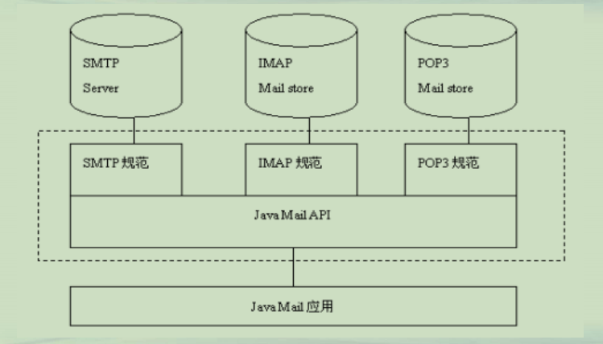

## Java Mail 编程

Java Mail 编程




**Java Mail 服务器配置**  
**• 邮件服务器支持**  
**–需要在邮件服务内设置，可以查看相关邮件帮助**  
**–需要知道pop服务器和smtp服务器信息**  


**Java Mail工具包**  
**• javax.mail 包和javax.mail.internet 包**   
**– https://javaee.github.io/javamail，目前1.6.2**  
**– mvn dependency**  


**Java Mail核心API**  
**• 关键类**  
**– Session: 邮件会话 和HttpSession不同**  
**– Store: 邮件存储空间**  
**– Folder: 邮件文件夹**  
**– Message: 电子邮件**  
**– Address: 邮件地址**  
**– Transport: 发送协议类**  

```java
├─src
│  ├─main
│  │  ├─java
│  │  │  ├─messages
│  │  │  │      AttachmentMessage.java
│  │  │  │      HtmlMessage.java
│  │  │  │      TextMessage.java
│  │  │  │      
│  │  │  └─tools
│  │  │          MailClientRecv.java
│  │  │          MailClientSend.java
│  │  │          
│  │  └─resources
│  └─test
│      ├─java
│      └─resources
```


```java
package tools;

import javax.mail.*;
import javax.mail.internet.*;
import javax.activation.*;
import java.util.*;

public class MailClientRecv {
  private Session session;
  private Store store;
  private String username = "chenliangyu1980@126.com";
  private String password = "1234567899";
  private String popServer = "pop.126.com";
  
  public void init()throws Exception
  {
    //设置属性
    Properties  props = new Properties();
    props.put("mail.store.protocol", "pop3");
    props.put("mail.imap.class", "com.sun.mail.imap.IMAPStore");
    props.put("mail.pop3.class", "com.sun.mail.pop3.POP3Store");    

    // 创建Session对象
    session = Session.getInstance(props,null);
    session.setDebug(false); //输出跟踪日志

    // 创建Store对象
    store = session.getStore("pop3");
    
    //连接到收邮件服务器
    store.connect(popServer,username,password);
  }  
  
  public void receiveMessage()throws Exception
  {
	String folderName = "inbox";
    Folder folder=store.getFolder(folderName);
    if(folder==null)
    {
    	throw new Exception(folderName+"邮件夹不存在");
    }
    //打开信箱
    folder.open(Folder.READ_ONLY);
    System.out.println("您的收件箱有"+folder.getMessageCount()+"封邮件.");
    System.out.println("您的收件箱有"+folder.getUnreadMessageCount()+"封未读的邮件.");

    //读邮件
    Message[] messages=folder.getMessages();
    //for(int i=1;i<=messages.length;i++)
    for(int i=1;i<=3;i++)  
    {
      System.out.println("------第"+i+"封邮件-------");
      //打印邮件信息
      Message message = messages[i];
      //folder.getMessage(i).writeTo(System.out);
      System.out.println((message.getFrom())[0]);
      System.out.println(message.getSubject());
      System.out.println();
    }
    folder.close(false);  //关闭邮件夹
  }
  
  public void close()throws Exception
  {
	store.close();
  }
  
  public static void main(String[] args)throws Exception {
    MailClientRecv client=new MailClientRecv();
    //初始化
    client.init();
    //接收邮件
    client.receiveMessage();
    //关闭连接
    client.close();
  }
}
```

```java
package tools;

import javax.mail.*;
import java.util.*;
import messages.*;


public class MailClientSend {
  private Session session;
  private Transport transport;
  private String username = "lychen@sei.ecnu.edu.cn";
  private String password = "1234567899";
  private String smtpServer = "webmail.ecnu.edu.cn";
  
  public void init()throws Exception
  {
	//设置属性
    Properties  props = new Properties();
    props.put("mail.transport.protocol", "smtp");
    props.put("mail.smtp.class", "com.sun.mail.smtp.SMTPTransport");
    props.put("mail.smtp.host", smtpServer); //设置发送邮件服务器
    props.put("mail.smtp.port", "25");
    props.put("mail.smtp.auth", "true"); //SMTP服务器需要身份验证    

    // 创建Session对象
    session = Session.getInstance(props,new Authenticator(){   //验账账户 
        public PasswordAuthentication getPasswordAuthentication() { 
          return new PasswordAuthentication(username, password); 
        }            
 });
    session.setDebug(true); //输出跟踪日志
    
    // 创建Transport对象
    transport = session.getTransport();           
  }
  
  public void sendMessage()throws Exception{
    //创建一个邮件
    //Message msg = TextMessage.generate();
	//Message msg = HtmlMessage.generate();
	Message msg = AttachmentMessage.generate();
    //发送邮件    
    transport.connect();
    transport.sendMessage(msg, msg.getAllRecipients());
    //打印结果
    System.out.println("邮件已经成功发送");
  } 
  
  public void close()throws Exception
  {
	transport.close();
  }
  
  public static void main(String[] args)throws Exception {
	  
    MailClientSend client=new MailClientSend();
    //初始化
    client.init();
    //发送邮件
    client.sendMessage();
    //关闭连接
    client.close();
  }
}
```

```java
package messages;

import java.util.Date;
import java.util.Properties;
import javax.mail.Message;
import javax.mail.Session;
import javax.mail.internet.InternetAddress;
import javax.mail.internet.MimeMessage;
import java.io.FileOutputStream;

public class TextMessage {
	public static MimeMessage generate() throws Exception {
		String from = "lychen@sei.ecnu.edu.cn "; // 发件人地址
		String to = "chenliangyu1980@126.com"; // 收件人地址
		
		String subject = "test";
		String body = "您好,这是来自一封chenliangyu的测试邮件";

		// 创建Session实例对象
		Session session = Session.getDefaultInstance(new Properties());
		// 创建MimeMessage实例对象
		MimeMessage message = new MimeMessage(session);
		// 设置发件人
		message.setFrom(new InternetAddress(from));
		// 设置收件人
		message.setRecipients(Message.RecipientType.TO, InternetAddress.parse(to));
		// 设置发送日期
		message.setSentDate(new Date());
		// 设置邮件主题
		message.setSubject(subject);
		// 设置纯文本内容的邮件正文
		message.setText(body);
		// 保存并生成最终的邮件内容
		message.saveChanges();

		// 把MimeMessage对象中的内容写入到文件中
		//msg.writeTo(new FileOutputStream("e:/test.eml"));
		return message;
	}
}

```

```java
package messages;

import java.util.Date;
import java.util.Properties;
import javax.mail.Message;
import javax.mail.Session;
import javax.mail.internet.InternetAddress;
import javax.mail.internet.MimeMessage;
import java.io.FileOutputStream;

public class HtmlMessage {
	public static MimeMessage generate() throws Exception 
	{
		String from = "lychen@sei.ecnu.edu.cn "; // 发件人地址
		String to = "chenliangyu1980@126.com"; // 收件人地址
		
		String subject = "HTML邮件";
		String body = "<a href=http://www.ecnu.edu.cn>" 
		  + "<h4>欢迎大家访问我们的网站</h4></a></br>" 
		  + "";

		// 创建Session实例对象
		Session session = Session.getDefaultInstance(new Properties());
		// 创建MimeMessage实例对象
		MimeMessage message = new MimeMessage(session);
		// 设置发件人
		message.setFrom(new InternetAddress(from));
		// 设置收件人
		message.setRecipients(Message.RecipientType.TO, InternetAddress.parse(to));
		// 设置发送日期
		message.setSentDate(new Date());
		// 设置邮件主题
		message.setSubject(subject);
		// 设置HTML格式的邮件正文
		message.setContent(body, "text/html;charset=gb2312");
		// 保存并生成最终的邮件内容
		message.saveChanges();

		// 把MimeMessage对象中的内容写入到文件中
		//msg.writeTo(new FileOutputStream("e:/HtmlMessage.eml"));
		return message;
	}
}
```

```java
package messages;

import java.io.FileOutputStream;
import java.util.Properties;
import javax.activation.DataHandler;
import javax.activation.FileDataSource;
import javax.mail.Message;
import javax.mail.Session;
import javax.mail.internet.InternetAddress;
import javax.mail.internet.MimeBodyPart;
import javax.mail.internet.MimeMessage;
import javax.mail.internet.MimeMultipart;
public class AttachmentMessage 
{
	public static MimeMessage generate() throws Exception
	{
		String from = "lychen@sei.ecnu.edu.cn "; // 发件人地址
		String to = "chenliangyu1980@126.com"; // 收件人地址
		
        String subject = "多附件邮件";        //邮件主题
        String body = "<a href=http://www.ecnu.edu.cn>" +
        			  "欢迎大家访问我们的网站</a></br>"; 
      
        // 创建Session实例对象
        Session session = Session.getDefaultInstance(new Properties());
     	// 创建MimeMessage实例对象
     	MimeMessage message = new MimeMessage(session);            
        message.setFrom(new InternetAddress(from));
        message.setRecipients(Message.RecipientType.TO,
        		InternetAddress.parse(to));
        message.setSubject(subject);
        
        //创建代表邮件正文和附件的各个MimeBodyPart对象
        MimeBodyPart contentPart = createContent(body);
        MimeBodyPart attachPart1 = createAttachment("c:/temp/ecnu4.jpg");
        MimeBodyPart attachPart2 = createAttachment("c:/temp/ecnu5.jpg");
        
        //创建用于组合邮件正文和附件的MimeMultipart对象
        MimeMultipart allMultipart = new MimeMultipart("mixed");
        allMultipart.addBodyPart(contentPart);
        allMultipart.addBodyPart(attachPart1);
        allMultipart.addBodyPart(attachPart2);
        
        //设置整个邮件内容为最终组合出的MimeMultipart对象
        message.setContent(allMultipart);
        message.saveChanges();
        
        //message.writeTo(new FileOutputStream("e:/ComplexMessage.eml"));
        return message;
	}
	
	public static MimeBodyPart createContent(String body) throws Exception
	{
        MimeBodyPart htmlBodyPart = new MimeBodyPart();          
        htmlBodyPart.setContent(body,"text/html;charset=gb2312");
        return htmlBodyPart;
	}
	
	public static MimeBodyPart createAttachment(String filename) throws Exception
	{
		//创建保存附件的MimeBodyPart对象，并加入附件内容和相应信息
		MimeBodyPart attachPart = new MimeBodyPart();
        FileDataSource fds = new FileDataSource(filename);
        attachPart.setDataHandler(new DataHandler(fds));
        attachPart.setFileName(fds.getName());
		return attachPart;
	}
}
```

**进一步的工作**  
**• 阅读书籍《Java邮件开发详解》，张孝祥等著，2007.**  
**• 官方例子：https://javaee.github.io/javamail/#Samples**  
**• 邮件定时发送**  
**• 邮件快速发送**  
**• 邮件地址收集**  
**• 邮件客户端开发**  
**• 垃圾邮件判定和防火墙开发**  
**• 邮件和其他通讯手段融合**  


**总结**  
**• 掌握Java 邮件收发方法**  
**• 注意：在项目中集成邮件处理，采用独立线程进行收发，避免阻塞**  

