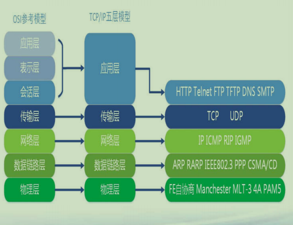

## 网络基础知识

**网络基础知识(1)**  
**• 网络是当前信息技术的第一推动力**  
**• 每个计算设备上都有若干个网卡**  
**• 每个网卡上有(全球唯一)单独的硬件地址，MAC地址**  

**网络基础知识(2)**  
**• IP地址:每个网卡/机器都有一个或多个IP地址**  
**– IPV4:192.168.0.100，每段从0到255**  
**– IPV6: 128bit长，分成8段，每段4个16进制数**  
**• FE80:0000:0000:0000:AAAA:0000:00C2:0002**  
**• https://baike.baidu.com/item/IPv6/172297?fr=aladdin**  
**– 查询：Windows平台ipconfig, Linux/Mac平台ifconfig**  

**网络基础知识(3)**  
**• port：端口,0-65535**  
**– 0~1023, OS已经占用了，80是Web，23是telnet**  
**– 1024~65535，一般程序可使用(谨防冲突) **   
**• 两台机器通讯就是在IP+Port上进行的**  
**• 在Windows/Linux/Mac上都可以通过netstat -an来查询**  

**网络基础知识(4)**  
**• 保留ip：127.0.0.1 本机**  
**• 公网(万维网/互联网)和内网(局域网)**  
**– 网络是分层的**  
**– 最外层是公网/互联网**  
**– 底下的每层都是内网 **  
**– ip地址可以在每个层次的网重用 **  
**– tracert 看当前机器**  
**和目标机器的访问中继**  

**网络基础知识(5)**  
**• 通讯协议：TCP和UDP**  
**• TCP(Transmission Control Protocol)**   
**– 传输控制协议，面向连接的协议**  
**– 两台机器的可靠无差错的数据传输**  
**– 双向字节流传递**  
**• UDP(User Datagram Protocol)**   
**– 用户数据报协议，面向无连接协议**  
**– 不保证可靠的数据传输**  
**– 速度快，也可以在较差网络下使用**  

这里本目录下有一张 网络分层协议图

**总结**  
**• 了解网络的基础概念**  
**• 为进一步网络编程应用奠定基础 ** 

