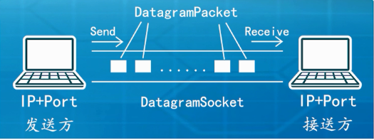

## Java UDP编程

**网络通讯协议**  
**• 通讯协议：TCP和UDP**  
**• TCP：Transmission Control Protocol**   
**– 传输控制协议，面向连接的协议**  
**– 两台机器的可靠无差错的数据传输**  
**– 双向字节流传递**  
**• UDP: User Datagram Protocol**   
**– 用户数据报协议，面向无连接协议**  
**– 不保证可靠的数据传输**  
**– 速度快，也可以在较差网络下使用**  


**UDP(1)**  
**• 计算机通讯：数据从一个IP的port出发（发送方），运输到另外一个IP的port（接收方）**  
**• UDP：无连接无状态的通讯协议**  
**– 发送方发送消息，如果接收方刚好在目的地，则可以接受。如果不在，那这个消息就丢失了**  
**– 发送方也无法得知是否发送成功**  
**– UDP的好处就是简单，节省，经济**  


**UDP(2)**  
**• DatagramSocket：通讯的数据管道**  
**– send 和receive方法**  
**– (可选，多网卡)绑定一个IP和Port**  
**• DatagramPacket**  
**– 集装箱：封装数据**  
**– 地址标签：目的地IP+Port**  
**• 实例**  
**– 无主次之分**  
**– 接收方必须早于发起方执行**  

这里在本目录下有一张图 DatagramSocket-DatagramPacket.png



```java

import java.net.*;
public class UdpRecv
{
	public static void main(String[] args) throws Exception
	{
		//定义了一个 DatagramSocket ,端口为 3000
		DatagramSocket	ds=new DatagramSocket(3000);
		byte [] buf=new byte[1024];
		//定义了一个集装箱 
		DatagramPacket dp=new DatagramPacket(buf,1024);
		
		System.out.println("UdpRecv: 我在等待信息");
		ds.receive(dp);
		System.out.println("UdpRecv: 我接收到信息");
		String strRecv=new String(dp.getData(),0,dp.getLength()) +
		" from " + dp.getAddress().getHostAddress()+":"+dp.getPort(); 
		System.out.println(strRecv);
		
		Thread.sleep(1000);
		System.out.println("UdpRecv: 我要发送信息");
		String str="hello world 222";
		DatagramPacket dp2=new DatagramPacket(str.getBytes(),str.length(), 
				InetAddress.getByName("127.0.0.1"),dp.getPort());
		ds.send(dp2);
		System.out.println("UdpRecv: 我发送信息结束");
		ds.close();
	}
}
```

```java
import java.net.*;
public class UdpSend
{
	public static void main(String [] args) throws Exception
	{
		DatagramSocket ds=new DatagramSocket();
		String str="hello world";
		DatagramPacket dp=new DatagramPacket(str.getBytes(),str.length(),
				InetAddress.getByName("127.0.0.1"),3000);
		
		System.out.println("UdpSend: 我要发送信息");
		ds.send(dp);
		System.out.println("UdpSend: 我发送信息结束");
		
		Thread.sleep(1000);
		byte [] buf=new byte[1024];
		DatagramPacket dp2=new DatagramPacket(buf,1024);
		System.out.println("UdpSend: 我在等待信息");
		ds.receive(dp2);
		System.out.println("UdpSend: 我接收到信息");
		String str2=new String(dp2.getData(),0,dp2.getLength()) +
				" from " + dp2.getAddress().getHostAddress()+":"+dp2.getPort(); 
		System.out.println(str2);
				
		ds.close();
	}
}
```

**总结**  
**• 掌握UDP基础概念**  
**• 了解UDP的Java编程实现**  

