## Java 字节码文件构成

**HelloWorld.class文件**  

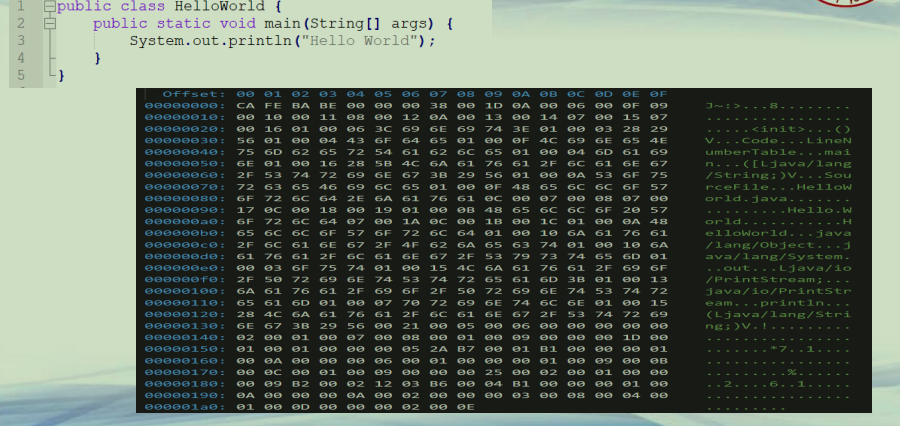

**class文件构成(1)**  
**• class文件构成**  
**–采用类似于C语言结构体的结构来表示数据**  
**–包括两种数据类型**  
**• 定长数据：无符号数，u1, u2, u4 (分别代表1个字节、2个字节、4个字节的无符号数)**  
**• 不定长数据：由多个无符号数组成，通常在数据的前面给出其长度**  

**class文件构成(2)**  

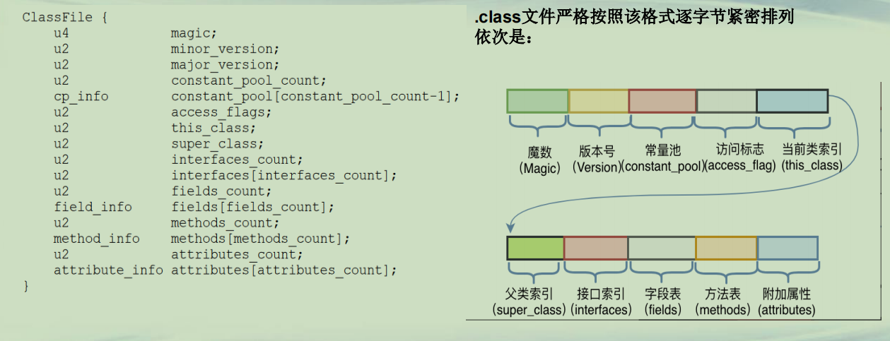

**class文件-魔数**  
**前4个字节为魔数，十六进制表示为0xCAFEBABE，标识该文件为class文件**  

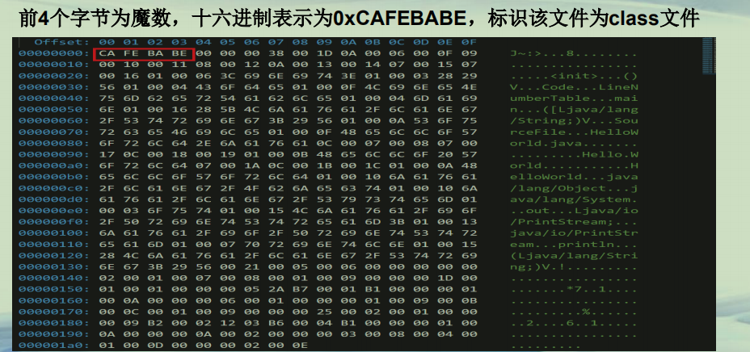

**class文件-版本号**  

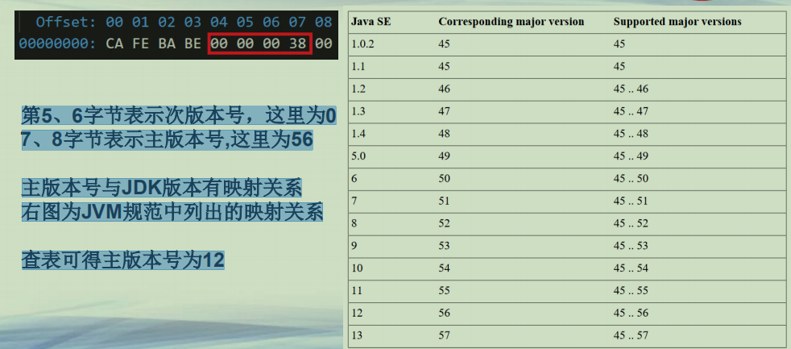

**反汇编工具javap**  
**• JDK提供了javap来对class文件做反汇编**  
**–按照class文件格式逐字节分析class文件，但过程比较繁琐、复杂**  
**–javap HelloWorld**  

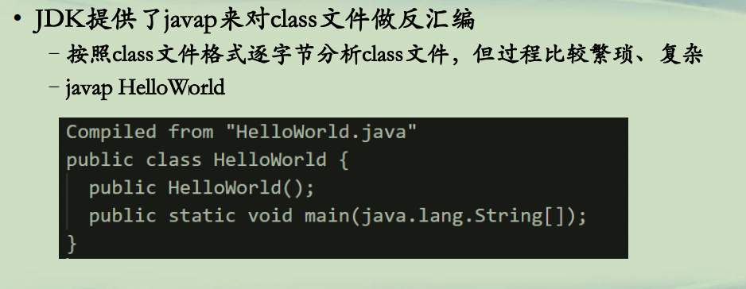

**class文件-常量池**  
**• 常量池主要存放两大类常量**  
**–字面量**  
**• 如文本字符串、final的常量值等**  
**–符号引用**  
**• 类和接口的全限定名**  
**• 字段的名称和描述符**  
**• 方法的名称和描述符**  

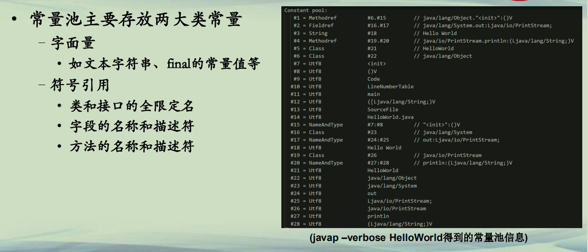

**class文件-访问标志**  
**• 常量池结束之后的两个字节，描述该Class是类还是接口，**  
**以及是否被public、abstract、final等修饰符修饰**  

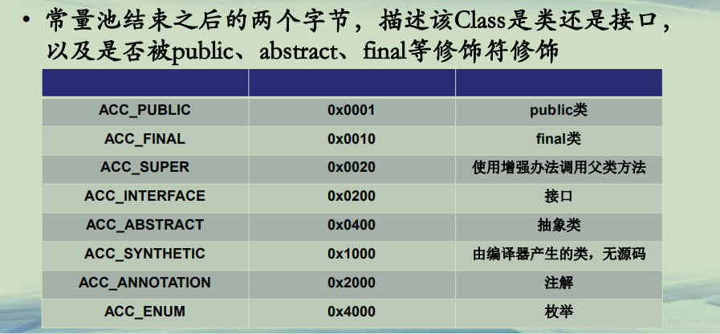

**class文件-类索引、父类索引与接口索引集合**  
**• 类索引**  
**–访问标志后的两个字节，描述的是当前类的全限定名**  
**–这两个字节保存的值为常量池中的索引值，根据索引值就能在常量池中找到这个类的全限定名**  
**• 父类索引**  
**–当前类名后的两个字节，描述父类的全限定名，同上，保存的也是常量池中的索引值**  
**• 接口索引集合**  
**–父类名称后为两字节的接口计数器，描述了该类或父类实现的接口数量**  
**–紧接着的n个字节是所有接口名称的字符串常量的索引值**  

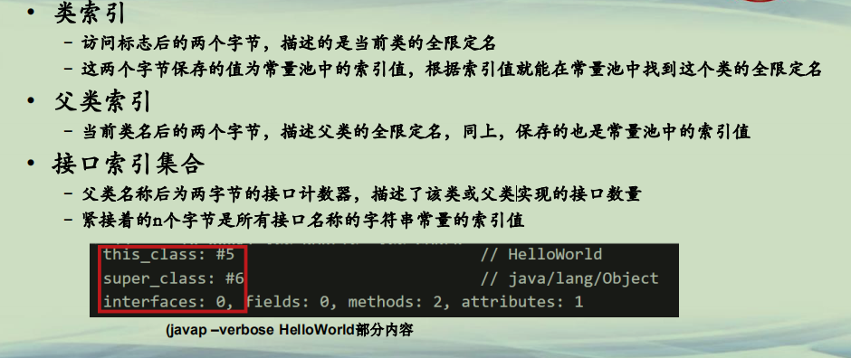

**class文件-字段表**  
**• 字段表**  
**–字段表用于描述类和接口中声明的变量，包含类级别的变量以及实例变量，但是不包含方法内部声明的局部变量**  
**–字段表也分为两部分，第一部分为两个字节，描述字段个数；第二部分是**  
**每个字段的详细信息fields_info**

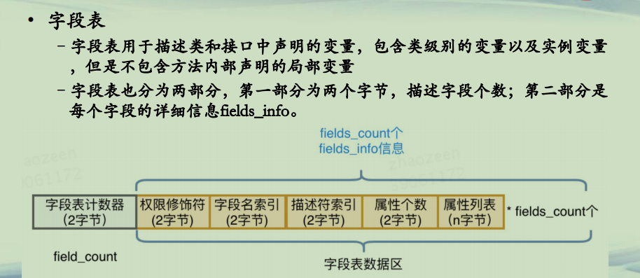

  

**class文件-方法表**  
**• 方法表**  
**–字段表结束后为方法表，方法表也是由两部分组成，第一部分为两个字节描述方法的个数；**  
**–第二部分为每个方法的详细信息。方法的详细信息较为复杂，包括方法的访问标志、方法名、方法的描述符以及方法的属性。**  

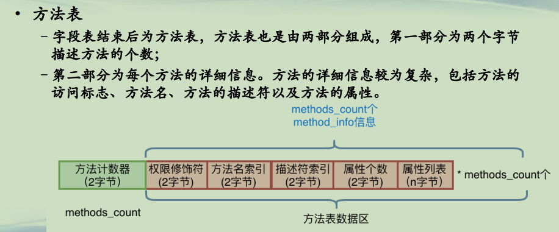

**class文件-方法表（续）**  
**(javap –verbose HelloWorld 方法表方法部分属性**  
**• Code，源代码对应的JVM指令操作码**  
**• LineNumberTable，行号表,将Code区的操作码和源代码中的行号对应**  

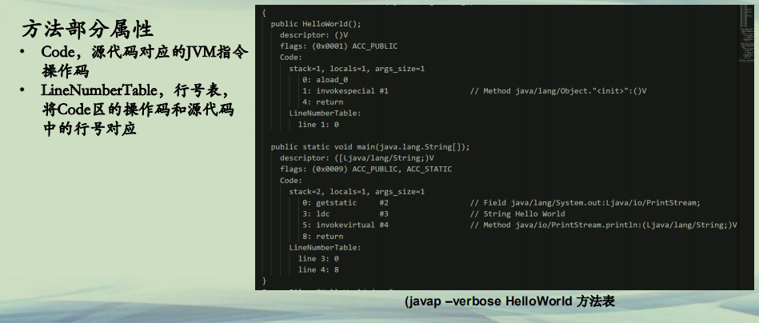

**class文件-附加属性**  
**• 字节码的最后一部分，该项存放了在该文件中类或接口所定义属性的基本信息**  
**• 如下图，为SourceFile属性**  

**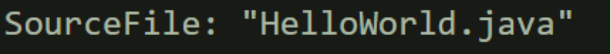**

**• 属性信息相对灵活，编译器可自由写入属性信息，JVM会忽略不认识的属性信息**   

**总结**  
**• class文件是JVM生态体系的基础构成之一**  
**• class文件的结构是学习和掌控class文件的基础**  

