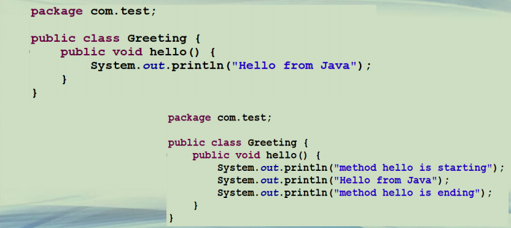
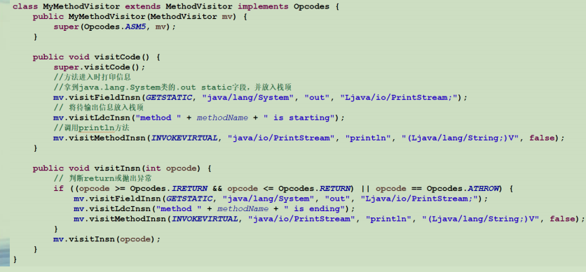
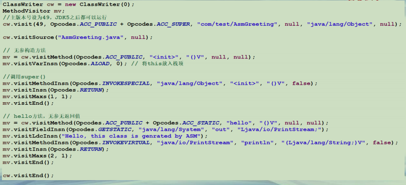

## Java 字节码操作ASM

**ASM简介**  
**• 字节码操作：指令层次较为复杂**  
**• 很多第三方字节码工具包**  
**– https://www.open-open.com/project/tag/zijie-ma-caozuo.html**  
**• ASM是生成、转换、分析class文件的工具包**  
**–https://asm.ow2.io/ **  
**–体积小、轻量、快速、文档完善，被众多开源项目采用**  
**• Groovy/Kotlin Compiler**  
**• Gradle**  
**• Jacoco //代码覆盖率统计**  
**• Mockito // Java Test Mock框架**  


**ASM API**  
**• Core API**  
**–类比解析XML文件中的SAX方式**  
**–不需要读取类的整个结构，使用流式的方法来处理字节码文件**  
**–非常节约内存，但是编程难度较大**  
**–出于性能考虑，一般情况下编程都使用Core API**  
**• Tree API**  
**–类比解析XML文件中的DOM方式，把整个类的结构读取到内存中**  
**–消耗内存多，但是编程比较简单**  
**–通过各种Node类来映射字节码的各个区域**  


**ASM API 核心类**  
**• 核心类**  
**–ClassReader 用于读取已经编译好的.class文件**  
**–ClassWriter 用于重新构建编译后的类**  
**• 如修改类名、属性以及方法，也可以生成新的类的字节码文件**  
**– Visitor类**  
**• CoreAPI根据字节码从上到下依次处理**  
**• 对于字节码文件中不同的区域有不同的Visitor，举例如下**  
**– MethodVisitor 用于访问类方法**  
**– FieldVisitor 访问类变量**  
**– AnnotationVisitor 用于访问注解**  


**ASM实例-修改字节码文件(1)**  




**ASM实例-修改字节码文件(2)**  




**ASM实例-生成字节码文件**




```java
│  pom.xml
├─src
│  ├─com
│  │  └─test
│  │          Greeting.java
│  │          
│  └─edu
│      └─ecnu
│              Generator.java
│              MyClassVisitor.java
│              Test.java
│              
└─target
    └─classes
        ├─com
        │  └─test
        │          AsmGreeting.class
        │          Greeting.class
        │          
        ├─edu
        │  └─ecnu
        │          Generator.class
        │          MyClassVisitor$MyMethodVisitor.class
        │          MyClassVisitor.class
        │          Test.class
        │          
        └─META-INF
            │  MANIFEST.MF
            │  
            └─maven
                └─PMOOC10-04
                    └─PMOOC10-04
                            pom.properties
                            pom.xml
```

```java
package com.test;

public class Greeting {
	public void hello() {
		System.out.println("Hello from Java");    
	}
}

```

```java
package edu.ecnu;


import java.io.File;
import org.objectweb.asm.Opcodes;
import java.io.FileOutputStream;
import java.io.IOException;

import org.objectweb.asm.ClassReader;
import org.objectweb.asm.ClassVisitor;
import org.objectweb.asm.ClassWriter;
import org.objectweb.asm.MethodVisitor;

public class Generator {

	public static void main(String[] args) throws Exception {
		modifyGreeting();
		createAsmGreeting();
	}

	public static void modifyGreeting() throws IOException {
		// 读取
		ClassReader classReader = new ClassReader("com/test/Greeting");
		ClassWriter classWriter = new ClassWriter(ClassWriter.COMPUTE_MAXS);
		// 处理
		ClassVisitor classVisitor = new MyClassVisitor(classWriter);
		classReader.accept(classVisitor, ClassReader.SKIP_DEBUG);
		byte[] data = classWriter.toByteArray();
		// 输出
		File f = new File("target/classes/com/test/Greeting.class");
		FileOutputStream fout = new FileOutputStream(f);
		fout.write(data);
		fout.close();
		System.out.println("Modify Greeting Class success!!!!!");
	}

	public static void createAsmGreeting() throws Exception {

		ClassWriter cw = new ClassWriter(0);
		MethodVisitor mv;
		//主版本号设为49，JDK5之后都可以运行
		cw.visit(49, Opcodes.ACC_PUBLIC + Opcodes.ACC_SUPER, "com/test/AsmGreeting", null, "java/lang/Object", null);

		cw.visitSource("AsmGreeting.java", null);

		// 无参构造方法
		mv = cw.visitMethod(Opcodes.ACC_PUBLIC, "<init>", "()V", null, null);
		mv.visitVarInsn(Opcodes.ALOAD, 0); // 将this放入栈顶
		
		//调用super()
		mv.visitMethodInsn(Opcodes.INVOKESPECIAL, "java/lang/Object", "<init>", "()V", false);
		mv.visitInsn(Opcodes.RETURN);
		mv.visitMaxs(1, 1);
		mv.visitEnd();

		// hello方法，无参无返回值
		mv = cw.visitMethod(Opcodes.ACC_PUBLIC + Opcodes.ACC_STATIC, "hello", "()V", null, null);
		mv.visitFieldInsn(Opcodes.GETSTATIC, "java/lang/System", "out", "Ljava/io/PrintStream;");
		mv.visitLdcInsn("Hello, this class is genrated by ASM");
		mv.visitMethodInsn(Opcodes.INVOKEVIRTUAL, "java/io/PrintStream", "println", "(Ljava/lang/String;)V", false);
		mv.visitInsn(Opcodes.RETURN);
		mv.visitMaxs(2, 1);
		mv.visitEnd();

		cw.visitEnd();
		
		
		File f = new File("target/classes/com/test/AsmGreeting.class");
		FileOutputStream fout = new FileOutputStream(f);
		fout.write(cw.toByteArray());
		fout.close();
		System.out.println("Create AsmGreeting success!!!!!");
	}
}

```

```java
package edu.ecnu;

import org.objectweb.asm.ClassVisitor;
import org.objectweb.asm.MethodVisitor;
import org.objectweb.asm.Opcodes;

public class MyClassVisitor extends ClassVisitor implements Opcodes {
	private static String methodName;

	public MyClassVisitor(ClassVisitor cv) {
		super(ASM5, cv);
	}

	@Override
	public void visit(int version, int access, String name, String signature, String superName, String[] interfaces) {
		cv.visit(version, access, name, signature, superName, interfaces);
	}

	@Override
	public MethodVisitor visitMethod(int access, String name, String desc, String signature, String[] exceptions) {
		MethodVisitor mv = cv.visitMethod(access, name, desc, signature, exceptions);
		// 忽略构造方法
		if (!name.equals("<init>") && mv != null) {
			methodName = name;
			mv = new MyMethodVisitor(mv);
		}
		return mv;
	}

	class MyMethodVisitor extends MethodVisitor implements Opcodes {
		public MyMethodVisitor(MethodVisitor mv) {
			super(Opcodes.ASM5, mv);
		}
		
		public void visitCode() {
			super.visitCode();
			//方法进入时打印信息
			//拿到java.lang.System类的.out static字段，并放入栈顶
			mv.visitFieldInsn(GETSTATIC, "java/lang/System", "out", "Ljava/io/PrintStream;");
			// 将待输出信息放入栈顶
			mv.visitLdcInsn("method " + methodName + " is starting");
			//调用println方法
			mv.visitMethodInsn(INVOKEVIRTUAL, "java/io/PrintStream", "println", "(Ljava/lang/String;)V", false);
		}

		public void visitInsn(int opcode) {
			// 判断return或抛出异常
			if ((opcode >= Opcodes.IRETURN && opcode <= Opcodes.RETURN) || opcode == Opcodes.ATHROW) {
				mv.visitFieldInsn(GETSTATIC, "java/lang/System", "out", "Ljava/io/PrintStream;");
				mv.visitLdcInsn("method " + methodName + " is ending");
				mv.visitMethodInsn(INVOKEVIRTUAL, "java/io/PrintStream", "println", "(Ljava/lang/String;)V", false);
			}
			mv.visitInsn(opcode);
		}
	}
}
```

```java
package edu.ecnu;

import java.lang.reflect.InvocationTargetException;
import java.lang.reflect.Method;

import com.test.Greeting;


public class Test {

	/**
	 * 在eclipse下，运行该类，使得Greeting.java被编译生成class文件
	 * 再运行Generator类，使得Greeting.class被修改，以及生成AsmHello.class
	 * 再运行该类可看到修改后效果
	 * 
	 * 由于修改、生成的class文件都位于target下，Project/Clean可清除所有class文件
	 */
	public static void main(String[] args) throws InterruptedException, NoSuchMethodException, SecurityException, ClassNotFoundException, IllegalAccessException, IllegalArgumentException, InvocationTargetException {
		new Greeting().hello();
		
		System.out.println("====================");
		
//		//运行过Generator类后会生成AsmHello.class，取消如下注释可看到效果
		Method newMethod = Class.forName("com.test.AsmGreeting").getMethod("hello");
		newMethod.invoke(null);
	
	}

}

```

```java
<project xmlns="http://maven.apache.org/POM/4.0.0" xmlns:xsi="http://www.w3.org/2001/XMLSchema-instance" xsi:schemaLocation="http://maven.apache.org/POM/4.0.0 http://maven.apache.org/xsd/maven-4.0.0.xsd">
  <modelVersion>4.0.0</modelVersion>
  <groupId>PMOOC10-04</groupId>
  <artifactId>PMOOC10-04</artifactId>
  <version>0.0.1-SNAPSHOT</version>
  
  <dependencies>
		<!-- https://mvnrepository.com/artifact/org.ow2.asm/asm -->
		<dependency>
			<groupId>org.ow2.asm</groupId>
			<artifactId>asm</artifactId>
			<version>7.2</version>
		</dependency>
		<!-- https://mvnrepository.com/artifact/org.ow2.asm/asm-commons -->
		<dependency>
			<groupId>org.ow2.asm</groupId>
			<artifactId>asm-commons</artifactId>
			<version>7.2</version>
		</dependency>
	</dependencies>
  
  <build>
    <sourceDirectory>src</sourceDirectory>
    <plugins>
      <plugin>
        <artifactId>maven-compiler-plugin</artifactId>
        <version>3.8.0</version>
        <configuration>
          <source>1.8</source>
          <target>1.8</target>
        </configuration>
      </plugin>
    </plugins>
  </build>
</project>
```


**总结**  
**• ASM可以用来分析、转换、生成字节码文件**  
**–Core API**  
**–Tree API**  
**• 理解字节码文件相关概念是重点和难点**  
**–字节码指令**  
**–常量池**  
**–操作数栈**  
**–局部变量表等 ** 

