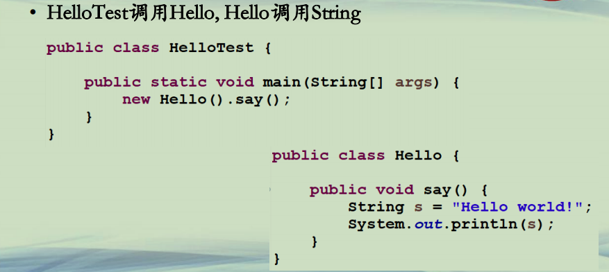
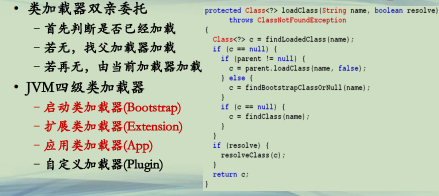
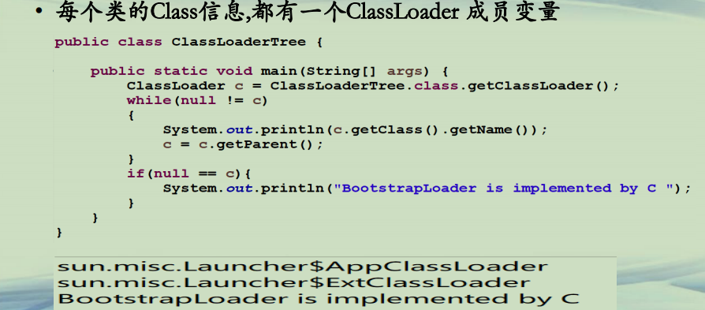

## Java 类加载机制

**类加载过程(1)**  
**• HelloTest调用Hello, Hello调用String**  




**类加载过程(2)**  
**• 执行HelloTest，增加一个VM参数 <u>-verbose:class</u>**  
**– [Opened E:\java\jdk1.8.0_45\jre\lib\rt.jar]**  
**– [Loaded java.lang.Object from E:\java\jdk1.8.0_45\jre\lib\rt.jar]**  
**–……**  
**<u>– [Loaded java.lang.String from E:\java\jdk1.8.0_45\jre\lib\rt.jar]</u>**  
**–……**  
**<u>– [Loaded HelloTest from file:/E:/java/source/PMOOC11-01/bin/]</u>**  
**<u>– [Loaded Hello from file:/E:/java/source/PMOOC11-01/bin/]</u>**  
**– [Loaded java.lang.Shutdown from E:\java\jdk1.8.0_45\jre\lib\rt.jar]**  


**类加载过程(3)**  
**• 类加载过程**  
**–程序是依靠多个Java类共同协作完成的**  
**–JVM依据classpath执行的类库的顺序来查找类**  
**–潜在的问题**  
**• 如何找到正确的类，如classpath路径的前后**  
**• 如何避免恶意的类，如一个假的String类**  
**• 加载的顺序，如先加载父类，还是子类**  
**• ……**  


**Java类加载机制(1)**  
**• 类加载器ClassLoader**  
**–负责查找、加载、校验字节码的应用程序**  
**–java.lang.ClassLoader**  
**• load(String className) 根据名字加载一个类，返回类的实例**  
**• defineClass(String name, byte[] b, int off, int len) 将一个字节流定义一个类**  
**• findClass(String name) 查找一个类**  
**• findLoadedClass(String name) 在已加载的类中，查找一个类**  
**<u>• 成员变量 ClassLoader parent;</u>**  


**Java类加载机制(2)**  
**• JVM四级类加载器**  
**–启动类加载器(Bootstrap)，系统类rt.jar**  
**–扩展类加载器(Extension)，jre/lib/ext**  
**–应用类加载器(App)，classpath**  
**–用户自定义加载器(Plugin)，程序自定义**  


**Java类加载机制(3)**  
**• 类加载器双亲委托**  
**–首先判断是否已经加载**  
**–若无，找父加载器加载**  
**–若再无，由当前加载器加载**  
**• JVM四级类加载器**  
**–启动类加载器(Bootstrap)**  
**–扩展类加载器(Extension)**  
**–应用类加载器(App)**  
**–自定义加载器(Plugin)**  




**Java类加载机制(4)**




```java

public class ClassLoaderTreeTest {
	
	public static void main(String[] args) {
		ClassLoader classLoader=ClassLoaderTreeTest.class.getClassLoader();
		//System.out.println(classLoader);
		
		while(classLoader !=null) {
			System.out.println(classLoader.getClass().getName());
			classLoader=classLoader.getParent();
		}
		
		if(classLoader == null) {
			System.out.println("类启动加载器");
		}
	}
}
//输出
//sun.misc.Launcher$AppClassLoader
//sun.misc.Launcher$ExtClassLoader
//类启动加载器
```


**总结**  
**• 类加载器是JVM生态体系的基础构成之一**  
**• JVM的四级类加载器和双亲委托机制**  