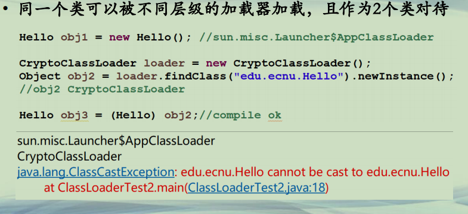

## 自定义类加载器

**Java类加载机制**  
**• JVM四级类加载器**  
**–启动类加载器(Bootstrap)，系统类rt.jar**  
**–扩展类加载器(Extension)，jre/lib/ext**  
**–应用类加载器(App)，classpath**  
**–<u>用户自定义加载器(Plugin)，程序自定义</u>**  


**自定义类加载器**  
**• 自定义加载路径**  
**–弥补类搜索路径静态的不足**  
**–URLClassLoader, 从多个URL(jar或者目录)中加载类**  
**• 自定义类加载器**  
**–<u>继承ClassLoader类</u>**  
**–<u>重写findClass(String className)方法</u>**  


**自定义类加载器(1)**  
**• 自定义类加载器**  
**–继承ClassLoader类**  
**–<u>重写findClass(String className)方法</u>**  
**–使用时，默认先调用loadClass(className)来查看是否已经加载过，然后委托双亲加载，如果都没有，再通过findClass加载返回**  
**• 在findClass中，首先读取字节码文件**  
**• 然后，调用defineClass(className, bytes, off, len) 将类注册到虚拟机中**  
**• 可以重写loadClass方法来突破双亲加载**  


**自定义类加载器(2)**  
**• 同一个类可以被不同层级的加载器加载，且作为2个类对待**  




```java

├─PMOOC11-04           
│  │              
│  └─src
│      │  Caesar.java
│      │  
│      └─edu
│          └─ecnu
│                  Hello.java
│                  
├─PMOOC11-04-Test  
│  │      
│  └─src
│          ClassLoaderTest.java
│          CryptoClassLoader.java
│          
└─PMOOC11-04-Test2      
    └─src
            ClassLoaderTest2.java
            CryptoClassLoader.java
            

```

PMOOC11-04：

```java
package edu.ecnu;

public class Hello {
	public void say()
	{
		System.out.println("Hello"); 
	}
}
```

```java

import java.io.*;

/**
 * Encrypts a file using the Caesar cipher.
 * 
 * @version 1.01 2012-06-10
 * @author Cay Horstmann
 */
public class Caesar {
	public static void main(String[] args) throws Exception {
		int key = 3;

		// 将Input类加密，输出到Output中
//		String input = "E:/java/source/PMOOC11-04/bin/edu/ecnu/Hello.class";
//		String output = "E:/java/source/PMOOC11-04/bin/edu/ecnu/Hello.caesar";
		
		String input = "D:\\eclipseWorkspaceIcourse163\\PMOOC11-04\\PMOOC11-04\\bin/edu/ecnu/Hello.class";
		String output = "D:\\eclipseWorkspaceIcourse163\\PMOOC11-04\\PMOOC11-04\\bin/edu/ecnu/Hello.caesar";

		try (FileInputStream in = new FileInputStream(input); FileOutputStream out = new FileOutputStream(output)) {
			int ch;
			while ((ch = in.read()) != -1) {
				// 每个字节码+key
				byte c = (byte) (ch + key);
				out.write(c);
			}
		}
		System.out.println("Caesar done");
	}
}

```


PMOOC11-04-Test：

```java
import java.io.IOException;
import java.nio.file.Files;
import java.nio.file.Paths;

class CryptoClassLoader extends ClassLoader 
{
   private int key = 3; 
   
   public Class<?> findClass(String name) throws ClassNotFoundException
   {
	   System.out.println("findClass");
      try
      {
    	 byte[] classBytes = null;
         //读取Hello.caesar文件，得到所有字节流
         classBytes = loadClassBytes(name);
         //调用defineClass方法产生一个类，并在VM中注册
         Class<?> cl = defineClass(name, classBytes, 0, classBytes.length);
         if (cl == null) throw new ClassNotFoundException(name);
         return cl;
      }
      catch (IOException e)
      {
         throw new ClassNotFoundException(name);
      }
   }

   /**
    * Loads and decrypt the class file bytes.
    * @param name the class name
    * @return an array with the class file bytes
    */
   private byte[] loadClassBytes(String name) throws IOException
   {
	   System.out.println("加载Hello.caesar,解密...");
      String cname = "D:\\\\eclipseWorkspaceIcourse163\\\\PMOOC11-04\\\\PMOOC11-04\\\\bin/edu/ecnu/Hello.caesar";
      byte[] bytes = Files.readAllBytes(Paths.get(cname));
      for (int i = 0; i < bytes.length; i++)
         bytes[i] = (byte) (bytes[i] - key);
      return bytes;
   }
}
```


```java

import java.lang.reflect.*;

public class ClassLoaderTest
{
   public static void main(String[] args)
   {
	   try
	      {
	         ClassLoader loader = new CryptoClassLoader();
	         //loadClass去加载Hello类
	         //loadClass是ClassLoader默认方法，通过委托双亲去加载类
	         //如加载不到，则调用findClass方法加载
	         Class<?> c = loader.loadClass("edu.ecnu.Hello");
	         Method m = c.getMethod("say");
	         m.invoke(c.newInstance());
	         
	         System.out.println(c.getClassLoader().getClass().getName());
	      }
	      catch (Exception e)
	      {
	         e.printStackTrace();
	      }
   }
}
```


PMOOC11-04-Test2:

```java
import java.io.IOException;
import java.nio.file.Files;
import java.nio.file.Paths;

class CryptoClassLoader extends ClassLoader 
{
   private int key = 3; 
   
   public Class<?> findClass(String name) throws ClassNotFoundException
   {
      try
      {
    	 byte[] classBytes = null;
         //读取Hello.caesar文件，得到所有字节流
         classBytes = loadClassBytes(name);
         //调用defineClass方法产生一个类，并在VM中注册
         Class<?> cl = defineClass(name, classBytes, 0, classBytes.length);
         if (cl == null) throw new ClassNotFoundException(name);
         return cl;
      }
      catch (IOException e)
      {
         throw new ClassNotFoundException(name);
      }
   }

   /**
    * Loads and decrypt the class file bytes.
    * @param name the class name
    * @return an array with the class file bytes
    */
   private byte[] loadClassBytes(String name) throws IOException
   {
      String cname = "D:/eclipseWorkspaceIcourse163/PMOOC11-04/PMOOC11-04/bin/edu/ecnu/Hello.caesar";
      byte[] bytes = Files.readAllBytes(Paths.get(cname));
      for (int i = 0; i < bytes.length; i++)
         bytes[i] = (byte) (bytes[i] - key);
      return bytes;
   }
}
```

```java

import edu.ecnu.Hello;

public class ClassLoaderTest2
{
   public static void main(String[] args)
   {
	   try
	      {
		   Hello obj1 = new Hello(); //sun.misc.Launcher$AppClassLoader
		   
		   CryptoClassLoader loader = new CryptoClassLoader();		   
		   Object obj2 = loader.findClass("edu.ecnu.Hello").newInstance();	   
		   //obj2 CryptoClassLoader
		   
//		   Hello obj3 = (Hello) obj2;//compile ok
		   
		   System.out.println(obj1.getClass().getClassLoader().getClass().getName());
		   System.out.println(obj2.getClass().getClassLoader().getClass().getName());
		  
		
	      }
	      catch (Exception e)
	      {
	         e.printStackTrace();
	      }
   }
}
```


**总结**  
**• JVM四级类加载器严格遵循从上到下的加载机制**  
**• 自定义类加载器继承ClassLoader类，可重写loadClass和findClass方法**  
**• 不同层次的类加载器，加载同名的类，在JVM里面也算两个**  

