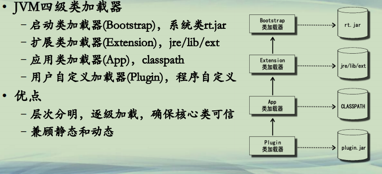

## Java 类加载器总结

**Java类加载机制(1)**  

**• JVM四级类加载器**
**–启动类加载器(Bootstrap)，系统类rt.jar**  
**–扩展类加载器(Extension)，jre/lib/ext**  
**–应用类加载器(App)，classpath**  
**–用户自定义加载器(Plugin)，程序自定义**  
**• 优点**  
**–层次分明，逐级加载，确保核心类可信**  
**–兼顾静态和动态**  

**Java类加载机制(2)**  
**• JVM四级类加载器的动态性**  
**–使用虚拟机参数-*Xbootclasspath*，将jar或目录提高到Bootstrap等级**  
**–使用ServiceLoader和SPI机制，实现上层加载器的类，访问下层加载器的类**  
**–使用URLClassLoader，可以在运行时增加新的classpath路径**  
**–使用自定义的ClassLoader，可以通过重写loadClass和findClass方法动态加载字节码，还可以在加载字节码过程中进行修改/校验等操作**  

**进一步学习的内容(1)**  
**• JVM类装载过程**  
**<u>*–加载(loading)*</u>(这个是目前这节所学习的)**  
**–链接(linking)**  
**• 验证(Verification)，字节码是否满足规范要求**  
**• 准备(Preparation)，分配内存，常量池初始化**  
**• 解析(Resolution)，解析类/接口/字段/方法的符号引用**  
**–初始化(Initializing)，执行类的初始化方法<clinit>**  
**– https://docs.oracle.com/javase/specs/jvms/se8/html/jvms-5.html**  

**进一步学习的内容(2)**  
**• Java类加载器：类的加载和隔离**  
**• 基于类加载器，诞生OSGi**  
**–OSGi, Open Service Gateway Initiative, https://www.osgi.org/**  
**–在OSGi容器里面运行bundle，通过类加载器来控制类的可见性**  
**• 类加载器和模块(module)之间的关系**  
**– https://docs.oracle.com/javase/9/docs/api/java/lang/ClassLoader.html**  
**– https://docs.oracle.com/javase/9/docs/api/java/lang/Module.html  **  
**– https://docs.oracle.com/javase/9/migrate/toc.htm#JSMIG-GUID-A868D0B9-026F-4D46-B979-901834343F9E **  

**进一步学习的资源**  
**• 网站**  
**–JVM规范，**  
**https://docs.oracle.com/javase/specs/jvms/se11/jvms11.pdf**  
**–Oracle Java文档，https://docs.oracle.com/en/java/javase/13/**  
**• 书籍**  
**–深入理解Java虚拟机，周志明著**  
**–实战Java虚拟机，葛一鸣著**  
**–揭秘Java虚拟机，封亚飞著**  
**–Java Performance，Oreilly出版**  

**总结**  
**• 总结Java四层类加载器的特点**  
**• 总结Java类加载器的动态性**  

