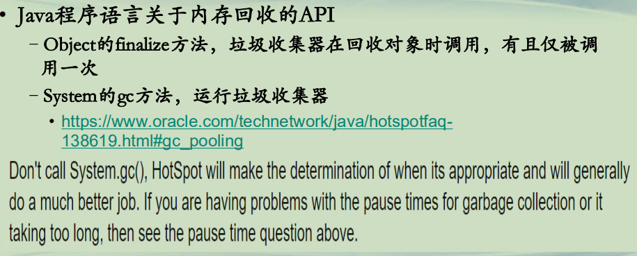
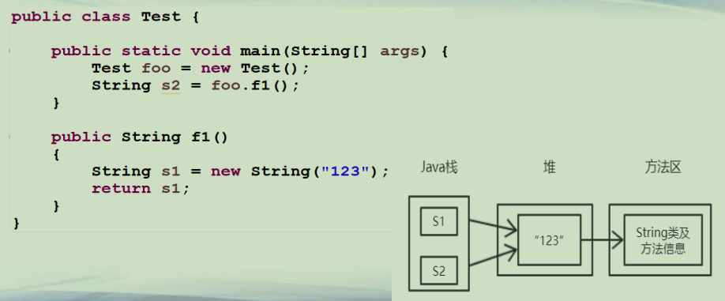
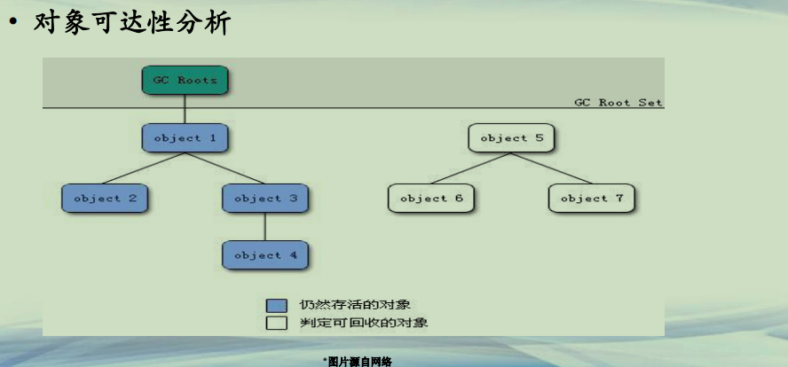

## Java对象引用

**Java自动内存管理**  
**• 传统程序语言：由程序员手动内存管理**  
**–C/C++，malloc申请内存和free释放内存**  
**–由于程序员疏忽或程序异常，导致内存泄露**  
**• 现代程序语言：自动内存管理**  
**–Java/C#，采用内存自动管理**  
**–程序员只需要申请使用，系统会检查无用的对象并回收内存**  
**–系统统一管理内存，内存使用相对高效**  


**垃圾收集器**  
**• JVM内置有垃圾收集器**  
**–GC, Garbage Collector**  
**–自动清除无用的对象，回收内存**  
**• 垃圾收集器的工作职责(John McCarthy, Lisp 语言)**  
**–*什么内存需要收集(判定无用的对象)***  
**–什么时候回收(何时启动，不影响程序正常运行)**  
**–如何回收(回收过程，要求速度快/时间短/影响小)**  


**Java对象的生命周期(1)**  
**• Java对象的生命周期**  
**–对象通过构造函数创建，但是没有析构函数回收内存**  
**–*对象存活在离它最近的一对大括号中(如下 Test.java)***  

Test.java

```java

public class Test {

	public static void main(String[] args) {
		Test foo = new Test();
		String s2 = foo.f1();
	}
	
	public String f1()
	{
		String s1 = new String("123");//s1仅存活在 f1(){}函数中的大括号中
		return s1;
	}
}

```


**Java对象的生命周期(2)**  
**• Java程序语言关于内存回收的API**  
**–Object的finalize方法，垃圾收集器在回收对象时调用，有且仅被调用一次**  
**–System的gc方法，运行垃圾收集器**  
**• https://www.oracle.com/technetwork/java/hotspotfaq-138619.html#gc_pooling**   




**Java对象的生命周期(3)**




**Java对象引用(1)**  
**• 基于对象引用判定无用对象**  
**–零引用，互引用等**  
**• 对象引用链**  
**–通过一系列的称为"GC Roots"的对象作为起始点，从这些节点开始向下搜索，搜索所走过的路径称为引用链（Reference Chain），当一个对象到GC Roots没有任何引用链相连（用图论的话来说，就是从GC Roots到这个对象不可达）时，则证明此对象是不可用的**  
	**--摘自：《深入理解Java虚拟机：JVM高级特性与最佳实践》 — 周志明**  


**Java对象引用(2)**  
**• 对象可达性分析**  




**Java对象引用(3)**  
**• GC Roots对象包括**  
**–虚拟机栈中引用的对象**  
**–方法区中类静态属性引用的对象**  
**–方法区中常量引用的对象**  
**–本地方法栈中引用的对象**  


**Java对象引用(4)**  
**• 强引用**  
**–例如Object obj = new Object(); Object obj2 = obj;**  
**–只要强引用还存在，对象就不会被回收，哪怕发生OOM异常**  
**• 软引用**  
**–描述有用但并非必需的对象**  
**–在系统将要发生内存溢出异常之前，会把这些对象列为可回收**  
**–JDK提供了SoftReference类来实现软引用**  


**Java对象引用(5)**  
**• 弱引用**  
**–描述非必需对象，比软引用强度更弱些**  
**–被弱引用关联的对象只能生存到下一次垃圾收集发生之前**  
**–JDK提供了WeakReference类来实现弱引用**  
**• 虚引用**  
**–最弱的引用关系，JDK提供PhantomReference实现虚引用**  
**–为一个对象设置虚引用关联的唯一目的就是能在这个对象被收集器回收时收到一个系统通知，用于对象回收跟踪**  

| 引用类型 | 强引用   | 软引用         | 弱引用        | 虚引用           |
| -------- | -------- | -------------- | ------------- | ---------------- |
| 类型     | 正常赋值 | SoftReference  | WeakReference | PhantomReference |
| 回收时间 | 不回收   | 内存紧张时回收 | GC就回收      | 随时可能被回收   |

**软引用和弱引用，适合用来保存可有可无的缓存数据。**  


```java
└─src
        PhontomReferenceTest.java
        SoftReferenceTest.java
        StrongReferenceTest.java
        Test.java
        WeakReferenceTest.java
```

```java

public class Test {

	public static void main(String[] args) {
		Test foo = new Test();
		String s2 = foo.f1();
	}
	
	public String f1()
	{
		String s1 = new String("123");
		return s1;
	}
}

```

```java

public class StrongReferenceTest {

	public static void main(String[] args) {
		StringBuilder s1 = new StringBuilder();
		for(int i=0;i<10000;i++)
		{
			s1.append("00000000000000000000");
		}
		
		StringBuilder s2 = s1;
		s1 = null; //s1 为null, 但是s2依旧占据内存
		//s2 = null;
		System.gc(); 
		//垃圾回收, 无法对强类型引用回收, 内存被占用, 引发异常
		
		byte[] b = new byte[1024*1024*3];
		
	}

}

```

```java
import java.lang.ref.SoftReference;

public class SoftReferenceTest {

	public static void main(String[] args) {
		StringBuilder s1 = new StringBuilder();
		for(int i=0;i<100000;i++)
		{
			s1.append("0000000000");
		}
		
		SoftReference<StringBuilder> s2 = new SoftReference<StringBuilder>(s1);
		s1 = null;
		
		System.out.println(s2.get().length()); //not null
		
		System.gc();
		//软引用, 内存不紧张, 没有回收
		System.out.println(s2.get().length()); //not null
		
		byte[] b = new byte[(int)(1024*1024*3.5)];
		
		System.gc();
		//内存紧张, 软引用被回收
		System.out.println(s2.get()); //null
		
	}

}

```

```java

import java.lang.ref.WeakReference;

public class WeakReferenceTest {

	public static void main(String[] args) {
		StringBuilder s1 = new StringBuilder();
		for(int i=0;i<100000;i++)
		{
			s1.append("0000000000");
		}
		
		WeakReference<StringBuilder> s2 = new WeakReference<StringBuilder>(s1);
		s1 = null;
		
		System.out.println(s2.get().length());
		
		System.gc();
		//弱引用，只要gc，就会回收
		System.out.println(s2.get()); //null
		
		byte[] b = new byte[(int)(1024*1024*3.5)];	
		
	}

}
```

```java

import java.lang.ref.PhantomReference;
import java.lang.ref.ReferenceQueue;

public class PhontomReferenceTest {

	public static void main(String[] args) {
		ReferenceQueue<StringBuilder> queue = new ReferenceQueue<StringBuilder>();
		Thread t = new CheckReferenceQueue(queue);
		t.setDaemon(true);
		t.start();
		
		StringBuilder s1 = new StringBuilder();
		for(int i=0;i<100000;i++)
		{
			s1.append("0000000000");
		}		
		
		PhantomReference<StringBuilder> s2 = new PhantomReference<StringBuilder>(s1,queue);
		s1 = null;
		//虚引用随时可能被回收,甚至没有被GC
		System.out.println(s2.get());
		
		System.gc();
		
		System.out.println(s2.get()); //null
		
		byte[] b = new byte[(int)(1024*1024*3.5)];	
		
	}

}

class CheckReferenceQueue extends Thread
{
	ReferenceQueue<StringBuilder> queue = null;
	
	public CheckReferenceQueue(ReferenceQueue<StringBuilder> queue)
	{
		this.queue = queue;
	}
	
	public void run()
	{
		while(true)
		{
			if(queue != null)
			{
				PhantomReference<StringBuilder> obj = null;
				try
				{
					obj = (PhantomReference<StringBuilder>) queue.remove();
				}
				catch(Exception e)
				{
					e.printStackTrace();
				}
				if(obj != null)
				{
					System.out.println("obj is deleted");
				}
			}
		}
	}
}

```


**总结**  
**• 理解垃圾收集器的职责**  
**• 掌握并使用四种Java对象引用类型，使内存回收更高效**  


