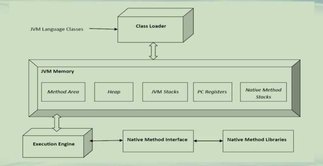

## 总结和展望

**JVM内存(1)**  

**Hotspot虚拟机构成**  

**JVM内存(2)**  

| 名称         | 线程私有/共享 | 功能                     | 大小                             | 异常                                |
| ------------ | ------------- | ------------------------ | -------------------------------- | ----------------------------------- |
| 程序计数器   | 私有          | 保存当前线程执行方法     | 通常固定大小                     | 不会                                |
| JVM栈        | 私有          | 方法的栈帧               | -Xss                             | StackOverflowError,OutOfMemoryError |
| 本地方法栈   | 私有          | 存储native方法信息       | 通常固定大小                     | StackOverflowError,OutOfMemoryError |
| <u>堆</u>    | <u>共享</u>   | <u>存储对象和数组</u>    | <u>-Xms 初始堆值-Xmx最大堆值</u> | <u>OutOfMemoryError</u>             |
| 方法区       | 共享          | 存储类结构/常量/静态变量 | -XX参数设置                      | OutOfMemoryError                    |
| 运行时常量池 | 共享          | 常量池运行时表示         | 从属于方法区                     | OutOfMemoryError                    |

**JVM内存(3)**  
**• 本章所学过的内容**  
**–虚拟机的发展历程和内部结构组成**  
**–JVM内存分类和每一类内存的参数控制**  
**–四种对象引用类型，加快无用对象判定**  
**–垃圾收集经典算法**  
**–堆内存参数设置和垃圾收集跟踪**  
***–注意：本章所学的JVM内存管理和Java并发内存模型不同***  

**进一步学习的内容**  
**• 编译JVM**  
**• JVM的多种垃圾收集器使用和区别**  
**• 理解每一种内存分类的职责，熟悉相关参数设置**  
**• 根据GC报告和VM监控，调整正确的内存分配策略**  

**进一步学习的资源(1)**  
**• 网站**  
**–JVM规范，https://docs.oracle.com/javase/specs/jvms/se11/jvms11.pdf **  
**–VM文档，https://www.oracle.com/technetwork/java/javase/tech/index-jsp-136373.html**  
**–VM性能调优，https://docs.oracle.com/javase/8/docs/technotes/guides/vm/gctuning/toc.html**  
**–垃圾收集器文档，https://www.oracle.com/technetwork/java/javase/tech/index-jsp-140228.html**  

**进一步学习的资源(2)**  
**• 书籍**  
**–深入理解Java虚拟机，周志明著**  
**–实战Java虚拟机，葛一鸣著**  
**–揭秘Java虚拟机，封亚飞著**  
**–Java性能权威指南，Charlie Hunt等著柳飞等译**  

**总结**  
**• 总结本章所学的JVM内容 **  
**• 展望下一步的学习内容 **  

 