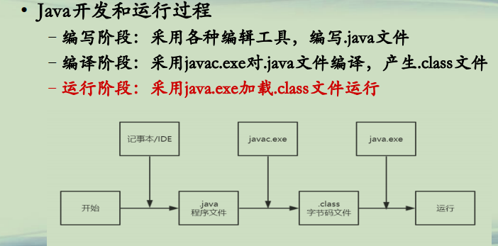
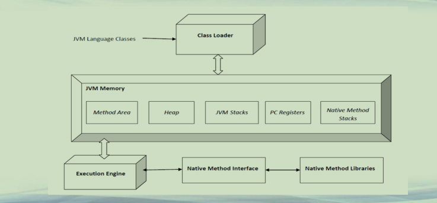
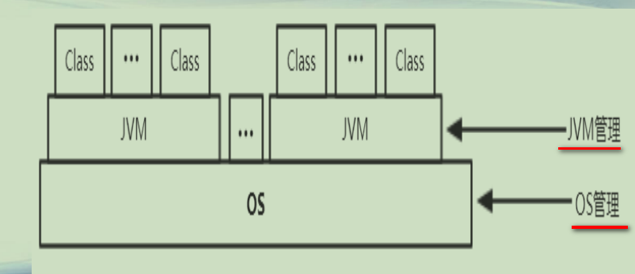

## Java运行管理概述

**Java开发和运行过程(1)**  
**• Java开发和运行过程**  
**–编写阶段：采用各种编辑工具，编写.java文件**  
**–编译阶段：采用javac.exe对.java文件编译，产生.class文件**  
**–运行阶段：采用java.exe加载.class文件运行**  

**Java开发和运行过程(2)** 

**Java运行管理(1)**  

**Java运行管理(2)**  
**• OS管理**  
***–进程级别的管理(黑盒)***  
**–CPU/内存/IO等具体性能监控**  
**• JVM管理**  
***–线程/程序级别的管理(白盒)***  
**–查看虚拟机运行时各项信息**  
**–跟踪程序的执行过程，查看程序运行时信息**  
**–限制程序对资源的使用**  
**–将内存导出为文件进行具体分析**  
**–……**   

**总结**  
**• 了解Java程序的开发和运行整个过程**  
**• 了解Java程序运行管理的意义和内容**  

