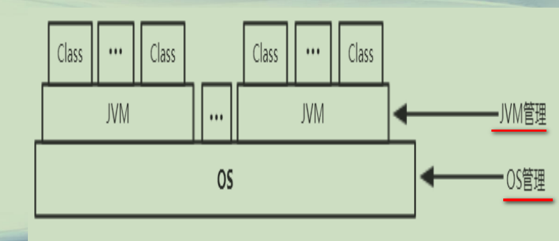
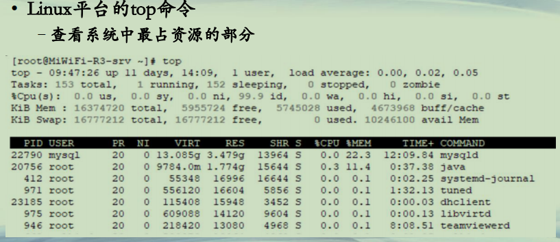
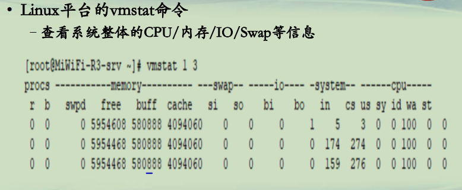
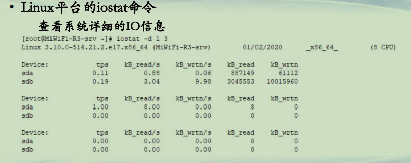
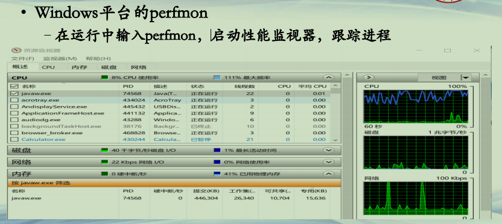

## OS层管理

**Java运行管理(1)**

**Java运行管理(2)**  
**• OS层管理**  
**–*进程级别的管理(黑盒)***  
**–CPU/内存/IO等具体性能监控**  
**• JVM层管理**  
**–*线程/程序级别的管理(白盒)***  
**–查看虚拟机运行时各项信息**  
**–跟踪程序的执行过程，查看程序运行时状态信息**  
**–限制程序对资源的使用**  
**–将内存导出为文件进行具体分析**  
**–……**  

**Java运行管理(3)**  
**• Linux平台管理**  
**–top命令**  
**–vmstat命令**  
**–iostat命令**  
**• Windows平台管理**  
**–任务管理器**  
**–perfmon工具**  

**Java运行管理(4)**  
**• Linux平台的top命令**  
**–查看系统中最占资源的部分**  

**Java运行管理(5)**  
**• Linux平台的vmstat命令**  
**–查看系统整体的CPU/内存/IO/Swap等信息**  

**Java运行管理(6)**  
**• Linux平台的iostat命令**  
**–查看系统详细的IO信息**    

**Java运行管理(7)**  
**• Windows平台的任务管理器 **   
**–ctrl+del+alt, 启动任务管理器，对系统进程信息进行概览**    

.png)

**Java运行管理(8)**  
**• Windows平台的perfmon**  
**–在运行中输入perfmon，启动性能监视器，跟踪进程**   

**Java运行管理(10)**  
**• 进一步扩展学习**  
**–了解命令更多的参数和使用方法**  
**–Linux平台管理**  
**• pidstat工具，多功能诊断器，可以定位到线程，**  
**https://sourceforge.net/projects/sysstat/**  
**–Windows平台管理**  
**• Process Explorer，进程管理工具， https://docs.microsoft.com/en-us/sysinternals/downloads/process-explorer**  
**• pslist, Windows命令行工具， https://docs.microsoft.com/en-us/sysinternals/downloads/pslist**  

**总结**  
**• 了解在OS层面上对Java进程的管理**  
**• 掌握Linux和Windows两种平台上基础的程序监控命令**  

