## 可视化管理工具

**Java运行管理工具**  
**• 可视化Java管理工具**  
**–JConsole**  
**–Visual VM**  
**–Mission Control  **  

**JConsole(1)**  
**• JConsole**  
**–监管本地Java进程**  
**–监管远程Java进程**  
**• 需要远程进程启动开启JMX服务**   

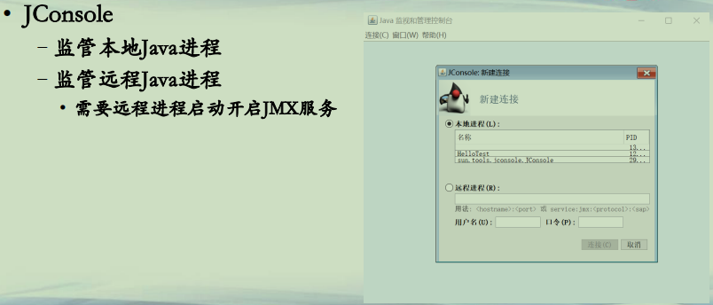

**JConsole(2)**  
**• 概览界面：堆内存、线程、加载类、CPU**  

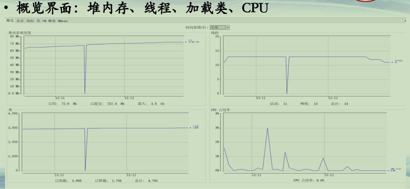

**JConsole(3)**  
**• 内存界面：显示内存中各项信息**  

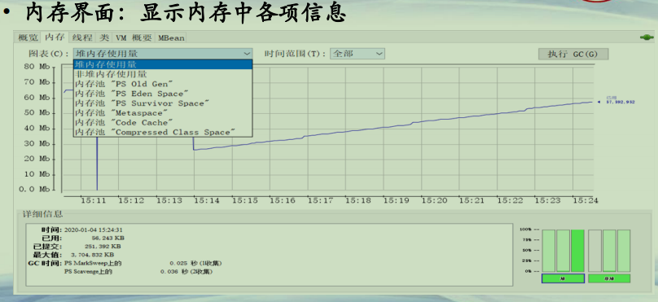

**JConsole(4)**  
**• 线程界面：查看进程中的线程，检测死锁**  

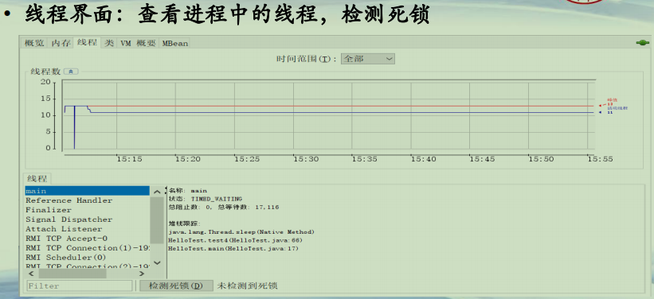

**JConsole(5)**  
**• 类界面：显示已加载的类和卸载的类数量**  

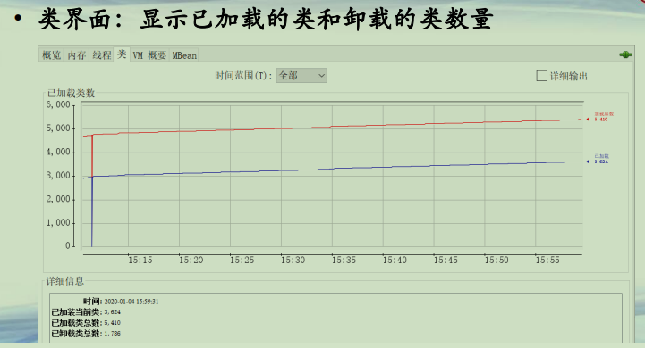

**JConsole(6)**  
**• VM概要：显示整体概要信息(文本)**  

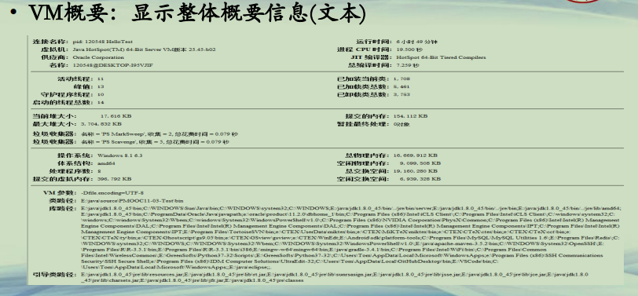

**Visual VM(1)**  
**• Visual VM**  
**–自JDK 7发布，一个综合性的工具**  
**–可以查看、统计，也可以支持插件扩展**  
**–jvisualvm 启动**  

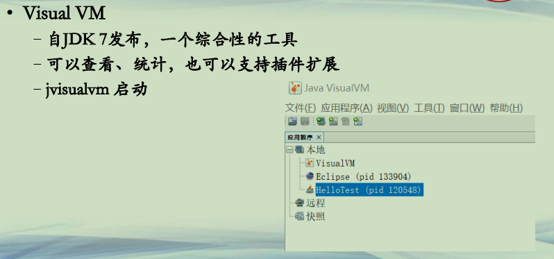

**Visual VM(2)**  
**• 概述页：全局统览**  

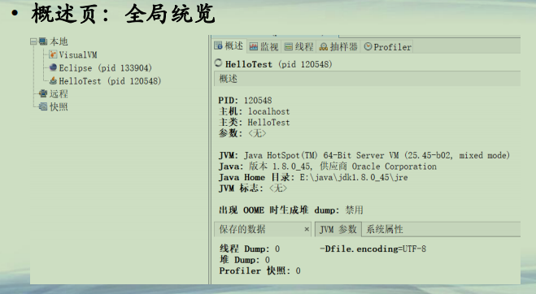

**Visual VM(3)**  
**• 监视页：对每一种指标持续监控**  

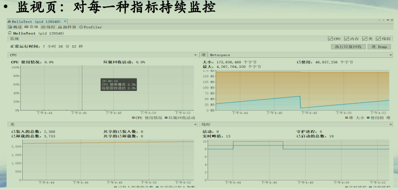

**Visual VM(4)**  
**• 线程页：对每一个线程持续监控**  

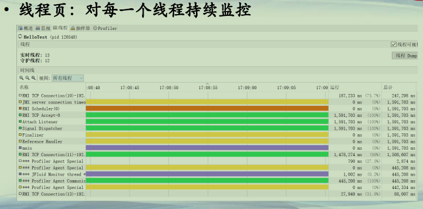

**Visual VM(5)**  
**• 抽样器：对CPU和内存进行抽样**  

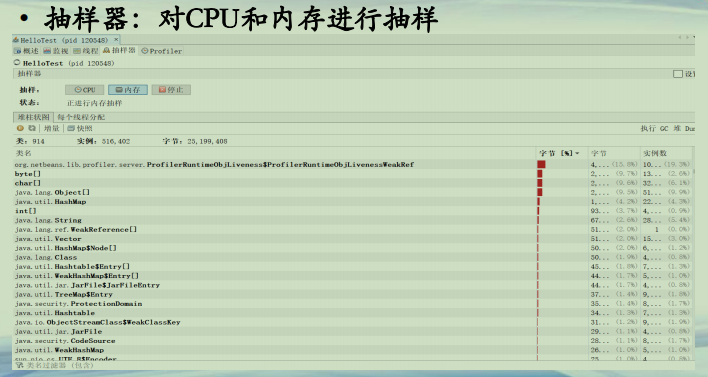

**Mission Control(1)**  
**• Mission Control**  
**–源自于JRockit JDK (BEA)**  
**–自Oracle JDK 7u40发行版加入**  
**–文件位于 %JAVA_HOME%/bin/jmc**  
**–带有一些商业特性**  

**Mission Control(2)**  

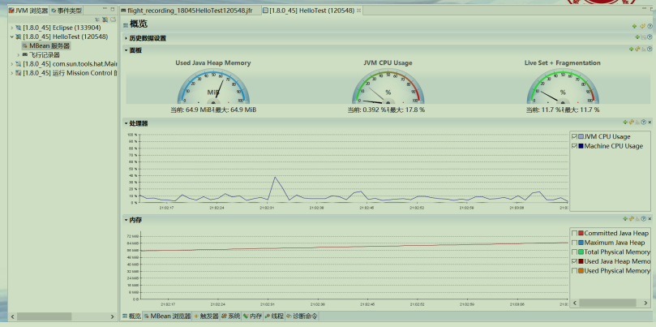

**Mission Control(3)**  

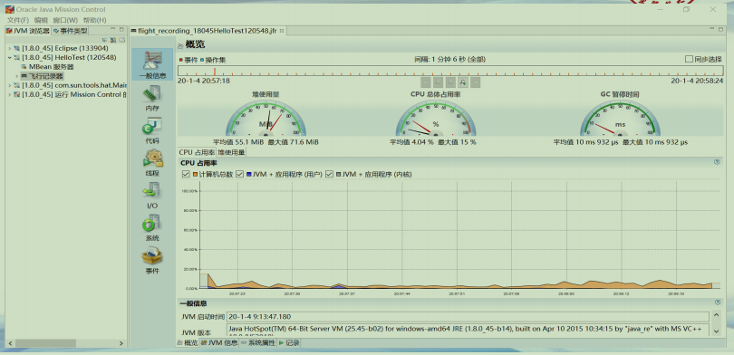

 

**总结**  
**• 了解JConsole/Visual VM/Mission Control两种工具**  
**• 图形可视化更直观，容易监控连续的信息**  

