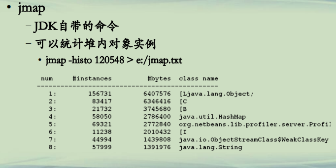
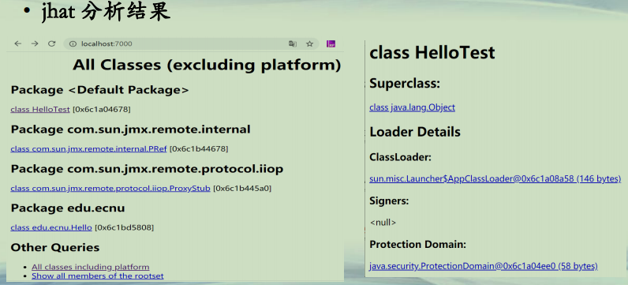
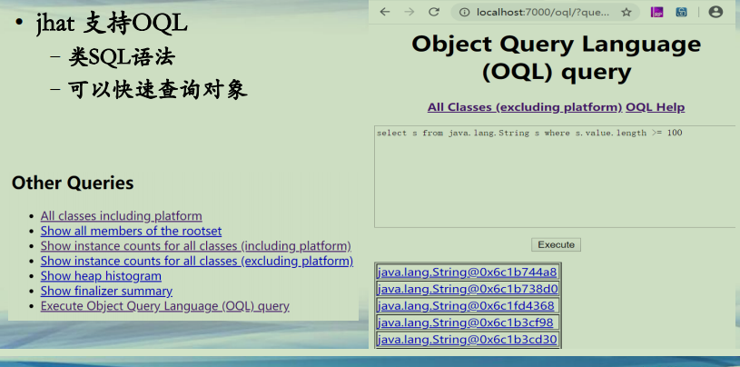
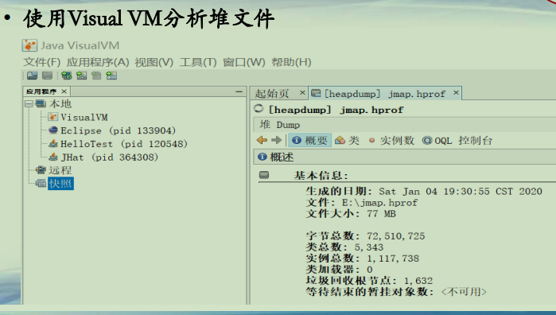
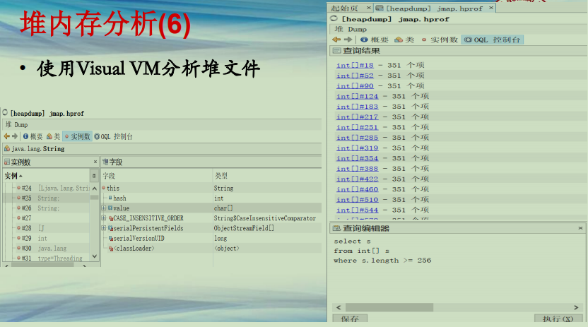
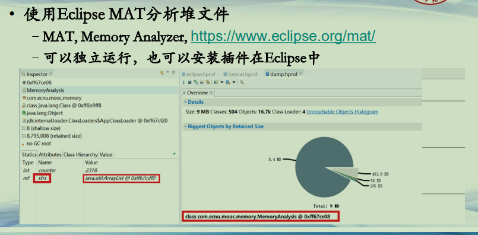

## 堆文件分析

**JVM内存**  

| 名称         | 线程私有/共享 | 功能                     | 大小                             | 异常                                |
| ------------ | ------------- | ------------------------ | -------------------------------- | ----------------------------------- |
| 程序计数器   | 私有          | 保存当前线程执行方法     | 通常固定大小                     | 不会                                |
| JVM栈        | 私有          | 方法的栈帧               | -Xss                             | StackOverflowError,OutOfMemoryError |
| 本地方法栈   | 私有          | 存储native方法信息       | 通常固定大小                     | StackOverflowError,OutOfMemoryError |
| <u>堆</u>    | <u>共享</u>   | <u>存储对象和数组</u>    | <u>-Xms 初始堆值-Xmx最大堆值</u> | <u>OutOfMemoryError</u>             |
| 方法区       | 共享          | 存储类结构/常量/静态变量 | -XX参数设置                      | OutOfMemoryError                    |
| 运行时常量池 | 共享          | 常量池运行时表示         | 从属于方法区                     | OutOfMemoryError                    |

**堆内存分析(1)**  
**• jmap**  
**–JDK自带的命令**  
**–可以统计堆内对象实例**  
**• jmap -histo 120548 > e:/jmap.txt**  

**堆内存分析(2)**  
**• jmap**  
**–可以生成堆内存dump文件**  
**• jmap –dump:format=b,file=e:/jmap.hprof 120548**  
**• jhat**  
**–JDK自带的工具，自JDK 9开始，被Visual VM代替**  
**–解析hprof文件，并通过http方式进行展示**  
**–jhat e:/jmap.hprof**  

**堆内存分析(3)**  
**• jhat 分析结果**  

**堆内存分析(4)**  
**• jhat 支持OQL**  
**–类SQL语法**  
**–可以快速查询对象**  

**堆内存分析(5)**  
**• 使用Visual VM分析堆文件**  

**堆内存分析(6)**  
**• 使用Visual VM分析堆文件**  

**堆内存分析(7)**  
**• 使用Eclipse MAT分析堆文件**  
**–MAT, Memory Analyzer, https://www.eclipse.org/mat/**  
**–可以独立运行，也可以安装插件在Eclipse中**  

**总结**  
**• 堆内存有效管理是Java程序正常运行的保障**  
**• 使用jmap/jhat/Visual VM/Eclipse MAT分析堆Dump文件**  

