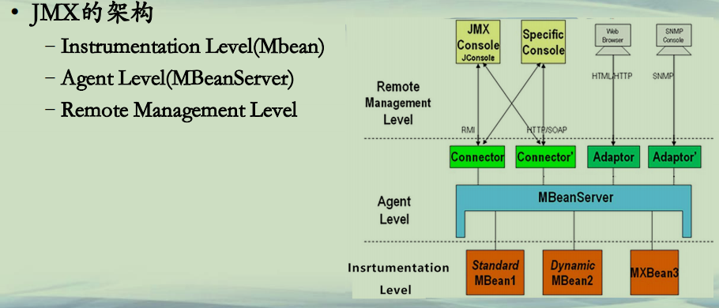

## JMX

**JMX(1)**  
**• JMX**  
**–Java Management Extensions**  
**–JMX是一个为应用程序植入管理功能的框架**  
**–用户可以在任何Java应用程序中使用这些代理和服务实现管理**  
**– The Java VM includes a platform MBean server and platform MBeans for use by management   applications that conform to the Java Management Extensions (JMX) specification.**   
**• These platforms are implementations of the monitoring and management API.**  
**• https://docs.oracle.com/en/java/javase/13/management/overview-java-se-monitoring-and-management.html**  


**JMX(2)**  
**• JMX的架构**  
**–Instrumentation(百度解释：插桩，一般指的是获取计算机软件或者硬件状态的数据的技术；常用实现的方法是将一段代码注入到目标程序中) Level(Mbean)**  
**–Agent Level(MBeanServer)**  
**–Remote Management Level**  




**JMX(3)**  
**• MBean**  
**–代表着一个被管理的对象，类似JavaBean**  
**–对外暴露一个管理接口，即一些可读/写的属性，一些可操作的方法**  
**–standard MBean**  
**• 最普通的MBean,定义一个接口SomethingMBean, 和实现类Something**  
**–dynamic MBean**  
**–open MBean**  
**–model MBean**    


**JMX(4)**  
**• Agent**  
**–*一个MBean的容器，代表着一群被管理的对象***  
**–外界通过Agent可以访问到MBean**  
**–Agent的核心是MBeanServer，MBean在MBeanServer中注册**  
**–Agent也包含一个通讯适配器或者连接器，使得外界的管理工具可以接入。**  
**• A JMX agent also includes a set of services to manage MBeans, and at least one communications adaptor or connector to enable access by a management application.**  


**JMX(5)**  
**• JMX的优点**  
**–JMX不需要较大成本，即可管理应用程序**  
**–JMX提供一套标准化方法，来管理基于Java的应用程序/系统/网络**  
**–JMX被用来作为JVM的外在管理方式**  
**–JMX提供了一个可扩展、动态的管理架构**  
**–JMX充分利用已有的Java技术**  
**–JMX容易和现有的管理技术进行集成**  
**– https://docs.oracle.com/en/java/javase/13/jmx/introduction-jmx-technology.html#GUID-CCF1F9D8-1918-4FB1-93FF-EAF3BD239F43**  


```
└─src
    └─com
        └─example
            └─mbeans
                    Hello.java
                    HelloMBean.java
                    Main.java
```

```java
package com.example.mbeans;

public interface HelloMBean {
	// operations

	public void sayHello();

	public int add(int x, int y);

	// attributes

	// a read-only attribute called Name of type String
	public String getName();

	// a read-write attribute called CacheSize of type int
	public int getCacheSize();

	public void setCacheSize(int size);
}

```

```java
package com.example.mbeans;

/* Hello.java - MBean implementation for the Hello World MBean.
This class must implement all the Java methods declared in the
HelloMBean interface, with the appropriate behavior for each one.  */

public class Hello implements HelloMBean {
	public void sayHello() {
		System.out.println("hello, world");
	}

	public int add(int x, int y) {
		return x + y;
	}

	/*
	 * Getter for the Name attribute. The pattern shown here is frequent: the getter
	 * returns a private field representing the attribute value. In our case, the
	 * attribute value never changes, but for other attributes it might change as
	 * the application runs. Consider an attribute representing statistics such as
	 * uptime or memory usage, for example. Being read-only just means that it can't
	 * be changed through the management interface.
	 */
	public String getName() {
		return this.name;
	}

	/*
	 * Getter for the CacheSize attribute. The pattern shown here is frequent: the
	 * getter returns a private field representing the attribute value, and the
	 * setter changes that field.
	 */
	public int getCacheSize() {
		return this.cacheSize;
	}

	/*
	 * Setter for the CacheSize attribute. To avoid problems with stale values in
	 * multithreaded situations, it is a good idea for setters to be synchronized.
	 */
	public synchronized void setCacheSize(int size) {
		this.cacheSize = size;

		/*
		 * In a real application, changing the attribute would typically have effects
		 * beyond just modifying the cacheSize field. For example, resizing the cache
		 * might mean discarding entries or allocating new ones. The logic for these
		 * effects would be here.
		 */
		System.out.println("Cache size now " + this.cacheSize);
	}

	private final String name = "Reginald";
	private int cacheSize = DEFAULT_CACHE_SIZE;
	private static final int DEFAULT_CACHE_SIZE = 200;
}

```

```java
package com.example.mbeans;

/* Main.java - main class for Hello World example.  Create the
HelloWorld MBean, register it, then wait forever (or until the
program is interrupted).  */

import java.lang.management.*;
import javax.management.*;

public class Main {
	/*
	 * For simplicity, we declare "throws Exception". Real programs will usually
	 * want finer-grained exception handling.
	 */
	public static void main(String[] args) throws Exception {
		// Get the Platform MBean Server
		MBeanServer mbs = ManagementFactory.getPlatformMBeanServer();

		// Construct the ObjectName for the MBean we will register
		ObjectName name = new ObjectName("com.example.mbeans:type=Hello");

		// Create the Hello World MBean
		Hello mbean = new Hello();

		// Register the Hello World MBean
		mbs.registerMBean(mbean, name);

		// Wait forever
		System.out.println("Waiting forever...");
		Thread.sleep(Long.MAX_VALUE);
	}
}
```


<u>代码执行步骤:需要先执行Main.java文件，然后打开 jconsole.exe ,找到 MBean 进行测试。</u>


**总结**  
**• 了解JMX的概念和架构**  
**• 掌握JMX的开发模式，使得JConsole可扩展管理程序**  

