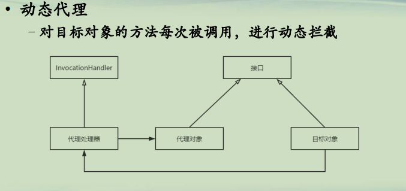
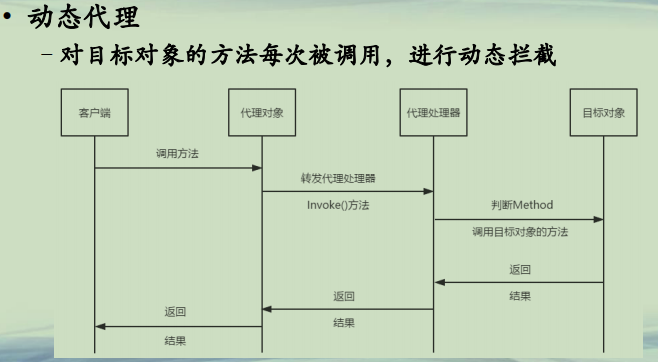

## 动态代理

**静态代理**
**• 静态代理**
**–对每个方法，需要静态编码(简洁，但繁琐)**


**动态代理(1) **  
**• 动态代理**  
**–对目标对象的方法每次被调用，进行动态拦截**  




**动态代理(2)**  
**• 动态代理**  
**–对目标对象的方法每次被调用，进行动态拦截**  




```java
└─src
    │  DynamicProxyDemo.java
    │  ProxyHandler.java
    │  Subject.java
    │  SubjectImpl.java             
    └─multiple
        └─interfaces
                Cook.java
                CookImpl.java
                Driver.java
                MultipleInterfacesProxyTest.java
                ProxyHandler.java
                
```

```java

public interface Subject{
    public void request();
}
```

```java

//目标对象
class SubjectImpl implements Subject{
  public void request(){
      System.out.println("I am dealing the request.");
  }
}
```

```java
import java.lang.reflect.InvocationHandler;
import java.lang.reflect.Method;

/**
 * 代理类的调用处理器
 */
class ProxyHandler implements InvocationHandler{
    private Subject subject;
    public ProxyHandler(Subject subject){
        this.subject = subject;
    }
    
    //此函数在代理对象调用任何一个方法时都会被调用。
    //第一个参数是代理对象 
    @Override
    public Object invoke(Object proxy, Method method, Object[] args)
            throws Throwable {
    	System.out.println(proxy.getClass().getName());
    	//定义预处理的工作，当然你也可以根据 method 的不同进行不同的预处理工作
        System.out.println("====before====");
        Object result = method.invoke(subject, args);
        System.out.println("====after====");
        return result;
    }
}
```

```java

import java.lang.reflect.Field;
import java.lang.reflect.Method;
import java.lang.reflect.Proxy;

//动态代理模式
public class DynamicProxyDemo {
    public static void main(String[] args) {
    	//1.创建目标对象
    	SubjectImpl realSubject = new SubjectImpl();    
    	
    	//2.创建调用处理器对象
    	ProxyHandler handler = new ProxyHandler(realSubject); 
    	
    	//3.动态生成代理对象
        Subject proxySubject = 
        		(Subject)Proxy.newProxyInstance
        		  (SubjectImpl.class.getClassLoader(),
                   SubjectImpl.class.getInterfaces(), handler); 
        //proxySubject真实类型com.sun.proxy.$Proxy0
        //proxySubject继承Proxy类，实现Subject接口
        //newProxyInstance的第二个参数，就是指定代理对象的接口
        
        //4.客户端通过代理对象调用方法
        //本次调用将自动被代理处理器的invoke方法接收
        proxySubject.request();    
        
        System.out.println(proxySubject.getClass().getName());
        System.out.println(proxySubject.getClass().getSuperclass().getName());
 
      //这里可以通过运行结果证明subject是Proxy的一个实例，这个实例实现了Subject接口  
      		System.out.println(proxySubject instanceof Proxy);  
      		
      		//这里可以看出subject的Class类是$Proxy0,这个$Proxy0类继承了Proxy，实现了Subject接口  
              System.out.println("subject的Class类是："+proxySubject.getClass().getName());  
      		
      		
              Field[] field=proxySubject.getClass().getDeclaredFields();  
              for(Field f:field){  
                  System.out.print(f.getName()+", ");  
              }  
                
              System.out.print("\n"+"subject中的方法有：");  
                
              Method[] method=proxySubject.getClass().getDeclaredMethods();  
                
              for(Method m:method){  
                  System.out.print(m.getName()+", ");  
              }  
               
              System.out.println("\n"+"subject的父类是："+proxySubject.getClass().getSuperclass());  
              
              
              Class<?>[] interfaces=proxySubject.getClass().getInterfaces();  
              
              for(Class<?> i:interfaces){  
                  System.out.print(i.getName()+" ");  
              }
    
    }
}
```


当多个接口中有相同的方法时，默认是调用第一个的handler。

```java
package multiple.interfaces;

public interface Cook {
	public void doWork();
}
```

```java
package multiple.interfaces;

public class CookImpl implements Cook{
	public void doWork()
	{
		System.out.println("cook for you");
	}
}
```

```java
package multiple.interfaces;

public interface Driver {
	public void doWork();
}
```

```java
package multiple.interfaces;
import java.lang.reflect.InvocationHandler;
import java.lang.reflect.Method;
import java.util.Arrays;

/**
 * 代理类的调用处理器
 */
class ProxyHandler implements InvocationHandler{
    private Cook cook;
    public ProxyHandler(Cook cook){
        this.cook = cook;
    }
    
    //此函数在代理对象调用任何一个方法时都会被调用。
    @Override
    public Object invoke(Object proxy, Method method, Object[] args)
            throws Throwable {
    	System.out.println("proxy类型:" + proxy.getClass().getName());
    	System.out.println("调用方法 " + method + "；参数为 " + Arrays.deepToString(args));
        Object result = method.invoke(cook, args);        
        return result;
    }
}
```

```java
package multiple.interfaces;

import java.lang.reflect.InvocationHandler;
import java.lang.reflect.Method;
import java.lang.reflect.Proxy;
import java.util.ArrayList;
import java.util.Arrays;
import java.util.List;
import java.util.Set;


public class MultipleInterfacesProxyTest {

	public static void main(String[] args) throws Exception {
		
        //System.getProperties().put("sun.misc.ProxyGenerator.saveGeneratedFiles", "true");

        Cook cook = new CookImpl();
        ClassLoader cl = MultipleInterfacesProxyTest.class.getClassLoader();
        ProxyHandler handler = new ProxyHandler(cook);
        
        //生成代理类型
        Class<?> proxyClass = Proxy.getProxyClass(cl, new Class<?>[]{Cook.class,Driver.class});
                
        //生成代理对象
        Object proxy = proxyClass.getConstructor(new Class[]{InvocationHandler.class}).
                newInstance(new Object[]{handler});
        System.out.println(Proxy.isProxyClass(proxyClass));
        
        Proxy p = (Proxy) proxy;
        System.out.println(p.getInvocationHandler(proxy).getClass().getName());        
        System.out.println("proxy类型:" + proxyClass.getName());
        
        //代理对象都继承于java.lang.reflect.Proxy，但是获取父类确是Object而不是Proxy
        Class father = proxyClass.getSuperclass();
        System.out.println("proxy的父类类型:" + father.getName());
        
        Class[] cs = proxy.getClass().getInterfaces();
        for(Class c:cs)
        {
        	System.out.println("proxy的父接口类型:" + c.getName());
        }
        System.out.println("=====================");
        
        Method[] ms = proxy.getClass().getMethods();
        for(Method m:ms)
        {
        	System.out.println("调用方法 " + m.getName() + "；参数为 " + Arrays.deepToString(m.getParameters()));
        }
        System.out.println("=====================");
        
        Cook c = (Cook) proxy;
        c.doWork();
        
        Driver d = (Driver) proxy;
        d.doWork();     
    }
}

```


**动态代理(3)**  
**• 代理处理器**  
**–持有目标对象的句柄**  
**–实现InvocationHandler接口**  
**• 实现invoke方法**  
**• 所有的代理对象方法调用，都会转发到invoke方法来**  
**• invoke的形参method，就是指代理对象方法的调用**  
**• 在invoke内部，可以根据method，使用目标对象不同的方法来响应请求**  


**动态代理(4)**  
**• 代理对象**  
**–根据给定的接口，由Proxy类自动生成的对象**  
**–类型 com.sun.proxy.$Proxy0，继承自java.lang.reflect.Proxy**  
**–通常和目标对象实现同样的接口(可另实现其他的接口)**  
**–实现多个接口**  
**• 接口的排序非常重要**  
**• 当多个接口里面有方法同名，则默认以第一个接口的方法调用**  
**• Therefore, when a duplicate method is invoked on a proxy instance, the Method**   
**object for the method in the foremost interface that contains the method (either**   
**directly or inherited through a superinterface) in the proxy class's list of interfaces**   
**is passed to the invocation handler's invoke method, regardless of the reference**   
**type through which the method invocation occurred.**   


**总结**  
**• 了解Java的动态代理方法**  
**• 理解代理对象和代理处理器的区别**  
**• 谨慎使用代理对象实现多个接口**  


