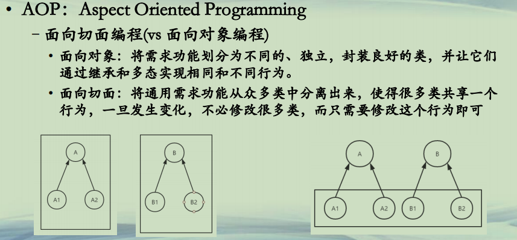
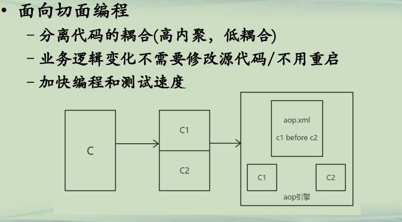

## AOP编程

**AOP(1)**  
**• AOP：Aspect Oriented Programming**  
**–面向切面编程(vs 面向对象编程)**  
**• 面向对象：将需求功能划分为不同的、独立，封装良好的类，并让它们通过继承和多态实现相同和不同行为。**  
**• 面向切面：将通用需求功能从众多类中分离出来，使得很多类共享一个行为，一旦发生变化，不必修改很多类，而只需要修改这个行为即可**  




**AOP(2)**  
**• 面向切面编程**  
**–分离代码的耦合(高内聚，低耦合)**  
**–业务逻辑变化不需要修改源代码/不用重启**  
**–加快编程和测试速度**  




**AOP(3)**  
**• 面向切面编程 **  
**–一个概念/规范，没有限定语言**  
**–*不是取代OOP编程，而是OOP的补充*，和数据库的触发器有点相似**  
**–主要内容**  
**• Aspect ：配置文件，包括一些Pointcut和相应的Advice**  
**• Joint point：在程序中明确定义的点，如方法调用、对类成员访问等**  
**• Pointcut：一组joint point, 可以通过逻辑关系/通配符/正则等组合起来，定义了相应advice将要发生的地方**  
**• Advice：定义了在pointcut处要发生的动作,通过before/after/around/来关联**  
**• weaving：advice代码在具体joint point的关联方式**  


**AOP(4)**  
**• 面向切面编程**  
**–Java的AOP实现**  
**• AspectJ(Eclipse)， https://www.eclipse.org/aspectj/**  
**• Spring AOP，https://spring.io/projects/spring-framework **  
**• 两者比较，https://www.baeldung.com/spring-aop-vs-aspectj **  


```java

│  aops.xml
│      
└─src
        Main.java
        Person.java
        PersonImpl.java
        ProxyHandler.java
        ResourceListener.java
        XmlReader.java
```


```java

public interface Person {

	void eat();
	void washHand();
	void bath();
}
```

```java

public class PersonImpl implements Person {

	public void eat() {
		System.out.println("I am eating");
	}

	public void washHand() {
		System.out.println("I am washing hands");

	}

	public void bath() {
		System.out.println("I am bathing");

	}

}
```

```java

import java.lang.reflect.InvocationHandler;
import java.lang.reflect.Method;
import java.util.Arrays;


public class ProxyHandler implements InvocationHandler {
	
	static String beforeMethod = "";
	static String afterMethod = "";
	
	private Person receiverObject;
	
	public ProxyHandler(Person object){
		this.receiverObject = object;
	}
	
	@Override
	public Object invoke(Object proxy, Method method, Object[] args) throws Throwable {
		//处理before方法
		if(beforeMethod!=null&&beforeMethod.length()>0){
			ClassLoader cl = ProxyHandler.class.getClassLoader();
			Class<?> c = cl.loadClass(receiverObject.getClass().getName());
			Method m=c.getMethod(beforeMethod);
			Object obj = c.newInstance();
			m.invoke(obj);
		}
		
		//处理目标方法
		Object result = method.invoke(receiverObject, args);
		
		//处理after方法
		if(afterMethod!=null&&afterMethod.length()>0){
			method.invoke(receiverObject, args);
			ClassLoader cl = ProxyHandler.class.getClassLoader();
			Class<?> c = cl.loadClass(receiverObject.getClass().getName());
			Method m=c.getMethod(afterMethod);
			Object obj = c.newInstance();
			m.invoke(obj);
		}
		return result;
	}

}
```

```java

import java.nio.file.FileSystems;
import java.nio.file.Path;
import java.nio.file.Paths;
import java.nio.file.StandardWatchEventKinds;
import java.nio.file.WatchEvent;
import java.nio.file.WatchKey;
import java.nio.file.WatchService;
import java.util.List;
import java.util.concurrent.ExecutorService;
import java.util.concurrent.Executors;

public class ResourceListener {

	private static ExecutorService fixedThreadPool=Executors.newCachedThreadPool();
    private WatchService ws;
    private String listenerPath;
    private ResourceListener(String path){
        try
        {
            ws=FileSystems.getDefault().newWatchService();
            this.listenerPath=path;
        }
        catch (Exception e)
        {
            e.printStackTrace();
        }
    }
    private void start(){
        fixedThreadPool.execute(new Listener(ws, listenerPath));
    }
    
    public static void addListener(String path){
    	try{
    		ResourceListener resourceListener=new ResourceListener(path);
            Path p=Paths.get(path);
            p.register(resourceListener.ws, StandardWatchEventKinds.ENTRY_MODIFY,StandardWatchEventKinds.ENTRY_DELETE,
                StandardWatchEventKinds.ENTRY_CREATE);
            resourceListener.start();
    	}
    	catch (Exception e){
    		e.printStackTrace();
    	}
    	
    }
    
    
    class Listener implements Runnable{

    	WatchService ws;
    	String listenerPath;
    	
    	Listener(WatchService ws,String listenerPath){
    		this.ws = ws;
    		this.listenerPath = listenerPath;
    	}
    	
		@Override
		public void run() {
			try {  
                while(true){  
                    WatchKey watchKey = ws.take();  
                    List<WatchEvent<?>> watchEvents = watchKey.pollEvents();  
                    for(WatchEvent<?> event : watchEvents){  
                    	String context = event.context().toString();//对象
                    	String kind = event.kind().toString();//变更类型
                    	if(context.equals("aops.xml")){
                    		if(kind.equals("ENTRY_MODIFY")){
                    			XmlReader.readXml(listenerPath+"/"+event.context());
                    		}
                    	}
                    }  
                    watchKey.reset();  
                }  
            } catch (InterruptedException e) {  
                e.printStackTrace();  
                try {
                    ws.close();
                } catch (Exception e1) {
                }
            }
		}
    	
    }
}

```

```java

import java.io.BufferedReader;
import java.io.File;
import java.io.FileReader;
import java.io.StringReader;

import javax.xml.parsers.DocumentBuilder;
import javax.xml.parsers.DocumentBuilderFactory;

import org.w3c.dom.Document;
import org.w3c.dom.Element;
import org.w3c.dom.Node;
import org.w3c.dom.NodeList;
import org.xml.sax.InputSource;

public class XmlReader {

	
	public static void readXml(String filePath){
		String xml = load(filePath);
		try{
			DocumentBuilderFactory dbFactory = DocumentBuilderFactory.newInstance();
			Document document;
			DocumentBuilder dbBuilder = dbFactory.newDocumentBuilder();
			StringReader sr = new StringReader(xml);		  
			InputSource is = new InputSource(sr);
			document = dbBuilder.parse(is);
			Element root = document.getDocumentElement();
			findMethod(root.getChildNodes());
		}
		catch(Exception e){
			e.printStackTrace();
		}
	}
	
	public static void findMethod(NodeList elementList){
		for (int i = 0; i < elementList.getLength(); i++) {
			Node elementNode = elementList.item(i);
			//System.out.println("allnode: "+elementNode.getNodeName());
			if (elementNode.getNodeType() == Node.ELEMENT_NODE) {
				Element element = (Element) elementNode;
				String name = element.getNodeName();
				if(name.equalsIgnoreCase("aop")){
					readMethod(element.getChildNodes());
				}
				else{
					findMethod(element.getChildNodes());
				}
			}
		}
	}
	
	private static void readMethod(NodeList elementList){
		String methodName = "";
		for (int i = 0; i < elementList.getLength(); i++) {
			Node elementNode = elementList.item(i);
			if (elementNode.getNodeType() == Node.ELEMENT_NODE) {
				Element element = (Element) elementNode;
				String name = element.getNodeName();
				if(name.equals("method")){
					if(methodName==null||methodName.length()==0)methodName = element.getFirstChild().getTextContent();
				}
				else if(name.equals("type")){
					String type = element.getFirstChild().getTextContent();
					if(type.equals("after")){
						ProxyHandler.afterMethod = methodName;
					}
					else{
						ProxyHandler.beforeMethod = methodName;
					}
					
				}
			}
		}
	}
	
	private static String load(String path){
		try{
			File file = new File(path);
	        FileReader reader = new FileReader(file);
	        BufferedReader bReader = new BufferedReader(reader);
	        StringBuilder sb = new StringBuilder();
	        String s = "";
	        while ((s =bReader.readLine()) != null) {
	            sb.append(s + "\n");
	            //System.out.println(s);
	        }
	        bReader.close();
	        return sb.toString();
		}
		catch(Exception e){
			e.printStackTrace();
		}
		return null;
	}

}
```

aops.xml:

```java
<aops>
   	<aop>
   		<method>washHand</method>
   		<type>before</type>
   		<method>eat</method>
   	</aop>
</aops>
```


**总结**  
**• 了解AOP编程思想**  
**• 了解代理在AOP中的作用**  