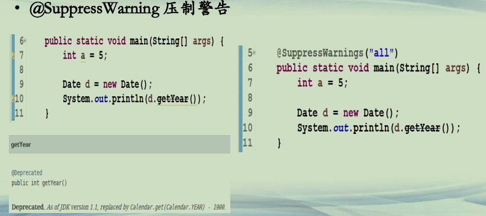
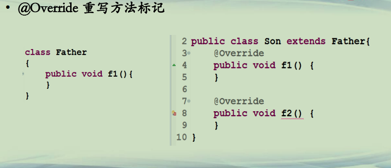
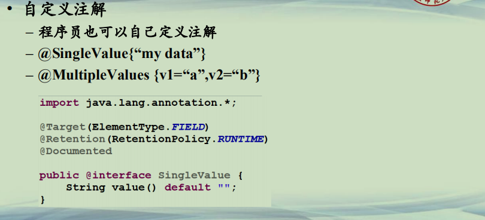

## 注解入门

**例子(1)**  
**• @SuppressWarning 压制警告**  

**例子(2)**  
**• @Override 重写方法标记**  

**注解(1)**  
**• 注解：Annotation**  
**–从JDK 1.5 引入**  
**–位于源码中(*代码/注释/注解*)，使用其他工具进行处理的标签 **  
**–注解用来修饰程序的元素，但不会对被修饰的对象有直接的影响**  
**–只有通过*某种配套的工具*才会对注解信息进行访问和处理**  
**–主要用途**  
**• 提供信息给编译器/IDE工具**  
**• 可用于其他工具来产生额外的代码/配置文件等**  
**• 有一些注解可在程序运行时访问，增加程序的动态性**  

**注解(2)**  
**• JDK预定义的普通注解(*部分*)**  
**–@Override 表示继承和改写 自带注解**  
**–@Deprecated 表示废弃 自带注解**  
**–@SuppressWarnings 表示压制警告 自带注解**  
**–@SafeVarargs 不会对不定项参数做危险操作 自带注解**  
**–@FunctionInterface 声明功能性接口 自带注解**  

**注解(3)**  
**• JDK预定义的元注解(*部分*) **  
**–@Target 设置目标范围 元注解**  
**–@Retention 设置保持性 元注解**  
**–@Documented 文档 元注解**  
**–@Inherited 注解继承 元注解**  
**–@Repeatable 此注解可以重复修饰 元注解**  

**注解(4)**  
**• 自定义注解**  
**– 程序员也可以自己定义注解**  
**– @SingleValue{“my data”}**  
**– @MultipleValues {v1=“a”,v2=“b”}**  

**总结**  
**• 了解注解的用途  **  
**• 了解Java的注解的分类**  
**–自带注解(标记注解、元注解)**  
**–自定义注解**  

