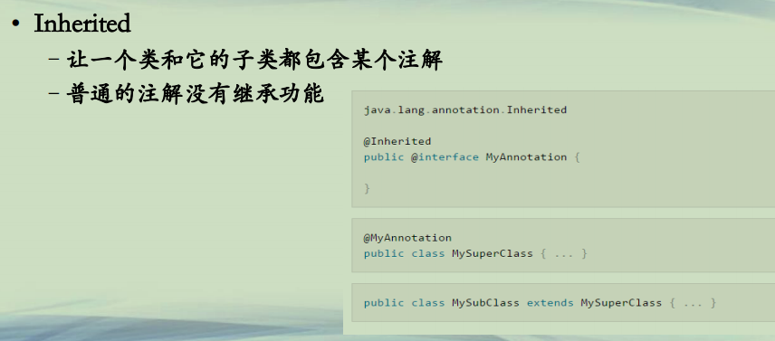
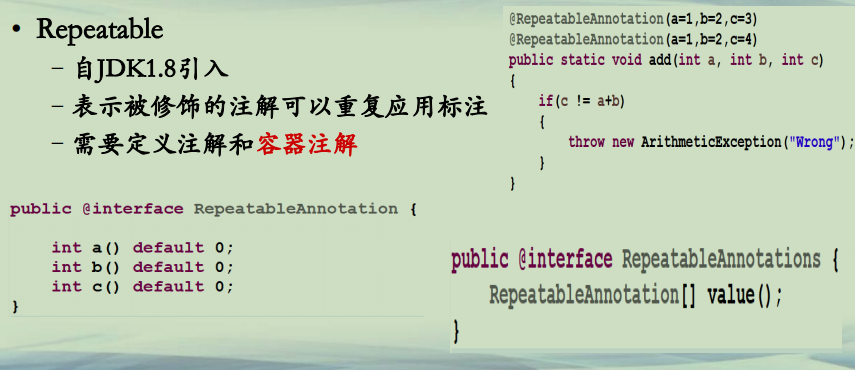
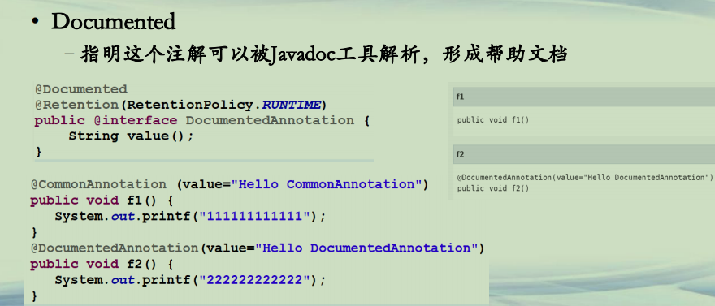

## Java预定义的元注解

**Java预定义的注解**  
**• JDK预定义的元注解(*部分*) **  
**–*元注解：修饰注解的注解***  
**–@Target 设置目标范围 元注解**  
**–@Retention 设置保持性 元注解**  
**–@Inherited 注解继承 元注解**  
**–@Repeatable 此注解可以重复修饰 元注解**  
**–@Documented 文档 元注解**  


**元注解(1)**  
**• Retention(保留)**  
**–示例：@Retention(RetentionPolicy.RUNTIME)**  
**–这个注解用来修饰其他注解的存在范围**  
**–RetentionPolicy.SOURCE 注解仅存在源码，不在class文件。**  
**–RetentionPolicy.CLASS 这是默认的注解保留策略。注解存在于.class文件，但是不能被JVM加载。**  
**–RetentionPolicy.RUNTIME 这种策略下，注解可以被JVM运行时访问到。通常情况下，可以结合反射来做一些事情。**   


**元注解(2)**  
**• Target**  
**–限定目标注解作用于什么位置@Target({ElementType.METHOD})**  
**–ElementType.ANNOTATION_TYPE（注：修饰注解）**  
**–ElementType.CONSTRUCTOR**  
**–ElementType.FIELD**  
**–ElementType.LOCAL_VARIABLE**  
**–ElementType.METHOD**  
**–ElementType.PACKAGE**  
**–ElementType.PARAMETER**  
**–ElementType.TYPE（注：任何类型，即上面的的类型都可以修饰）**  


**元注解(3)**  
**• Inherited**  
**–让一个类和它的子类都包含某个注解**  
**–普通的注解没有继承功能**  




**元注解(4)**  
**• Repeatable**  
**–自JDK1.8引入**  
**–表示被修饰的注解可以重复应用标注**  
**–需要定义注解和容器注解**  




**元注解(5)**  
**• Documented**  
**–指明这个注解可以被Javadoc工具解析，形成帮助文档**  




```java
└─src
    ├─document
    │      CommonAnnotation.java
    │      DocumentedAnnotation.java
    │      Main.java
    │      
    ├─inherits
    │      CommonAnnotation.java
    │      CommonFather.java
    │      CommonSon.java
    │      InheritAnnotation.java
    │      InheritFather.java
    │      InheritSon.java
    │      Main.java
    │      
    ├─repeatable
    │      CommonAnnotation.java
    │      Main.java
    │      RepeatableAnnotation.java
    │      RepeatableAnnotations.java
    │      Student.java
    │      
    ├─retentions
    │      A1.java
    │      A2.java
    │      B1.java
    │      B2.java
    │      C1.java
    │      C2.java
    │      ClassAnnotation.java
    │      Main.java
    │      RuntimeAnnotation.java
    │      SourceAnnotation.java
    │      
    └─targets
            FieldAnnotation.java
            FieldMethodAnnotation.java
            Main.java
            MethodAnnotation.java
```


retentions:

```java
package retentions;

@SourceAnnotation
public class A1 {

}
```

```java
package retentions;

public class A2 {

}
```

```java
package retentions;

@ClassAnnotation
public class B1 {

}
```

```java
package retentions;

public class B2 {

}
```

```java
package retentions;

@RuntimeAnnotation
public class C1 {

}
```

```java
package retentions;

public class C2 {

}
```

```java
package retentions;

import java.lang.annotation.*;

@Retention(RetentionPolicy.CLASS)
public @interface ClassAnnotation {

}
```

```java
package retentions;

import java.lang.annotation.*;

@Retention(RetentionPolicy.RUNTIME)
public @interface RuntimeAnnotation {

}
```

```java
package retentions;

import java.lang.annotation.*;

@Retention(RetentionPolicy.SOURCE)
public @interface SourceAnnotation {

}
```

```java
package retentions;

public class Main {
	public static void main(String[] a) throws Exception {
		// RetentionPolicy.SOURCE
		//注解不会保存到class文件中
		Class a1 = Class.forName("retentions.A1");
		Class a2 = Class.forName("retentions.A2");
		System.out.println(a1.getAnnotations().length);
		System.out.println(a2.getAnnotations().length);
		System.out.println("============1=============");

		// RetentionPolicy.CLASS
		// 注解会保存到class文件中，但是不会被JVM加载
		Class b1 = Class.forName("retentions.B1");
		Class b2 = Class.forName("retentions.B2");
		System.out.println(b1.getAnnotations().length);
		System.out.println(b2.getAnnotations().length);
		System.out.println("============2=============");

		// RetentionPolicy.RUNTIME
		// 注解会保存在class文件中，且会被JVM加载，反射识别
		Class c1 = Class.forName("retentions.C1");
		Class c2 = Class.forName("retentions.C2");
		System.out.println(c1.getAnnotations().length);
		System.out.println(c2.getAnnotations().length);
		System.out.println("============3=============");

	}
}
```


targets:

```java
package targets;

import java.lang.annotation.*;

@Target({ElementType.FIELD})
public @interface FieldAnnotation {

}
```

```java
package targets;

import java.lang.annotation.ElementType;
import java.lang.annotation.Target;

@Target({ElementType.METHOD})
public @interface MethodAnnotation {

}
```

```java
package targets;

import static java.lang.annotation.ElementType.FIELD;
import static java.lang.annotation.ElementType.METHOD;

import java.lang.annotation.Target;

@Target({ FIELD, METHOD })
public @interface FieldMethodAnnotation {

}
```

```java
package targets;

public class Main {

	@FieldAnnotation
	@FieldMethodAnnotation
	private String name;
	
	@MethodAnnotation
	@FieldMethodAnnotation
	public static void main(String[] args) {
		

	}
	
	@MethodAnnotation
	@FieldMethodAnnotation
	public static void f1()
	{
		
	}

}
```


repeatable：

```java
package repeatable;

import java.lang.annotation.Retention;
import java.lang.annotation.RetentionPolicy;

@Retention(RetentionPolicy.RUNTIME)
public @interface CommonAnnotation {

}
```

```java
package repeatable;

import java.lang.annotation.Repeatable;
import java.lang.annotation.Retention;
import java.lang.annotation.RetentionPolicy;

@Retention(RetentionPolicy.RUNTIME)
@Repeatable(RepeatableAnnotations.class)
public @interface RepeatableAnnotation {
	
	int a() default 0;
	int b() default 0;
	int c() default 0;
}

```

```java
package repeatable;

import java.lang.annotation.Retention;
import java.lang.annotation.RetentionPolicy;

@Retention(RetentionPolicy.RUNTIME)
public @interface RepeatableAnnotations {
	RepeatableAnnotation[] value();
}

```

```java
package repeatable;

public class Student {
	
	
	@RepeatableAnnotation(a=1,b=2,c=3)
	@RepeatableAnnotation(a=1,b=2,c=4)
	public static void add(int a, int b, int c)
	{
		if(c != a+b)
		{
			throw new ArithmeticException("Wrong");
		}
	}
}
```

```java
package repeatable;

import java.lang.reflect.Method;

@CommonAnnotation
@RepeatableAnnotation
@RepeatableAnnotation

public class Main {

	public static void main(String[] a) throws Exception
	{
		String className = "repeatable.Student";
		for (Method m : Class.forName(className).getMethods()) 
		{
			if (m.isAnnotationPresent(RepeatableAnnotations.class)) 
			{
				RepeatableAnnotation[] annos = m.getAnnotationsByType(RepeatableAnnotation.class);
				for (RepeatableAnnotation anno : annos) 
				{
					System.out.println(anno.a() + "," + anno.b() + "," + anno.c());
					try 
					{
						m.invoke(null,anno.a(),anno.b(),anno.c());
					} catch (Throwable ex) {
						System.out.printf("Test %s failed: %s %n", m, ex.getCause());
					}
				}			
			}
		}
	}
	
}

```


inherits：

```java
package inherits;

import java.lang.annotation.Retention;
import java.lang.annotation.RetentionPolicy;

@Retention(RetentionPolicy.RUNTIME)
public @interface CommonAnnotation {

}
```

```java
package inherits;

@CommonAnnotation
public class CommonFather {

}
```

```java
package inherits;

public class CommonSon extends CommonFather {

}
```

```java
package inherits;

import java.lang.annotation.Inherited;
import java.lang.annotation.Retention;
import java.lang.annotation.RetentionPolicy;

@Retention(RetentionPolicy.RUNTIME)
@Inherited
public @interface InheritAnnotation {

}
```

```java
package inherits;

@InheritAnnotation
public class InheritFather {

}
```

```java
package inherits;

public class InheritSon extends InheritFather{

}
```

```java
package inherits;

public class Main {

	public static void main(String[] args) throws Exception {
		Class a1 = Class.forName("inherits.CommonFather");
		Class a2 = Class.forName("inherits.CommonSon");
		System.out.println(a1.getAnnotations().length);  //1
		System.out.println(a2.getAnnotations().length);  //0
		
		
		Class a3 = Class.forName("inherits.InheritFather"); 
		Class a4 = Class.forName("inherits.InheritSon");    
		System.out.println(a3.getAnnotations().length);  //1
		System.out.println(a4.getAnnotations().length);  //1
		//Inherit注释过的Annotation，会保持继承

	}

}
```


document:

```java
package document;

import java.lang.annotation.Retention;
import java.lang.annotation.RetentionPolicy;

@Retention(RetentionPolicy.RUNTIME)
public @interface CommonAnnotation {
	String value();
}
```

```java
package document;

import java.lang.annotation.*;

@Documented
@Retention(RetentionPolicy.RUNTIME)
public @interface DocumentedAnnotation {
	String value();
}
```

```java
package document;

public class Main {

	public static void main(String arg[]) {
	      new Main().f1();
	      new Main().f2();
	   }
	   @CommonAnnotation (value="Hello CommonAnnotation")
	   public void f1() {
	      System.out.printf("111111111111");
	   }
	   @DocumentedAnnotation(value="Hello DocumentedAnnotation")
	   public void f2() {
	      System.out.printf("222222222222");
	   }
}
```


**总结**  
**• Java的预定义的元注解**  
***–元注解是用来修饰其他的注解***  
**–Retention是用来限定被修饰的注解的保存范围**  
**–Target是用来表示被修饰的注解的应用范围**  
**–Inherited是用来标志被修饰的注解的继承性**  
**–Repeatable使得被修饰的注解可重复应用**  
**–Documented标注被修饰的注解可以被Javadoc工具所解析**  


