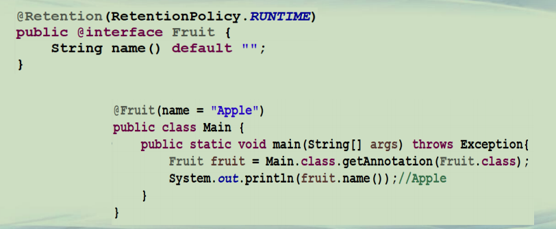
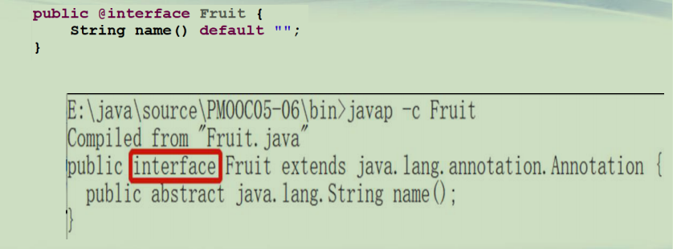
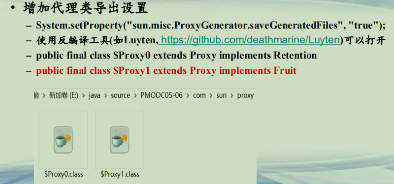
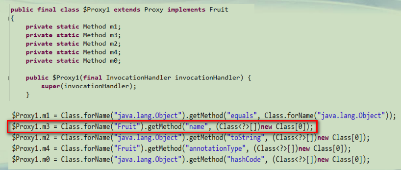
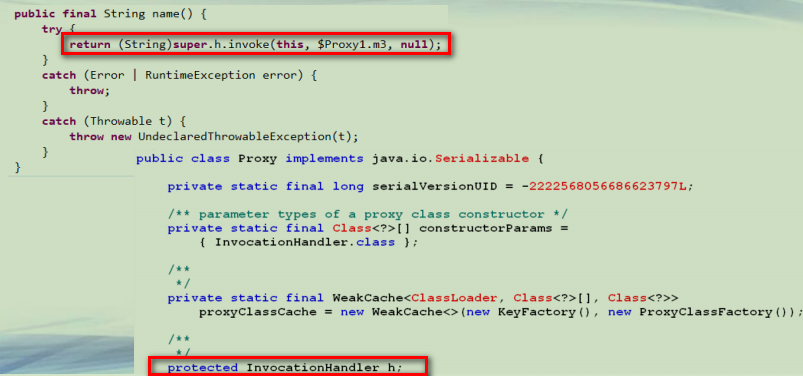
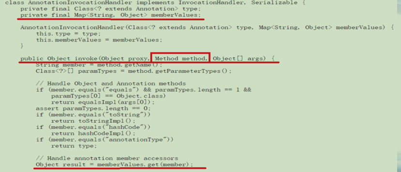

## RUNTIME注解的实现本质

**注解的分类**  
**• 注解：Annotation**  
**–位于源码中(*代码+注释+注解*)，使用其他工具进行处理的标签 **  
**–根据RetentionPolicy的不同，分成三种类型的注解：**  
**• SOURCE：注解在源码，不在class文件**  
**• CLASS：注解在源码和class文件中，但JVM不加载**  
**• RUNTIME：注解在源码和class文件中，JVM加载**  


**RUNTIME注解的实现本质(1)**




**RUNTIME注解的实现本质(2)**




**RUNTIME注解的实现本质(3)**


**RUNTIME注解的实现本质(4)**

**• 增加代理类导出设置**  
**– System.setProperty("sun.misc.ProxyGenerator.saveGeneratedFiles", "true");**  
**– 使用反编译工具(如Luyten, https://github.com/deathmarine/Luyten)可以打开**  
**– public final class $Proxy0 extends Proxy implements Retention**  
**– *public final class $Proxy1 extends Proxy implements Fruit***  




**RUNTIME注解的实现本质(5)**




**RUNTIME注解的实现本质(6)**




**RUNTIME注解的实现本质(7)**


**RUNTIME注解的实现本质(8)**




**RUNTIME注解调用路线**  
**• 注解采用接口中的方法来表示变量。**  
**• Java为注解产生一个代理类。这个代理类包括一个**  
**AnnotationInvocationHandler成员变量。**  
**• AnnotationInvocationHandler有一个Map的成员变量，用来存储所有的注解的属性赋值。**  
**• 在程序中，调用*注解接口的方法*，将会被*代理类*接管，然后根据*方法名字*，到*Map*里面拿*相应的Value*并返回。**  


**RUNTIME注解的设计思路**  
**• 传统的接口中的变量，都是public final static**  
**• 注解需要随意赋值**  
**–注解方法表示变量**  
**–采用代理类拦截注解方法访问**  
**–所有的注解的赋值，都放在Map中，访问速度快**  

```java
├─com
│  └─sun
│      └─proxy
│              $Proxy0.class
│              $Proxy1.class
│              
└─src
        Fruit.java
        Fruit2.java
        Fruit3.java
        Fruit3Test.java
        Main.java   
```


```java
import java.lang.annotation.*;

@Retention(RetentionPolicy.RUNTIME)
public @interface Fruit {
	String name() default "";
}
```

```java
import java.lang.annotation.*;

@Retention(RetentionPolicy.RUNTIME)
@Documented
@Target(ElementType.TYPE)

public @interface Fruit2 {
	String name() default "";
}
```

```java

public interface Fruit3 {
	String name = "Apple";
}

```

```java
import java.lang.reflect.Field;
import java.lang.reflect.Modifier;

public class Fruit3Test implements Fruit3 {

	public static void main(String[] args) throws Exception {
		System.out.println(Fruit3Test.name);
		//Fruit3Test.name = "Orange";  error
		
		Field f = Fruit3.class.getField("name");
		System.out.println(f.getModifiers()); //25=16+8+1
		
		System.out.println(Modifier.FINAL);  //16
		System.out.println(Modifier.STATIC); //8
		System.out.println(Modifier.PUBLIC); //1
	}

}
```

```java
import java.lang.reflect.Field;
import java.lang.reflect.InvocationHandler;
import java.lang.reflect.Proxy;
import java.util.Map;


@Fruit(name = "apple")
public class Main {
    public static void main(String[] args) throws Exception{
    	Fruit fruit = Main.class.getAnnotation(Fruit.class);
    	System.out.println(fruit.name());//Apple
    	
    	System.out.println(fruit.getClass().getName());
    	//com.sun.proxy.$Proxy1
    	System.out.println(fruit.getClass().getGenericInterfaces()[0]);
    	//interface Fruit
    	
    	System.setProperty("sun.misc.ProxyGenerator.saveGeneratedFiles", "true");
    	InvocationHandler h = Proxy.getInvocationHandler(fruit);
        System.out.println(h.getClass().getName());
        //sun.reflect.annotation.AnnotationInvocationHandler
        
        Field f = h.getClass().getDeclaredField("memberValues");
        f.setAccessible(true);
        
        Map memberValues = (Map) f.get(h);  
        
        //only contain "name" key
        for(Object o : memberValues.keySet())
        {
        	System.out.println(o.toString());
        }
        
        //change the value of "name" key
        memberValues.put("name", "Pear");
        System.out.println(fruit.name()); //Pear
    }
}


```


**总结**  
**• 注解是程序中*特殊的元素***  
**• 如果RUNTIME注解被JVM加载进来，Java可以用反射获取到注解内容**  
**–程序自动为注解产生一个代理类，来拦截注解的方法访问**  
**–代理类有一个AnnotationInvocationHandler成员变量，其内部存放所有的注解的赋值**  


