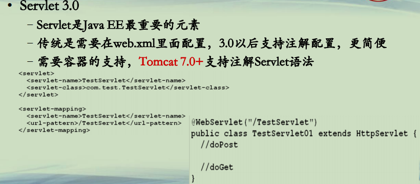
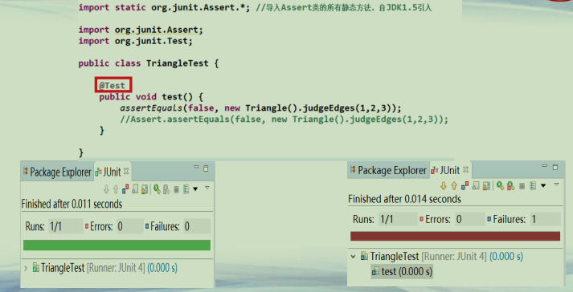
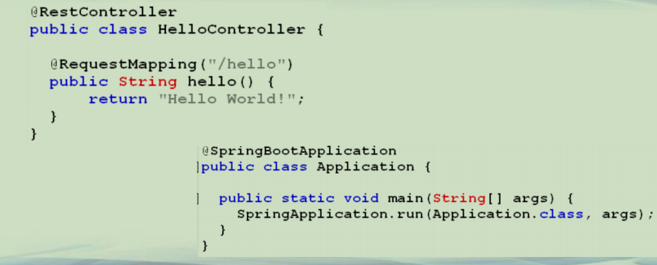
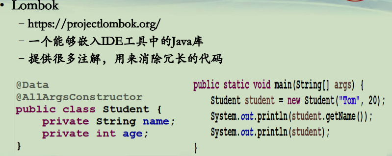

## 注解的应用

**注解**  
**• 注解：Annotation**  
**–自JDK 1.5引入**  
**–位于源码中(*代码+注释+注解*)，使用其他工具进行处理的标签**  
**–提供了额外的程序，增加了自由度，迅速被广大框架所接受**  
**–已经成为各种框架程序的标配**  
**–程序员需要*了解并熟练使用*各种框架提供的新注解 **  

**Servlet 3.0的配置**  
**• Servlet 3.0**  
**–Servlet是Java EE最重要的元素**  
**–传统是需要在web.xml里面配置，3.0以后支持注解配置，更简便**  
**–需要容器的支持，Tomcat 7.0+支持注解Servlet语法**  

**JUnit**

**Spring & Spring Boot**  

**Lombok**  
**• Lombok**  
**–https://projectlombok.org/**  
**–一个能够嵌入IDE工具中的Java库**  
**–提供很多注解，用来消除冗长的代码**  

**总结**  
**• 注解**  
**–已经成为很多框架的标配**  
**–需要了解注解的用法，更要理解它的原理**  
**–不要滥用，特别是大团队使用多个框架/第三方库的兼容协调**  
**–要注意第三方软件升级所带来的注解差异**  

