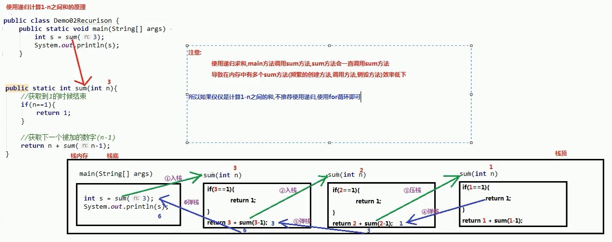
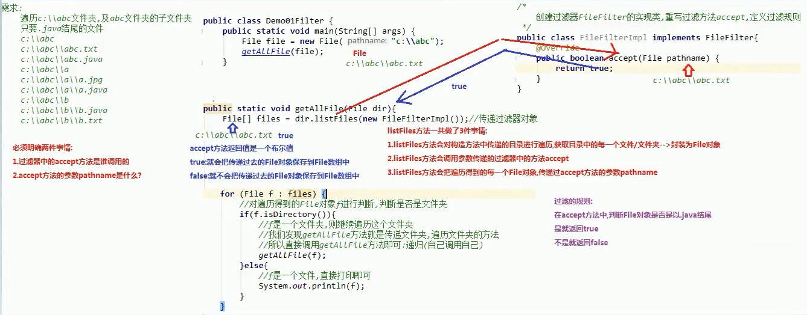

# 一、File类

## 1.1概述

`java.io.File`类是文件和目录路径名的抽象表示，主要用于文件和目录的创建，查找和删除等操作。

## 1.2构造方法

- - 

- - 

- - 

- - 

- 构造函数，代码如下

  ```java
  package com.wck.demo01.file;
  
  import java.io.File;
  
  /**
   * @author 御香烤翅
   * @create 2020-03-24 17:59
   *
   * 路径
   *      绝对路径：是一个完整的路径
   *      相对路径：是一个简化路径
   * 注意：路径不区分大小写
   */
  public class Demo02File {
      public static void main(String[] args) {
  //        show01();
  //        show02("d:","a.txt");   
          show03();
      }
  
      /**
       * File(File parent, String child)
       * 从父抽象路径名和子路径名字符串创建新的 File实例。
       *
       */
      private static void show03() {
  
          File parent =new File("d:");
          File file = new File(parent, "a.txt");
          System.out.println(file);
  
      }
  
      /**
       * File(String parent, String child)
       * 从父路径名字符串和子路径名字符串创建新的 File实例。
       *      String parent 父路径
       *      String child 子路径
       *
       *
       */
  
      private static void show02(String parent, String child) {
  
          File file = new File(parent, child);
          System.out.println(file);
      }
  
      /**
       * File(String pathname) 通过将给定路径名称字符串转换为抽象路径来创建一个新的File类
       * 参数： String pathname ：
       *          字符串的路径名称
       *          路径可以是以文件结尾，也可以是文件夹结尾
       *          路径可以是相对路径，也可以是绝对路径
       *          路径可以是存在的，也可以是不存在的
       *          创建File对象，只是把字符串路径转换为File对象，不考虑路径的真假情况
       */
      private static void show01() {
          //文件
          File file = new File("D:\\ideaProject\\java-io\\IOTest\\b.txt");
          System.out.println(file);
  
          //文件夹
          File file2 = new File("D:\\ideaProject\\java-io\\IOTest\\");
          System.out.println(file2);
  
          //相对文件
          File file3 = new File("c.txt");
          System.out.println(file3);
      }
  
  
  }
  
  ```

  

## 1.3 常用方法

### 获取功能的方法

- `public String getAbsolutePath()` ：返回此File的绝对路径名字符串。

- `public String getPath()` ：将此File转换为路径名字符串。

- `public String getName()` ：返回由此File表示的文件或目录的名称。

- `public long length()` ：返回由此File表示的文件的长度。


```java
package com.wck.demo01.file;

import java.io.File;

/**
 * @author 御香烤翅
 * @create 2020-03-24 18:52
 *
 *  File类获取功能的方法
 * public String getAbsolutePath() ：返回此File的绝对路径名字符串。
 *
 * public String getPath() ：将此File转换为路径名字符串。
 *
 * public String getName() ：返回由此File表示的文件或目录的名称。
 *
 * public long length() ：返回由此File表示的文件的长度。
 */

public class Demo03File {

    public static void main(String[] args) {
        
        show04();
        System.out.println("-------------------");
        show03();
        System.out.println("-------------------");
        show02();
        System.out.println("-------------------");
        show01();
        
    }

    /**
     * public long length() ：返回由此File表示的文件的长度。
     * 获取的是构造方法指定的文件的大小，以字节为单位
     * 注意：
     *      文件夹是没有大小概念的，不能获取文件夹的大小
     *      如果构造方法中给出的文件路径不存在，则 length() 返回 0
     */
    private static void show04() {
        //存在 不存在的返回 0
        File file = new File("D:\\ideaProject\\java-io\\IOTest\\a.txt");
        long length = file.length();
        System.out.println(length); // 4

        //文件夹
        File file2 = new File("D:\\ideaProject\\java-io\\IOTest");
        long length1 = file2.length();
        System.out.println(length1); //0

    }

    /**
     * public String getName() ：返回由此File表示的文件或目录的名称。
     * 获取的就是构造方法传递路径的结尾部分（文件、文件夹）
     */
    private static void show03() {

        File file = new File("D:\\ideaProject\\java-io\\IOTest\\b.txt");
        File file1 = new File("D:\\ideaProject\\java-io\\IOTest");
        String name = file.getName();
        String name1 = file1.getName();
        System.out.println(name);//b.txt
        System.out.println(name1);//IOTest
    }

    /**
     *  public String getPath() ：将此File转换为路径名字符串
     *  原样输出，传递的是什么样，就输出什么样
     */
    private static void show02() {
        File file = new File("D:\\ideaProject\\java-io\\IOTest\\b.txt");
        File file1 = new File("a.txt");
        String path = file.getPath();
        String path1 = file1.getPath();
        System.out.println(path);//D:\ideaProject\java-io\IOTest\b.txt
        System.out.println(path1);//a.txt

        //toString方法调用的就是 getPath()方法
        System.out.println(file.toString());//D:\ideaProject\java-io\IOTest\b.txt
    }

    /**
     * public String getAbsolutePath() ：返回此File的绝对路径名字符串。
     * 获取绝对路径
     */
    private static void show01() {
        File file = new File("D:\\ideaProject\\java-io\\IOTest\\b.txt");
        String absolutePath = file.getAbsolutePath();
        System.out.println(absolutePath);//D:\ideaProject\java-io\IOTest\b.txt

        File file1 = new File("a.txt");
        String absolutePath1 = file1.getAbsolutePath();
        System.out.println(absolutePath1);//D:\ideaProject\java-io\javaIO\a.txt
    }
}

```

### 判断功能的方法

- `public boolean exists()` ：此File表示的文件或目录是否实际存在。
- `public boolean isDirectory()` ：此File表示的是否为目录。
- `public boolean isFile()` ：此File表示的是否为文件。

```java
package com.wck.demo01.file;

import java.io.File;

/**
 * @author 御香烤翅
 * @create 2020-03-24 19:20
 *
 *
 * 判断功能的方法
 * public boolean exists() ：此File表示的文件或目录是否实际存在。
 * public boolean isDirectory() ：此File表示的是否为目录。
 * public boolean isFile() ：此File表示的是否为文件。
 */
public class Demo04File {

    public static void main(String[] args) {
        show02();
    }

    /**
     * public boolean isDirectory() ：此File表示的是否为目录。
     *  判断是否是以文件夹结尾 是 true 不是 false
     * public boolean isFile() ：此File表示的是否为文件。
     *  判断是否是以文件结尾 是 true 不是 false
     *
     *  两个判断如果路径都不存在，则返回 是 false
     *
     */
    private static void show02() {
        File file = new File("D:\\ideaProject\\java-io\\IOTest");
        boolean b = file.isDirectory();
        System.out.println(b);//true

        //不存在的路径
        File file1 = new File("D:\\ideaProject\\java-io\\IOTest\\c.txt");
        boolean b1 = file1.isDirectory();
        System.out.println(b1);//false

    }

    /**
     * public boolean exists() ：此File表示的文件或目录是否实际存在。
     *  用于判断构造方法中的路径是否存在
     *  存在 true
     *  不存在 false
     *
     */
    private static void show01() {
        //存在 的路径
        File file = new File("D:\\ideaProject\\java-io\\IOTest\\a.txt");
        boolean exists = file.exists();
        System.out.println(exists);//true

        //不存在的路径
        File file1 = new File("D:\\ideaProject\\java-io\\IOTest\\c.txt");
        boolean exists1 = file1.exists();
        System.out.println(exists1);//false


    }

}

```


### 创建删除功能的方法

- `public boolean createNewFile()` ：当且仅当具有该名称的文件尚不存在时，创建一个新的空文件。
- `public boolean delete()` ：删除由此File表示的文件或目录。
- `public boolean mkdir()` ：创建由此File表示的目录。
- `public boolean mkdirs()` ：创建由此File表示的目录，包括任何必需但不存在的父目录。

```java
package com.wck.demo01.file;

import java.io.File;
import java.io.IOException;

/**
 * @author 御香烤翅
 * @create 2020-03-24 19:34
 *
 * public boolean createNewFile() ：当且仅当具有该名称的文件尚不存在时，创建一个新的空文件。
 * public boolean delete() ：删除由此File表示的文件或目录。
 * public boolean mkdir() ：创建由此File表示的目录。
 * public boolean mkdirs() ：创建由此File表示的目录，包括任何必需但不存在的父目录。
 * 
 */
public class Demo05File {

    public static void main(String[] args) throws IOException {
        show03();
    }

    /**
     * public boolean delete() ：删除由此File表示的文件或目录。
     *  既可以删除文件，也可以删除文件夹
     *  true:文件、文件夹删除成功 返回true
     *  false：
     *      文件夹中有内容，不会删除，返回false
     *      构造方法中的路径不存在，返回 false
     *
     *  delete 直接在硬盘上删除，不走回收站
     */
    private static void show03() {
        File file1 = new File("ioTestDir/a/b/c/abc.txt");
        boolean delete = file1.delete();
        System.out.println(delete);

    }

    /**
     *  public boolean mkdir() ：创建由此File表示的目录
     *      创建单级的空文件夹
     *  public boolean mkdirs() ：创建由此File表示的目录，包括任何必需但不存在的父目录。
     *      既可以创建单级的文件夹，也可以创建多级的文件夹
     *  创建文件夹 如果不存在 则创建 返回 true
     *  创建文件夹 如果存在 则不创建 返回 false
     *
     *   注意事项：
     *      构造方法中给出的路径不存在创建返回false
     *      只能创建文件夹，不能创建文件
     *      创建的路径必须存在，否则会报异常
     */
    private static void show02() {

        //文件夹不存在的情况下，创建成功
        File file = new File("ioTestDir");
        boolean mkdir = file.mkdir();
        System.out.println(mkdir);//true

        //创建多级文件夹，且文件夹 不存在
        File file1 = new File("ioTestDir/a/b/c");
        boolean mkdirs = file1.mkdirs();
        System.out.println(mkdirs);//true

        //这个也是为true 创建了一个 abc.txt的文件夹
        File file2 = new File("ioTestDir/a/b/c/abc.txt");
        boolean mkdirs2 = file2.mkdirs();
        System.out.println(mkdirs2);//true

        //不存在的路径,也会创建
        File file3 = new File("aaar/ccc.txt");
        boolean mkdirs3 = file3.mkdirs();
        System.out.println(mkdirs3);//true
    }

    /**
     * public boolean createNewFile() ：当且仅当具有该名称的文件尚不存在时，创建一个新的空文件。
     *  创建文件 如果不存在 则创建 返回 true
     *  创建文件 如果存在 则不创建 返回 false
     *
     *  注意：
     *      此方法只能创建文件，不能创建文件夹
     *      创建文件的路径必须存在，否则会抛出异常
     */
    private static void show01() throws IOException {

        //路径正确，不存在的文件
        File file = new File("D:\\ideaProject\\java-io\\IOTest\\1.txt");
        boolean newFile = file.createNewFile();
        System.out.println(newFile);//true

        //再次创建
        File file1 = new File("D:\\ideaProject\\java-io\\IOTest\\1.txt");
        boolean newFile2 = file1.createNewFile();
        System.out.println(newFile2);//false
    }
}

```


## 1.4 目录的遍历

- `public String[] list()` ：返回一个String数组，表示该File目录中的所有子文件或目录。
- `public File[] listFiles()` ：返回一个File数组，表示该File目录中的所有的子文件或目录。

```java
package com.wck.demo01.file;

import java.io.File;

/**
 * @author 御香烤翅
 * @create 2020-03-24 20:21
 *
 * public String[] list() ：返回一个String数组，表示该File目录中的所有子文件或目录。
 *
 * public File[] listFiles() ：返回一个File数组，表示该File目录中的所有的子文件或目录。
 *
 * 注意
 *    如果给出的目录不存在，则抛出空指针异常
 *    如果给出的目录是一个目录，则抛出空指针异常
 */
public class Demo06File {

    public static void main(String[] args) {
        show02();
    }

    /**
     * public File[] listFiles() ：返回一个File数组，表示该File目录中的所有的子文件或目录。
     * 遍历给出的目录，会获取目录中所有文件夹、文件的名称，把获取到的多个名称存储到一个File类型的数组中
     *  注意
     *     如果给出的目录不存在，则抛出空指针异常
     *     如果给出的目录是一个目录，则抛出空指针异常
     */
    private static void show02() {
        File file1 = new File("ioTestDir");
        File[] list = file1.listFiles();
        for (File f : list) {
            System.out.println(f);
        }

    }

    /**
     * public String[] list() ：返回一个String数组，表示该File目录中的所有子文件或目录。
     *
     * 遍历给出的目录，会获取目录中所有文件夹、文件的名称，把获取到的多个名称存储到一个String类型的数组中
     * 可以获取隐藏的文件和文件夹
     *  注意
     *     如果给出的目录不存在，则抛出空指针异常
     *     如果给出的目录是一个目录，则抛出空指针异常
     */
    private static void show01() {
        File file1 = new File("ioTestDir");
        String[] list = file1.list();
        for (String s : list) {
            System.out.println(s);
        }
    }
}

```

# 二、递归

## 2.1 概述

- **递归**：指在当前方法内调用自己的这种现象。

- **递归的分类**:
  - 递归分为两种，直接递归和间接递归。
  - 直接递归称为方法自身调用自己。
  - 间接递归可以A方法调用B方法，B方法调用C方法，C方法调用A方法。

- **注意事项**：
  - 递归一定要有条件限定，保证递归能够停止下来，否则会发生栈内存溢出。
  - 在递归中虽然有限定条件，但是递归次数不能太多。否则也会发生栈内存溢出。
  - 构造方法,禁止递归

```java
package com.wck.demo02;

/**
 * @author 御香烤翅
 * @create 2020-03-24 20:42
 */
public class Demo01DiGui {

    public static void main(String[] args) {
        // a();
        b(1);
    }

    /*
     * 3.构造方法,禁止递归
     * 编译报错:构造方法是创建对象使用的,不能让对象一直创建下去
     */
    public Demo01DiGui() {
        //Demo01DiGui();
    }


    /*
     * 2.在递归中虽然有限定条件，但是递归次数不能太多。否则也会发生栈内存溢出。
     * 4993
     * 	Exception in thread "main" java.lang.StackOverflowError
     */
    private static void b(int i) {
        System.out.println(i);
        //添加一个递归结束的条件,i==5000的时候结束
        if(i==5000){
            return;//结束方法
        }
        b(++i);
    }

    /*
     * 1.递归一定要有条件限定，保证递归能够停止下来，否则会发生栈内存溢出。 Exception in thread "main"
     * java.lang.StackOverflowError
     */
    private static void a() {
        System.out.println("a方法");
        a();
    }
}

```


## 2.2 递归累加求和

### 计算1 ~ n的和

**分析**：num的累和 = num + (num-1)的累和，所以可以把累和的操作定义成一个方法，递归调用。



```java
package com.wck.demo02;

/**
 * @author 御香烤翅
 * @create 2020-03-24 20:44
 *
 * 使用递归计算 1~n 的和
 */
public class Demo02DiGui {

    public static void main(String[] args) {

        int sum = sum(3);
        System.out.println(sum);
    }

    /**
     * 定义 一个方法，计算  1~n的和
     *
     *      1+2+3+4+...+n
     * 等价于
     *      n+(n-1)+(n-2)+...+1
     *
     * 使用递归必须明确
     *      1.递归的结束条件
     *            获取到1 的时候结束
     *      2.递归的目的
     *            获取下一个被加的数字（n-1）
     */

    public static int sum(int n){
        //判断到1的时候结束
        if(n == 1){
            return 1;
        }
        //获取下一个被加的数字 (n-1)
        return n+sum(n-1);
    }
}

```

## 2.3 递归求阶乘

- **阶乘**：所有小于及等于该数的正整数的积。

  - n的阶乘：n! = n * (n-1) *...* 3 * 2 * 1

  - 推理得出：n! = n * (n-1)!
  - **分析**：这与累和类似,只不过换成了乘法运算，需要注意阶乘值符合int类型的范围。

```java
package com.wck.demo02;

/**
 * @author 御香烤翅
 * @create 2020-03-24 21:05
 *  n的阶乘：n! = n * (n-1) *...* 3 * 2 * 1
 *  推理得出：n! = n * (n-1)!
 *  **分析**：这与累和类似,只不过换成了乘法运算，学员可以自己练习，需要注意阶乘值符合int类型的范围。
 */
public class Demo03DiGui {

    public static void main(String[] args) {
        int value = getValue(3);
        System.out.println(value);
    }

    private static int getValue(int n) {
        if(n == 1){
            return 1;
        }
        return n*(n-1);
    }
}

```

## 2.4 递归打印多级目录

**分析**：多级目录的打印，就是当目录的嵌套。遍历之前，无从知道到底有多少级目录，所以我们还是要使用递归实现。

```java
package com.wck.demo02;

import java.io.File;

/**
 * @author 御香烤翅
 * @create 2020-03-24 21:09
 */
public class Demo04DiGui {
    public static void main(String[] args) {
        getAllFile(new File("ioTestDir"));
    }
    private static void getAllFile(File dir) {
        System.out.println(dir);
        if(!dir.exists()){
            System.out.println("不存在的目录");
            return;
        }
        File[] files = dir.listFiles();
        for (File file : files) {
            if(file.isDirectory()){
                getAllFile(file);
            }else {
                System.out.println(file);
            }
        }
    }
}

```

# 三、 综合案例

## 3.1 文件搜索

搜索`D:\aaa` 目录中的`.java` 文件。

**分析**：

1. 目录搜索，无法判断多少级目录，所以使用递归，遍历所有目录。
2. 遍历目录时，获取的子文件，通过文件名称，判断是否符合条件。

```java
package com.wck.demo02;

import java.io.File;

/**
 * @author 御香烤翅
 * @create 2020-03-24 21:09
 */
public class Demo05DiGui {
    public static void main(String[] args) {
        getAllFile(new File("ioTestDir"));
    }
    private static void getAllFile(File dir) {
        //System.out.println(dir);
        if(!dir.exists()){
            System.out.println("不存在的目录");
            return;
        }
        File[] files = dir.listFiles();
        for (File file : files) {
            if(file.isDirectory()){
                getAllFile(file);
            }else {
                String s = file.getName();
//                System.out.println(s);
                if(s.endsWith(".java")){
                    System.out.println(file);
                }
            }
        }
    }
}

```

## 3.2 文件过滤器优化

`java.io.FileFilter`是一个接口，是File的过滤器。 该接口的对象可以传递给File类的`listFiles(FileFilter)` 作为参数， 接口中只有一个方法。

`boolean accept(File pathname)` ：测试pathname是否应该包含在当前File目录中，符合则返回true。

分析：

- 接口作为参数，需要传递子类对象，重写其中方法。我们选择匿名内部类方式，比较简单。
- accept方法，参数为File，表示当前File下所有的子文件和子目录。保留住则返回true，过滤掉则返回false。保留规则：
  - 要么是.java文件。
  - 要么是目录，用于继续遍历。

- 通过过滤器的作用，`listFiles(FileFilter)`返回的数组元素中，子文件对象都是符合条件的，可以直接打印。



```java
package com.wck.demo03;

import java.io.File;

/**
 * @author 御香烤翅
 * @create 2020-03-24 22:10
 * listFiles(FileFilter filter)
 * 返回一个抽象路径名(File)数组，表示由此抽象路径名表示的满足指定过滤器的目录中的文件和目录。
 *      java.io.FileFilter接口
 *          作用：用来过滤文件（File对象）
 *          抽象方法：用来过滤文件的方法
 *             boolean accept(File pathname)测试指定的抽象路径名是否应包含在路径名列表中
 *                  参数 File pathname：就是使用listFiles方法遍历目录，得到的每一个文件对象
 *
 * list(FilenameFilter filter)
 * 返回一个字符串数组，命名由此抽象路径名表示的目录中满足指定过滤器的文件和目录。
 *      java.io.FilenameFilter接口 ：用于实现此接口的类的实例用于过滤文件名。
 *          作用：用来过滤文件名称
 *          抽象方法：用来过滤文件的方法
 *              boolean accept(File dir, String name)测试指定文件是否应包含在文件列表中。
 *                  参数
 *                      File dir：构造方法中传递的被遍历的目录
 *                      String name：使用listFiles方法遍历目录，获取的每一个文件/文件夹的名称
 *  注意：两个接口是没有实现类的，需要我们自己写实现类，重写过滤的方法accept，在方法中自己定义过滤的规则
 */
public class Demo01Filter {

    public static void main(String[] args) {
        getAllFile(new File("ioTestDir"));
    }

    private static void getAllFile(File dir) {
//        System.out.println(dir);
        if(!dir.exists()){
            System.out.println("不存在的目录");
            return;
        }
        File[] files = dir.listFiles(new FileFilterImpl());
        for (File file : files) {
            if(file.isDirectory()){
                getAllFile(file);
            }else {
                System.out.println(file);
            }
        }


    }
}

```

```java
package com.wck.demo03;

import java.io.File;
import java.io.FileFilter;

/**
 * @author 御香烤翅
 * @create 2020-03-24 22:24
 * 创建过滤器FileFilter的实现类，重写accept，定义过滤规则
 */
public class FileFilterImpl implements FileFilter {
    @Override
    public boolean accept(File pathname) {
//        System.out.println("pathname:"+pathname);
        if(pathname.isDirectory()){
            return true;
        }
        return pathname.getName().toLowerCase().endsWith(".java");
    }
}

```

## 3.3 Lambda优化

**分析：**`FileFilter`是只有一个方法的接口，因此可以用lambda表达式简写。

lambda格式：

```java
()->{ }
```

```java
package com.wck.demo03;

import java.io.File;
import java.io.FileFilter;
import java.io.FilenameFilter;

/**
 * @author 御香烤翅
 * @create 2020-03-24 22:10
 * listFiles(FileFilter filter)
 * 返回一个抽象路径名(File)数组，表示由此抽象路径名表示的满足指定过滤器的目录中的文件和目录。
 *      java.io.FileFilter接口
 *          作用：用来过滤文件（File对象）
 *          抽象方法：用来过滤文件的方法
 *             boolean accept(File pathname)测试指定的抽象路径名是否应包含在路径名列表中
 *                  参数 File pathname：就是使用listFiles方法遍历目录，得到的每一个文件对象
 *
 * list(FilenameFilter filter)
 * 返回一个字符串数组，命名由此抽象路径名表示的目录中满足指定过滤器的文件和目录。
 *      java.io.FilenameFilter接口 ：用于实现此接口的类的实例用于过滤文件名。
 *          作用：用来过滤文件名称
 *          抽象方法：用来过滤文件的方法
 *              boolean accept(File dir, String name)测试指定文件是否应包含在文件列表中。
 *                  参数
 *                      File dir：构造方法中传递的被遍历的目录
 *                      String name：使用listFiles方法遍历目录，获取的每一个文件/文件夹的名称
 *  注意：两个接口是没有实现类的，需要我们自己写实现类，重写过滤的方法accept，在方法中自己定义过滤的规则
 */
public class Demo02Filter {

    public static void main(String[] args) {
        getAllFile(new File("ioTestDir"));
    }

    private static void getAllFile(File dir) {
//        System.out.println(dir);
        if(!dir.exists()){
            System.out.println("不存在的目录");
            return;
        }
        //使用匿名内部类
/*        File[] files = dir.listFiles(new FileFilter() {
            @Override
            public boolean accept(File pathname) {
                return pathname.isDirectory() || pathname.getName().toLowerCase().endsWith(".java");
            }
        });*/

        //使用lamda表达式简化
/*        File[] files =dir.listFiles((File pathname)->{
            return pathname.isDirectory() || pathname.getName().toLowerCase().endsWith(".java");
        });*/

        //使用lamda继续简化
        //File[] files = dir.listFiles(pathname ->pathname.isDirectory() || pathname.getName().toLowerCase().endsWith(".java") );


        //使用匿名内部类

/*        File[] files = dir.listFiles(new FilenameFilter() {
            @Override
            public boolean accept(File dir, String name) {
                return new File(dir, name).isDirectory() || name.toLowerCase().endsWith(".java");
            }
        });*/

        //使用lamda简化
/*        File[] files = dir.listFiles((File dir1, String name)->{
            return new File(dir1, name).isDirectory() || name.toLowerCase().endsWith(".java");
        });*/

        //使用lamda继续简化
        File[] files=dir.listFiles((dir1,name)->new File(dir1, name).isDirectory() || name.toLowerCase().endsWith(".java"));

        for (File file : files) {
            if(file.isDirectory()){
                getAllFile(file);
            }else {
                System.out.println(file);
            }
        }
    }
}

```

