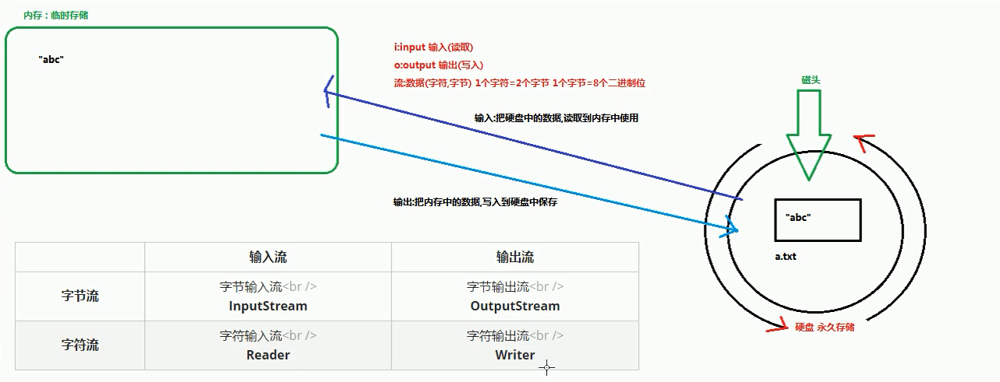
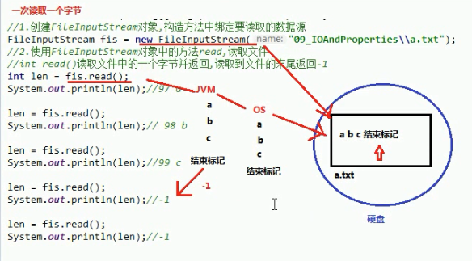
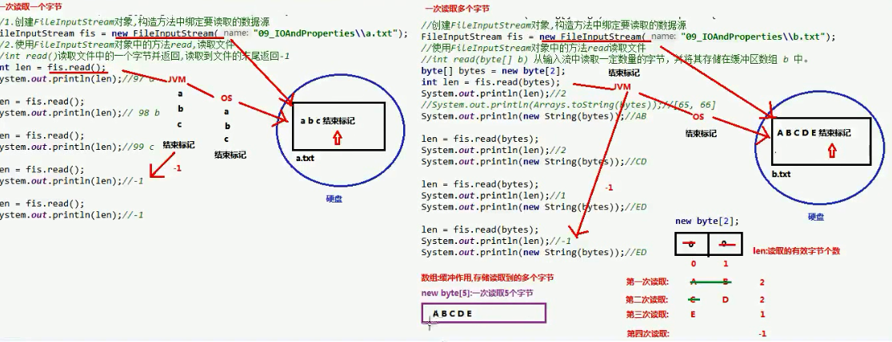
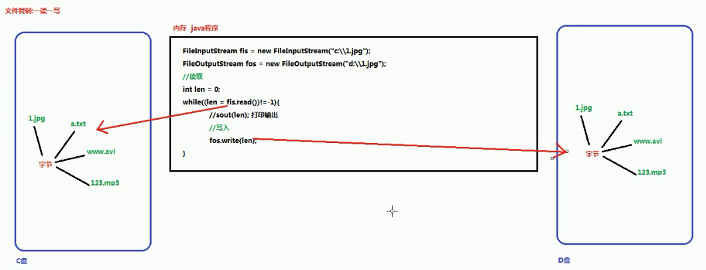

# 一、 IO概述（主要点IO流-字节流-字符流-Properties）

## 1.1 什么是IO

生活中，你肯定经历过这样的场景。当你编辑一个文本文件，忘记了`ctrl+s` ，可能文件就白白编辑了。当你电脑上插入一个U盘，可以把一个视频，拷贝到你的电脑硬盘里。那么数据都是在哪些设备上的呢？键盘、内存、硬盘、外接设备等等。

我们把这种数据的传输，可以看做是一种数据的流动，按照流动的方向，以内存为基准，分为`输入input` 和`输出output` ，即流向内存是输入流，流出内存的输出流。

Java中I/O操作主要是指使用`java.io`包下的内容，进行输入、输出操作。**输入**也叫做**读取**数据，**输出**也叫做作**写出**数据。

## 1.2 IO的分类

根据数据的流向分为：**输入流**和**输出流**。

- **输入流** ：把数据从`其他设备`上读取到`内存`中的流。
- **输出流** ：把数据从`内存` 中写出到`其他设备`上的流。

格局数据的类型分为：**字节流**和**字符流**。

- **字节流** ：以字节为单位，读写数据的流。
- **字符流** ：以字符为单位，读写数据的流。

## 1.3 IO的流向说明图解




## 1.4 顶级父类们

|            | **输入流**                 | 输出流                      |
| ---------- | -------------------------- | --------------------------- |
| **字节流** | 字节输入流 **InputStream** | 字节输出流 **OutputStream** |
| **字符流** | 字符输入流 **Reader**      | 字符输出流 **Writer**       |

# 二、字节流

## 2.1 一切皆为字节

一切文件数据(文本、图片、视频等)在存储时，都是以二进制数字的形式保存，都一个一个的字节，那么传输时一样如此。所以，字节流可以传输任意文件数据。在操作流的时候，我们要时刻明确，无论使用什么样的流对象，底层传输的始终为二进制数据。

## 2.2 字节输出流【OutputStream】

`java.io.OutputStream`抽象类是表示字节输出流的所有类的超类，将指定的字节信息写出到目的地。它定义了字节输出流的基本共性功能方法。

- `public void close()` ：关闭此输出流并释放与此流相关联的任何系统资源。
- `public void flush()` ：刷新此输出流并强制任何缓冲的输出字节被写出。
- `public void write(byte[] b)`：将 b.length字节从指定的字节数组写入此输出流。
- `public void write(byte[] b, int off, int len)` ：从指定的字节数组写入 len字节，从偏移量 off开始输出到此输出流。
- `public abstract void write(int b)` ：将指定的字节输出流。


> close方法，当完成流的操作时，必须调用此方法，释放系统资源。

## 2.3 FileOutputStream类

`OutputStream`有很多子类，从最简单的一个子类开始。

`java.io.FileOutputStream`类是文件输出流，用于将数据写出到文件。

### 构造方法

- `public FileOutputStream(File file)`：创建文件输出流以写入由指定的 File对象表示的文件。
- `public FileOutputStream(String name)`： 创建文件输出流以指定的名称写入文件。

当你创建一个流对象时，必须传入一个文件路径。该路径下，如果没有这个文件，会创建该文件。如果有这个文件，会清空这个文件的数据。

### 写出字节数据

1、**写出字节**：`write(int b)` 方法，每次可以写出一个字节数据

```java
package com.wck.demo01.outputstream;

import java.io.FileOutputStream;
import java.io.IOException;

/**
 * @author 御香烤翅
 * @create 2020-03-24 23:19
 *
 *java.io.Demo01OutputStream【字节输出流】:这个抽象类是表示字节输出流的所有类的超类
 *  定义了一些子类的共性的成员方法：
 *
 * - public void close() ：关闭此输出流并释放与此流相关联的任何系统资源。
 * - public void flush() ：刷新此输出流并强制任何缓冲的输出字节被写出。
 * - public void write(byte[] b)：将 b.length字节从指定的字节数组写入此输出流。
 * - public void write(byte[] b, int off, int len) ：从指定的字节数组写入 len字节，从偏移量 off开始输出到此输出流。
 * - public abstract void write(int b) ：将指定的字节输出流。
 *
 *   FileOutputStream extends Demo01OutputStream
 *   FileOutputStream：文件字节输出流
 *      作用：把内存中的数据写入到硬盘的文件中
 *
 *   构造方法：
 *   FileOutputStream(File file) 创建文件输出流以写入由指定的 File对象表示的文件。
 *   FileOutputStream(String name) 创建文件输出流以指定的名称写入文件。
 *      参数：写入数据的目的地
 *      File file ： 目的地是一个文件
 *      String name ： 目的地是一个文件的路径
 *      构造方法的作用“
 *          1.创建一个FileOutputStream对象
 *          2.会根据构造方法所传的文件/文件路径，创建一个空的文件
 *          3.会把FileOutputStream对象指向创建好的文件
 *  写入数据的原理（内存->硬盘）：
 *      java程序->JVM（虚拟机）->OS(操作系统)->OS调用写数据的方法->把数据写入到文件中去
 *
 *  字节输出流的使用步骤（重点）
 *      1.创建一个FileOutputStream对象，构造方法中传入写入数据的目的地
 *      2.调用FileOutputStream的对象方法中的write,把数据写入到文件中
 *      3.释放资源，关闭流（流使用会占用内存，使用完毕要把内存清空，提高程序的效率）
 *
 */
public class Demo01OutputStream {

    public static void main(String[] args) throws IOException {
        //1.创建一个FileOutputStream对象，构造方法中传入写入数据的目的地
        FileOutputStream fos=new FileOutputStream("IO/a.txt");

        //2.调用FileOutputStream的对象方法中的write,把数据写入到文件中
        //public abstract void write(int b) ：将指定的字节输出流
        fos.write(97);
        //3.释放资源，关闭流（流使用会占用内存，使用完毕要把内存清空，提高程序的效率）
        fos.close();
    }

}

```


2、**写出字节数组**：`write(byte[] b)`

3、**写出指定长度字节数组**：`write(byte[] b, int off, int len)` ,每次写出从off索引开始，len个字节

代码

```java
package com.wck.demo01.outputstream;

import java.io.File;
import java.io.FileOutputStream;
import java.io.IOException;
import java.util.Arrays;

/**
 * @author 御香烤翅
 * @create 2020-03-25 0:02
 *
 * 一次写多个字节
 * - public void write(byte[] b)：将 b.length字节从指定的字节数组写入此输出流。
 * - public void write(byte[] b, int off, int len) ：从指定的字节数组写入 len字节，从偏移量 off开始输出到此输出流。
 *
 */
public class Demo02OutputStream {

    public static void main(String[] args) throws IOException {

        //创建FileOutputStream对象，传入将要写的数据的目的地
        FileOutputStream fos=new FileOutputStream(new File("IO/b.txt"));
        //调用FileOutputStream对象的write方法，把数据写入到文件中
        //在文件显示100，写几个自己
        fos.write(49);
        fos.write(48);
        fos.write(48);

        /**
         * public void write(byte[] b)
         *  一次写入多个字节
         */
        byte[] bytes={65,66,67,68,69};
        fos.write(bytes);

        /**
         * 写字节数组的一部分
         * public void write(byte[] b, int off, int len) ：从指定的字节数组写入 len字节，从偏移量 off开始输出到此输出流。
         * 参数
         *      int off ：数组的开始索引
         *      int len : 写几个字节
         */
        fos.write(bytes,1,2);

        /**
         * 写入字符串的方法：
         *  String 类中的getBytes()方法，把字符串转换为 byte[] 字节数组
         */
        byte[] bytes1="你好".getBytes();
        System.out.println(bytes1.length);
        System.out.println(Arrays.toString(bytes1));//[-28, -67, -96, -27, -91, -67]
        fos.write(bytes1);

        //关闭流
        fos.close();

    }
}

```

### 数据追加续写

经过以上的演示，每次程序运行，创建输出流对象，都会清空目标文件中的数据。如何保留目标文件中数据，还能继续添加新数据呢？

- `public FileOutputStream(File file, boolean append)`： 创建文件输出流以写入由指定的 File对象表示的文件。
- `public FileOutputStream(String name, boolean append)`： 创建文件输出流以指定的名称写入文件。

这两个构造方法，参数中都需要传入一个boolean类型的值，`true` 表示追加数据，`false` 表示清空原有数据。这样创建的输出流对象，就可以指定是否追加续写了。

### 写出换行

> 回车符\r和换行符\n ：
> 回车符：回到一行的开头（return）。
> 换行符：下一行（newline）。
> 系统中的换行：
> Windows系统里，每行结尾是 回车+换行 ，即\r\n；
> Unix系统里，每行结尾只有 换行 ，即\n；
> Mac系统里，每行结尾是 回车 ，即\r。从 Mac OS X开始与Linux统一。
>

Windows系统里，换行符号是`\r\n` 。把

以指定是否追加续写了，代码使用：

```java
package com.wck.demo01.outputstream;

import java.io.FileOutputStream;
import java.io.IOException;

/**
 * @author 御香烤翅
 * @create 2020-03-25 0:26
 *
 * 追加、续写，使用两个参数的构造方法
 * FileOutputStream(String name, boolean append) 创建文件输出流以指定的名称写入文件。
 * FileOutputStream(File file, boolean append) 创建文件输出流以写入由指定的 File对象表示的文件。
 *  参数：
 *      String name 、 File file ：写入数据的目的地
 *      boolean append：追加写开关 true :创建对象不会覆盖原文件，继续在原来的文件后面追加写
 *                                false:创建一个新文件，覆盖掉原来的文件
 *
 *  写换行：写换行符号
 *         windows:\r\n
 *         linux : /n
 *         mac : /r
 *
 *
 */
public class Demo03OutputStream {

    public static void main(String[] args) throws IOException {

        FileOutputStream fos = new FileOutputStream("IO/c.txt", true);
        //换行
        for (int i = 0; i < 10; i++) {
            fos.write("你好".getBytes());
            fos.write("\r\n".getBytes());
        }
        fos.close();
    }
}

```

## 2.4 字节输入流【InputStream】

`java.io.InputStream`抽象类是表示字节输入流的所有类的超类，可以读取字节信息到内存中。它定义了字节输入流的基本共性功能方法。

- `public void close()` ：关闭此输入流并释放与此流相关联的任何系统资源。
- `public abstract int read()`： 从输入流读取数据的下一个字节。
- `public int read(byte[] b)`： 从输入流中读取一些字节数，并将它们存储到字节数组 b中 。

## 2.5 FileInputStream类

`java.io.FileInputStream`类是文件输入流，从文件中读取字节。

### 构造方法

- `FileInputStream(File file)`： 通过打开与实际文件的连接来创建一个 FileInputStream ，该文件由文件系统中的 File对象 file命名。
- `FileInputStream(String name)`： 通过打开与实际文件的连接来创建一个 FileInputStream ，该文件由文件系统中的路径名 name命名。

当你创建一个流对象时，必须传入一个文件路径。该路径下，如果没有该文件,会抛出`FileNotFoundException` 

### 读取字节数据

1. **读取字节**：`read`方法，每次可以读取一个字节的数据，提升为int类型，读取到文件末尾，返回`-1`
2. **循环改进读取方式**，
3. 原理图（下面4代码解释）



 4.代码使用：

```java
package com.wck.demo02.inputstream;

import java.io.FileInputStream;
import java.io.IOException;

/**
 * @author 御香烤翅
 * @create 2020-03-25 0:47
 * java.io.InputStream :字节输出流
 *  这个抽象类是表示输入字节流的所有类的超类。
 * public abstract class InputStream
 *
 *  定义了所有子类共性的方法：
 *      abstract int read() 从输入流读取数据的下一个字节。
 *      int read(byte[] b) 从输入流读取一些字节数，并将它们存储到缓冲区 b 。
 *      void close() 关闭此输入流并释放与流相关联的任何系统资源。
 *
 * java.io.FileInputStream extends InputStream
 *  FileInputStream:文件字节输入流
 *  作用：把文件里的数据字节流读取到内存中使用
 *
 *  构造方法：
 *      FileInputStream(String name) 通过打开与实际文件的连接来创建一个 FileInputStream ，该文件由文件系统中的路径名 name命名。
 *      FileInputStream(File file) 通过打开与实际文件的连接创建一个 FileInputStream ，该文件由文件系统中的 File对象 file命名。
 *
 *      参数： 读取文件的数据源
 *          String name ： 文件的路径
 *          File file ： 文件
 *
 *   构造方法的作用：
 *      1.创建FileInputStream对象
 *      2.会把FileInputStream对象指向构造方法中要读取的文件
 *
 *  读取数据的原理（硬盘->内存）
 *
 *  java程序->JVM->OS->OS读取数据的方法->读取文件
 *
 *  字节输入流的使用步骤：
 *      1.创建FileInputStream对象,构造方法中绑定要读取的数据源
 *      2.使用FileInputStream对象的read读取文件
 *      3.释放资源
 */
public class Demo01InputStream {

    public static void main(String[] args) throws IOException {
        //1.创建FileInputStream对象,构造方法中绑定要读取的数据源
        //a.txt 里面的内容就只有 abc 三个字母
        FileInputStream fis = new FileInputStream("IO/a.txt");
        //2.使用FileInputStream对象的read读取文件
        //int read() 读取文件中的一个字节并返回，读取到文件的末尾会返回-1
  /*      int len = fis.read();
        System.out.println(len);//97
        len = fis.read();
        System.out.println(len);//98
        len = fis.read();
        System.out.println(len);//99

        len = fis.read();
        System.out.println(len);//-1

        len = fis.read();
        System.out.println(len);//-1*/

        //使用while循环优化
        int len=0;

        while ((len=fis.read()) != -1){
            System.out.println((char) len);
        }
        //3.释放资源
        fis.close();
    }
}

```

### 读取字节数据-使用字节数组

**使用字节数组读取**：`read(byte[] b)`，每次读取b的长度个字节到数组中，返回读取到的有效字节个数，读取到末尾时，返回`-1` ，代码使用演示：



```java
package com.wck.demo02.inputstream;

import java.io.FileInputStream;
import java.io.IOException;
import java.util.Arrays;

/**
 * @author 御香烤翅
 * @create 2020-03-25 1:27
 *
 * 字节输入流一次读取多个字节的方法
 * int read(byte[] b) 从输入流读取一些字节数，并将它们存储到缓冲区 b
 *  明确两件事情：
 *      1.方法参数的byte[] b 的作用？
 *          起到缓冲作用，存储每次读取到的多个字节
 *          数组的长度一般定义为1024（1kb）或者1024的整数倍
 *      2.方法的返回值 int 是什么？
 *          每次读取到的有效字符个数
 *
 * String(byte[] bytes) ：把字节数组转换为字符串
 * String(byte[] bytes, int offset, int length) ：offset转换的字节索引，length:转换的字节个数 把字节数组的一部分转化为 字符串， 通过使用平台的默认字符集解码指定的字节子阵列来构造新的 String 。
 *
 */
public class Demo02InputStream {

    public static void main(String[] args) throws IOException {
        //创建FileInputStream对象，传入输入的数据源
        //这个文件中的内容为 ABCDE
        FileInputStream fis = new FileInputStream("IO/b.txt");
        //使用FileInputStream对象中的方法 read 读取

/*        byte[] bytes=new byte[2];
        int read = fis.read(bytes);
        System.out.println(read);//2
//        System.out.println(Arrays.toString(bytes));//[65, 66]
        System.out.println(new String(bytes));//AB

        read = fis.read(bytes);
        System.out.println(read);//2
        System.out.println(new String(bytes));//CD

        read = fis.read(bytes);
        System.out.println(read);//1
        System.out.println(new String(bytes));//ED

        read = fis.read(bytes);
        System.out.println(read);//-1
        System.out.println(new String(bytes));//ED*/

        /**
         * 发现以上读取时，是一个重复的过程，可以使用循环进行优化
         * 循环优化，不知道文件中具体有多少字节，使用while 循环
         * while 结束的条件，读取到 -1结束
         */

        byte[] bytes=new byte[1024];//存储读取道的多个字节
        int len=0;//记录每次读取的有效字符个数
        while ((len=fis.read(bytes))!=-1){
            //String(byte[] bytes, int offset, int length)
            System.out.println(new String (bytes,0,len));
        }
        //关闭资源
        fis.close();
    }
}

```

## 2.6 字节流练习：图片复制

### 复制原理图解



### 案例实现

复制图片文件，代码使用：

```java
package com.wck.demo03CopyFile;

import java.io.FileInputStream;
import java.io.FileOutputStream;
import java.io.IOException;

/**
 * @author 御香烤翅
 * @create 2020-03-25 15:06
 *
 * 文件复制的练习：
 *  一读一写
 *      明确：
 *          1.数据源：c:/1.jpg
 *          2.数据的目的地：d:/1.jpg
 *  文件复制的步骤：
 *      1.创建一个字节输入流对象，构造方法中传入要读取的数据源
 *      2.创建一个字节输出流对象，构造方法中传入要写入的目的地
 *      3.使用字节输入流对象的read()方法来读取文件
 *      4.使用字节输出流对象的write()方法把读取到的字节写入到目的地的文件中去
 *      5.关闭释放资源
 */
public class Demo01CopyFile {

    public static void main(String[] args) throws IOException {

        long s = System.currentTimeMillis();
        String aPath="D:\\ideaProject\\java-io\\javaIO\\ioTestDir\\a\\cat.jpeg";
        String bPath="D:\\ideaProject\\java-io\\javaIO\\ioTestDir\\b\\cat.jpeg";

        // 1.创建一个字节输入流对象，构造方法中传入要读取的数据源
        FileInputStream fis = new FileInputStream(aPath);
        // 2.创建一个字节输出流对象，构造方法中传入要写入的目的地
        FileOutputStream fos = new FileOutputStream(bPath);
        //3.使用字节输入流对象的read()方法来读取文件
/*        int len=0;
        while ((len=fis.read())!=-1){
            //4.使用字节输出流对象的write()方法把读取到的字节写入到目的地的文件中去
            fos.write(len);//818毫秒
        }*/

        // 优化，使用数组缓冲读取多个字节，写入多个字节
        byte[] bytes=new byte[1024];
        int len=0;
        while ((len=fis.read(bytes))!=-1){
            fos.write(bytes,0,len);//5毫秒
        }
        //5.关闭释放资源
        fos.close();
        fis.close();

        long e = System.currentTimeMillis();
        System.out.println("复制所有时间为："+(e-s)+"毫秒");

    }
}

```

> 流的关闭原则：先开后关，后开先关。

# 三、 字符流

当使用字节流读取文本文件时，可能会有一个小问题。就是遇到中文字符时，可能**不会显示完整的字符（乱码）**，那是因为一个**中文字符可能占用多个字节存储**。所以Java提供一些**字符流类**，以**字符为单位**读写数据，专门用于处理文本文件。

## 3.1 字符输入流【Reader】

`java.io.Reader`抽象类是表示用于读取字符流的所有类的超类，可以读取字符信息到内存中。它定义了字符输入流的基本共性功能方法。

- `public void close()` ：关闭此流并释放与此流相关联的任何系统资源。
- `public int read()`： 从输入流读取一个字符。
- `public int read(char[] cbuf)`： 从输入流中读取一些字符，并将它们存储到字符数组 cbuf中 。

## 3.2 FileReader类

`java.io.FileReader`类是读取字符文件的便利类。构造时使用系统默认的字符编码和默认字节缓冲区。

> 1. 字符编码：字节与字符的对应规则。Windows系统的中文编码默认是GBK编码表。
>
>    idea中UTF-8
>
> 2. 字节缓冲区：一个字节数组，用来临时存储字节数据。

### 构造方法

- `FileReader(File file)`： 创建一个新的 FileReader ，给定要读取的File对象。
- `FileReader(String fileName)`： 创建一个新的 FileReader ，给定要读取的文件的名称。

当你创建一个流对象时，必须传入一个文件路径。类似于FileInputStream 。

### 读取字符数据

1. **读取字符**：`read`方法，每次可以读取一个字符的数据，提升为int类型，读取到文件末尾，返回`-1`，循环读取。
2. **使用字符数组读取**：`read(char[] cbuf)`，每次读取b的长度个字符到数组中，返回读取到的有效字符个数，读取到末尾时，返回`-1` 。

```java
package com.wck.demo04Reader;

import java.io.FileReader;
import java.io.IOException;

/**
 * @author 御香烤翅
 * @create 2020-03-25 16:09
 *
 * java.io.Reader
 * public abstract class Reader
 * 字符输出流，是字符输入流的最顶层的父类，定义了一些共性的成员方法，是一个抽象类
 *  共性的成员方法：
 *      int read() 读取一个字符，并返回
 *      int read(char[] cbuf) 读取多个字符，将字符读入数组。
 *      abstract void close() 关闭流并释放与之相关联的任何系统资源。
 *
 * java.io.FileReader extends InputStreamReader ->extends Reader
 *      FileReader:文件字符输入流
 *      作用：把硬盘文件中的数据以字符的方式读取到内存中
 *
 *  构造函数：
 *      FileReader(File file)
 *      FileReader(String fileName)
 *          参数：要读取的数据源
 *              File file : 一个文件
 *              String fileName : 文件的路径
 *  FileReader 构造方法的作用：
 *      1.创建一个FileReader对象
 *      2.会把创建的FileReader对象指向要读取的文件
 *
 *
 * FileReader字符输入流的使用步骤：
 *  1.创建FileReader对象，构造方法中绑定要读取的数据源
 *  2.使用FileReader中的read()方法，读取文件
 *  3.释放资源，关闭流
 */
public class Demo01Reader {

    public static void main(String[] args) throws IOException {
        //1.创建FileReader对象，构造方法中绑定要读取的数据源
        FileReader fr = new FileReader("IO/c.txt");
        //2.使用FileReader中的read()方法，读取文件

        /*//int read() 读取一个字符，并返回
        int len=0;
        while ((len=fr.read()) != -1){
            System.out.println((char)len);
        }*/

        //读取多个字符
        // int read(char[] cbuf) 读取多个字符，将字符读入数组。
        char[] chars=new char[1024];//存储读取到的多个字符
        int len=0;//记录的是每次读取字符的有效个数
        while ((len=fr.read(chars))!=-1){
            //分配一个新的 String
            //String(char[] value)
            //String(char[] value, int offset, int count)
            //offset ： 开始的索引 count：转换的个数
            System.out.println(new String(chars,0,len));
        }

        //3.释放资源，关闭流
        fr.close();

    }
}

```


## 3.3 字符输出流【Writer】

`java.io.Writer`抽象类是表示用于写出字符流的所有类的超类，将指定的字符信息写出到目的地。它定义了字节输出流的基本共性功能方法

- `void write(int c)` 写入单个字符。
- `void write(char[] cbuf)`写入字符数组。
- `abstract void write(char[] cbuf, int off, int len)`写入字符数组的某一部分,off数组的开始索引,len写的字符个数。

- `void write(String str)`写入字符串。
- `void write(String str, int off, int len)` 写入字符串的某一部分,off字符串的开始索引,len写的字符个数。
- `void flush()`刷新该流的缓冲。

- `void close()` 关闭此流，但要先刷新它。

## 3.4 FileWriter类

`java.io.FileWriter`类是写出字符到文件的便利类。构造时使用系统默认的字符编码和默认字节缓冲区。

### 构造方法

- `FileWriter(File file)`： 创建一个新的 FileWriter，给定要读取的File对象。
- `FileWriter(String fileName)`： 创建一个新的 FileWriter，给定要读取的文件的名称。

当你创建一个流对象时，必须传入一个文件路径，类似于FileOutputStream。

### 基本写出数据

**写出字符**：`write(int b)` 方法，每次可以写出一个字符数据

```java
package com.wck.demo05writer;

import java.io.FileWriter;
import java.io.IOException;

/**
 * @author 御香烤翅
 * @create 2020-03-25 16:56
 *
 * java.io.Writer :字符输出流，是所有字符输出流的最顶层的类，是一个抽象类
 * public abstract class Writer
 *
 *  共性的成员方法：
 *    void write(int c) 写入单个字符。
 *    void write(char[] cbuf) 写入字符数组。
 *    abstract void write(char[] cbuf, int off, int len) 写入字符数组的某一部分,off数组的开始索引,len写的字符个数。
 *    void write(String str) 写入字符串。
 *    void write(String str, int off, int len) 写入字符串的某一部分,off字符串的开始索引,len写的字符个数。
 *    void flush() 刷新该流的缓冲。
 *    void close() 关闭此流，但要先刷新它。
 *
 *  FileWriter extends OutputStreamWriter ->Writer
 *      FileWriter:文件字符输出流
 *          作用：把内存中的字符数据写入到文件中
 *      构造方法：
 *      FileWriter(File file) 给一个File对象构造一个FileWriter对象。
 *      FileWriter(String fileName) 构造一个给定文件名的FileWriter对象。
 *          参数：写入数据的目的地
 *              File file : 写入的文件
 *              String fileName ： 写入的文件路径
 *
 *      构造方法的作用：
 *          1.创建一个FileWriter对象
 *          2.会根据都早方法中传递的文件、路径创建一个文件
 *          3.把创建的FileWriter对象指向创建好的这个文件
 *
 *  字符输出流的使用步骤（重点）
 *      1.创建一个FileWriter对象传入要写入数据的目的地
 *      2.使用FileWriter里面的write方法，把数据写入到内存的缓冲区中（字符转换为字节的过程）
 *      3.使用FileWriter里面的flush方法，把内存缓冲区的数据，刷新到文件中
 *      4.释放关闭资源（会先把内存缓冲区的数据刷新到文件中）
 *
 */
public class Demo01Writer {

    public static void main(String[] args) throws IOException {

        //1.创建一个FileWriter对象传入要写入数据的目的地
        FileWriter fw = new FileWriter("IO/d.txt");
        //2.使用FileWriter里面的write方法，把数据写入到内存的缓冲区中（字符转换为字节的过程）
        //void write(int c) 写入单个字符。
        fw.write(98);
        //3.使用FileWriter里面的flush方法，把内存缓冲区的数据，刷新到文件中
//        fw.flush();
        //4.释放关闭资源（会先把内存缓冲区的数据刷新到文件中）
        fw.close();
    }
}
```


### 关闭和刷新

因为内置缓冲区的原因，如果不关闭输出流，无法写出字符到文件中。但是关闭的流对象，是无法继续写出数据的。如果我们既想写出数据，又想继续使用流，就需要`flush` 方法了。

- `flush` ：刷新缓冲区，流对象可以继续使用。
- `close`:先刷新缓冲区，然后通知系统释放资源。流对象不可以再被使用了

```java
package com.wck.demo05writer;

import java.io.FileWriter;
import java.io.IOException;

/**
 * @author 御香烤翅
 * @create 2020-03-25 16:56
 *
 *  flush和close方法的区别
 *  void flush() 刷新流 ->刷新缓冲区，流对象可以继续使用
 *  void close() 关闭流，先刷新->先刷新缓冲区，然后通知系统释放资源，流对象不可以再被使用了
 *
 *
 */
public class Demo02WriterCloseAndFlush {

    public static void main(String[] args) throws IOException {

        //1.创建一个FileWriter对象传入要写入数据的目的地
        FileWriter fw = new FileWriter("IO/d.txt");
        //2.使用FileWriter里面的write方法，把数据写入到内存的缓冲区中（字符转换为字节的过程）
        //void write(int c) 写入单个字符。
        fw.write(97);
        //3.使用FileWriter里面的flush方法，把内存缓冲区的数据，刷新到文件中
        fw.flush();
        //刷新之后，流可以继续使用
        fw.write(98);
        //4.释放关闭资源（会先把内存缓冲区的数据刷新到文件中）
        fw.close();
        //close方法之后，流已经关闭了，已经从内存中消失了，流就不能在使用了
        //fw.write(99); 这句写法错误

    }

}

```

### 写出其他数据

1、**写出字符数组** ：`write(char[] cbuf)` 和 `write(char[] cbuf, int off, int len)` ，每次可以写出字符数组中的数据，用法类似FileOutputStream

2、**写出字符串**：`write(String str)` 和 `write(String str, int off, int len)` ，每次可以写出字符串中的数据，更为方便

```java
package com.wck.demo05writer;

import java.io.FileWriter;
import java.io.IOException;

/**
 * @author 御香烤翅
 * @create 2020-03-25 19:24
 *
 * 字符输出流写数据的其他方法
 *    void write(char[] cbuf) 写入字符数组。
 *    abstract void write(char[] cbuf, int off, int len) 写入字符数组的某一部分,off数组的开始索引,len写的字符个数。
 *    void write(String str) 写入字符串。
 *    void write(String str, int off, int len) 写入字符串的某一部分,off字符串的开始索引,len写的字符个数。
 */
public class Demo03Writer {

    public static void main(String[] args) throws IOException {
        FileWriter fw = new FileWriter("IO/e.txt");

        char[] cbuf={'a','b','c','d','e'};
        //write(char[] cbuf) 写入字符数组。
        fw.write(cbuf);
        //void write(char[] cbuf, int off, int len) 写入字符数组的某一部分,
        fw.write(cbuf,0,2);
        //write(String str) 写入字符串。
        fw.write("你好世界");
        //write(String str, int off, int len)
        fw.write("我是程序员",2,3);
        fw.close();
    }

}

```


3、**续写和换行**：操作类似于FileOutputStream。

```java
package com.wck.demo05writer;

import java.io.FileWriter;
import java.io.IOException;

/**
 * @author 御香烤翅
 * @create 2020-03-25 19:32
 *
 * 续写和换行
 *  续写：追加写，使用两个参数的构造方法
 *
 *  FileWriter(String fileName, boolean append) 构造一个FileWriter对象，给出一个带有布尔值的文件名，表示是否附加写入的数据。
 *  FileWriter(File file, boolean append) 给一个File对象构造一个FileWriter对象。
 *      参数：
 *          String fileName、File file：写入数据的目的地
 *          boolean append: 续写开关 true:不会创建新的文件覆盖原文件，可以续写，false：创建新的文件，覆盖原文件
 *      换行：
 *          Windows：\r\n
 *          linux:/n
 *          mac:/r
 *
 *
 *
 */
public class Demo04Writer {

    public static void main(String[] args) throws IOException {
        FileWriter fw = new FileWriter("IO/f.txt",true);
        for (int i = 0; i < 10; i++) {
            fw.write("Hello Word"+i+"\r\n");
        }

        fw.close();
    }
}

```

# 第四章 IO异常的处理

### JDK7前处理

之前的入门练习，我们一直把异常抛出，而实际开发中并不能这样处理，建议使用`try...catch...finally` 代码块，处理异常部分

```java
package com.wck.demo05writer;

import java.io.FileWriter;
import java.io.IOException;

/**
 * @author 御香烤翅
 * @create 2020-03-25 19:32
 *
 *
 */
public class Demo05Writer {

    public static void main(String[] args){
        FileWriter fw=null;
        try {
            fw = new FileWriter("z:/IO/f.txt",true);
            for (int i = 0; i < 10; i++) {
                fw.write("Hello Word"+i+"\r\n");
            }
        }catch (IOException e){
            e.printStackTrace();
        }finally {
           if(fw != null){
               try {
                   fw.close();
               } catch (IOException e) {
                   e.printStackTrace();
               }
           }
        }
    }
}

```

### JDK7的处理(扩展知识点了解内容)

还可以使用JDK7优化后的`try-with-resource` 语句，该语句确保了每个资源在语句结束时关闭。所谓的资源（resource）是指在程序完成后，必须关闭的对象。

格式：

```java
try (创建流对象语句，如果多个,使用';'隔开) {
	// 读写数据
} catch (IOException e) {
	e.printStackTrace();
}
```

代码使用：

```java
package com.wck.demo06trycatch;

import java.io.FileWriter;
import java.io.IOException;

/**
 * @author 御香烤翅
 * @create 2020-03-25 20:40
 *
 * JDK7的新特性
 * 在try的后边可以增加一个(),在括号中可以定义流对象
 * 那么这个流对象的作用域就在try中有效
 * try中的代码执行完毕,会自动把流对象释放,不用写 finally
 * 格式:
 * 	try(定义流对象;定义流对象...){
 * 		可能会产出异常的代码
 * 	}  catch(异常类变量变量名){
 * 	异常的处理逻辑
 * 	}
 *
 */
public class Demo01TryCatchJDK7 {

    public static void main(String[] args) {
        try ( FileWriter fw = new FileWriter("IO/f.txt",true);){
            for (int i = 0; i < 10; i++) {
                fw.write("Hello Word"+i+"\r\n");
            }

        }catch (IOException e){
            e.printStackTrace();
        }
    }

}

```

### JDK9的改进(扩展知识点了解内容)

JDK9中`try-with-resource` 的改进，对于**引入对象**的方式，支持的更加简洁。被引入的对象，同样可以自动关闭，无需手动close。

改进前格式：

```java
// 被final修饰的对象
final Resource resource1 = new Resource("resource1");
// 普通对象
Resource resource2 = new Resource("resource2");
// 引入方式：创建新的变量保存
try (Resource r1 = resource1;
     Resource r2 = resource2) {
     // 使用对象
}

```

改进后格式:

```java
// 被final修饰的对象
final Resource resource1 = new Resource("resource1");
// 普通对象
Resource resource2 = new Resource("resource2");

// 引入方式：直接引入
try (resource1; resource2) {
     // 使用对象
}
```

代码使用：

```java
package com.wck.demo06trycatch;

import java.io.FileWriter;
import java.io.IOException;

/**
 * @author 御香烤翅
 * @create 2020-03-25 20:49
 *
 * JDK9新特性
 * try的前边可以定义流对象
 * 在try后边的()中可以直接引入流对象的名称(变量名)
 * 在try代码执行完毕之后,流对象也可以释放掉,不用写 finalty格式:
 *    A a=new A();
 *    B b=new B();
 * 	  try(a;b){
 * 	  	可能会产出异常的代码
 * 	  }  catch(异常类变量变量名){
 * 	  异常的处理逻辑
 * 	  }
 *
 */
public class Demo02TryCatchJDK9 {

    public static void main(String[] args) throws IOException {
        FileWriter fw = new FileWriter("IO/f.txt",true);
        try (fw;){

            for (int i = 0; i < 10; i++) {
                fw.write("Hello Word"+i+"\r\n");
            }
        }catch (IOException e){
            e.printStackTrace();
        }

    }
}

```

# 五、 属性集

## 5.1 概述

`java.util.Properties` 继承于`Hashtable` ，来表示一个持久的属性集。它使用键值结构存储数据，每个键及其对应值都是一个字符串。该类也被许多Java类使用，比如获取系统属性时，`System.getProperties` 方法就是返回一个`Properties`对象

## 5.2 Properties类

### 构造方法

- `public Properties()` :创建一个空的属性列表。
- `public Object setProperty(String key, String value)` ： 保存一对属性。
- `public String getProperty(String key)` ：使用此属性列表中指定的键搜索属性值。
- `public Set<String> stringPropertyNames()` ：所有键的名称的集合。

### 与流相关的方法

- `public void load(InputStream inStream)`： 从字节输入流中读取键值对。

参数中使用了字节输入流，通过流对象，可以关联到某文件上，这样就能够加载文本中的数据了。文本数据格式:

```properties
filename=a.txt
length=209385038
location=D:\a.txt
```

代码使用：

```java
package com.wck.demo07Prop;

import java.io.*;
import java.util.Properties;
import java.util.Set;

/**
 * @author 御香烤翅
 * @create 2020-03-25 21:06
 *
 * java.util.Properties extends Hashtable<K,V> implements Map<K,V>
 *     Properties类表示一组持久的属性。 Properties可以保存到流中或从流中加载。
 *     Properties集合是一个唯一和IO流相结合的集合
 *          可以使用Properties集合中的方法store,把集合中的临时数据，持久化写入到硬盘中存储
 *          可以使用Properties集合中的方法load,把硬盘中保存的文件（键值对），读取到集合中使用
 *
 *     属性列表中的每个键及其对应的值都是一个字符串。
 *          Properties集合是一个双列集合，key和value默认都是字符串
 *
 */
public class Demo01Properties {

    public static void main(String[] args) throws IOException {
        show03();
    }

    /**
     * 可以使用Properties集合中的方法load,把硬盘中保存的文件（键值对），读取到集合中使用
     *      void load(InputStream inStream)
     *      void load(Reader reader)
     *              参数：
     *                  InputStream inStream：字节输入流，不能读取含有中文的键值对
     *                  Reader reader：字符输入流，能读取含有中文的键值对
     *      使用步骤：
     *          1.创建Properties集合对象
     *          2.使用Properties集合对象的load方法读取保存键值对的文件
     *          3.遍历Properties集合
     *              注意：
     *                  1.存储键值对的文件中，键与值默认的连接符号可以使用 = ，空格 或者其他符号
     *                  2.存储键值对的文件中，可以使用# 进行注释，被注释的键值对不会再被读取
     *                  3.存储键值对的文件中，键与值默认都是字符串，不用再加双引号
     */
    private static void show03() throws IOException {

        //1.创建Properties集合对象
        Properties properties = new Properties();
        //2.使用Properties集合对象的load方法读取保存键值对的文件
        properties.load(new FileReader("IO/g.txt"));
        //3.遍历Properties集合
        Set<String> set = properties.stringPropertyNames();
        for (String key : set) {
            String value = properties.getProperty(key);
            System.out.println("key:"+key+",value:"+value);
        }
    }

    /**
     * 可以使用Properties集合中的方法store,把集合中的临时数据，持久化写入到硬盘中存储
     *      void store(OutputStream out, String comments)
     *      void store(Writer writer, String comments)
     *      参数：
     *         OutputStream out:字节输出流，不能传入中文
     *         Writer writer: 字符输出流，可以写中文
     *         String comments：注释，用来解释，这个保存的文件是干甚么的用的，
     *                          不能使用中文，会产生乱码，默认是Unicode的编码
     *                          一般使用空字符串
     *  使用步骤：
     *          1.创建Properties集合对象，添加数据
     *          2.创建字节输出流、字符输出流对象，构造方法中传入所要保存的目的地
     *          3.使用Properties集合中的方法store,把集合中的临时数据，持久化写入到硬盘中存储
     *          4.关闭释放资源
     */
    private static void show02() throws IOException {
        //1.创建Properties集合对象，添加数据
        Properties properties = new Properties();
        properties.setProperty("wck","1");
        properties.setProperty("wck2","2");
        properties.setProperty("wck3","3");
        properties.setProperty("wck4","4");
        properties.setProperty("中文","5");
        //2创建字节输出流、字符输出流对象，构造方法中传入所要保存的目的地
//        FileOutputStream fos = new FileOutputStream("IO/g.txt");
        FileWriter fw = new FileWriter("IO/g.txt", true);
        //3使用Properties集合中的方法store,把集合中的临时数据，持久化写入到硬盘中存储
        properties.store(fw,"Common2");
        //4关闭释放资源
        fw.close();
    }

    /**
     * 使用Properties集合存储数据，遍历取出Properties集合中的数据
     * Properties集合是一个双列集合，key和value默认都是字符串
     *      Properties集合有一些操作字符串的特有方法
     *          Object setProperty(String key, String value) 调用 Hashtable方法 put 。
     *          String getProperty(String key) 通过key找到value值，此方法相当于Map的get(key)方法
     *          Set<String> stringPropertyNames() 返回此属性列表中的一组键，其中键及其对应的值为字符串，此方法相当于Map集合的keySet方法
     *
     */
    private static void show01() {

        Properties properties = new Properties();
        //使用setProperty设置值
        properties.setProperty("张三","170");
        properties.setProperty("李四","171");
        properties.setProperty("王五","172");
        properties.setProperty("赵六","173");

        //使用stringPropertyNames把Properties集合中的键取出，存储到一个Set集合中
        Set<String> set = properties.stringPropertyNames();

        //遍历set集合，取出properties集合的每一个键

        for (String string : set) {
            //使用 String getProperty(String key) 来获取值
            String property = properties.getProperty(string);
            System.out.println(string +"="+ property);
        }
    }
}

```

