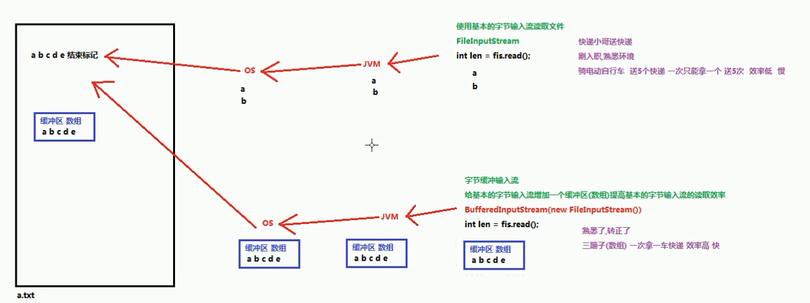
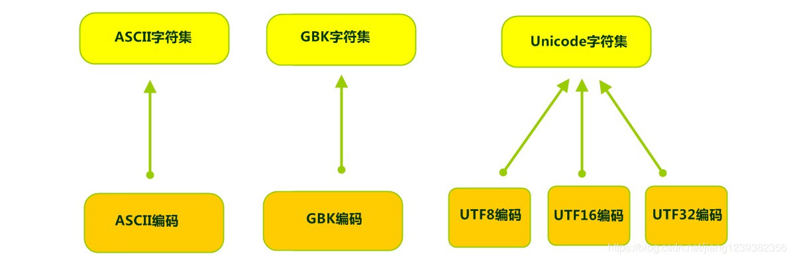
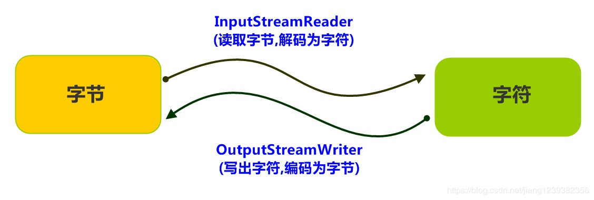
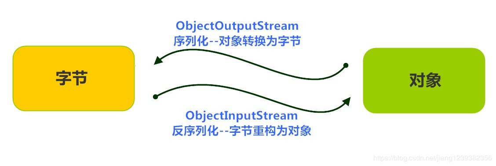
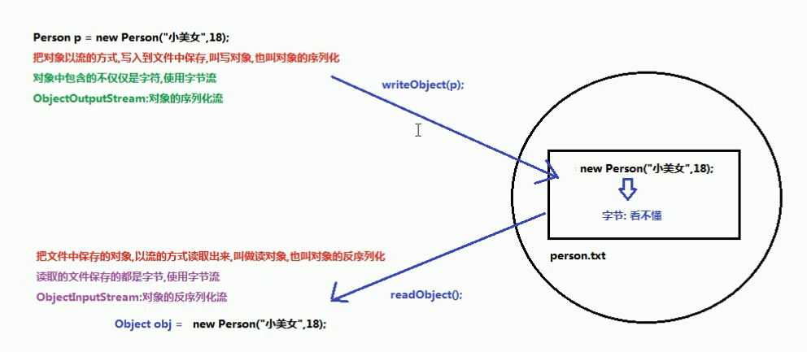

IO流（缓冲流-转换流-序列化流）

# 一、 缓冲流

主要点IO流-字节流-字符流-Properties是基本的一些流，作为IO流的入门，要见识一些更强大的流。比如能够高效读写的缓冲流，能够转换编码的转换流，能够持久化存储对象的序列化流等等。这些功能更为强大的流，都是在基本的流对象基础之上创建而来的，就像穿上铠甲的武士一样，相当于是对基本流对象的一种增强。




## 1.1 概述

缓冲流,也叫高效流，是对4个基本的`FileXxx` 流的增强，所以也是4个流，按照数据类型分类：

- **字节缓冲流**：`BufferedInputStream`，`BufferedOutputStream`
- **字符缓冲流**：`BufferedReader`，`BufferedWriter`

缓冲流的基本原理，是在创建流对象时，会创建一个内置的默认大小的缓冲区数组，通过缓冲区读写，减少系统IO次数，从而提高读写的效率。

## 1.2 字节缓冲流

### 构造方法

- `public BufferedInputStream(InputStream in)` ：创建一个 新的缓冲输入流。
- `public BufferedOutputStream(OutputStream out)`： 创建一个新的缓冲输出流。

1、BufferedOutputStream使用代码

```java
package com.wck.demo08BufferedStream;

import java.io.BufferedOutputStream;
import java.io.FileOutputStream;
import java.io.IOException;

/**
 * @author 御香烤翅
 * @create 2020-03-25 23:15
 *
 * java.io.BufferedOutputStream  extends java.io.OutputStream
 *
 *  BufferedOutputStream:字节输出缓冲流
 *  继承自父类的共性成员方法：
 *    - public void close() ：关闭此输出流并释放与此流相关联的任何系统资源。
 *    - public void flush() ：刷新此输出流并强制任何缓冲的输出字节被写出。
 *    - public void write(byte[] b)：将 b.length字节从指定的字节数组写入此输出流。
 *    - public void write(byte[] b, int off, int len) ：从指定的字节数组写入 len字节，从偏移量 off开始输出到此输出流。
 *    - public abstract void write(int b) ：将指定的字节输出流。
 *
 *  构造方法：
 *      BufferedOutputStream(OutputStream out) 创建一个新的缓冲输出流，以将数据写入指定的底层输出流。
 *      BufferedOutputStream(OutputStream out, int size) 创建一个新的缓冲输出流，以便以指定的缓冲区大小将数据写入指定的底层输出流。
 *
 *      参数：
 *          OutputStream out:字节输出流
 *              我们可以传递一个FileOutputStream,缓冲流会给FileOutputStream增加一个缓冲区，提高FileOutputStream的写入效率
 *          int size ：指定缓冲流内部缓冲区的大小，不指定默认为1024
 *      使用步骤（重点）：
 *          1.创建一个FileOutputStream对象，传入一个所要写入数据的目的地
 *          2.创建BufferedOutputStream对象，构造方法中传递FileOutputStream对象,提高FileOutputStream对象的效率
 *          3.BufferedOutputStream对象中的方法writer,把数据写入到内部缓冲区中
 *          4.使用BufferedOutputStream对象中的flush方法，把内部缓冲区的数据刷新到文件中
 *          5.释放关闭资源（释放资源会先调用flush刷新数据，第4步可以省略）
 *
 *
 */
public class Demo01BufferedOutputStream {

    public static void main(String[] args) throws IOException {

        //1 创建一个FileOutputStream对象，传入一个所要写入数据的目的地
        FileOutputStream fos = new FileOutputStream("IO/h.txt");
        //2 创建BufferedOutputStream对象，构造方法中传递FileOutputStream对象
        BufferedOutputStream bos = new BufferedOutputStream(fos);
        //3 BufferedOutputStream对象中的方法writer,把数据写入到内部缓冲区中
        bos.write("把数据写入到内部的缓冲区中".getBytes());
        //4 使用BufferedOutputStream对象中的flush方法，把内部缓冲区的数据刷新到文件中
        bos.flush();
        //5 释放关闭资源（释放资源会先调用flush刷新数据，第4步可以省略）
        bos.close();
    }
}

```

2.BufferedInputStream使用代码：

```java
package com.wck.demo08BufferedStream;


import java.io.BufferedInputStream;
import java.io.FileInputStream;
import java.io.IOException;

/**
 * @author 御香烤翅
 * @create 2020-03-25 23:39
 *
 * java.io.BufferedInputStream extends java.io.InputStream
 *    BufferedInputStream:字节缓冲输入流
 *
 *  继承自父类的共性方法：
 *      abstract int read() 从输入流读取数据的下一个字节。
 *      int read(byte[] b) 从输入流读取一些字节数，并将它们存储到缓冲区 b 。
 *      void close() 关闭此输入流并释放与流相关联的任何系统资源
 *
 *  构造方法：
 *      BufferedInputStream(InputStream in) 创建一个 BufferedInputStream并保存其参数，输入流 in ，供以后使用。
 *      BufferedInputStream(InputStream in, int size)  创建 BufferedInputStream具有指定缓冲区大小，并保存其参数，输入流 in ，供以后使用。
 *  参数：
 *      InputStream in :字节输入流
 *          我们可以传递FileInputStream,缓冲流会给FileInputStream增加一个缓冲区，提高FileInputStream的读取效率
 *      int size ：指定缓冲流内部缓冲区的大小，不指定默认为1024
 *  步骤：
 *      1 创建一个FileInputStream对象，传入要绑定读取数据的文件
 *      2 创建BufferedInputStream对象，构造方法中传递FileInputStream对象，提高FileInputStream对象的读取效率
 *      3 使用BufferedInputStream对象的read方法，读取文件
 *      4 释放资源
 */
public class Demo02BufferedInputStream {

    public static void main(String[] args) throws IOException {

        //1 创建一个FileInputStream对象，传入要绑定读取数据的文件
        FileInputStream fis = new FileInputStream("IO/h.txt");
        //2 创建BufferedInputStream对象，构造方法中传递FileInputStream对象
        BufferedInputStream bis = new BufferedInputStream(fis);
        //3 使用BufferedInputStream对象的read方法，读取文件

       /* //int read() 从输入流读取数据的下一个字节。
        int len=0;
        while ((len=bis.read())!=-1){
            System.out.println(len);
        }*/

       //int read(byte[] b)
        byte[] bytes=new byte[1024];

        int len=0;
        while ((len=bis.read(bytes)) != -1){

            System.out.println(new String(bytes,0,len));

        }

        //4 释放资源
        bis.close();

    }
}

```

### 效率测试

查询API，缓冲流读写方法与基本的流是一致的，效率对比得出的结果是：缓冲字节流加上字节数组是最快的，代码使用如下：

```java
package com.wck.demo08BufferedStream.copyfile;

import java.io.*;

/**
 * @author 御香烤翅
 * @create 2020-03-26 0:05
 *  文件复制的练习：
 *   一读一写
 *       明确：
 *           1.数据源：c:/1.jpg
 *           2.数据的目的地：d:/1.jpg
 *   文件复制的步骤：
 *   1 创建字节缓冲输入流对象，构造方法中传递字节输入流
 *   2 创建字节缓冲输出流对象，构造方法中传递字节输出流
 *   3 使用字节缓冲输入流兑现的read方法。读取文件
 *   4 使用字节缓冲输出流对象，把读取的 数据写入到内部缓冲区中
 *   5 释放资源（会把缓冲区中的数据刷新到文件中）
 *
 *
 */
public class Demo02CopyFile {

    public static void main(String[] args) throws IOException {
        long s = System.currentTimeMillis();
        String aPath="D:\\ideaProject\\java-io\\javaIO\\ioTestDir\\a\\cat.jpeg";
        String bPath="D:\\ideaProject\\java-io\\javaIO\\ioTestDir\\b\\cat.jpeg";

        // 1.创建字节缓冲输入流对象，构造方法中传递字节输入流
        FileInputStream fis = new FileInputStream(aPath);
        BufferedInputStream bis = new BufferedInputStream(fis);
        // 2.创建字节缓冲输出流对象，构造方法中传递字节输出流
        FileOutputStream fos = new FileOutputStream(bPath);
        BufferedOutputStream bos = new BufferedOutputStream(fos);
        //3 使用字节缓冲输入流兑现的read方法。读取文件

        int len=0;
        byte[] bytes=new byte[1024];
        while ((len=bis.read(bytes))!=-1){
            //4 使用字节缓冲输出流对象，把读取的 数据写入到内部缓冲区中
            bos.write(bytes,0,len); 
        }

        bos.close();
        bis.close();
        long e = System.currentTimeMillis();
        System.out.println("复制所有时间为："+(e-s)+"毫秒");
    }
}

```

## 1.3 字符缓冲流

### 构造方法

- `public BufferedReader(Reader in)` ：创建一个 新的缓冲输入流。
- `public BufferedWriter(Writer out)`： 创建一个新的缓冲输出流。

### 特有方法

字符缓冲流的基本方法与普通字符流调用方式一致，不再阐述，我们来看它们具备的特有方法。

- BufferedReader：`public String readLine()`: 读一行文字。
- BufferedWriter：`public void newLine()`: 写一行行分隔符,由系统属性定义符号。

1、BufferedWriter代码：

```java
package com.wck.demo08BufferedStream;

import java.io.BufferedWriter;
import java.io.FileWriter;
import java.io.IOException;

/**
 * @author 御香烤翅
 * @create 2020-03-26 0:16
 *
 * java.io.BufferedWriter extends java.io.Writer
 *  BufferedWriter:字符输出缓冲流
 *  继承自父类的共性成员方法：
 *    void write(int c) 写入单个字符。
 *    void write(char[] cbuf) 写入字符数组。
 *    abstract void write(char[] cbuf, int off, int len) 写入字符数组的某一部分,off数组的开始索引,len写的字符个数。
 *    void write(String str) 写入字符串。
 *    void write(String str, int off, int len) 写入字符串的某一部分,off字符串的开始索引,len写的字符个数。
 *    void flush() 刷新该流的缓冲。
 *    void close() 关闭此流，但要先刷新它。
 *
 *    构造方法：
 *          BufferedWriter(Writer out) 创建使用默认大小的输出缓冲区的缓冲字符输出流。
 *          BufferedWriter(Writer out, int sz) 创建一个新的缓冲字符输出流，使用给定大小的输出缓冲区。
 *     参数：
 *      Writer out：字符输出流
 *             我们传递FileWriter,缓冲流会给FileWriter增加一个缓冲区，提高FileWriter的写入效率
 *      int sz：缓冲区的大小，默认是1024
 *
 *      特有的成员方法：
 *          void newLine() 写一行行分隔符。好处：会根据不同的操作系统，获取对应的行分割符
 *
 *      换行：换行符号
 *          Windows：\r\n
 *          linux:/n
 *          mac:/r
 *
 *    使用步骤：
 *          1 创建一个缓冲字符输出流对象，传递字符输出流
 *          2 调用缓冲字符输出流对象的writer方法，把数据写入到内存缓冲区中
 *          3 调用字符缓冲输出流的flush方法，把内存中的数据刷新到文件中去
 *          4 关闭释放资源
 */
public class Demo03BufferedWriter {

    public static void main(String[] args) throws IOException {
        //1 创建一个缓冲字符输出流对象，传递字符输出流
        BufferedWriter bw = new BufferedWriter(new FileWriter("IO/i.txt"));
        //2 调用缓冲字符输出流对象的writer方法，把数据写入到内存缓冲区中

        for (int i = 0; i < 10; i++) {
            bw.write("你好世界，夜深了"+i);
            bw.newLine();
        }

        //3 调用字符缓冲输出流的flush方法，把内存中的数据刷新到文件中去
        bw.flush();
        //4 关闭释放资源
        bw.close();
    }
}

```

2、BufferedReader代码：

```java
package com.wck.demo08BufferedStream;

import java.io.BufferedReader;
import java.io.FileReader;
import java.io.IOException;

/**
 * @author 御香烤翅
 * @create 2020-03-26 0:33
 *
 * java.io.BufferedReader  extends java.io.Reader
 *      BufferedReader：字符缓冲输入流
 *
 *  继承自父类的共性成员方法：
 *      int read() 读取一个字符，并返回
 *      int read(char[] cbuf) 读取多个字符，将字符读入数组。
 *      abstract void close() 关闭流并释放与之相关联的任何系统资源。
 *
 *   构造方法
 *          BufferedReader(Reader in) 创建使用默认大小的输入缓冲区的缓冲字符输入流。
 *          BufferedReader(Reader in, int sz) 创建使用指定大小的输入缓冲区的缓冲字符输入流。
 *   参数：
 *          Reader in：字符输入流
 *              我们可以使用FileReader,字符输入缓冲流会给FileReader增加一个缓冲区，提高读取效率
 *          int sz：缓冲区的大小，不指定是默认值
 *
 *      特有的成员方法：
 *      String readLine() 读一行文字。读取一行数据
 *         行的终止符号（条件） ：读一行文字。 一行被视为由换行符（'\ n'），回车符（'\ r'）中的任何一个或随后的换行符终止。
 *
 *          返回值：
 *               包含行的内容的字符串，不包括任何行终止字符，如果已达到流的末尾，则为null
 *   使用步骤：
 *      1 创建一个BufferedReader对象，传递字符输入流的文件
 *      2 使用BufferedReader对象的read/readLine方法读取文本
 *      3 释放关闭资源
 */
public class Demo04BufferedReader {

    public static void main(String[] args) throws IOException {
        //1 创建一个BufferedReader对象，传递字符输入流的文件
        BufferedReader br = new BufferedReader(new FileReader("IO/i.txt"));

        //2 使用BufferedReader对象的read/readLine方法读取文本
        String str=null;
        while ((str=br.readLine()) != null){
            System.out.println(str);
        }
        //3 释放关闭资源
        br.close();
    }
}

```

## 1.4 练习:文本排序

请将文本信息恢复顺序。

```tex
3.侍中、侍郎郭攸之、费祎、董允等，此皆良实，志虑忠纯，是以先帝简拔以遗陛下。愚以为宫中之事，事无大小，悉以咨之，然后施行，必得裨补阙漏，有所广益。
8.愿陛下托臣以讨贼兴复之效，不效，则治臣之罪，以告先帝之灵。若无兴德之言，则责攸之、祎、允等之慢，以彰其咎；陛下亦宜自谋，以咨诹善道，察纳雅言，深追先帝遗诏，臣不胜受恩感激。
4.将军向宠，性行淑均，晓畅军事，试用之于昔日，先帝称之曰能，是以众议举宠为督。愚以为营中之事，悉以咨之，必能使行阵和睦，优劣得所。
2.宫中府中，俱为一体，陟罚臧否，不宜异同。若有作奸犯科及为忠善者，宜付有司论其刑赏，以昭陛下平明之理，不宜偏私，使内外异法也。
1.先帝创业未半而中道崩殂，今天下三分，益州疲弊，此诚危急存亡之秋也。然侍卫之臣不懈于内，忠志之士忘身于外者，盖追先帝之殊遇，欲报之于陛下也。诚宜开张圣听，以光先帝遗德，恢弘志士之气，不宜妄自菲薄，引喻失义，以塞忠谏之路也。
9.今当远离，临表涕零，不知所言。
6.臣本布衣，躬耕于南阳，苟全性命于乱世，不求闻达于诸侯。先帝不以臣卑鄙，猥自枉屈，三顾臣于草庐之中，咨臣以当世之事，由是感激，遂许先帝以驱驰。后值倾覆，受任于败军之际，奉命于危难之间，尔来二十有一年矣。
7.先帝知臣谨慎，故临崩寄臣以大事也。受命以来，夙夜忧叹，恐付托不效，以伤先帝之明，故五月渡泸，深入不毛。今南方已定，兵甲已足，当奖率三军，北定中原，庶竭驽钝，攘除奸凶，兴复汉室，还于旧都。此臣所以报先帝而忠陛下之职分也。至于斟酌损益，进尽忠言，则攸之、祎、允之任也。
5.亲贤臣，远小人，此先汉所以兴隆也；亲小人，远贤臣，此后汉所以倾颓也。先帝在时，每与臣论此事，未尝不叹息痛恨于桓、灵也。侍中、尚书、长史、参军，此悉贞良死节之臣，愿陛下亲之信之，则汉室之隆，可计日而待也。

```

### 分析

1. 逐行读取文本信息。
2. 解析文本信息到集合中。
3. 遍历集合，按顺序，写出文本信息。

```java
package com.wck.demo08BufferedStream;
/**
 * 所需要的词
 3.侍中、侍郎郭攸之、费祎、董允等，此皆良实，志虑忠纯，是以先帝简拔以遗陛下。愚以为宫中之事，事无大小，悉以咨之，然后施行，必得裨补阙漏，有所广益。
 8.愿陛下托臣以讨贼兴复之效，不效，则治臣之罪，以告先帝之灵。若无兴德之言，则责攸之、祎、允等之慢，以彰其咎；陛下亦宜自谋，以咨诹善道，察纳雅言，深追先帝遗诏，臣不胜受恩感激。
 4.将军向宠，性行淑均，晓畅军事，试用之于昔日，先帝称之曰能，是以众议举宠为督。愚以为营中之事，悉以咨之，必能使行阵和睦，优劣得所。
 2.宫中府中，俱为一体，陟罚臧否，不宜异同。若有作奸犯科及为忠善者，宜付有司论其刑赏，以昭陛下平明之理，不宜偏私，使内外异法也。
 1.先帝创业未半而中道崩殂，今天下三分，益州疲弊，此诚危急存亡之秋也。然侍卫之臣不懈于内，忠志之士忘身于外者，盖追先帝之殊遇，欲报之于陛下也。诚宜开张圣听，以光先帝遗德，恢弘志士之气，不宜妄自菲薄，引喻失义，以塞忠谏之路也。
 9.今当远离，临表涕零，不知所言。
 6.臣本布衣，躬耕于南阳，苟全性命于乱世，不求闻达于诸侯。先帝不以臣卑鄙，猥自枉屈，三顾臣于草庐之中，咨臣以当世之事，由是感激，遂许先帝以驱驰。后值倾覆，受任于败军之际，奉命于危难之间，尔来二十有一年矣。
 7.先帝知臣谨慎，故临崩寄臣以大事也。受命以来，夙夜忧叹，恐付托不效，以伤先帝之明，故五月渡泸，深入不毛。今南方已定，兵甲已足，当奖率三军，北定中原，庶竭驽钝，攘除奸凶，兴复汉室，还于旧都。此臣所以报先帝而忠陛下之职分也。至于斟酌损益，进尽忠言，则攸之、祎、允之任也。
 5.亲贤臣，远小人，此先汉所以兴隆也；亲小人，远贤臣，此后汉所以倾颓也。先帝在时，每与臣论此事，未尝不叹息痛恨于桓、灵也。侍中、尚书、长史、参军，此悉贞良死节之臣，愿陛下亲之信之，则汉室之隆，可计日而待也。
 */

import java.io.*;
import java.util.HashMap;
import java.util.Map;
import java.util.Set;

/**
 * @author 御香烤翅
 * @create 2020-03-26 0:58
 *
 * 练习:  分析:
 *     对文本的内容进行排序按照(1,23顺序排序)
 * 	1创建一个HashMap集合对象,可以:存储每行文本的序号(1,2,3...) value:存储每行的文本
 * 	2.创建字符缓冲输入流对象,构造方法中绑定字符输入流
 * 	3.创建字符缓冲输出流对象,构造方法中绑定字符输出流
 * 	4.使用字符缓冲输入流中的方法readLine,逐行读取文本
 * 	5.对读取到的文本进行切割获取行中的序号和文本内容
 * 	6.把切割好的序号和文本的内容存储到HashMap集合中(key序号是有序的会自动排序1,2,3,4)
 * 	7.遍历 HashMap集合,获取每一个键值对
 * 	8.把每一个键值对,拼接为一个文本行
 * 	9.把拼接好的文本,使用字符缓冲输出流中的方法rite写入到文件中
 * 	10.释放资源
 */
public class Demo05ChushiBiao {

    public static void main(String[] args) throws IOException {

        //1创建一个HashMap集合对象,可以:存储每行文本的序号(1,2,3...) value:存储每行的文本
        HashMap<String, String> map = new HashMap<>();
        //2.创建字符缓冲输入流对象,构造方法中绑定字符输入流
        BufferedReader br = new BufferedReader(new FileReader("IO/chushibiao.txt"));
        //3.创建字符缓冲输出流对象,构造方法中绑定字符输出流
        BufferedWriter bw = new BufferedWriter(new FileWriter("IO/chushibiao2.txt"));
        //4.使用字符缓冲输入流中的方法readLine,逐行读取文本
        String line=null;
        while ((line=br.readLine())!=null){
            //5.对读取到的文本进行切割获取行中的序号和文本内容
            String[] arr = line.split("\\.");
            //6.把切割好的序号和文本的内容存储到HashMap集合中(key序号是有序的会自动排序1,2,3,4)
            map.put(arr[0],arr[1]);
        }

        //7.遍历 HashMap集合,获取每一个键值对
        Set<Map.Entry<String, String>> entrySet = map.entrySet();
        for (Map.Entry<String, String> entry : entrySet) {
            //8.把每一个键值对,拼接为一个文本行
            String key = entry.getKey();
            String value = entry.getValue();
            String str=key+value;
            //9.把拼接好的文本,使用字符缓冲输出流中的方法rite写入到文件中
            bw.write(str);
            bw.newLine();
        }

        bw.close();
        br.close();


    }
}

```

# 二、 转换流

## 2.1 字符编码和字符集

### 字符编码

计算机中储存的信息都是用二进制数表示的，而我们在屏幕上看到的数字、英文、标点符号、汉字等字符是二进制数转换之后的结果。按照某种规则，将字符存储到计算机中，称为**编码** 。反之，将存储在计算机中的二进制数按照某种规则解析显示出来，称为**解码** 。比如说，按照A规则存储，同样按照A规则解析，那么就能显示正确的文本符号。反之，按照A规则存储，再按照B规则解析，就会导致乱码现象。

编码:字符(能看懂的)–字节(看不懂的)

解码:字节(看不懂的)–>字符(能看懂的)

**字符编码Character Encoding** : 就是一套自然语言的字符与二进制数之间的对应规则。

编码表:生活中文字和计算机中二进制的对应规则

### 字符集

- **字符集 Charset**：也叫编码表。是一个系统支持的所有字符的集合，包括各国家文字、标点符号、图形符号、数字等。

计算机要准确的存储和识别各种字符集符号，需要进行字符编码，一套字符集必然至少有一套字符编码。常见字符集有ASCII字符集、GBK字符集、Unicode字符集。



当指定了**编码**，它所对应的**字符集**自然就指定了

**ASCII字符集** ：

- ASCII（American Standard Code for Information Interchange，美国信息交换标准代码）是基于拉丁字母的一套电脑编码系统，用于显示现代英语，主要包括控制字符（回车键、退格、换行键等）和可显示字符（英文大小写字符、阿拉伯数字和西文符号）。

- 基本的ASCII字符集，使用7位（bits）表示一个字符，共128字符。ASCII的扩展字符集使用8位（bits）表示一个字符，共256字符，方便支持欧洲常用字符。

**ISO-8859-1字符集：**

- 拉丁码表，别名Latin-1，用于显示欧洲使用的语言，包括荷兰、丹麦、德语、意大利语、西班牙语等。
- ISO-8859-1使用单字节编码，兼容ASCII编码。

**GBxxx字符集：**

- GB就是国标的意思，是为了显示中文而设计的一套字符集。
- **GB2312**：简体中文码表。一个小于127的字符的意义与原来相同。但两个大于127的字符连在一起时，就表示一个汉字，这样大约可以组合了包含7000多个简体汉字，此外数学符号、罗马希腊的字母、日文的假名们都编进去了，连在ASCII里本来就有的数字、标点、字母都统统重新编了两个字节长的编码，这就是常说的"全角"字符，而原来在127号以下的那些就叫"半角"字符了。
- **GBK**：最常用的中文码表。是在GB2312标准基础上的扩展规范，使用了双字节编码方案，共收录了21003个汉字，完全兼容GB2312标准，同时支持繁体汉字以及日韩汉字等。
- **GB18030**：最新的中文码表。收录汉字70244个，采用多字节编码，每个字可以由1个、2个或4个字节组成。支持中国国内少数民族的文字，同时支持繁体汉字以及日韩汉字等。

**Unicode字符集 ：**

- Unicode编码系统为表达任意语言的任意字符而设计，是业界的一种标准，也称为统一码、标准万国码。
- 它最多使用4个字节的数字来表达每个字母、符号，或者文字。有三种编码方案，UTF-8、UTF-16和UTF-32。最为常用的UTF-8编码。
- UTF-8编码，可以用来表示Unicode标准中任何字符，它是电子邮件、网页及其他存储或传送文字的应用中，优先采用的编码。互联网工程工作小组（IETF）要求所有互联网协议都必须支持UTF-8编码。所以，我们开发Web应用，也要使用UTF-8编码。它使用一至四个字节为每个字符编码，编码规则：
  - 128个US-ASCII字符，只需一个字节编码。
  - 拉丁文等字符，需要二个字节编码。
  - 大部分常用字（含中文），使用三个字节编码。
  - 其他极少使用的Unicode辅助字符，使用四字节编码。
    

## 2.2 编码引出的问题

在IDEA中，使用`FileReader` 读取项目中的文本文件。由于IDEA的设置，都是默认的`UTF-8`编码，所以没有任何问题。但是，当读取Windows系统中创建的文本文件时，由于Windows系统的默认是GBK编码，就会出现乱码。

```java
package com.wck.demo09convertstream;

import java.io.FileReader;
import java.io.IOException;

/**
 * @author 御香烤翅
 * @create 2020-03-26 15:07
 */
public class Demo01ConvertStream {


    public static void main(String[] args) throws IOException {
        //Gbk格式的txt文本使用utf-8 读取会产生乱码，编码方式不同就会乱码
        FileReader fr = new FileReader("IO/hahah.txt");
        int len=0;
        while ((len=fr.read())!=-1){
            System.out.println((char)len);
        }
        fr.close();
    }

}
输出结果：
���
```

## 2.3 InputStreamReader类

转换流`java.io.InputStreamReader`，是Reader的子类，是从字节流到字符流的桥梁。它读取字节，并使用指定的字符集将其解码为字符。它的字符集可以由名称指定，也可以接受平台的默认字符集。

### 构造方法

- `InputStreamReader(InputStream in)`: 创建一个使用默认字符集的字符流。
- `InputStreamReader(InputStream in, String charsetName)`: 创建一个指定字符集的字符流。

```java
package com.wck.demo09convertstream;

import java.io.FileInputStream;
import java.io.IOException;
import java.io.InputStreamReader;

/**
 * @author 御香烤翅
 * @create 2020-03-26 16:16
 *
 * java.io.InputStreamReader extends java.io.Reader
 *  InputStreamReader:是从字节流通向字符流的桥梁：它读取字节，并使用指定的charset将其解码为字符（把看不懂的变成能看懂的）
 *
 *  共性的成员方法：
 *      int read() 读取一个字符，并返回
 *      int read(char[] cbuf) 读取多个字符，将字符读入数组。
 *      abstract void close() 关闭流并释放与之相关联的任何系统资源。
 *
 *  构造方法：
 *      InputStreamReader(InputStream in) 创建一个使用默认字符集的InputStreamReader。
 *      InputStreamReader(InputStream in, String charsetName) 创建一个使用命名字符集的InputStreamReader。
 *    参数：
 *      InputStream in：字节输入流，用来读取文件中保存的字节
 *      String charsetName: 指定编码表名称，不区分大小写，utf-8/UTF-8,不指定使用默认编码，就是IDE的编码
 *
 *    使用步骤：
 *      1 创建InputStreamReader对象，构造方法中传递字节输入流和指定的编码表名称
 *      2 使用创建InputStreamReader对象的read读取文件
 *      3 释放关闭资源
 *
 *    注意事项：
 *      构造方法中指定的编码表名称要和文件的编码相同，否则会发生乱码
 *
 */
public class Demo03InputStreamReader {

    public static void main(String[] args) throws IOException {
        //1 创建InputStreamReader对象，构造方法中传递字节输入流和指定的编码表名称
        InputStreamReader isr = new InputStreamReader(new FileInputStream("IO/utf-8.txt"), "utf-8");
        //2 使用创建InputStreamReader对象的read读取文件

        int len=0;

        while ((len=isr.read())!=-1){
            System.out.print((char)len);
        }
        //3 释放关闭资源
        isr.close();
    }

}

```

## 2.4 OutputStreamWriter类

转换流`java.io.OutputStreamWriter` ，是Writer的子类，是从字符流到字节流的桥梁。使用指定的字符集将字符编码为字节。它的字符集可以由名称指定，也可以接受平台的默认字符集。

### 构造方法

- `OutputStreamWriter(OutputStream in)`: 创建一个使用默认字符集的字符流。
- `OutputStreamWriter(OutputStream in, String charsetName)`: 创建一个指定字符集的字符流。

```java
package com.wck.demo09convertstream;

import java.io.FileOutputStream;
import java.io.IOException;
import java.io.OutputStreamWriter;
import java.nio.charset.Charset;
import java.nio.charset.StandardCharsets;

/**
 * @author 御香烤翅
 * @create 2020-03-26 15:39
 *
 * java.io.OutputStreamWriter extends Writer
 *  OutputStreamWriter是字符流通向字节流的桥梁：向其写入的字符编码成使用指定的字节charset（把能看懂的变成看不懂的）
 *
 * 继承自父类的共性成员方法：
 *
 *    void write(int c) 写入单个字符。
 *    void write(char[] cbuf) 写入字符数组。
 *    abstract void write(char[] cbuf, int off, int len) 写入字符数组的某一部分,off数组的开始索引,len写的字符个数。
 *    void write(String str) 写入字符串。
 *    void write(String str, int off, int len) 写入字符串的某一部分,off字符串的开始索引,len写的字符个数。
 *    void flush() 刷新该流的缓冲。
 *    void close() 关闭此流，但要先刷新它。
 *
 *
 *  构造方法：
 *      OutputStreamWriter(OutputStream out) 创建一个使用默认字符编码的OutputStreamWriter。
 *      OutputStreamWriter(OutputStream out, String charsetName) 创建一个使用命名字符集的OutputStreamWriter。
 *
 *          参数：
 *              OutputStream out：字节输出流，可以用来写转换之后的字节到文件中
 *              String charsetName: 指定编码表名称，不区分大小写，utf-8/UTF-8,不指定使用默认编码，就是IDE的编码
 *
 *  使用步骤：
 *      1 创建OutputStreamWriter对象，构造方法中传入字节输出流和指定编码名称
 *      2 使用OutputStreamWriter对象中的writer方法，把字符转换为字节存储在缓冲区中（并编码）
 *      3 使用OutputStreamWriter对象中的flush方法，把内存缓冲区中数据刷新到文件中（使用字节流写字节的过程）
 *      4.关闭释放资源
 */
public class Demo02OutputStreamWriter {

    public static void main(String[] args) throws IOException {
        writer_gbk();
//        writer_utf_8();
    }

    private static void writer_gbk() throws IOException {

        //1 创建OutputStreamWriter对象，构造方法中传入字节输出流和指定编码名称\
        OutputStreamWriter osw = new OutputStreamWriter(new FileOutputStream("IO/gbk.txt"), "gbk");
        //2 使用OutputStreamWriter对象中的writer方法，把字符转换为字节存储在缓冲区中（并编码）
        osw.write("你好中国");
        // 3 使用OutputStreamWriter对象中的flush方法，把内存缓冲区中数据刷新到文件中（使用字节流写字节的过程）
        osw.flush();
        //4.关闭释放资源
        osw.close();
    }

    /**
     * 使用OutputStreamWriter转换流写u-f-8格式的文件
     */
    private static void writer_utf_8() throws IOException {

        //1 创建OutputStreamWriter对象，构造方法中传入字节输出流和指定编码名称\
        OutputStreamWriter osw = new OutputStreamWriter(new FileOutputStream("IO/utf-8.txt"), "utf-8");
        //2 使用OutputStreamWriter对象中的writer方法，把字符转换为字节存储在缓冲区中（并编码）
        osw.write("你好中国");
        // 3 使用OutputStreamWriter对象中的flush方法，把内存缓冲区中数据刷新到文件中（使用字节流写字节的过程）
        osw.flush();
        //4.关闭释放资源
        osw.close();
    }
}

```

### 转换流理解图解

**转换流是字节与字符间的桥梁！**



## 2.5 练习：转换文件编码

将GBK编码的文本文件，转换为UTF-8编码的文本文件。

### 分析

1. 指定GBK编码的转换流，读取文本文件。
2. 使用UTF-8编码的转换流，写出文本文件。

```java
package com.wck.demo09convertstream;

import java.io.*;

/**
 * @author 御香烤翅
 * @create 2020-03-26 16:39
 *
 * 将GBK编码的文本文件，转换为UTF-8编码的文本文件。
 * 分析步骤：
 *
 *      1.创建 InputstreamReader对象构造方法中传字节输入流和指定的编码表名称GBK
 *      2.创建Outputstreomiriter对象构造方法中传递字节输出流和指定的编码表名称UTF-8
 *      3.使用 InputstreamReader对象中的方法read读取文件
 *      4.使用 outputstreamiriterwrit对象中的方法把读取的数据写入到文件中
 *      5.释放资源
 */
public class Demo04Test {

    public static void main(String[] args) throws IOException {
//        base();//字符数组8毫秒，非字符数组 50毫秒

        buffer();//8毫秒

    }

    private static void buffer() throws IOException {

        long s = System.currentTimeMillis();

        BufferedReader br = new BufferedReader(new InputStreamReader(new FileInputStream("IO/gbk.txt"), "gbk"));

        BufferedWriter bw = new BufferedWriter(new OutputStreamWriter(new FileOutputStream("IO/utf-8-2.txt"), "utf-8"));

        char[] chars=new char[1024];
        int len=0;
        while ((len=br.read(chars))!=-1){
            bw.write(chars,0,len);
        }
        bw.close();
        br.close();
        long e = System.currentTimeMillis();
        System.out.println("复制所有时间为："+(e-s)+"毫秒");

    }

    private static void base() throws IOException {
        long s = System.currentTimeMillis();
        //1.创建 InputstreamReader对象构造方法中传字节输入流和指定的编码表名称GBK
        InputStreamReader isr = new InputStreamReader(new FileInputStream("IO/gbk.txt"), "gbk");
        //2.创建Outputstreomiriter对象构造方法中传递字节输出流和指定的编码表名称UTF-8
        OutputStreamWriter osw = new OutputStreamWriter(new FileOutputStream("IO/utf-8-2.txt"),"utf-8");
    /*   int len=0;
        // 3.使用 InputstreamReader对象中的方法read读取文件
        while ((len=isr.read())!=-1){
            //4.使用 outputstreamiriterwrit对象中的方法把读取的数据写入到文件中
            osw.write(len);
        }*/

        //使用数组
        char[] chars=new char[1024];
        int len=0;
        while ((len=isr.read(chars))!=-1){
            osw.write(chars,0,len);
        }
        //5.释放资源
        osw.close();
        isr.close();
        long e = System.currentTimeMillis();
        System.out.println("复制所有时间为："+(e-s)+"毫秒");
    }

}

```

# 三、 序列化

## 3.1 概述

Java 提供了一种对象**序列化**的机制。用一个字节序列可以表示一个对象，该字节序列包含该`对象的数据`、`对象的类型`和`对象中存储的属性`等信息。字节序列写出到文件之后，相当于文件中**持久保存**了一个对象的信息。

反之，该字节序列还可以从文件中读取回来，重构对象，对它进行**反序列化**。`对象的数据`、`对象的类型`和`对象中存储的数据`信息，都可以用来在内存中创建对象。看图理解序列化：





## 3.2 ObjectOutputStream类

`java.io.ObjectOutputStream` 类，将Java对象的原始数据类型写出到文件,实现对象的持久存储。

### 构造方法

- `public ObjectOutputStream(OutputStream out)`： 创建一个指定OutputStream的ObjectOutputStream。

### 序列化操作

1. 一个对象要想序列化，必须满足两个条件:

- 该类必须实现`java.io.Serializable` 接口，`Serializable` 是一个标记接口，不实现此接口的类将不会使任何状态序列化或反序列化，会抛出`NotSerializableException` 。

- 该类的所有属性必须是可序列化的。如果有一个属性不需要可序列化的，则该属性必须注明是瞬态的，使用`transient` 关键字修饰

2.写出对象方法

- `public final void writeObject (Object obj)` : 将指定的对象写出。

Person类:

```java
package com.wck.demo10objectoutputstream;

import java.io.Serializable;

/**
 * @author 御香烤翅
 * @create 2020-03-26 17:18
 */
public class Person implements Serializable {

    private static final long serialVersionUID = 1161011992012103901L;
    private String name;
    private int age;

    public Person() {
    }

    public Person(String name, int age) {
        this.name = name;
        this.age = age;
    }

    public String getName() {
        return name;
    }

    public void setName(String name) {
        this.name = name;
    }

    public int getAge() {
        return age;
    }

    public void setAge(int age) {
        this.age = age;
    }

    @Override
    public String toString() {
        return "Person{" +
                "name='" + name + '\'' +
                ", age=" + age +
                '}';
    }
}

```


```java
package com.wck.demo10objectoutputstream;

import java.io.FileOutputStream;
import java.io.IOException;
import java.io.ObjectOutputStream;

/**
 * @author 御香烤翅
 * @create 2020-03-26 17:10
 *
 * java.io.ObjectOutputStream extends java.io.OutputStream
 *  ObjectOutputStream:对象的序列化流
 *  作用：
 *      把对象以流的方式写入到文件中保存
 *
 *  构造方法：
 *      ObjectOutputStream(OutputStream out) 创建一个写入指定的OutputStream的ObjectOutputStream。
 *          参数：
 *              OutputStream out ：字节输出流
 *
 *  特有的成员方法：
 *      void writeObject(Object obj) 将指定的对象写入ObjectOutputStream。
 *
 *  使用步骤：
 *      1 创建ObjectOutputStream对象输出流，构造方法中传入字节输出流
 *      2 使用ObjectOutputStream对象中的writeObject方法，把对象写入到文件中
 *      3 释放关闭资源
 */
public class Demo01ObjectOutputStream {

    public static void main(String[] args) throws IOException {

        //1 创建ObjectOutputStream对象输出流，构造方法中传入字节输出流
        ObjectOutputStream oos = new ObjectOutputStream(new FileOutputStream("IO/person.txt"));
        //2 使用ObjectOutputStream对象中的writeObject方法，把对象写入到文件中
        oos.writeObject(new Person("wck",18));
        //3 释放关闭资源
        oos.close();
    }
}

```

## 3.3 ObjectInputStream类

ObjectInputStream反序列化流，将之前使用ObjectOutputStream序列化的原始数据恢复为对象。

### 构造方法

- `public ObjectInputStream(InputStream in)`： 创建一个指定InputStream的ObjectInputStream。

### 反序列化操作1

如果能找到一个对象的class文件，我们可以进行反序列化操作，调用`ObjectInputStream`读取对象的方法：

- `public final Object readObject ()` : 读取一个对象。

**对于JVM可以反序列化对象，它必须是能够找到class文件的类。如果找不到该类的class文件，则抛出一个 ClassNotFoundException 异常。**

```java
package com.wck.demo10objectoutputstream;

import java.io.FileInputStream;
import java.io.IOException;
import java.io.ObjectInputStream;

/**
 * @author 御香烤翅
 * @create 2020-03-26 17:32
 *
 *  java.io.ObjectInputStream  extends java.io.InputStream
 *      ObjectInputStream:对象的输入流，对象的反序列化流
 *          作用：把文件中保存的对象，以流的方式读出来使用
 *
 *  构造方法：
 *      ObjectInputStream(InputStream in) 创建从指定的InputStream读取的ObjectInputStream。
 *          参数：
 *             InputStream in ：字节输入流
 *  特有的成员方法：
 *      Object readObject() 从ObjectInputStream读取一个对象。
 *
 *  使用步骤：
 *      1 创建ObjectInputStream对象，传入字节输入流
 *      2 使用ObjectInputStream对象的readObject()方法，读取保存对象的文件
 *      3 释放关闭资源
 *      4 使用读取出来的对象（打印）
 *
 */
public class Demo02ObjectInputStream {

    public static void main(String[] args) throws IOException, ClassNotFoundException {
        //1 创建ObjectInputStream对象，传入字节输入流
        ObjectInputStream ois = new ObjectInputStream(new FileInputStream("IO/person.txt"));
        //2 使用ObjectInputStream对象的readObject()方法，读取保存对象的文件
        Object object = ois.readObject();
        //3 释放关闭资源
        ois.close();
        //4 使用读取出来的对象（打印）
        Person p= (Person) object;
        System.out.println(p.toString());
    }
}

```

### **反序列化操作2**

**另外，当JVM反序列化对象时，能找到class文件，但是class文件在序列化对象之后发生了修改，那么反序列化操作也会失败**，抛出一个`InvalidClassException`异常。**发生这个异常的原因如下**：

- 该类的序列版本号与从流中读取的类描述符的版本号不匹配
- 该类包含未知数据类型
- 该类没有可访问的无参数构造方法

`Serializable` 接口给需要序列化的类，提供了一个序列版本号。`serialVersionUID` 该版本号的目的在于验证序列化的对象和对应类是否版本匹配

```java
package com.wck.demo10objectoutputstream;

import java.io.Serializable;

/**
 * @author 御香烤翅
 * @create 2020-03-26 17:18
 */
public class Person implements Serializable {

    //防止报`InvalidClassException`错误
    private static final long serialVersionUID = 1161011992012103901L;
    private String name;
    private int age;
```

## 3.4 练习：序列化集合

1. 将存有多个自定义对象的集合序列化操作，保存到`list.txt`文件中。
2. 反序列化`list.txt` ，并遍历集合，打印对象信息。

### 分析

1. 把若干学生对象 ，保存到集合中。
2. 把集合序列化。
3. 反序列化读取时，只需要读取一次，转换为集合类型。
4. 遍历集合，可以打印所有的学生信息

代码：

```java
package com.wck.demo10objectoutputstream;

import org.ietf.jgss.Oid;

import java.io.*;
import java.util.ArrayList;

/**
 * @author 御香烤翅
 * @create 2020-03-26 18:11
 *
 * 1. 将存有多个自定义对象的集合序列化操作，保存到`list.txt`文件中。
 * 2. 反序列化`list.txt` ，并遍历集合，打印对象信息。
 *
 * ### 分析
 *
 * 1. 把若干学生对象 ，保存到集合中。
 * 2. 把集合序列化。
 * 3. 反序列化读取时，只需要读取一次，转换为集合类型。
 * 4. 遍历集合，可以打印所有的学生信息
 */
public class DemoTest {

    public static void main(String[] args) throws IOException, ClassNotFoundException {

        ArrayList<Person> personArrayList = new ArrayList<>();
        personArrayList.add(new Person("wck1",18));
        personArrayList.add(new Person("wck2",19));
        personArrayList.add(new Person("wck20",20));

        ObjectOutputStream oos = new ObjectOutputStream(new FileOutputStream("IO/list.txt"));
        oos.writeObject(personArrayList);


        ObjectInputStream ois = new ObjectInputStream(new FileInputStream("IO/list.txt"));
        Object object = ois.readObject();
        ArrayList<Person> list= (ArrayList<Person>) object;
        System.out.println(list);
        ois.close();
        oos.close();

    }
}

```

# 四、 打印流

## 4.1 概述

平时我们在控制台打印输出，是调用`print`方法和`println`方法完成的，这两个方法都来自于`java.io.PrintStream`类，该类能够方便地打印各种数据类型的值，是一种便捷的输出方式。

## 4.2 PrintStream类

### 构造方法

- `public PrintStream(String fileName)`： 使用指定的文件名创建一个新的打印流。

### 改变打印流向

`System.out`就是`PrintStream`类型的，只不过它的流向是系统规定的，打印在控制台上。不过，既然是流对象，就可以改变它的流向。

```java
public class PrintDemo {
    public static void main(String[] args) throws IOException {
		// 调用系统的打印流,控制台直接输出97
        System.out.println(97);
      
		// 创建打印流,指定文件的名称
        PrintStream ps = new PrintStream("ps.txt");
      	
      	// 设置系统的打印流流向,输出到ps.txt
        System.setOut(ps);
      	// 调用系统的打印流,ps.txt中输出97
        System.out.println(97);
    }
}
```

