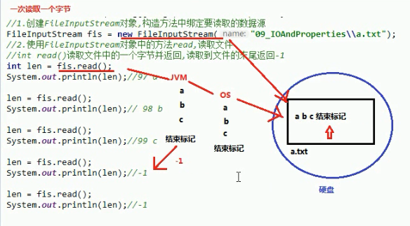

# 一、 IO概述

## 1.1 什么是IO

生活中，你肯定经历过这样的场景。当你编辑一个文本文件，忘记了`ctrl+s` ，可能文件就白白编辑了。当你电脑上插入一个U盘，可以把一个视频，拷贝到你的电脑硬盘里。那么数据都是在哪些设备上的呢？键盘、内存、硬盘、外接设备等等。

我们把这种数据的传输，可以看做是一种数据的流动，按照流动的方向，以内存为基准，分为`输入input` 和`输出output` ，即流向内存是输入流，流出内存的输出流。

Java中I/O操作主要是指使用`java.io`包下的内容，进行输入、输出操作。**输入**也叫做**读取**数据，**输出**也叫做作**写出**数据。

## 1.2 IO的分类

根据数据的流向分为：**输入流**和**输出流**。

- **输入流** ：把数据从`其他设备`上读取到`内存`中的流。
- **输出流** ：把数据从`内存` 中写出到`其他设备`上的流。

格局数据的类型分为：**字节流**和**字符流**。

- **字节流** ：以字节为单位，读写数据的流。
- **字符流** ：以字符为单位，读写数据的流。

## 1.3 IO的流向说明图解


## 1.4 顶级父类们

|            | **输入流**                 | 输出流                      |
| ---------- | -------------------------- | --------------------------- |
| **字节流** | 字节输入流 **InputStream** | 字节输出流 **OutputStream** |
| **字符流** | 字符输入流 **Reader**      | 字符输出流 **Writer**       |

# 二、字节流

## 2.1 一切皆为字节

一切文件数据(文本、图片、视频等)在存储时，都是以二进制数字的形式保存，都一个一个的字节，那么传输时一样如此。所以，字节流可以传输任意文件数据。在操作流的时候，我们要时刻明确，无论使用什么样的流对象，底层传输的始终为二进制数据。

## 2.2 字节输出流【OutputStream】

`java.io.OutputStream`抽象类是表示字节输出流的所有类的超类，将指定的字节信息写出到目的地。它定义了字节输出流的基本共性功能方法。

- `public void close()` ：关闭此输出流并释放与此流相关联的任何系统资源。
- `public void flush()` ：刷新此输出流并强制任何缓冲的输出字节被写出。
- `public void write(byte[] b)`：将 b.length字节从指定的字节数组写入此输出流。
- `public void write(byte[] b, int off, int len)` ：从指定的字节数组写入 len字节，从偏移量 off开始输出到此输出流。
- `public abstract void write(int b)` ：将指定的字节输出流。


> close方法，当完成流的操作时，必须调用此方法，释放系统资源。

## 2.3 FileOutputStream类

`OutputStream`有很多子类，从最简单的一个子类开始。

`java.io.FileOutputStream`类是文件输出流，用于将数据写出到文件。

### 构造方法

- `public FileOutputStream(File file)`：创建文件输出流以写入由指定的 File对象表示的文件。
- `public FileOutputStream(String name)`： 创建文件输出流以指定的名称写入文件。

当你创建一个流对象时，必须传入一个文件路径。该路径下，如果没有这个文件，会创建该文件。如果有这个文件，会清空这个文件的数据。

### 写出字节数据

1、**写出字节**：`write(int b)` 方法，每次可以写出一个字节数据

```java
package com.wck.demo01.outputstream;

import java.io.FileOutputStream;
import java.io.IOException;

/**
 * @author 御香烤翅
 * @create 2020-03-24 23:19
 *
 *java.io.Demo01OutputStream【字节输出流】:这个抽象类是表示字节输出流的所有类的超类
 *  定义了一些子类的共性的成员方法：
 *
 * - public void close() ：关闭此输出流并释放与此流相关联的任何系统资源。
 * - public void flush() ：刷新此输出流并强制任何缓冲的输出字节被写出。
 * - public void write(byte[] b)：将 b.length字节从指定的字节数组写入此输出流。
 * - public void write(byte[] b, int off, int len) ：从指定的字节数组写入 len字节，从偏移量 off开始输出到此输出流。
 * - public abstract void write(int b) ：将指定的字节输出流。
 *
 *   FileOutputStream extends Demo01OutputStream
 *   FileOutputStream：文件字节输出流
 *      作用：把内存中的数据写入到硬盘的文件中
 *
 *   构造方法：
 *   FileOutputStream(File file) 创建文件输出流以写入由指定的 File对象表示的文件。
 *   FileOutputStream(String name) 创建文件输出流以指定的名称写入文件。
 *      参数：写入数据的目的地
 *      File file ： 目的地是一个文件
 *      String name ： 目的地是一个文件的路径
 *      构造方法的作用“
 *          1.创建一个FileOutputStream对象
 *          2.会根据构造方法所传的文件/文件路径，创建一个空的文件
 *          3.会把FileOutputStream对象指向创建好的文件
 *  写入数据的原理（内存->硬盘）：
 *      java程序->JVM（虚拟机）->OS(操作系统)->OS调用写数据的方法->把数据写入到文件中去
 *
 *  字节输出流的使用步骤（重点）
 *      1.创建一个FileOutputStream对象，构造方法中传入写入数据的目的地
 *      2.调用FileOutputStream的对象方法中的write,把数据写入到文件中
 *      3.释放资源，关闭流（流使用会占用内存，使用完毕要把内存清空，提高程序的效率）
 *
 */
public class Demo01OutputStream {

    public static void main(String[] args) throws IOException {
        //1.创建一个FileOutputStream对象，构造方法中传入写入数据的目的地
        FileOutputStream fos=new FileOutputStream("IO/a.txt");

        //2.调用FileOutputStream的对象方法中的write,把数据写入到文件中
        //public abstract void write(int b) ：将指定的字节输出流
        fos.write(97);
        //3.释放资源，关闭流（流使用会占用内存，使用完毕要把内存清空，提高程序的效率）
        fos.close();
    }

}

```


2、**写出字节数组**：`write(byte[] b)`

3、**写出指定长度字节数组**：`write(byte[] b, int off, int len)` ,每次写出从off索引开始，len个字节

代码

```java
package com.wck.demo01.outputstream;

import java.io.File;
import java.io.FileOutputStream;
import java.io.IOException;
import java.util.Arrays;

/**
 * @author 御香烤翅
 * @create 2020-03-25 0:02
 *
 * 一次写多个字节
 * - public void write(byte[] b)：将 b.length字节从指定的字节数组写入此输出流。
 * - public void write(byte[] b, int off, int len) ：从指定的字节数组写入 len字节，从偏移量 off开始输出到此输出流。
 *
 */
public class Demo02OutputStream {

    public static void main(String[] args) throws IOException {

        //创建FileOutputStream对象，传入将要写的数据的目的地
        FileOutputStream fos=new FileOutputStream(new File("IO/b.txt"));
        //调用FileOutputStream对象的write方法，把数据写入到文件中
        //在文件显示100，写几个自己
        fos.write(49);
        fos.write(48);
        fos.write(48);

        /**
         * public void write(byte[] b)
         *  一次写入多个字节
         */
        byte[] bytes={65,66,67,68,69};
        fos.write(bytes);

        /**
         * 写字节数组的一部分
         * public void write(byte[] b, int off, int len) ：从指定的字节数组写入 len字节，从偏移量 off开始输出到此输出流。
         * 参数
         *      int off ：数组的开始索引
         *      int len : 写几个字节
         */
        fos.write(bytes,1,2);

        /**
         * 写入字符串的方法：
         *  String 类中的getBytes()方法，把字符串转换为 byte[] 字节数组
         */
        byte[] bytes1="你好".getBytes();
        System.out.println(bytes1.length);
        System.out.println(Arrays.toString(bytes1));//[-28, -67, -96, -27, -91, -67]
        fos.write(bytes1);

        //关闭流
        fos.close();

    }
}

```

### 数据追加续写

经过以上的演示，每次程序运行，创建输出流对象，都会清空目标文件中的数据。如何保留目标文件中数据，还能继续添加新数据呢？

- `public FileOutputStream(File file, boolean append)`： 创建文件输出流以写入由指定的 File对象表示的文件。
- `public FileOutputStream(String name, boolean append)`： 创建文件输出流以指定的名称写入文件。

这两个构造方法，参数中都需要传入一个boolean类型的值，`true` 表示追加数据，`false` 表示清空原有数据。这样创建的输出流对象，就可以指定是否追加续写了。

### 写出换行

> 回车符\r和换行符\n ：
> 回车符：回到一行的开头（return）。
> 换行符：下一行（newline）。
> 系统中的换行：
> Windows系统里，每行结尾是 回车+换行 ，即\r\n；
> Unix系统里，每行结尾只有 换行 ，即\n；
> Mac系统里，每行结尾是 回车 ，即\r。从 Mac OS X开始与Linux统一。
>

Windows系统里，换行符号是`\r\n` 。把

以指定是否追加续写了，代码使用：

```java
package com.wck.demo01.outputstream;

import java.io.FileOutputStream;
import java.io.IOException;

/**
 * @author 御香烤翅
 * @create 2020-03-25 0:26
 *
 * 追加、续写，使用两个参数的构造方法
 * FileOutputStream(String name, boolean append) 创建文件输出流以指定的名称写入文件。
 * FileOutputStream(File file, boolean append) 创建文件输出流以写入由指定的 File对象表示的文件。
 *  参数：
 *      String name 、 File file ：写入数据的目的地
 *      boolean append：追加写开关 true :创建对象不会覆盖原文件，继续在原来的文件后面追加写
 *                                false:创建一个新文件，覆盖掉原来的文件
 *
 *  写换行：写换行符号
 *         windows:\r\n
 *         linux : /n
 *         mac : /r
 *
 *
 */
public class Demo03OutputStream {

    public static void main(String[] args) throws IOException {

        FileOutputStream fos = new FileOutputStream("IO/c.txt", true);
        //换行
        for (int i = 0; i < 10; i++) {
            fos.write("你好".getBytes());
            fos.write("\r\n".getBytes());
        }
        fos.close();
    }
}

```

## 2.4 字节输入流【InputStream】

`java.io.InputStream`抽象类是表示字节输入流的所有类的超类，可以读取字节信息到内存中。它定义了字节输入流的基本共性功能方法。

- `public void close()` ：关闭此输入流并释放与此流相关联的任何系统资源。
- `public abstract int read()`： 从输入流读取数据的下一个字节。
- `public int read(byte[] b)`： 从输入流中读取一些字节数，并将它们存储到字节数组 b中 。

## 2.5 FileInputStream类

`java.io.FileInputStream`类是文件输入流，从文件中读取字节。

### 构造方法

- `FileInputStream(File file)`： 通过打开与实际文件的连接来创建一个 FileInputStream ，该文件由文件系统中的 File对象 file命名。
- `FileInputStream(String name)`： 通过打开与实际文件的连接来创建一个 FileInputStream ，该文件由文件系统中的路径名 name命名。

当你创建一个流对象时，必须传入一个文件路径。该路径下，如果没有该文件,会抛出`FileNotFoundException` 

### 读取字节数据

1. **读取字节**：`read`方法，每次可以读取一个字节的数据，提升为int类型，读取到文件末尾，返回`-1`
2. **循环改进读取方式**，
3. 原理图（下面4代码解释）



 4.代码使用：

```java
package com.wck.demo02.inputstream;

import java.io.FileInputStream;
import java.io.IOException;

/**
 * @author 御香烤翅
 * @create 2020-03-25 0:47
 * java.io.InputStream :字节输出流
 *  这个抽象类是表示输入字节流的所有类的超类。
 * public abstract class InputStream
 *
 *  定义了所有子类共性的方法：
 *      abstract int read() 从输入流读取数据的下一个字节。
 *      int read(byte[] b) 从输入流读取一些字节数，并将它们存储到缓冲区 b 。
 *      void close() 关闭此输入流并释放与流相关联的任何系统资源。
 *
 * java.io.FileInputStream extends InputStream
 *  FileInputStream:文件字节输入流
 *  作用：把文件里的数据字节流读取到内存中使用
 *
 *  构造方法：
 *      FileInputStream(String name) 通过打开与实际文件的连接来创建一个 FileInputStream ，该文件由文件系统中的路径名 name命名。
 *      FileInputStream(File file) 通过打开与实际文件的连接创建一个 FileInputStream ，该文件由文件系统中的 File对象 file命名。
 *
 *      参数： 读取文件的数据源
 *          String name ： 文件的路径
 *          File file ： 文件
 *
 *   构造方法的作用：
 *      1.创建FileInputStream对象
 *      2.会把FileInputStream对象指向构造方法中要读取的文件
 *
 *  读取数据的原理（硬盘->内存）
 *
 *  java程序->JVM->OS->OS读取数据的方法->读取文件
 *
 *  字节输入流的使用步骤：
 *      1.创建FileInputStream对象,构造方法中绑定要读取的数据源
 *      2.使用FileInputStream对象的read读取文件
 *      3.释放资源
 */
public class Demo01InputStream {

    public static void main(String[] args) throws IOException {
        //1.创建FileInputStream对象,构造方法中绑定要读取的数据源
        //a.txt 里面的内容就只有 abc 三个字母
        FileInputStream fis = new FileInputStream("IO/a.txt");
        //2.使用FileInputStream对象的read读取文件
        //int read() 读取文件中的一个字节并返回，读取到文件的末尾会返回-1
  /*      int len = fis.read();
        System.out.println(len);//97
        len = fis.read();
        System.out.println(len);//98
        len = fis.read();
        System.out.println(len);//99

        len = fis.read();
        System.out.println(len);//-1

        len = fis.read();
        System.out.println(len);//-1*/

        //使用while循环优化
        int len=0;

        while ((len=fis.read()) != -1){
            System.out.println((char) len);
        }
        //3.释放资源
        fis.close();
    }
}

```

