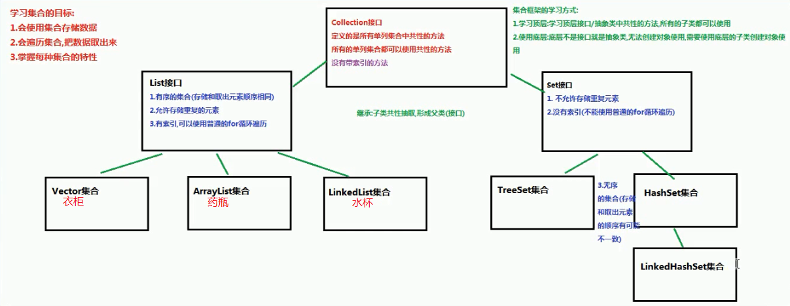
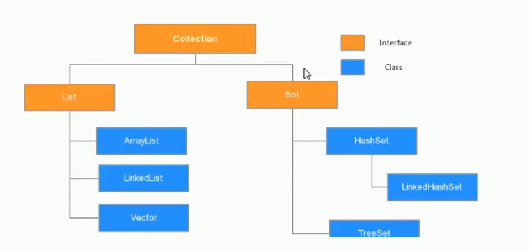
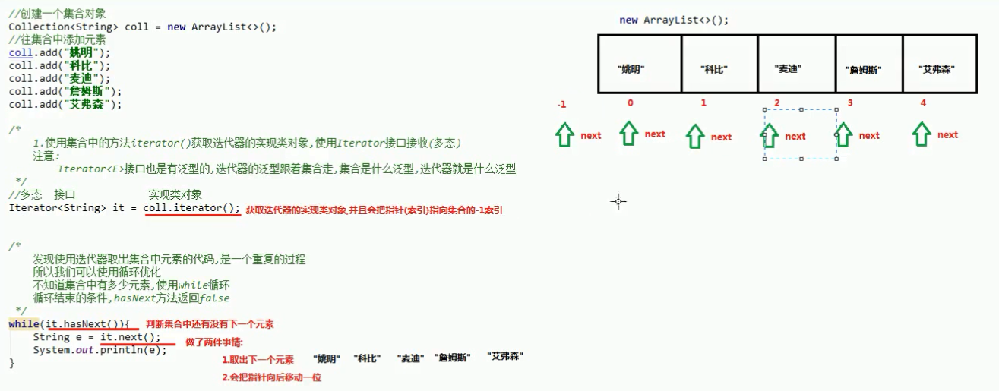
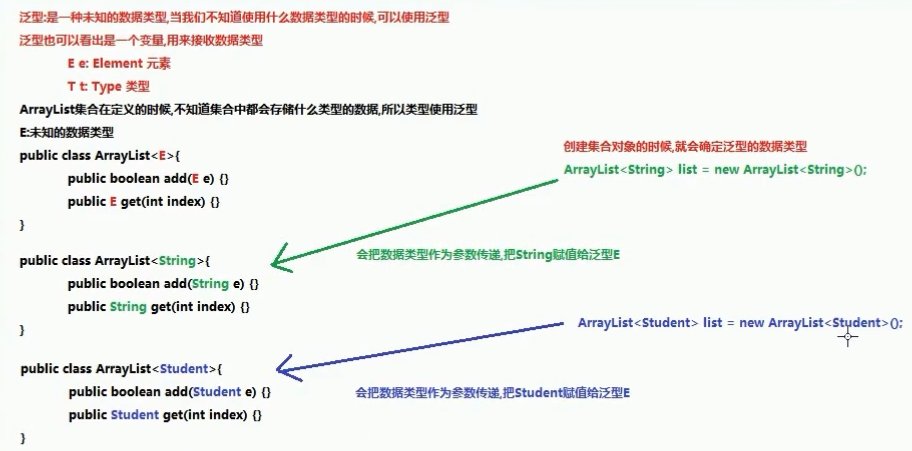
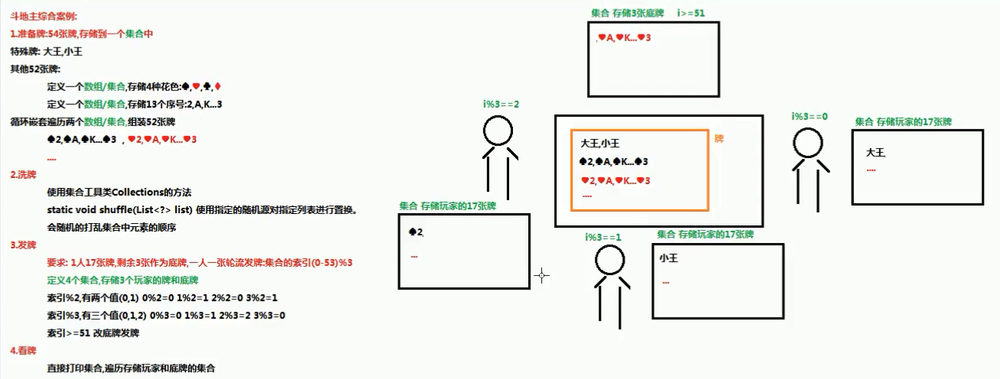

# Collection、泛型

# 一、 Collection集合

## 1.1 集合概述

**集合**：集合是java中提供的一种容器，可以用来存储多个数据

集合和数组既然都是容器，它们有啥区别呢？

- 数组的**长度是固定的**。集合的长度是**可变的**。
- 数组中存储的是同一类型的元素，可以存储基本数据类型值。集合存储的都是对象。而且对象的类型可以不一致。在开发中一般当对象多的时候，使用集合进行存储。

## 1.2 集合框架

JAVASE提供了满足各种需求的API，在使用这些API前，先了解其继承与接口操作架构，才能了解何时采用哪个类，以及类之间如何彼此合作，从而达到灵活应用。

集合按照其存储结构可以分为两大类，分别是单列集合`java.util.Collection`和双列集合`java.util.Map`

- **Collection**：单列集合类的根接口，用于存储一系列符合某种规则的元素，它有两个重要的子接口，分别是

  `java.util.List`和`java.util.Set`。其中，`List`的特点是元素有序、元素可重复。`Set`的特点是元素无序，而且不可重复。`List`接口的主要实现类有`java.util.ArrayList`和`java.util.LinkedList`，`Set`接口的主要实现类有`java.util.HashSet`和`java.util.TreeSet`。

JDK中提供了丰富的集合类库，接下来通过一张图来描述整个集合类的继承体系。





集合本身是一个工具，它存放在java.util包中。在`Collection`接口定义着单列集合框架中最最共性的内容

## 1.3 Collection 常用功能

Collection是所有单列集合的父接口，因此在Collection中定义了单列集合(List和Set)通用的一些方法，这些方法可用于操作所有的单列集合。方法如下：

- `public boolean add(E e)`： 把给定的对象添加到当前集合中 。

- `public void clear()` :清空集合中所有的元素

- `public boolean remove(E e)`: 把给定的对象在当前集合中删除。
- `public boolean contains(E e)`: 判断当前集合中是否包含给定的对象。

- `public boolean isEmpty()`: 判断当前集合是否为空。
- `public int size()`: 返回集合中元素的个数。

- `public Object[] toArray()`: 把集合中的元素，存储到数组中。

```java
package com.wck.demo01collection;

import java.util.ArrayList;
import java.util.Collection;
import java.util.Collections;

/**
 * @author 御香烤翅
 * @create 2020-03-26 21:20
 *
 * java.util.Collection：所有单列集合的最顶层的接口，里面定义了所有单列集合的共性方法
 *                       任意的单列集合都可以使用Collection接口中的方法
 *
 *  共性的方法：
 *     public boolean add(E e)： 把给定的对象添加到当前集合中 。
 *     public void clear() :清空集合中所有的元素
 *     public boolean remove(E e): 把给定的对象在当前集合中删除。
 *     public boolean contains(E e): 判断当前集合中是否包含给定的对象。
 *     public boolean isEmpty(): 判断当前集合是否为空。
 *     public int size(): 返回集合中元素的个数。
 *     public Object[] toArray(): 把集合中的元素，存储到数组中。
 */
public class Demo01Collection {

    public static void main(String[] args) {

        //使用多态，创建集合对象
        Collection<String> coll =new ArrayList<>();
        System.out.println(coll);

        /**
         * public boolean add(E e)： 把给定的对象添加到当前集合中 。
         *  返回boolean值，一般为true，不用接收
         */
        boolean b = coll.add("张三");
        System.out.println(b);
        System.out.println(coll);
        coll.add("李四");
        coll.add("王五");
        coll.add("赵六");
        coll.add("孙七");
        System.out.println(coll);//[张三, 李四, 王五, 赵六, 孙七]
        /**
         * public boolean remove(E e): 把给定的对象在当前集合中删除。
         *      返回值: true:集合中存在这个元素，删除返回true
         *             false:集合中不存在这个元素，删除失败返回 false
         */
        boolean b1 = coll.remove("赵六");//true
        System.out.println(b1);
        boolean b2 = coll.remove("王八");
        System.out.println(b2);//false
        System.out.println(coll);//[张三, 李四, 王五, 孙七]
        /**
         * public boolean contains(E e): 判断当前集合中是否包含给定的对象。
         *  包含：返回true
         *  不包含：返回false
         */
        boolean b3 = coll.contains("张三");//true
        System.out.println(b3);
        boolean b4 = coll.contains("王八");
        System.out.println(b4);//false
        /**
         * public boolean isEmpty(): 判断当前集合是否为空。
         */
        boolean empty = coll.isEmpty();
        System.out.println(empty);//false
        /**
         *  public int size(): 返回集合中元素的个数。
         */
        int size = coll.size();
        System.out.println(size);//4 [张三, 李四, 王五, 孙七]
        /**
         * public Object[] toArray(): 把集合中的元素，存储到数组中。
         */
        Object[] array = coll.toArray();
        for (Object o : array) {
            System.out.println(o);
        }
        /**
         *  public void clear() :清空集合中所有的元素
         *   注意只是清空集合里面的数据，而不删除集合，集合还在
         */
        coll.clear();
        boolean empty1 = coll.isEmpty();
        System.out.println(empty1);//true
    }

}

```

## 二、 Iterator迭代器

## 2.1 Iterator接口

在程序开发中，经常需要遍历集合中的所有元素。针对这种需求，JDK专门提供了一个接口`java.util.Iterator`。`Iterator`接口也是Java集合中的一员，但它与`Collection`、`Map`接口有所不同，`Collection`接口与`Map`接口主要用于存储元素，而`Iterator`主要用于迭代访问（即遍历）`Collection`中的元素，因此`Iterator`对象也被称为迭代器。想要遍历Collection集合，那么就要获取该集合迭代器完成迭代操作

`public Iterator iterator()`: 获取集合对应的迭代器，用来遍历集合中的元素的

迭代的概念：

- **迭代**：即Collection集合元素的通用获取方式。在取元素之前先要判断集合中有没有元素，如果有，就把这个元素取出来，继续在判断，如果还有就再取出出来。一直把集合中的所有元素全部取出。这种取出方式专业术语称为迭代。

Iterator接口的常用方法如下：

- `public E next()`:返回迭代的下一个元素。
- `public boolean hasNext()`:如果仍有元素可以迭代，则返回 true。

```java
package com.wck.demo02iterator;

import java.util.ArrayList;
import java.util.Collection;
import java.util.Iterator;

/**
 * @author 御香烤翅
 * @create 2020-03-26 22:02
 *
 *  java.util.Iterator  public interface Iterator<E> 是一个接口
 *      也称为：迭代器（对集合进行遍历）
 *
 *   有两个常用的方法：
 *      boolean hasNext() 如果迭代具有更多元素，则返回 true
 *          判断集合中还有没有下一个元素，有 返回 true ，没有返回 false
 *      E next() 返回迭代中的下一个元素。
 *          取出集合中的下一个元素
 *
 *  Iterator迭代器是一个接口，我们无法直接使用，需要使用Iterator接口类的实现对象，获取实现类比较特殊
 *  Collection接口中有一个方法叫iterator()，这个方法返回的就是迭代器的实现类对象
 *      Iterator<E> iterator() 返回此集合中的元素的迭代器
 *
 *  迭代器的使用步骤（重点）：
 *      1.使用Collection的iterator()获取迭代器的实现类对象，使用Iterator接口接受（多态）
 *      2.使用Iterator接口中的hasNext()方法判断还有没有下一个元素
 *      3.使用Iterator接口中的next方法取出集合中的下一个元素
 */
public class Demo01Iterator {

    public static void main(String[] args) {
        //创建一个集合对象
        Collection<String> coll=new ArrayList<>();
        //往集合中添加元素
        coll.add("张三");
        coll.add("李四");
        coll.add("王五");
        coll.add("赵六");
        coll.add("孙七");

        /**
         * 1.使用Collection的iterator()获取迭代器的实现类对象，使用Iterator接口接受（多态）
         *  注意 迭代器Iterator<E>接口也是有泛型的，迭代器的泛型跟着集合走，集合是什么泛型，迭代器就是什么泛型
         */
        Iterator<String> iterator = coll.iterator();
        //2.使用Iterator接口中的hasNext()方法判断还有没有下一个元素

        while (iterator.hasNext()){
            System.out.println(iterator.next());
        }
        //3.使用Iterator接口中的next方法取出集合中的下一个元素
    }
}

```

## 2.2 迭代器的实现原理

之前已经完成了Iterator遍历集合。当遍历集合时，首先通过调用集合的iterator()方法获得迭代器对象，然后使用hashNext()方法判断集合中是否存在下一个元素，如果存在，则调用next()方法将元素取出，否则说明已到达了集合末尾，停止遍历元素。

Iterator迭代器对象在遍历集合时，内部采用指针的方式来跟踪集合中的元素，一个图例来演示Iterator对象迭代元素的过程：



在调用Iterator的next方法之前，迭代器的索引位于第一个元素之前，不指向任何元素，当第一次调用迭代器的next方法后，迭代器的索引会向后移动一位，指向第一个元素并将该元素返回，当再次调用next方法时，迭代器的索引会指向第二个元素并将该元素返回，依此类推，直到hasNext方法返回false，表示到达了集合的末尾，终止对元素的遍历。

## 2.3 增强for

增强for循环(也称for each循环)是**JDK1.5**以后出来的一个高级for循环，专门用来遍历数组和集合的。它的内部原理其实是个Iterator迭代器，所以在遍历的过程中，不能对集合中的元素进行增删操作。

格式：

```java
for(元素的数据类型  变量 : Collection集合or数组){ 
  	//写操作代码
}
```


```java
package com.wck.demo02iterator;

import java.util.ArrayList;
import java.util.Collection;

/**
 * @author 御香烤翅
 * @create 2020-03-26 22:42
 	所有的单列集合都可以使用增强for
 */
public class Demo02foreach {

    public static void main(String[] args) {
        Collection<String> coll=new ArrayList<>();
        //往集合中添加元素
        coll.add("张三");
        coll.add("李四");
        coll.add("王五");
        coll.add("赵六");
        coll.add("孙七");

        //遍历集合
        for (String s : coll) {
            System.out.println(s);
        }

        //遍历数组
        int[] arr = {3,5,6,87};
        //使用增强for遍历数组
        for(int a : arr){//a代表数组中的每个元素
            System.out.println(a);
        }
    }
}

```

# 第三章 泛型

## 3.1 泛型概述

集合中是可以存放任意对象的，只要把对象存储集合后，那么这时他们都会被提升成Object类型。当我们在取出每一个对象，并且进行相应的操作，这时必须采用类型转换。



- **泛型**：可以在类或方法中预支地使用未知的类型。

## 3.2 使用泛型的好处

上一节只是讲解了泛型的引入，那么泛型带来了哪些好处呢？

- 将运行时期的ClassCastException，转移到了编译时期变成了编译失败。
- 避免了类型强转的麻烦。

```java
package com.wck.demo03generic;

import java.util.ArrayList;
import java.util.Iterator;

/**
 * @author 御香烤翅
 * @create 2020-03-27 8:18
 */
public class Demo01Generic {

    public static void main(String[] args) {
        show02();
    }

    /**
     * 创建集合对象，使用泛型
     * 好处：
     *  1 避免了类型转换的麻烦，存储的是什么类型，取出的就是什么类型
     *  2 把运行期异常（代码运行之后会抛出的异常），提升到了编译期（写代码的时候就会报错）
     * 弊端：
     *  泛型是什么类型，就只能存储什么类型的数据
     */
    private static void show02() {

        ArrayList<String> arrayList = new ArrayList<>();
        arrayList.add("张三");
        //arrayList.add(1);//这是编译期直接报错->add(java.lang.String)in ArrayList cannot be applied to(int)

        //使用迭代器来遍历集合
        Iterator<String> iterator = arrayList.iterator();
        while (iterator.hasNext()){
            String s = iterator.next();
            System.out.println(s.length());
        }

    }

    /**
     * 创建集合对象，不使用泛型
     * 好处：
     *  集合不使用泛型，默认就是Object类型，可以存储任意数据类型
     * 弊端：
     *  不安全，会引发异常
     *
     */
    private static void show01() {

        ArrayList<Object> arrayList = new ArrayList<>();
        arrayList.add("张三");
        arrayList.add(1);

        //使用迭代器进行遍历集合
        Iterator<Object> iterator = arrayList.iterator();
        while (iterator.hasNext()){
            Object next = iterator.next();
            System.out.println(next);

            //想要使用String类特有的方法，length获取字符串的长度；不能使用 多态 Object obj="abc"
            //多态的弊端：不能使用子类特有的方法
            //需要向下转型
            /**
             * 发生的报错:
             *  Exception in thread "main" java.lang.ClassCastException: java.lang.Integer cannot be cast to java.lang.String
             */
            //会抛出ClassCastException类型转换异常，不能把Integer类型转换为String类型
            String s= (String) next;
            System.out.println(s.length());
        }
    }

}


```

## 3.3 泛型的定义与使用

在集合中会大量使用到泛型，这里来完整地学习泛型知识。

泛型，用来灵活地将数据类型应用到不同的类、方法、接口当中。将数据类型作为参数进行传递。

### 定义和使用含有泛型的类

定义格式：

```
修饰符 class 类名<代表泛型的变量> {  }
```

例如，API中的ArrayList集合：

```java
class ArrayList<E>{ 
    public boolean add(E e){ }

    public E get(int index){ }
   	....
}

```

使用泛型： 即什么时候确定泛型。

在创建对象的时候确定泛型

例如，`ArrayList<String> list = new ArrayList<String>();`

此时，变量E的值就是String类型,那么我们的类型就可以理解为：

```java
class ArrayList<String>{ 
     public boolean add(String e){ }

     public String get(int index){  }
     ...
}
```

再例如，`ArrayList<Integer> list = new ArrayList<Integer>();`

此时，变量E的值就是Integer类型,那么我们的类型就可以理解为：

```java
class ArrayList<Integer> { 
     public boolean add(Integer e) { }

     public Integer get(int index) {  }
     ...
}
```


代码：

```java
package com.wck.demo03generic;

/**
 * @author 御香烤翅
 * @create 2020-03-27 8:43
 */
public class Demo02GenericClass {


    public static void main(String[] args) {
        //不写默认是 object类型
        GenericClass genericClass = new GenericClass();
        genericClass.setName("只能是Object");
        Object name = genericClass.getName();
        GenericClass<Integer> integerGenericClass = new GenericClass<>();
        integerGenericClass.setName(1);
        Integer name1 = integerGenericClass.getName();//返回的也是Integer
        System.out.println(name1);

        //再创建一个String类型的

        GenericClass<String> stringGenericClass = new GenericClass<>();
        stringGenericClass.setName("小明");
        String name2 = stringGenericClass.getName();
        System.out.println(name2);
    }
}

```

### 含有泛型的方法

定义格式：

```java
修饰符 <代表泛型的变量> 返回值类型 方法名(参数){  }
```


```java
package com.wck.demo03generic;

/**
 * @author 御香烤翅
 * @create 2020-03-27 8:53
 *
 * 定义含有泛型的方法：泛型定义在方法的修饰符和返回值类型之间
 *  格式：
 *      修饰符 <泛型> 返回值类型 方法名（参数列表（使用泛型））{
 *          方法体；
 *      }
 *
 *  含有泛型的方法，在调用方法的时候确定泛型的数据类型
 *  传递什么类型的参数，泛型就是什么类型
 *
 *
 */
public class GenericMethod {

    //定义一个含有泛型的方法
    //如果把<M> 删除 ，会报错，必须要先定义 <M> ->（M m）才能使用，否则报错
    public <M> void method01(M m){
        System.out.println(m);
    }

    //含有泛型的静态方法
    public static <M> void method02(M m){
        System.out.println(m);
    }

}

```


```java
package com.wck.demo03generic;

/**
 * @author 御香烤翅
 * @create 2020-03-27 9:00
 * 测试含有泛型的方法
 */
public class Demo03GenericMethod {

    public static void main(String[] args) {

        //创建GenericMethod对象
        GenericMethod genericMethod = new GenericMethod();

        /**
         * 调用含有泛型类型的方法 method01
         * 传递什么类型，泛型就是什么类型
         */

        genericMethod.method01("这是字符串");
        genericMethod.method01(1);
        genericMethod.method01(8.8);
        genericMethod.method01(true);

        //使用静态方法
        GenericMethod.method02("字符串");
        GenericMethod.method02(1);
        GenericMethod.method02(true);
    }
}

```

### 含有泛型的接口

定义格式：

```java
修饰符 interface接口名<代表泛型的变量> {  }
```

```java
package com.wck.demo03generic;

/**
 * @author 御香烤翅
 * @create 2020-03-27 9:07
 *
 * 定义含有泛型的接口

 */
public interface GenericInterface<I> {
    public abstract void method1(I i);
}

```

```java
package com.wck.demo03generic;

/**
 * @author 御香烤翅
 * @create 2020-03-27 9:10
 * 含有泛型的接口，第一种使用方式：定义接口的实现类，实现接口，指定接口的泛型
 * public interface Iterator<E> {
 *      E next();
 * }
 *
 * //Scanner实现了 Iterator接口，并指定接口的泛型为String，所以重写的next方法默认就是String
 * public final class Scanner implements Iterator<String>{
 *       public String next() {}
 * }
 */
public class GenericInterfaceImpl1 implements GenericInterface<String> {

    @Override
    public void method1(String s) {
        System.out.println(s.getClass().getName());
    }
}

```

```java
package com.wck.demo03generic;

/**
 * @author 御香烤翅
 * @create 2020-03-27 9:23
 *
 * 含有泛型的接口第二种使用方式：接口使用什么泛型，实现类就是用什么类型 ，类跟着接口走
 * 就相当于定义了含有泛型的类，创建对象的时候确定泛型的类型
 *
 * public interface List<E>{
 *      boolean add(E e);
 *      E get(int index);
 * }
 *
 * public class ArrayList<E> implements List<E>{
 *       public boolean add(E e) {}
 *        public E get(int index) {}
 * }
 */
public class GenericInterfaceImpl2<I> implements GenericInterface<I>{
    @Override
    public void method1(I i) {
        System.out.println(i.getClass().getName());
    }
}

```

## 3.4 泛型通配符

当使用泛型类或者接口时，传递的数据中，泛型类型不确定，可以通过通配符<?>表示。但是一旦使用泛型的通配符后，只能使用Object类中的共性方法，集合中元素自身方法无法使用。

#### 通配符基本使用

泛型的通配符:**不知道使用什么类型来接收的时候,此时可以使用?,?表示未知通配符。**

此时只能接受数据,不能往该集合中存储数据。

```java
package com.wck.demo03generic;

import java.util.ArrayList;
import java.util.Iterator;

/**
 * @author 御香烤翅
 * @create 2020-03-27 9:49
 * 泛型的通配符
 *  ?：代表任意的数据类型
 *
 * 使用方式：
 *  不能创建对象使用
 *  只能作为方法的参数使用
 *
 *
 */
public class Demo05Generic {

    public static void main(String[] args) {
        ArrayList<String> list1 = new ArrayList<>();
        list1.add("张三");
        list1.add("李四");

        printArrayList2(list1);

        ArrayList<Integer> list2 = new ArrayList<>();
        list2.add(1);
        list2.add(2);

        printArrayList2(list2);
    }

    /**
     * 定义一个方法能遍历所有类型的ArrayList集合
     * 这时候我们不知道ArrayList集合使用什么数据类型，可以使用泛型的通配符?来接收数据类型
     */
    public static  <E> void printArrayList1(ArrayList<E> list){

        for (E e : list) {
            System.out.println(e);
        }
    }
    /**
     * 使用泛型通配符 ?
     * @param list
     */
    public static void printArrayList2(ArrayList<?> list){
        Iterator<?> iterator = list.iterator();
        while (iterator.hasNext()){
            //泛型通配符得到的是 object
            Object next = iterator.next();
            System.out.println(next);
        }
    }

}

```

#### 通配符高级使用----受限泛型

之前设置泛型的时候，实际上是可以任意设置的，只要是类就可以设置。但是在JAVA的泛型中可以指定一个泛型的**上限**和**下限**。

**泛型的上限**：

- **格式**： `类型名称 <? extends 类 > 对象名称`
- **意义**： `只能接收该类型及其子类`

**泛型的下限**：

- **格式**： `类型名称 <? super 类 > 对象名称`
- **意义**： `只能接收该类型及其父类型`

```java
package com.wck.demo03generic;

import java.util.ArrayList;
import java.util.Collection;

/**
 * @author 御香烤翅
 * @create 2020-03-27 10:03
 *
 *  泛型的上限限定： ? extends E 代表使用的泛型类型只能是E类型的子类/本身
 *  泛型的下限限定： ? super E   代表使用的泛型类型只能是E类型的父类/本身
 *
 */
public class Demo06Generic {

    public static void main(String[] args) {
        Collection<Integer> list1 = new ArrayList<Integer>();
        Collection<String> list2 = new ArrayList<String>();
        Collection<Number> list3 = new ArrayList<Number>();
        Collection<Object> list4 = new ArrayList<Object>();

        getElement1(list1);
        getElement1(list2);//报错
        getElement1(list3);
        getElement1(list4);//报错

        getElement2(list1);//报错
        getElement2(list2);//报错
        getElement2(list3);
        getElement2(list4);

        /**
         * 类之间的继承关系
         * Integer extends Integer extends Object
         * String extends Object
         */
    }
    // 泛型的上限：此时的泛型?，必须是Number类型或者Number类型的子类
    public static void getElement1(Collection<? extends Number> coll){}
    // 泛型的下限：此时的泛型?，必须是Number类型或者Number类型的父类
    public static void getElement2(Collection<? super Number> coll){}
}

```

# 四、 集合斗地主

## 4.1 介绍

按照斗地主的规则，完成洗牌发牌的动作。
具体规则：

使用54张牌打乱顺序,三个玩家参与游戏，三人交替摸牌，每人17张牌，最后三张留作底牌。



- **准备牌：**

  牌可以设计为一个ArrayList,每个字符串为一张牌。
  每张牌由花色数字两部分组成，我们可以使用花色集合与数字集合嵌套迭代完成每张牌的组装。

- **洗牌**

  由Collections类的shuffle方法进行随机排序。

- **发牌**

  将每个人以及底牌设计为ArrayList,将最后3张牌直接存放于底牌，剩余牌通过对3取模依次发牌。

- **看牌**

  直接打印每个集合。

```java
package com.wck.demo04Test;

import java.util.ArrayList;
import java.util.Collections;
import java.util.Iterator;

/**
 * @author 御香烤翅
 * @create 2020-03-27 10:45
 *
 * 斗地主步骤
 *  1 准备牌
 *  2 洗牌
 *  3 发牌
 *  4 看牌
 *
 */
public class Doudizhu {

    public static void main(String[] args) {
        //1 准备牌
        //定义一个存储54张牌的ArrayList集合，泛型使用String
        ArrayList<String> poker = new ArrayList<>();
        //定义两个数组，一个存储牌的花色，一个存储牌的序号
        String[] colors={"♥","♠","♣","♦"};
        String[] numbers={"2","A","K","Q","J","10","9","8","7","6","5","4","3"};
        //先把大王，小王存储到poker集合中
        poker.add("大王");
        poker.add("小王");
        for (String number : numbers) {
            for (String color : colors) {
//                System.out.println(color+number);
                poker.add(color+number);
            }
        }

        /**
         * 2 洗牌
         * 使用集合工具类Collections里面的方法shuffle
         *      static void shuffle(List<?> list) 使用默认的随机源随机排列指定的列表。
         */
        Collections.shuffle(poker);
//        System.out.println(poker);

        /**
         * 3 发牌
         *  定义4个集合，存储玩家的牌和底牌
         */

        ArrayList<String> player01 = new ArrayList<>();
        ArrayList<String> player02 = new ArrayList<>();
        ArrayList<String> player03 = new ArrayList<>();
        ArrayList<String> diPai = new ArrayList<>();

        /**
         * 遍历poker集合，获取每一张牌
         * 使用poker集合的索引给3个玩家轮流发牌
         * 剩余3张给底牌
         * 注意：
         *  先判断底牌的（i>51）,否则牌就会发没了
         */
        for (int i = 0; i < poker.size(); i++) {
            String p = poker.get(i);//获取到的每一张牌
            //轮流发牌
            if(i>=51){//给底牌发牌
                diPai.add(p);
            }else if(i%3==0){//玩家1
                player01.add(p);
            }else if(i%3==1){//玩家2
                player02.add(p);
            }else if(i%3==2){//玩家3
                player03.add(p);
            }
        }
        //4 看牌
        System.out.println("player01:"+player01);
        System.out.println("player02:"+player02);
        System.out.println("player03:"+player03);
        System.out.println("diPai:"+diPai);
/*        Iterator<String> iterator = poker.iterator();
        while (iterator.hasNext()){
            System.out.println(iterator.next());
        }*/


    }
}

```

d3