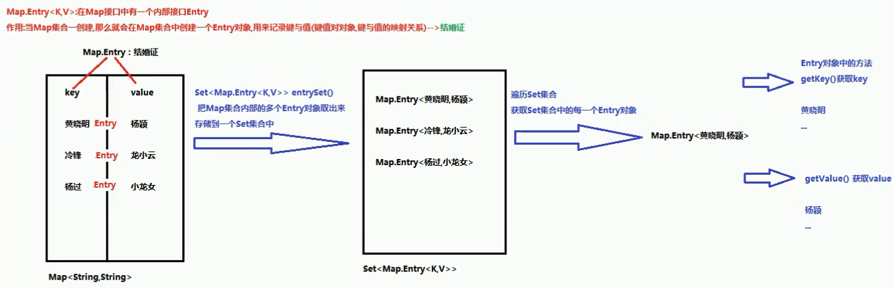
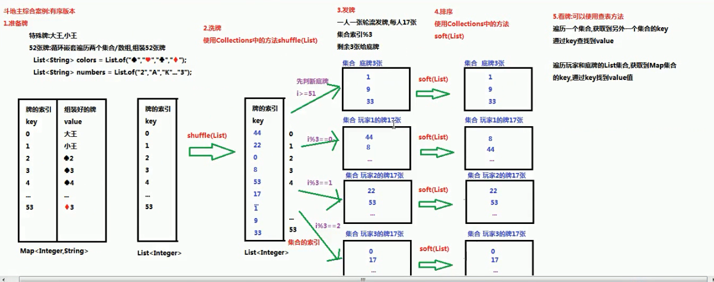

# Map

# 一、 Map集合

## 1.1 概述

现实生活中，我们常会看到这样的一种集合：IP地址与主机名，身份证号与个人，系统用户名与系统用户对象等，这种一一对应的关系，就叫做映射。Java提供了专门的集合类用来存放这种对象关系的对象，即`java.util.Map`接口。

我们通过查看`Map`接口描述，发现

`Map`接口下的集合与`Collection`接口下的集合，它们存储数据的形式不同

- `Collection`中的集合，元素是孤立存在的（理解为单身），向集合中存储元素采用一个个元素的方式存储。

- `Map`中的集合，元素是成对存在的(理解为夫妻)。每个元素由键与值两部分组成，通过键可以找对所对应的值

- `Collection`中的集合称为单列集合，`Map`中的集合称为双列集合。

- 需要注意的是，`Map`中的集合不能包含重复的键，值可以重复；每个键只能对应一个值。

## 1.2 Map常用子类

通过查看Map接口描述，看到Map有多个子类，这里我们主要讲解常用的HashMap集合、LinkedHashMap集合。

- **HashMap<K,V>**：存储数据采用的哈希表结构，元素的存取顺序不能保证一致。由于要保证键的唯一、不重复，需要重写键的hashCode()方法、equals()方法。

- **LinkedHashMap<K,V>**：HashMap下有个子类LinkedHashMap，存储数据采用的哈希表结构+链表结构。通过链表结构可以保证元素的存取顺序一致；通过哈希表结构可以保证的键的唯一、不重复，需要重写键的hashCode()方法、equals()方法。

## 1.3 Map接口中的常用方法

Map接口中定义了很多方法，常用的如下：

- `public V put(K key, V value)`: 把指定的键与指定的值添加到Map集合中。

- `public V remove(Object key)`: 把指定的键 所对应的键值对元素 在Map集合中删除，返回被删除元素的值。
- `public V get(Object key)` 根据指定的键，在Map集合中获取对应的值。

- `boolean containsKey(Object key)` 判断集合中是否包含指定的键。
- `public Set<K> keySet()`: 获取Map集合中所有的键，存储到Set集合中。

- `public Set<Map.Entry<K,V>> entrySet()`: 获取到Map集合中所有的键值对对象的集合(Set集合)。

方法代码：

```java
package com.wck.demo10map;

import java.util.HashMap;
import java.util.Map;

/**
 * @author 御香烤翅
 * @create 2020-03-28 10:30
 *
 *  java.util.map<k,v>
 *      Map集合的特点:
 *            1 Map集合是一个双列集合,一个元素包含两个值(一个key,一个 vaLue)
 *            2 Map集合中的元素,key和vue的数据类型可以相同,也可以不同
 *            3 Map集合中的元素,key是不允许重复的, value是可以重复的
 *
 *  java.util.HashMap<k,v> implement java.util.map<k,v> 接口
 *      HashMap集合的特点：
 *          1 HashMap的集合底层是哈希表：查询的速度特别的快
 *              JDK1.8 之前采用 数组+单向链表
 *              JDK1.9 之后采用 数组+单向链表/红黑树（链表的长度超过8）：提高查询速度
 *          2 HashMap集合是一个无序的集合，存储元素和取出元素的顺序有可能不一致
 *  java.util.LinkerHashMap<k,v> 集合 extends java.util.HashMap<k,v>
 *      LinkerHashMap集合的特点：
 *          1 LinkerHashMap集合底层是哈希表+链表（保证迭代的顺序）
 *          2 LinkerHashMap集合是一个有序的集合，存储元素和取出元素的顺序是一致的
 *
 */
public class Demo01Map {

    public static void main(String[] args) {
        show04();
    }

    /**
     * boolean containsKey(Object key) 判断集合中是否包含指定的键。
     *  返回值 boolean:
     *     key存在，boolean返回值true
     *     key不存在,boolean返回false
     */
    private static void show04() {
        Map<String,Integer> map=new HashMap<>();
        map.put("wck",18);
        map.put("yxkc",19);

        boolean wck = map.containsKey("wck");
        boolean www = map.containsKey("www");
        System.out.println(wck);//true
        System.out.println(www);//false

    }


    /**
     * public V get(Object key) 根据指定的键，在Map集合中获取对应的值。
     *   返回值 V:
     *      key存在，v返回值
     *      key不存在,v返回null
     */
    private static void show03() {
        Map<String,Integer> map=new HashMap<>();
        map.put("wck",18);
        map.put("yxkc",19);

        Integer wck = map.get("wck");
        Integer www = map.get("www");
        System.out.println(wck);//18
        System.out.println(www);//null

    }

    /**
     * public V remove(Object key): 把指定的键 所对应的键值对元素 在Map集合中删除，返回被删除元素的值。
     *
     *  返回值 V:
     *      key存在，v返回被删除的值
     *      key不存在,v返回null
     */
    private static void show02() {
        //创建Map集合多态
        Map<String,Integer> map=new HashMap<>();
        map.put("wck",18);
        map.put("yxkc",19);

        Integer wck = map.remove("wck");
        Integer wwww = map.remove("wwww");
        System.out.println(wwww);//null
        System.out.println(wck);//18
        System.out.println(map);//{yxkc=19}
    }

    /**
     * public V put(K key, V value): 把指定的键与指定的值添加到Map集合中。
     *
     *  返回值 V ：
     *      1 存储键值对的时候，key不重复，返回null
     *      2 存储键值对的时候，key重复，会使用新的value替换map中重复的value，返回被替换的value值
     */
    private static void show01() {

        //创建Map集合多态
        Map<String,String> map=new HashMap<>();
        String v1=map.put("wck","18");
        System.out.println("v1:"+v1);//v1:null

        String v2=map.put("wck","18");
        System.out.println("v2:"+v2);//v2:18

        System.out.println(map);//{wck=18}

        Map<String,String> map1=new HashMap<>();
        map1.put("wck","18");
        map1.put("wcc","18");
        System.out.println(map1);//{wcc=18, wck=18} value 可以重复
    }

}

```

## 1.4 Map集合遍历键找值方式

键找值方式：即通过元素中的键，获取键所对应的值

分析步骤：

1. 获取Map中所有的键，由于键是唯一的，所以返回一个Set集合存储所有的键。方法提示:`keyset()`
2. 遍历键的Set集合，得到每一个键。
3. 根据键，获取键所对应的值。方法提示:`get(K key)`

```java
package com.wck.demo10map;

import java.util.HashMap;
import java.util.Iterator;
import java.util.Map;
import java.util.Set;

/**
 * @author 御香烤翅
 * @create 2020-03-28 11:41
 *
 * Map集合的第一种遍历方式： 通过键找值的方式
 *  public Set<K> keySet(): 获取Map集合中所有的键，存储到Set集合中
 *
 *  Set<K> keySet() 返回此map中包含的键的Set视图。
 * 实现步骤：
 *     1 使用map集合的keySet()方法，把map集合的所有的key取出来，放入到一个Set集合中
 *     2 遍历set集合，获取Map集合中的每一个key
 *     3 通过map集合中的方法get(key),通过key找到value
 *
 */
public class Demo02KeySet {

    public static void main(String[] args) {
        //创建Map集合多态
        Map<String,Integer> map=new HashMap<>();
        map.put("wck",18);
        map.put("yxkc",19);
        map.put("wck2",20);

        // 1 使用map集合的keySet()方法，把map集合的所有的key取出来，放入到一个Set集合中
        Set<String> strings = map.keySet();
        //2 遍历set集合，获取Map集合中的每一个key
        for (String string : strings) {
            //3 通过map集合中的方法get(key),通过key找到value
            Integer integer = map.get(string);
            System.out.println(integer);
        }


        //使用迭代器
        Iterator<String> iterator = strings.iterator();
        while (iterator.hasNext()){
            System.out.println(map.get(iterator.next()));
        }

    }
}

```

## 1.5 Entry键值对对象



`Map`中存放的是两种对象，一种称为**key**(键)，一种称为**value**(值)，它们在在`Map`中是一一对应关系，这一对对象又称做`Map`中的一个`Entry(项)`。`Entry`将键值对的对应关系封装成了对象。即键值对对象，这样我们在遍历`Map`集合时，就可以从每一个键值对（`Entry`）对象中获取对应的键与对应的值。

既然Entry表示了一对键和值，那么也同样提供了获取对应键和对应值得方法：

- `public K getKey()`：获取Entry对象中的键。
- `public V getValue()`：获取Entry对象中的值。

在Map集合中也提供了获取所有Entry对象的方法：

- `public Set<Map.Entry<K,V>> entrySet()`: 获取到Map集合中所有的键值对对象的集合(Set集合)。

## 1.6 Map集合遍历键值对方式

键值对方式：即通过集合中每个键值对(Entry)对象，获取键值对(Entry)对象中的键与值。

操作步骤：

1 获取Map集合中，所有的键值对(Entry)对象，以Set集合形式返回。方法提示:`entrySet()`。

2 遍历包含键值对(Entry)对象的Set集合，得到每一个键值对(Entry)对象。

3 通过键值对(Entry)对象，获取Entry对象中的键与值。 方法提示:`getkey() getValue()`

```java
package com.wck.demo10map;

import java.util.HashMap;
import java.util.Iterator;
import java.util.Map;
import java.util.Set;

/**
 * @author 御香烤翅
 * @create 2020-03-28 11:59
 *
 *  Map集合的第二种遍历方式：使用Entry进行遍历
 *      Set<Map.Entry<K,V>> entrySet() 返回此Map中包含的映射的Set视图。
 *
 *  使用步骤：
 *      1 使用Map集合中的方法entrySet()，把map集合中的多个Entry对象取出来，放入set集合中
 *      2 遍历set集合，获取每一个Entry对象
 *      3 使用的Entry对象的getKey()和getValue()获取键与值
 */
public class Demo03EntrySet {

    public static void main(String[] args) {
        //创建Map集合多态
        Map<String,Integer> map=new HashMap<>();
        map.put("wck",18);
        map.put("yxkc",19);
        map.put("wck2",20);

        //第一种遍历方式
        for (Map.Entry<String, Integer> entry : map.entrySet()) {
            System.out.println("key:"+entry.getKey()+",value:"+entry.getValue());
        }

        System.out.println("----------------------");
        //第二种遍历方式

        Set<Map.Entry<String, Integer>> entries = map.entrySet();
        Iterator<Map.Entry<String, Integer>> iterator = entries.iterator();
        while (iterator.hasNext()){
            Map.Entry<String, Integer> entry=iterator.next();
           System.out.println("key:"+ entry.getKey()+",value:"+ entry.getValue());
        }

    }
}

```

## 1.7 HashMap存储自定义类型键值

练习：每位学生（姓名，年龄）都有自己的家庭住址。那么，既然有对应关系，则将学生对象和家庭住址存储到map集合中。学生作为键, 家庭住址作为值。

> 注意，学生姓名相同并且年龄相同视为同一名学生。

编写学生类：

```java
public class Student {
    private String name;
    private int age;

    public Student() {
    }

    public Student(String name, int age) {
        this.name = name;
        this.age = age;
    }

    public String getName() {
        return name;
    }

    public void setName(String name) {
        this.name = name;
    }

    public int getAge() {
        return age;
    }

    public void setAge(int age) {
        this.age = age;
    }

    @Override
    public boolean equals(Object o) {
        if (this == o)
            return true;
        if (o == null || getClass() != o.getClass())
            return false;
        Student student = (Student) o;
        return age == student.age && Objects.equals(name, student.name);
    }

    @Override
    public int hashCode() {
        return Objects.hash(name, age);
    }
}

```

编写测试类:

```java
public class HashMapTest {
    public static void main(String[] args) {
        //1,创建Hashmap集合对象。
        Map<Student,String>map = new HashMap<Student,String>();
        //2,添加元素。
        map.put(newStudent("lisi",28), "上海");
        map.put(newStudent("wangwu",22), "北京");
        map.put(newStudent("zhaoliu",24), "成都");
        map.put(newStudent("zhouqi",25), "广州");
        map.put(newStudent("wangwu",22), "南京");
        
        //3,取出元素。键找值方式
        Set<Student>keySet = map.keySet();
        for(Student key: keySet){
            Stringvalue = map.get(key);
            System.out.println(key.toString()+"....."+value);
        }
    }
}

```

- 当给HashMap中存放自定义对象时，如果自定义对象作为key存在，这时要保证对象唯一，必须复写对象的hashCode和equals方法(如果忘记，请回顾HashSet存放自定义对象)。

- 如果要保证map中存放的key和取出的顺序一致，可以使用`java.util.LinkedHashMap`集合来存放。

## 1.8 LinkedHashMap

HashMap保证成对元素唯一，并且查询速度很快，可是成对元素存放进去是没有顺序的，那么要保证有序，还要速度快怎么办呢？

在HashMap下面有一个子类LinkedHashMap，它是链表和哈希表组合的一个数据存储结构。

```java
package com.wck.demo10map;

import java.util.HashMap;
import java.util.LinkedHashMap;
import java.util.Map;

/**
 * @author 御香烤翅
 * @create 2020-03-28 12:48
 *
 * java.util.HashMap<K,V> extends java.util.LinkedHashMap<K,V>
 *     哈希表和链表实现的Map接口，具有可预测的迭代次序。
 *   底层原理：哈希表+双链表（记录元素的顺序）
 *
 *
 */
public class Demo05LinkedHashMap {

    public static void main(String[] args) {
        //创建Map集合多态
        Map<String,Integer> map=new LinkedHashMap<>();
        map.put("wck",18);
        map.put("yxkc",19);
        map.put("wck2",20);

        //打印出来是有序的hashMap集合
        System.out.println(map);//{wck=18, yxkc=19, wck2=20}
    }
}

```

## 1.9 Map集合练习

需求：

计算一个字符串中每个字符出现次数。

- 分析：
  - 获取一个字符串对象
  - 创建一个Map集合，键代表字符，值代表次数。
  - 遍历字符串得到每个字符。
  - 判断Map中是否有该键。
  - 如果没有，第一次出现，存储次数为1；如果有，则说明已经出现过，获取到对应的值进行++，再次存储。
  - 打印最终结果

```java
package com.wck.demo10map;

import java.util.HashMap;
import java.util.Scanner;

/**
 * @author 御香烤翅
 * @create 2020-03-28 13:19
 * 计算一个字符串中每个字符出现次数。
 *
 * 分析：
 *
 * - 获取一个字符串对象
 * - 创建一个Map集合，键代表字符，值代表次数。
 * - 遍历字符串得到每个字符。
 * - 判断Map中是否有该键。
 * - 如果没有，第一次出现，存储次数为1；如果有，则说明已经出现过，获取到对应的值进行++，再次存储。
 * - 打印最终结果
 */
public class Demo07Test {

    public static void main(String[] args) {

        Scanner sc=new Scanner(System.in);
        System.out.println("请输入：");
        String line = sc.nextLine();
        System.out.println(line);

        HashMap<String, Integer> map = new HashMap<>();
        char[] chars = line.toCharArray();

        for (char c : chars) {
//            System.out.println(c);
            if(!map.containsKey(String.valueOf(c))){//不存在的值
                map.put(String.valueOf(c),1);
            }else{//存在的情况
                Integer count = map.get(String.valueOf(c));
                count+=1;
                map.put(String.valueOf(c),count);
            }
        }
        System.out.println(map);
    }
}

```

# 二、 补充知识点

## 2.1 JDK9对集合添加的优化

通常，在代码中创建一个集合（例如，List 或 Set ），并直接用一些元素填充它。 实例化集合，几个 add方法 调用，使得代码重复。

```java
public class Demo01 {
    public static void main(String[] args) {
        List<String> list = new ArrayList<>();
        list.add("abc");
        list.add("def");
        list.add("ghi");
        System.out.println(list);
    }
}

```

Java 9，添加了几种集合工厂方法,更方便创建少量元素的集合、map实例。新的List、Set、Map的静态工厂方法可以更方便地创建集合的不可变实例。

```java
public class HelloJDK9 {  
    public static void main(String[] args) {  
        Set<String> str1=Set.of("a","b","c");  
        //str1.add("c");这里编译的时候不会错，但是执行的时候会报错，因为是不可变的集合  
        System.out.println(str1);  
        Map<String,Integer> str2=Map.of("a",1,"b",2);  
        System.out.println(str2);  
        List<String> str3=List.of("a","b");  
        System.out.println(str3);  
    }  
} 
```

需要注意以下两点：

> 1:of()方法只是Map，List，Set这三个接口的静态方法，其父类接口和子类实现并没有这类方法，比如 HashSet，ArrayList等待；
>
> 2:返回的集合是不可变的；

# 三、 模拟斗地主洗牌发牌（有序）

## 3.1 介绍

按照斗地主的规则，完成洗牌发牌的动作。

具体规则：

1. 组装54张扑克牌将
2. 54张牌顺序打乱
3. 三个玩家参与游戏，三人交替摸牌，每人17张牌，最后三张留作底牌。
4. 查看三人各自手中的牌（按照牌的大小排序）、底牌

> 规则：手中扑克牌从大到小的摆放顺序：大王,小王,2,A,K,Q,J,10,9,8,7,6,5,4,3

## 3.2 需求分析

- 准备牌：

完成数字与纸牌的映射关系：

使用双列Map(HashMap)集合，完成一个数字与字符串纸牌的对应关系(相当于一个字典)。

- 洗牌：

通过数字完成洗牌发牌

- 发牌：

将每个人以及底牌设计为ArrayList,将最后3张牌直接存放于底牌，剩余牌通过对3取模依次发牌。

存放的过程中要求数字大小与斗地主规则的大小对应。

将代表不同纸牌的数字分配给不同的玩家与底牌。

- 看牌：

通过Map集合找到对应字符展示。

通过查询纸牌与数字的对应关系，由数字转成纸牌字符串再进行展示。



```java
package com.wck.demo11doudizhusort;

import java.util.*;

/**
 * @author 御香烤翅
 * @create 2020-03-28 13:59
 *
 *  斗地主步骤：
 *      1 准备牌
 *      2 洗牌
 *      3 发牌
 *      4 排序
 *      5 看牌
 */
public class Demo01DoudiZhuSort {
    public static void main(String[] args) {
        //1 准备牌
        //创建一个Map集合，存储牌的索引的组装好的牌
        HashMap<Integer, String> poker = new HashMap<>();
        //创建一个list集合，存储牌的索引
        ArrayList<Integer> pokerIndex = new ArrayList<>();
        //定义两个集合，存储花色和牌的序号
        //定义两个数组，一个存储牌的花色，一个存储牌的序号
        String[] colorsArr={"♥","♠","♣","♦"};
        List<String> colors=Arrays.asList(colorsArr);
        String[] numbersArr={"2","A","K","Q","J","10","9","8","7","6","5","4","3"};
        List<String> numbers=Arrays.asList(numbersArr);

        //把定义的大王和小王存储到集合中
        //定义一个牌的索引
        int index=0;
        poker.put(index,"大王");
        pokerIndex.add(index);//存储索引
        index++;
        poker.put(index,"小王");
        pokerIndex.add(index);//存储索引
        index++;
        for (String number : numbersArr) {
            for (String color : colors) {
                //组装的纸牌
                //System.out.println(color+number);
                poker.put(index,color+number);
                pokerIndex.add(index);//存储索引
                index++;
            }
        }

//        System.out.println("poker:"+poker);
//        System.out.println("pokerIndex:"+pokerIndex);

        //2 洗牌
        Collections.shuffle(pokerIndex);
//        System.out.println("pokerIndex:"+pokerIndex);
        //3 发牌
        ArrayList<Integer> player01 = new ArrayList<>();
        ArrayList<Integer> player02 = new ArrayList<>();
        ArrayList<Integer> player03 = new ArrayList<>();
        ArrayList<Integer> diPai = new ArrayList<>();
        for (int i = 0; i < pokerIndex.size(); i++) {
            Integer p = pokerIndex.get(i);//获取到的每一张牌
            //轮流发牌
            if(i>=51){//给底牌发牌
                diPai.add( p);
            }else if(i%3==0){//玩家1
                player01.add( p);
            }else if(i%3==1){//玩家2
                player02.add( p);
            }else if(i%3==2){//玩家3
                player03.add( p);
            }
        }

        //4 排序
        Collections.sort(player01);
        Collections.sort(player02);
        Collections.sort(player03);
        Collections.sort(diPai);

        lookpoker("玩家1",poker,player01);
        lookpoker("玩家2",poker,player02);
        lookpoker("玩家3",poker,player03);
        lookpoker("底牌",poker,diPai);

    }

    /**
     *  定义方法，重复使用
     * @param playerName 玩家名称
     * @param poker //扑克的索引和牌的对应map
     * @param list //玩家的牌
     */
    public static void lookpoker(String playerName,HashMap<Integer, String> poker,ArrayList<Integer> list){

        StringBuffer sb=new StringBuffer("");
        sb.append(playerName+":");

        for (int i = 0; i < list.size(); i++) {
            int paiIndex=list.get(i);//获取对应的牌的索引
            String pai=poker.get(paiIndex);//对应的扑克牌
            sb.append(" ");
            sb.append(pai);
            sb.append(" ");
        }
        System.out.println(sb.toString());
    }

}

```

