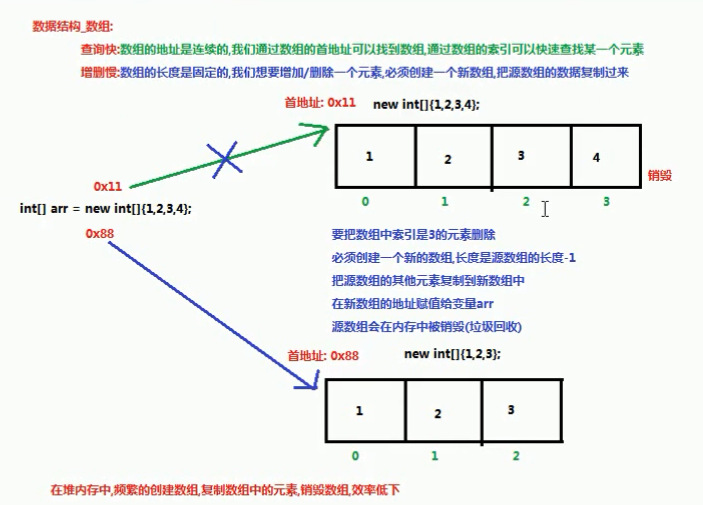

# 一、 数据结构

## 1.1 常见的数据结构

数据存储的常用结构有：栈、队列、数组、链表和红黑树。分别来了解一下：

#### 栈

- **栈**：**stack**,又称堆栈，它是运算受限的线性表，其限制是仅允许在标的一端进行插入和删除操作，不允许在其他任何位置进行添加、查找、删除等操作。

简单的说：采用该结构的集合，对元素的存取有如下的特点

- 先进后出（即，存进去的元素，要在后它后面的元素依次取出后，才能取出该元素）。例如，子弹压进弹夹，先压进去的子弹在下面，后压进去的子弹在上面，当开枪时，先弹出上面的子弹，然后才能弹出下面的子弹。
- 栈的入口、出口的都是栈的顶端位置。


两个名词需要注意：

- **压栈**：就是存元素。即，把元素存储到栈的顶端位置，栈中已有元素依次向栈底方向移动一个位置。
- **弹栈**：就是取元素。即，把栈的顶端位置元素取出，栈中已有元素依次向栈顶方向移动一个位置。

#### 队列

- **队列**：**queue**,简称队，它同堆栈一样，也是一种运算受限的线性表，其限制是仅允许在表的一端进行插入，而在表的另一端进行删除。

简单的说，采用该结构的集合，对元素的存取有如下的特点：

- 先进先出（即，存进去的元素，要在后它前面的元素依次取出后，才能取出该元素）。例如，小火车过山洞，车头先进去，车尾后进去；车头先出来，车尾后出来。
- 队列的入口、出口各占一侧。例如，下图中的左侧为入口，右侧为出口。


#### 数组

- **数组**:**Array**,是有序的元素序列，数组是在内存中开辟一段连续的空间，并在此空间存放元素。就像是一排出租屋，有100个房间，从001到100每个房间都有固定编号，通过编号就可以快速找到租房子的人。



简单的说,采用该结构的集合，对元素的存取有如下的特点：

- 查找元素快：通过索引，可以快速访问指定位置的元素

- 增删元素慢
- **指定索引位置增加元素**：需要创建一个新数组，将指定新元素存储在指定索引位置，再把原数组元素根据索引，复制到新数组对应索引的位置

#### 链表

- **链表**:**linked list**,由一系列结点node（链表中每一个元素称为结点）组成，结点可以在运行时i动态生成。每个结点包括两个部分：一个是存储数据元素的数据域，另一个是存储下一个结点地址的指针域。我们常说的链表结构有单向链表(自行车的链子，无序)与双向链表（不仅存了地址，还存了顺序），那么这里给大家介绍的是**单向链表**。


简单的说，采用该结构的集合，对元素的存取有如下的特点：

- 多个结点之间，通过地址进行连接。例如，多个人手拉手，每个人使用自己的右手拉住下个人的左手，依次类推，这样多个人就连在一起了。

- 查找元素慢：想查找某个元素，需要通过连接的节点，依次向后查找指定元素

- 增删元素快：
  - 增加元素：只需要修改连接下个元素的地址即可。
  - 删除元素：只需要修改连接下个元素的地址即可

#### 红黑树

- **二叉树**：**binary tree** ,是每个结点不超过2的有序**树（tree）** 。

简单的理解，就是一种类似于我们生活中树的结构，只不过每个结点上都最多只能有两个子结点。

二叉树是每个节点最多有两个子树的树结构。顶上的叫根结点，两边被称作“左子树”和“右子树”。


二叉树的一种比较有意思的叫做**红黑树**，红黑树本身**就是一颗二叉查找树**，将节点插入后，该树仍然是一颗二叉查找树。也就意味着，树的键值仍然是有序的。

红黑树的约束:

1. 节点可以是红色的或者黑色的
2. 根节点是黑色的
3. 叶子节点(特指空节点)是黑色的
4. 每个红色节点的子节点都是黑色的
5. 任何一个节点到其每一个叶子节点的所有路径上黑色节点数相同

红黑树的特点:

​	速度特别快,趋近平衡树,查找叶子元素最少和最多次数不多于二倍

# 二、 List集合

掌握了Collection接口的使用后，再来看看Collection接口中的子类，都具备那些特性呢？

接下来，学习Collection中的常用几个子类（`java.util.List`集合、`java.util.Set`集合）。

## 1.1 List接口介绍

`java.util.List`接口继承自`Collection`接口，是单列集合的一个重要分支，习惯性地会将实现了`List`接口的对象称为List集合。在List集合中允许出现重复的元素，所有的元素是以一种线性方式进行存储的，在程序中可以通过索引来访问集合中的指定元素。另外，List集合还有一个特点就是元素有序，即元素的存入顺序和取出顺序一致。

List接口特点：

1. 它是一个元素存取有序的集合。例如，存元素的顺序是11、22、33。那么集合中，元素的存储就是按照11、22、33的顺序完成的）。
2. 它是一个带有索引的集合，通过索引就可以精确的操作集合中的元素（与数组的索引是一个道理）。
3. 集合中可以有重复的元素，通过元素的equals方法，来比较是否为重复的元素。

## 1.2 List接口中常用方法

List作为Collection集合的子接口，不但继承了Collection接口中的全部方法，而且还增加了一些根据元素索引来操作集合的特有方法，如下：

- `public void add(int index, E element)`: 将指定的元素，添加到该集合中的指定位置上。
- `public E get(int index)`:返回集合中指定位置的元素。

- `public E remove(int index)`: 移除列表中指定位置的元素, 返回的是被移除的元素。
- `public E set(int index, E element)`:用指定元素替换集合中指定位置的元素,返回值的更新前的元素

List集合特有的方法都是跟索引相关：

```java
package com.wck.demo05list;

import java.util.ArrayList;
import java.util.Iterator;
import java.util.List;

/**
 * @author 御香烤翅
 * @create 2020-03-27 14:11
 *
 * java.util.List   public interface List<E> extends Collection<E>
 *     List是一个接口
 *  List接口的特点：
 *      1 有序的集合，存储元素和取出元素的顺序是一致的（存储为 1、2、3 取出也为 1、2、3）
 *      2 有索引，包含了一些带索引的方法
 *      3 允许存储元素重复
 *
 *  List接口中带索引的方法（特有的方法）
 *      public void add(int index, E element): 将指定的元素，添加到该集合中的指定位置上。
 *      public E get(int index):返回集合中指定位置的元素。
 *      public E remove(int index): 移除列表中指定位置的元素, 返回的是被移除的元素。
 *      public E set(int index, E element):用指定元素替换集合中指定位置的元素,返回值的更新前的元素。
 *
 *  注意：操作索引的时候，一定要防止索引越界异常
 *
 */
public class Demo01List {

    public static void main(String[] args) {
        //创建一个list集合，多态
        List<String> list =new ArrayList<>();
        list.add("a");
        list.add("b");
        list.add("c");
        list.add("d");
        list.add("a");
        System.out.println(list);//[a, b, c, d, a]

        /**
         * public void add(int index, E element): 将指定的元素，添加到该集合中的指定位置上。
         * 在c和d之间添加一个wck
         */
        list.add(3,"wck");
        System.out.println(list);//[a, b, c, wck, d, a]

        /**
         * public E remove(int index): 移除列表中指定位置的元素, 返回的是被移除的元素。
         */
        String remove = list.remove(3);
        System.out.println("被移除的元素："+remove);//被移除的元素：wck
        System.out.println(list);//[a, b, c, d, a]


        /**
         * public E set(int index, E element):用指定元素替换集合中指定位置的元素,返回值的更新前的元素。
         */
        String set = list.set(4, "e");
        System.out.println("被替换元素之前的值："+set);//被替换元素之前的值：a
        System.out.println(list);//[a, b, c, d, e]

        /**
         * public E get(int index):返回集合中指定位置的元素。
         */

        //List集合遍历有三种方式
        //1 普通的 for循环
        for (int i = 0; i < list.size(); i++) {
            //public E get(int index)
            String s = list.get(i);
            System.out.println(s);
        }
        System.out.println("-----------------");
        //2 使用迭代器
        Iterator<String> iterator = list.iterator();
        while (iterator.hasNext()){
            System.out.println(iterator.next());
        }
        System.out.println("-----------------");
        //3 使用增强for循环
        for (String s : list) {
            System.out.println(s);
        }
    }
}
```

# 三、 List的子类

## 3.1 ArrayList集合

`java.util.ArrayList`集合数据存储的结构是数组结构。元素增删慢，查找快，由于日常开发中使用最多的功能为查询数据、遍历数据，所以`ArrayList`是最常用的集合。

**开发时非常随意地使用ArrayList完成任何需求，并不严谨，这种用法是不提倡的。**

## 3.2 LinkedList集合

`java.util.LinkedList`集合数据存储的结构是链表结构。方便元素添加、删除的集合。

实际开发中对一个集合元素的添加与删除经常涉及到首尾操作，而LinkedList提供了大量首尾操作的方法。

- `public void addFirst(E e)`:将指定元素插入此列表的开头。
- `public void addLast(E e)`:将指定元素添加到此列表的结尾。

- `public E getFirst()`:返回此列表的第一个元素。
- `public E getLast()`:返回此列表的最后一个元素。

- `public E removeFirst()`:移除并返回此列表的第一个元素。
- `public E removeLast()`:移除并返回此列表的最后一个元素。

- `public E pop()`:从此列表所表示的堆栈处弹出一个元素。
- `public void push(E e)`:将元素推入此列表所表示的堆栈。
- `public boolean isEmpty()`：如果列表不包含元素，则返回true。

LinkedList是List的子类，List中的方法LinkedList都是可以使用，这里就不做详细介绍，只需要了解LinkedList的特有方法即可。在开发时，LinkedList集合也可以作为堆栈，队列的结构使用。（了解即可）

```java
package com.wck.demo6linklist;

import java.util.LinkedList;

/**
 * @author 御香烤翅
 * @create 2020-03-27 15:41
 * java.util.LinkedList implements List
 *  除了List的特点外，单独的特点为：
 *   1 底层是一个双向链表结构：查询慢，增删快
 *   2 里面包含了大量操作首尾元素的方法
 *  注意：
 *      使用LinkList集合特有的方法，就不能使用多态了
 *
 *  常用方法：
        public void addFirst(E e):将指定元素插入此列表的开头。
        public void addLast(E e):将指定元素添加到此列表的结尾。
        public void push(E e):将元素推入此列表所表示的堆栈。 此方法相当于addFirst(E) 。

        public E getFirst():返回此列表的第一个元素。
        public E getLast():返回此列表的最后一个元素。


        public E removeFirst():移除并返回此列表的第一个元素。
        public E removeLast():移除并返回此列表的最后一个元素。
        public E pop():从此列表所表示的堆栈处弹出一个元素。

        public boolean isEmpty()：如果列表不包含元素，则返回true。

 */
public class Demo01LinkList {
    public static void main(String[] args) {
        show03();
    }

    /**
     * 移除的方法
     *   public E removeFirst():移除并返回此列表的第一个元素。
     *   public E removeLast():移除并返回此列表的最后一个元素。
     *   public E pop():从此列表所表示的堆栈处弹出一个元素。 此方法想等于 removeFirst()
     */
    private static void show03() {
        //创建LinkList集合对象
        LinkedList<String> linkedList = new LinkedList<>();
        linkedList.add("a");
        linkedList.add("b");
        linkedList.add("c");

//        String removeFirst = linkedList.removeFirst();
        String removeFirst = linkedList.pop();
        System.out.println("移除的第一个元素为："+removeFirst);//移除的第一个元素为：a
        System.out.println(linkedList);//[b, c]
        String removeLast = linkedList.removeLast();
        System.out.println("移除的最后一个元素为："+removeLast);//移除的最后一个元素为：c
        System.out.println(linkedList);//[b]

    }

    /**
     * 获取的方法
     *   public E getFirst():返回此列表的第一个元素。
     *   public E getLast():返回此列表的最后一个元素。
     */
    private static void show02() {
        //创建LinkList集合对象
        LinkedList<String> linkedList = new LinkedList<>();
        linkedList.add("a");
        linkedList.add("b");
        linkedList.add("c");

        linkedList.clear();
        /**
         * Exception in thread "main" java.util.NoSuchElementException
         * clear()之后再获取，会报的错误
         *
         * 使用 isEmpty() 先判断是否为空即可
         */
        if(!linkedList.isEmpty()){
            String first = linkedList.getFirst();
            String last = linkedList.getLast();
            System.out.println(first);//a
            System.out.println(last);//c
        }
    }

    /**
     * 添加的方法
     *  public void addFirst(E e):将指定元素插入此列表的开头。
     *  public void addLast(E e):将指定元素添加到此列表的结尾。
     *  public void push(E e):将元素推入此列表所表示的堆栈。  此方法相当于addFirst(E) 。
     */
    private static void show01() {
        //创建LinkList集合对象
        LinkedList<String> linkedList = new LinkedList<>();
        linkedList.add("a");
        linkedList.add("b");
        linkedList.add("c");
        System.out.println(linkedList);//[a, b, c]
        /**
         * public void addFirst(E e):将指定元素插入此列表的开头。
         * public void push(E e):将元素推入此列表所表示的堆栈。  此方法相当于addFirst(E) 。
         */
//        linkedList.addFirst("www");
        linkedList.push("www");
        System.out.println(linkedList);//[www, a, b, c]
        /**
         * public void addLast(E e):将指定元素添加到此列表的结尾。此方法相当于add(E) 。
         */
        linkedList.addLast("com");
        System.out.println(linkedList);//[www, a, b, c, com]
    }
}

```

## 3.3 Vector集合

是java1.0早期的List集合,Vector类实现了可扩展的对象数组,其中有一些特殊的用法。但是不能使用迭代器Iterator进行迭代，是同步的，线程安全的集合

# 四、 Set接口

`java.util.Set`接口和`java.util.List`接口一样，同样继承自`Collection`接口，它与`Collection`接口中的方法基本一致，**并没有对`Collection`接口进行功能上的扩充**，只是比`Collection`接口**更加严格了**。与`List`接口不同的是，`Set`接口中元素无序，并且都会以某种规则保证存入的元素不出现重复。

`Set`集合有多个子类，这里介绍其中的`java.util.HashSet`、`java.util.LinkedHashSet`这两个集合。

> Set集合取出元素的方式可以采用：迭代器、增强for。

## 4.1 HashSet集合介绍

`java.util.HashSet`是`Set`接口的一个实现类，它所存储的元素是不可重复的，并且元素都是无序的(即存取顺序不一致)。`java.util.HashSet`底层的实现其实是一个`java.util.HashMap`支持

`HashSet`是根据对象的哈希值来确定元素在集合中的存储位置，因此具有良好的存取和查找性能。保证元素唯一性的方式依赖于：`hashCode`与`equals`方法

```java
package com.wck.demo07set;

import java.util.HashSet;
import java.util.Iterator;
import java.util.Set;

/**
 * @author 御香烤翅
 * @create 2020-03-27 16:40
 *
 * java.util.Set<E> extends Collection<E>
 *     是一个接口  Interface
 *
 *  set接口特点：
 *      1 不允许存储重复的元素
 *      2 没有索引，没有带索引的方法，不能使用普通的for循环进行遍历
 *
 *  java.util.HashSet<E> implements Set<E>
 *      HashSet特点：
 *      1 不允许存储重复的元素
 *      2 没有索引，没有带索引的方法，不能使用普通的for循环进行遍历
 *      3 是一个无序集合，存储元素的顺序和取出的顺序有可能不一致
 *      4 底层是一个哈希表结构（查询的速度非常的快）
 */
public class Demo01Set {
    public static void main(String[] args) {
        Set<Integer> hashSet = new HashSet<>();
        hashSet.add(1);
        hashSet.add(3);
        hashSet.add(2);
        hashSet.add(1);
        //无序且去重
        for (Integer i : hashSet) {
            System.out.print(i);//123
        }
        System.out.println("-------------");
        Iterator<Integer> iterator = hashSet.iterator();
        while (iterator.hasNext()){
            System.out.print(iterator.next());//123
        }
    }
}

```

### 1)、哈希值HashCode

HashCode:哈希值，是一个十进制的整数，由系统随机给出（就是对象的地址值，是一个逻辑地址，是模拟出来得到的地址，不是数据实际存储的物理地址）

```java
package com.wck.demo07set;

/**
 * @author 御香烤翅
 * @create 2020-03-27 16:57
 *
 * HashCode:哈希值，是一个十进制的整数，由系统随机给出（就是对象的地址值，是一个逻辑地址，
 *          是模拟出来得到的地址，不是数据实际存储的物理地址）
 *
 * Object 类中 ：int hashCode() 返回对象的哈希码值。
 * hashCode:源码： public native int hashCode(); 就这一句
 *      native：代表该方法调用的是本地操作系统的方法
 *
 */
public class DemoHashCode {

    public static void main(String[] args) {
        //获取hashCode
        Person p1 = new Person();
        int hashCode = p1.hashCode();
        System.out.println(hashCode);//356573597

        Person p2 = new Person();
        int hashCode2 = p2.hashCode();
        System.out.println(hashCode2);//1735600054

        /**
         *     public String toString() {
         *         return getClass().getName() + "@" + Integer.toHexString(hashCode());
         *     }
         *
         */
        System.out.println(p1.toString());//com.wck.demo07set.Person@1540e19d
        System.out.println(p2.toString());//com.wck.demo07set.Person@677327b6


        /**
         * String类的hash值
         *  String类重写了Object类的hashCode方法
         */
        String s = new String("abc");
        String s1 = new String("abc");
        System.out.println(s.hashCode());//96354
        System.out.println(s1.hashCode());//96354

        //有两个巧合的hashCode值

        System.out.println("重地".hashCode());//1179395
        System.out.println("通话".hashCode());//1179395

    }

}

```

## 4.2 HashSet集合存储数据的结构（哈希表）

什么是哈希表呢？

在JDK1.8之前，哈希表底层采用数组+链表实现，即使用链表处理冲突，同一hash值的链表都存储在一个链表里。但是当位于一个桶中的元素较多，即hash值相等的元素较多时，通过key值依次查找的效率较低。而JDK1.8中，哈希表存储采用数组+链表+红黑树实现，当链表长度超过阈值**（8）**时，将链表转换为红黑树，这样大大减少了查找时间。
简单的来说，哈希表是由数组+链表+红黑树（JDK1.8增加了红黑树部分）实现的，如下图所示。


这个是怎么存储的呢？

```java
package com.wck.demo07set;

import java.util.HashSet;

/**
 * @author 御香烤翅
 * @create 2020-03-27 19:52
 */
public class Demo02HashSetSaveString {

    public static void main(String[] args) {
        HashSet<String> hashSet = new HashSet<>();
        String s1 = new String("abc");
        String s2 = new String("abc");
        hashSet.add(s1);
        hashSet.add(s2);
        hashSet.add("重地");
        hashSet.add("通话");
        hashSet.add("abc");
        System.out.println(hashSet);//[重地, 通话, abc]
    }
}
```


为了方便理解，结合一个存储流程图来说明一下：


总而言之，**JDK1.8**引入红黑树大程度优化了HashMap的性能，那么对于我们来讲保证HashSet集合元素的唯一，其实就是根据对象的hashCode和equals方法来决定的。如果我们往集合中存放自定义的对象，那么保证其唯一，就必须复写hashCode和equals方法建立属于当前对象的比较方式。


## 4.3 HashSet存储自定义类型元素

给HashSet中存放自定义类型元素时，需要重写对象中的hashCode和equals方法，建立自己的比较方式，才能保证HashSet集合中的对象唯一

创建Person2类

```java
package com.wck.demo07set;

import java.util.Objects;

/**
 * @author 御香烤翅
 * @create 2020-03-27 20:19
 */
public class Person2 {

    private String name;
    private int age;

    public Person2() {
    }

    @Override
    public boolean equals(Object o) {
        if (this == o) return true;
        if (o == null || getClass() != o.getClass()) return false;
        Person2 person2 = (Person2) o;
        return age == person2.age &&
                Objects.equals(name, person2.name);
    }

    @Override
    public int hashCode() {

        return Objects.hash(name, age);
    }

    @Override
    public String toString() {
        return "Person2{" +
                "name='" + name + '\'' +
                ", age=" + age +
                '}';
    }

    public Person2(String name, int age) {
        this.name = name;
        this.age = age;
    }

    public String getName() {
        return name;
    }

    public void setName(String name) {
        this.name = name;
    }

    public int getAge() {
        return age;
    }

    public void setAge(int age) {
        this.age = age;
    }
}

```

```java
package com.wck.demo07set;


import java.util.HashSet;

/**
 * @author 御香烤翅
 * @create 2020-03-27 20:16
 *
 *  HashSet存储自定义类型元素
 *
 *  Set 集合保证唯一：
 *      存储的元素：（String、Integer、...Student、Person），必须重写HashCode方法和equals方法
 *
 *  要求：
 *      同名同年龄的人，视为同一个人，只能存储一次
 *
 */
public class Demo03HashSetSavePerson {

    public static void main(String[] args) {

        HashSet<Person2> set = new HashSet<>();

        Person2 p1 = new Person2("wck", 18);
        Person2 p2 = new Person2("wck", 18);
        Person2 p3 = new Person2("wck", 19);

        System.out.println(p1.hashCode());
        System.out.println(p2.hashCode());

        System.out.println(p1==p2);//是比较两个地址
        System.out.println(p1.equals(p2));//是比较值

        String abc = new String("abc");
        String abc2 = new String("abc");
        System.out.println("------------------------");
        System.out.println(abc.equals(abc2));
        System.out.println(abc==abc2);
        System.out.println("*************************");

        set.add(p1);
        set.add(p2);
        set.add(p3);

        System.out.println(set);

        /**
         *输出结果：
         * 3644564
         * 3644564
         * false
         * true
         * ------------------------
         * true
         * false
         * *************************
         * [Person2{name='wck', age=19}, Person2{name='wck', age=18}]
         */
    }
}

```

## 4.4 LinkedHashSet

HashSet保证元素唯一，可是元素存放进去是没有顺序的，那么要保证有序，怎么办呢？

在HashSet下面有一个子类`java.util.LinkedHashSet`，它是链表和哈希表组合的一个数据存储结构。

```java
package com.wck.demo07set;

import java.util.LinkedHashSet;

/**
 * @author 御香烤翅
 * @create 2020-03-27 20:38
 *
 * java.util.LinkedHashSet extends java.util.HashSet
 *
 *  LinkedHashSet集合特点：
 *      底层是一个（数组+链表/红黑树）+链表，多了一条链表（记录元素的顺序），保证元素有序
 *
 */
public class Demo04LinkedHashSet {

    public static void main(String[] args) {
        LinkedHashSet<String> linkedHashSet = new LinkedHashSet<>();
        linkedHashSet.add("abc");
        linkedHashSet.add("abc");
        linkedHashSet.add("www");
        linkedHashSet.add("com");
        System.out.println(linkedHashSet);//[abc, www, com]
    }
}

```


## 4.5 可变参数

在**JDK1.5**之后，定义一个方法需要接受多个参数，并且多个参数类型一致，可以对其简化成如下格式：

```java
修饰符 返回值类型 方法名(参数类型... 形参名){  }
```

其实这个书写完全等价与

```java
修饰符 返回值类型 方法名(参数类型[] 形参名){  }
```

只是后面这种定义，在调用时必须传递数组，而前者可以直接传递数据即可。

JDK1.5以后。出现了简化操作。… 用在参数上，称之为可变参数。

同样是代表数组，但是在调用这个带有可变参数的方法时，不用创建数组(这就是简单之处)，直接将数组中的元素作为实际参数进行传递，其实编译成的class文件，将这些元素先封装到一个数组中，在进行传递。这些动作都在编译.class文件时，自动完成了。

```java
package com.wck.demo08varagrs;

import java.util.Arrays;

/**
 * @author 御香烤翅
 * @create 2020-03-27 20:45
 *
 * 可变参数:
 * 是JDK1.5之后出现的新特性
 * 使用前提   当方法的参数列表数据类型已经确定,但是参数的个数不确定,就可以使用可变参数
 * 使用格式 :定义方法时使用
 * 修饰符 返回值类型 方法名(数据类型 变量名...){}
 * 可变参数的原理:
 *  可变参数底层就是一个数组,根据传递参数个数不同,会创建不同长度的数组,
 *  来存储这些参数传递的参数个数,可以是0个(不传递),1.2.2...多个
 */
public class Demo01VarAgrs {
    public static void main(String[] args) {

        int add = add(1, 2, 3);
        System.out.println(add);
    }

    /**
     * 使用可变参数来求和
     *  可变参数实际就是一个数组
     * @param arr
     * @return
     */
    /**
     * 可变参数的注意事项：
     *  1 一个方法的参数列表，只能有一个可变参数
     *  2 如果方法的参数有多个，那么可变参数必须写在参数的末尾
     *
     * @param arr
     * @return
     */
    public static int add(int ...arr){
        System.out.println(Arrays.toString(arr));
        int res=0;
        for (int i : arr) {
            res+=i;
        }
        return res;

    }
}

```

# 五、 Collections

## 5.1 常用功能

- `java.utils.Collections`是集合工具类，用来对集合进行操作。部分方法如下：

- `public static <T> boolean addAll(Collection<T> c, T... elements)`:往集合中添加一些元素。
- `public static void shuffle(List<?> list) 打乱顺序`:打乱集合顺序。

- `public static <T> void sort(List<T> list)`:将集合中元素按照默认规则排序。
- `public static <T> void sort(List<T> list，Comparator<? super T> )`:将集合中元素按照指定规则排序。

```java
package com.wck.demo09collections;

import java.util.ArrayList;
import java.util.Collections;

/**
 * @author 御香烤翅
 * @create 2020-03-28 9:01
 *
 * java.util.Collections  此类仅由静态方法组合或返回集合
 *
 *   java.utils.Collections是集合工具类，用来对集合进行操作。部分方法如下：
 *
 *   public static <T> boolean addAll(Collection<T> c, T... elements):往集合中添加一些元素。
 *   public static void shuffle(List<?> list) 打乱顺序:打乱集合顺序。
 *
 *
 */
public class Demo01Collections {

    public static void main(String[] args) {
        //创建集合
        ArrayList<String> list = new ArrayList<>();
        /*//往集合中添加多个元素
        list.add("a");
        list.add("b");
        list.add("c");
        System.out.println(list);//[a, b, c]*/

        /**
         * public static <T> boolean addAll(Collection<T> c, T... elements):往集合中添加一些元素。
         */

        Collections.addAll(list,"a","b","c","d","e");
        System.out.println(list);//[a, b, c, d, e]

        Collections.shuffle(list);
        System.out.println(list);//[b, e, d, a, c]

    }


}

```

## 5.2 Comparable比较器

```java
package com.wck.demo09collections;

/**
 * @author 御香烤翅
 * @create 2020-03-28 9:15
 */
public class Person implements Comparable<Person>{

    private String name;
    private Integer age;

    @Override
    public String toString() {
        return "Person{" +
                "name='" + name + '\'' +
                ", age=" + age +
                '}';
    }

    public Person(String name, Integer age) {
        this.name = name;
        this.age = age;
    }

    public Person() {
    }

    public String getName() {
        return name;
    }

    public void setName(String name) {
        this.name = name;
    }

    public Integer getAge() {
        return age;
    }

    public void setAge(Integer age) {
        this.age = age;
    }

    //重写排序的规则
    @Override
    public int compareTo(Person o) {
        //return 0;//认为元素都是相同的

        //自定义比较的规则，比较两个人的年龄(this,参数person)
//        return this.getAge() - o.getAge();//按照年龄升序排序
        return o.getAge() - this.getAge();//按照年龄降序排序
    }
}

```


```java
package com.wck.demo09collections;

import java.util.ArrayList;
import java.util.Collections;

/**
 * @author 御香烤翅
 * @create 2020-03-28 9:08
 *
 *  java.util.Collections  此类仅由静态方法组合或返回集合
 *      public static <T> void sort(List<T> list):将集合中元素按照默认规则排序。
 *
 *  注意：
 *      sort(List<T> list)使用的前提：
 *      被排序的集合里面存储的元素，必须实现Comparable，重写接口中的方法 compareTo定义排序的规则
 *
 *  Comparable接口的排序顺序：
 *      自己（this）-参数 ： 升序
 */
public class Demo02Sort {

    public static void main(String[] args) {

        ArrayList list01 = new ArrayList<Integer>();
        list01.add(1);
        list01.add(3);
        list01.add(2);
        System.out.println(list01);//[1, 3, 2]
        /**
         * public static <T> void sort(List<T> list):将集合中元素按照默认规则排序。
         */
        Collections.sort(list01);
        System.out.println(list01);//[1, 2, 3]

        ArrayList list02 = new ArrayList<String>();
        list02.add("a");
        list02.add("c");
        list02.add("b");
        list02.add("d");
        System.out.println(list02);//[a, c, b, d]
        /**
         * public static <T> void sort(List<T> list):将集合中元素按照默认规则排序。
         */
        Collections.sort(list02);
        System.out.println(list02);//[a, b, c, d]


        ArrayList<Person> list03 = new ArrayList<>();
        list03.add(new Person("张三",18));
        list03.add(new Person("李四",29));
        list03.add(new Person("王五",15));
        System.out.println(list03);//[Person{name='张三', age=18}, Person{name='李四', age=29}, Person{name='王五', age=15}]

        Collections.sort(list03);
        System.out.println(list03);//[Person{name='王五', age=15}, Person{name='张三', age=18}, Person{name='李四', age=29}]
    }
}

```

##  5.3 Comparator比较器

> 两个对象比较的结果有三种：大于，等于，小于。
>
> 如果要按照升序排序，
> 则o1 小于o2，返回（负数），相等返回0，01大于02返回（正数）
> 如果要按照降序排序
> 则o1 小于o2，返回（正数），相等返回0，01大于02返回（负数）


```java
package com.wck.demo09collections;

/**
 * @author 御香烤翅
 * @create 2020-03-28 9:57
 */
public class Student {

    private String name;
    private Integer age;

    public Student() {
    }

    @Override
    public String toString() {
        return "Student{" +
                "name='" + name + '\'' +
                ", age=" + age +
                '}';
    }

    public Student(String name, Integer age) {
        this.name = name;
        this.age = age;
    }

    public String getName() {
        return name;
    }

    public void setName(String name) {
        this.name = name;
    }

    public Integer getAge() {
        return age;
    }

    public void setAge(Integer age) {
        this.age = age;
    }
}

```

```java
package com.wck.demo09collections;

import java.util.ArrayList;
import java.util.Collections;
import java.util.Comparator;

/**
 * @author 御香烤翅
 * @create 2020-03-28 9:46
 *
 * java.util.Collections  此类仅由静态方法组合或返回集合
 *      public static <T> void sort(List<T> list，Comparator<? super T> ):将集合中元素按照指定规则排序
 *
 *  Comparator和Comparable的区别
 *      Comparable：自己（this）和别人（参数）比较，自己需要实现Comparable接口重写比较的规则compareTo（）方法
 *      Comparator:相当于找一个第三方的裁判，比较两个
 *
 *  Comparator排序规则：
 *      o1-o2：升序
 */
public class Demo03Sort {
    public static void main(String[] args) {
        ArrayList list01 = new ArrayList<Integer>();
        list01.add(1);
        list01.add(3);
        list01.add(2);
        System.out.println(list01);//[1, 3, 2]

        Collections.sort(list01, new Comparator<Integer>() {
            //重写排序规则
            @Override
            public int compare(Integer o1, Integer o2) {
//                return o1-o2;//升序
                return o2-o1;//降序
            }
        });

        System.out.println(list01);//[1, 2, 3]

        ArrayList<Student> list02 = new ArrayList<>();
        list02.add(new Student("awangwu",18));
        list02.add(new Student("lisi",20));
        list02.add(new Student("zhaoliu",16));
        list02.add(new Student("czhaoliu",18));

        System.out.println(list02);//[Student{name='wangwu', age=18}, Student{name='lisi', age=20}, Student{name='zhaoliu', age=16}]

/*        Collections.sort(list02, new Comparator<Student>() {
            @Override
            public int compare(Student o1, Student o2) {
                //按照年龄进行升序
//                return o1.getAge()-o2.getAge();

                //按照年龄进行降序
                return o2.getAge()-o1.getAge();
            }
        });*/

        Collections.sort(list02, new Comparator<Student>() {
            @Override
            public int compare(Student o1, Student o2) {
                //按照年龄升序
                int result=o1.getAge()-o2.getAge();
                if(result == 0){
                    //年龄相同，按照姓名第一个字升序
                    result=o1.getName().charAt(0) - o2.getName().charAt(0);
                }

                return result;
            }
        });


        System.out.println(list02);//[Student{name='zhaoliu', age=16}, Student{name='wangwu', age=18}, Student{name='lisi', age=20}]


    }
}

```

## 5.4 简述Comparable和Comparator两个接口的区别。

**Comparable**：强行对实现它的每个类的对象进行整体排序。这种排序被称为类的自然排序，类的compareTo方法被称为它的自然比较方法。只能在类中实现compareTo()一次，不能经常修改类的代码实现自己想要的排序。实现此接口的对象列表（和数组）可以通过Collections.sort（和Arrays.sort）进行自动排序，对象可以用作有序映射中的键或有序集合中的元素，无需指定比较器。

**Comparator**强行对某个对象进行整体排序。可以将Comparator 传递给sort方法（如Collections.sort或 Arrays.sort），从而允许在排序顺序上实现精确控制。还可以使用Comparator来控制某些数据结构（如有序set或有序映射）的顺序，或者为那些没有自然顺序的对象collection提供排序。

