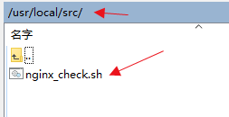
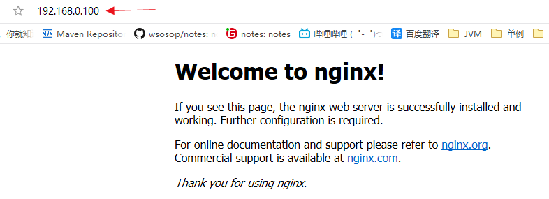

# 序、nginx

# **内容概览**

### 1、nginx 简介

- 介绍 nginx 的应用场景和具体可以做什么事情
- 介绍什么是反向代理
- 介绍什么是负载均衡
- 介绍什么是动静分离

### 2、nginx 安装

- 介绍 nginx 在 linux 系统中如何进行安装

### 3、nginx 常用的命令和配置文件

- 介绍 nginx 启动、关闭、重新加载命令
- 介绍 nginx 的配置文件
- nginx 配置实例-反向代理
- nginx 配置实例-负载均衡
- nginx 配置实例-动静分离
- nginx 原理与优化参数配置
- 搭建 nginx 高可用集群
  - 搭建 nginx 高可用集群（主从模式）
  - 搭建 nginx 高可用集群（双主模式）

# 一、nginx简介

## 1.1）Nginx 概述

Nginx ("engine x") 是一个高性能的 HTTP 和反向代理服务器,特点是占有内存少，并发能力强，事实上 nginx 的并发能力确实在同类型的网页服务器中表现较好。

## 1.2）Nginx 作为 web 服务器

Nginx 可以作为静态页面的 web 服务器，同时还支持 CGI 协议的动态语言，比如 perl、php等。但是不支持 java。Java 程序只能通过与 tomcat 配合完成。Nginx 专为性能优化而开发，性能是其最重要的考量,实现上非常注重效率 ，能经受高负载的考验,有报告表明能支持高达 50,000 个并发连接数。

## 1.3）正向代理

（1）需要在**客户端配置代理服务器**进行指定网站访问


## 1.4）反向代理

反向代理，其实**客户端对代理是无感知**的，因为客户端不需要任何配置就可以访问，我们只需要将请求发送到反向代理服务器，由反向代理服务器去选择目标服务器获取数据后，在返回给客户端，此时反向代理服务器和目标服务器对外就是一个服务器，暴露的是代理服务器地址，隐藏了真实服务器 IP 地址。


## 1.5）负载均衡

单个服务器解决不了，我们**增加服务器的数量**，然后将**请求分发到各个服务器上**，将原先请求集中到单个服务器上的情况改为将请求分发到多个服务器上，将负载分发到不同的服务器，也就是我们所说的**负载均衡**


## 1.6）动静分离

为了加快网站的解析速度，可以把**动态页面和静态页面由不同的服务器来解析**，加快解析速度。降低原来单个服务器的压力。


# 二、nginx安装

## 2.1）官网进行下载


## 2.2）准备的软件及依赖


## 2.3）安装步骤

### 2.3.1）安装pcre依赖

1.准备pcre-8.37.tar.gz 压缩包，上传到 `/usr/src`目录下：


2.解压pcre-8.37.tar.gz 


```shell
[root@localhost src]# tar -xvzf pcre-8.37.tar.gz 
```

3.解压后的文件目录


4.进入解压后的pcre-8.37文件夹中，使用`./configure`执行


```shell
[root@localhost src]# cd pcre-8.37
[root@localhost pcre-8.37]# ./configure 
```

​	**出错的情况一：**


​	①安装GCC


```shell
yum -y install gcc
```

​	②安装GCC完成


​	③重新执行4步骤

**出错的情况二：**

​	

​	①安装pcre包的时候提示缺少c++编译器，解决办法，使用yum安装


```shell
yum -y install gcc-c++
```

​	②安装gcc-c++完成


​	③重新执行4步骤

5.执行 `make && make install`编译并安装


```shell
[root@localhost pcre-8.37]# make && make install
```

6.安装完成，检查是否安装完成，使用命令 `pcre-config --version`：


```shell
[root@localhost pcre-8.37]# pcre-config --version
```

### 2.3.2）安装 openssl依赖

### 2.3.3）安装 zlib依赖

1.【2.3.2安装 openssl依赖,2.3.3安装 zlib依赖】这两个依赖使用**下面这个命令就都可以安装了**

`yum -y install make zlib zlib-devel gcc-c++ libtool	openssl openssl-devel`


```shell
[root@localhost pcre-8.37]# yum -y install make zlib zlib-devel gcc-c++ libtool openssl openssl-devel
```

2.安装成功


### 2.3.4）安装nginx

1.把nginx的安装包nginx-1.12.2.tar.gz上传到`/usr/src/`下


2.解压安装包nginx-1.12.2.tar.gz


```shell
[root@localhost src]# tar -xvzf nginx-1.12.2.tar.gz 
```

3.解压完成后，进入解压文件夹nginx-1.12.2 执行 `./configure` 


```shell
[root@localhost src]# cd nginx-1.12.2
[root@localhost nginx-1.12.2]# ./configure 
```

4.编译并且安装,执行 `make && make install`


5.安装完成


6.安装成功之后，在`/usr/`文件夹下多出来一个文件夹 `local/nginx` ,在`nginx/sbin` 文件夹下有 启动的脚本 `nginx`


```shell
[root@localhost sbin]# cd /usr/
[root@localhost usr]# ls
[root@localhost usr]# cd local/
[root@localhost local]# ls
[root@localhost local]# cd nginx/
[root@localhost nginx]# ls
[root@localhost nginx]# cd sbin/
[root@localhost sbin]# ls
[root@localhost sbin]# 
```

### 2.3.5）检查nginx安装是否成功

1.进入nginx执行脚本的文件夹  `/usr/local/nginx/sbin/` 启动nginx


```shell
[root@localhost sbin]# cd /usr/local/nginx/sbin/
[root@localhost sbin]# ls
[root@localhost sbin]# ./nginx
```

2.查看进程，启动成功 `ps -ef | grep nginx | grep -v grep`


```shell
[root@localhost sbin]# ps -ef | grep nginx | grep -v grep
```

### 2.3.6）访问不了，开放端口号

```shell
查看开放的端口号

firewall-cmd --list-all

设置开放的端口号

firewall-cmd --add-service=http –permanent

sudo firewall-cmd --add-port=80/tcp --permanent

重启防火墙

firewall-cmd –reload
```

# 三、nginx 常用的命令

使用命令前提：要先进入`/usr/local/nginx/sbin`  这个目录中去

### 3.1）查看nginx版本号  `./nginx -v`


```shell
[root@localhost sbin]# cd /usr/local/nginx/sbin
[root@localhost sbin]# ls
[root@localhost sbin]# ./nginx -v
```

### 3.2）启动nginx `./nginx` 


```shell
[root@localhost sbin]# ./nginx 
[root@localhost sbin]# ps -ef | grep nginx | grep -v grep
```

### 3.3）关闭nginx `./nginx -s stop`


```shell
[root@localhost sbin]# ./nginx -s stop
[root@localhost sbin]# ps -ef | grep nginx | grep -v gre
```

### 3.4）重新加载nginx `./nginx -s reload`


```shell
[root@localhost sbin]# ./nginx -s reload
```

# 四、nginx配置文件

## 4.1）nginx配置文件位置 `/usr/local/nginx/conf/nginx.conf`


```shell
[root@localhost conf]# cd /usr/local/nginx/conf
[root@localhost conf]# ls
```

## 4.2）nginx配置文件组成

nginx.conf 去除注释后的配置内容：

```shell
worker_processes  1;

events {
    worker_connections  1024;
}

http {
    include       mime.types;
    default_type  application/octet-stream;

    sendfile        on;

    keepalive_timeout  65;

    server {
        listen       80;
        server_name  localhost;
        location / {
            root   html;
            index  index.html index.htm;
        }
        error_page   500 502 503 504  /50x.html;
        location = /50x.html {
            root   html;
        }


    }
}
```

**根据上述文件，我们可以很明显的将 nginx.conf 配置文件分为三部分**

### 4.2.1）nginx配置文件有三部分组成

#### ①全局块

从配置文件开始到 events 块之间的内容，主要会设置一些影响 nginx 服务器整体运行的配置指令，主要包括配置运行 Nginx 服务器的用户（组）、允许生成的 worker process 数，进程 PID 存放路径、日志存放路径和类型以及配置文件的引入等。

比如上面第一行配置的：

```shell
#这是 Nginx 服务器并发处理服务的关键配置，worker_processes 值越大，可以支持的并发处理量也越多，但是会受到硬件、软件等设备的制约
worker_processes  1;
 
```

#### ②events块

events 块涉及的指令主要影响 Nginx 服务器与用户的网络连接，常用的设置包括是否开启对多 work process 下的网络连接进行序列化，是否允许同时接收多个网络连接，**选取哪种事件驱动模型**来处理连接请求，每个 word process 可以同时支持的最大连接数等。

```shell
events {
#表示每个 work process 支持的最大连接数为 1024. 
#这部分的配置对 Nginx 的性能影响较大，在实际中应该灵活配置。
    worker_connections  1024;
}
```

#### ③http块

这算是 Nginx 服务器配置中最频繁的部分，**代理、缓存和日志**定义等**绝大多数功能和第三方模块**的配置都在这里。

需要注意的是：http 块也可以包括 **http** **全局块**、**server** **块**。

```shell
http {
    include       mime.types;
    default_type  application/octet-stream;

    sendfile        on;

    keepalive_timeout  65;

    server {
        listen       80;
        server_name  localhost;
        location / {
            root   html;
            index  index.html index.htm;
        }
        error_page   500 502 503 504  /50x.html;
        location = /50x.html {
            root   html;
        }
    }
}
```

#### 3.1）http全局块

http 全局块配置的指令包括**文件引入、MIME-TYPE 定义、日志自定义、连接超时时间、单链接请求数上限**等。

#### 3.2）server块

这块和**虚拟主机**有密切关系，虚拟主机从用户角度看，和一台独立的硬件主机是完全一样的，该技术的产生是为了节省互联网服务器硬件成本。

每个 **http 块可以包括多个 server 块**，而每个 server 块就相当于**一个虚拟主机**。

而每个 **server 块**也分为**全局 server 块**，以及可以同时**包含多个 locaton 块**。

##### 3.2.1）、全局server块

最常见的配置是本虚拟机主机的监听配置和本虚拟主机的名称或 IP 配置

##### 3.2.2）、server块

一个 server 块可以配置**多个 location 块**。

这块的主要作用是基于 **Nginx 服务器接收到的请求字符串**（例如 server_name/uri-string），对**虚拟主机名称（也可以是 IP 别名）之外的字符串**（例如 前面的 /uri-string）进行匹配，对特定的**请求进行处理。地址定向、数据缓存和应答控制**等功能，还有许多**第三方模块的配置**也在这里进行。


**location 指令说明**

该指令用于匹配 URL。

 语法如下：


1、**=** ：用于不含正则表达式的 uri 前，要求请求字符串与 uri 严格匹配，如果匹配成功，就停止继续向下搜索并立即处理该请求。

2、**~**：用于表示 uri 包含正则表达式，并且区分大小写。

3、**~***：用于表示 uri 包含正则表达式，并且不区分大小写。

4、**^~**：用于不含正则表达式的 uri 前，要求 Nginx 服务器找到标识 uri 和请求字符串匹配度最高的 location 后，立即使用此 location 处理请求，而不再使用 location 块中的正则 uri 和请求字符串做匹配。

注意：**如果 uri 包含正则表达式，则必须要有 ~ 或者 ~* 标识。**


# 五、nginx配置1-反向代理实例1

## 5.1）实现效果

实现效果：使用 nginx 反向代理，访问 http://192.168.1.102/ （虚拟机的ip）直接跳转到 127.0.0.1:8080(tomcat页面)

## 5.2）准备工作：安装tomcat

在linux上安装tomcat，使用默认端口 8080

①上传tomcat安装包apache-tomcat-7.0.70.tar.gz到 `/usr/src` 目录下


```shell
[root@localhost src]# cd /usr/src
[root@localhost src]# ls
```

②解压apache-tomcat-7.0.70.tar.gz `tar -xvzf apache-tomcat-7.0.70.tar.gz` 


```shell
[root@localhost src]# tar -xvzf apache-tomcat-7.0.70.tar.gz 
```

③进入解压的目录下 `/usr/src/apache-tomcat-7.0.70/bin`


```shell
[root@localhost bin]# cd /usr/src/apache-tomcat-7.0.70/bin
[root@localhost bin]# ./startup.sh 
```

④检查是否启动成功


```shell
[root@localhost bin]# ./startup.sh
[root@localhost bin]# ps -ef | grep tomcat | grep -v grep
```

## 5.3）配置nginx

1.配置nginx.conf


```shell
server {
    listen       80;
    #server_name  localhost
    server_name  192.168.1.102;

    #charset koi8-r;

    #access_log  logs/host.access.log  main;

    location / {
        root   html;
        #添加下面一行，转发到tomcat
        proxy_pass http://127.0.0.1:8080;
        index  index.html index.htm;
    }
```
2.重新加载nginx  `./nginx -s reload`

3.测试访问


# 六、nginx配置1-反向代理实例2

## 6.1）实现效果：

使用 nginx 反向代理，根据访问的路径跳转到不同端口的服务中 nginx 监听端口为 8001，

访问 http://127.0.0.1:8001/test/ 直接跳转到 127.0.0.1:8081 访问 http://127.0.0.1:8001/test1/ 直接跳转到 127.0.0.1:9080

## 6.2）准备两个tomcat 8080,9080

对应的修改端口就行了

## 6.3）两个tomcat 8080,9080准备区分页面

在两个tomcat 文件夹 `/usr/src/8080apache-tomcat-7.0.70/webapps/test` 、`/usr/src/8080apache-tomcat-7.0.70/webapps/test1`路径中分别添加 `a.html`文件用于区分8080端口tomcat和9080端口tomcat

a.html文件内容，8080对应 8080 ； 9080 对应 9080

```html
<h1>8080!</h1>
```

```html
<h1>9080!</h1>
```


## 6.4）nginx.conf配置文件配置反向代理

在nginx.conf配置文件中新增加http下的server配置


```shell
    server {
        listen       8001;
        server_name  192.168.1.102;

        location ~ /test/ {
           proxy_pass http://127.0.0.1:8080;
        }

        location ~ /test1/ {
           proxy_pass http://127.0.0.1:9080;
        }
    }
```

## 6.5）重新加载nginx  `./nginx -s reload`

## 6.6)测试反向代理


# 七、nginx配置2-负载均衡实例

## 7.1）、实现效果

浏览器地址栏输入地址 http://192.168.1.102:8080/edu/a.html，负载均衡效果，平均 8080和9080 端口中

## 7.2）、准备工作

准备两台 tomcat 服务器，一台 8080，一台 9080，在两台 tomcat 里面 webapps 目录中，创建名称是 edu 文件夹，在 edu 文件夹中创建页面 a.html，用于测试。

此步骤参考上面安装tomcat 和准备两个tomcat 步骤

## 7.3）、nginx.conf配置文件配置负载均衡

1.nginx.conf配置


```shell
#这里要定义的配置负载的服务器列表
# myserver是下面代理 proxy_pass 要引用的名称，可以相当于是id
upstream myserver{
        server 192.168.1.102:8080;
        server 192.168.1.102:9080;
   }
    server {
        listen       80;
        server_name  192.168.1.102;

        #charset koi8-r;

        #access_log  logs/host.access.log  main;

        location / {
            root   html;
        #请求代理到 配置的myserver上
	    proxy_pass http://myserver;
            index  index.html index.htm;
        }
```

2.重新加载nginx  `./nginx -s reload`

3.访问浏览器即可看到负载的页面显示，这里就不截图了

## 7.4）、负载均衡-Nginx 提供了几种分配方式(策略)

- **第一种 轮询（默认）**

  每个请求按时间顺序逐一分配到不同的后端服务器，如果后端服务器 down 掉，能自动剔除。

- **第二种 weight**

  weight 代表权重默认为 1,权重越高被分配的客户端越多

- **第三种 ip_hash**

  每个请求按访问 ip 的 hash 结果分配，这样每个访客固定访问一个后端服务器

- **第四种 fair（第三方）**

  按后端服务器的响应时间来分配请求，响应时间短的优先分配。

# 八、nginx配置3-动静分离

## 8.1）什么是动静分离


- 一种是纯粹把静态文件**独立成单独的域名**，放在**独立的服务器上**，也是**目前主流推崇的方案**；

- 另外一种方法就是动态跟静态文件混合在一起发布，通过 nginx 来分开。

通过 location 指定不同的后缀名实现不同的请求转发。通过 expires 参数设置，可以使浏览器缓存过期时间，减少与服务器之前的请求和流量。具体 Expires 定义：是给一个资源设定一个过期时间，也就是说无需去服务端验证，直接通过浏览器自身确认是否过期即可，所以不会产生额外的流量。此种方法非常适合不经常变动的资源。（如果经常更新的文件，不建议使用 Expires 来缓存），我这里设置 3d，表示在这 3 天之内访问这个 URL，发送一个请求，比对服务器该文件最后更新时间没有变化，则不会从服务器抓取，返回状态码304，如果有修改，则直接从服务器重新下载，返回状态码 200。

## 8.2）准备工作

在linux根目录选创建相应的文件夹目录如下


`images` 文件夹里面有 一张图片:

​	01.png

`www`里面有一个页面，内容如下：

```html
<h1>static resource!</h1>
```


## 8.3）nginx.config配置动态分离

①配置nginx.config文件


```shell
server {
        listen       80;
        #自己的ip地址，也可以使用upstream 来指定
        server_name  192.168.1.102;

        #charset koi8-r;

        #access_log  logs/host.access.log  main;
        #配置路径 注意，此配置是 拦截在 /www目录下的请求，然后转到 /data/www/下去找资源文件
        location /www/ {
            root   /data/;
        }
	    #配置路径 注意，此配置是 拦截在 /www目录下的请求，然后转到 /data/images/下去找资源文件
        location /images/ {
            root   /data/;
            autoindex on; #列出文件的索引
        }
```

②重新加载nginx  `./nginx -s reload`

③最终测试

http://192.168.1.102/www/a.html ->请求到了静态的页面

http://192.168.1.102/images/01.png ->请求到了静态的图片

# 九、nginx配置高可用集群

## 9.1）什么是高可用


- 需要两台 nginx 服务器

- 需要 keepalived

- 需要虚拟 ip

## 9.2）配置高可用集群的准备工作

（1）需要两台服务器 192.168.0.103和 192.168.0.104

（2）在两台服务器安装 nginx【之前已经介绍，按照之前的步骤安装】

（3）在两台服务器安装 keepalived

## 9.3）在两台服务器安装 keepalived

1.使用 yum 命令进行安装 `yum install keepalived –y`


```shell
[root@localhost usr]# pwd
/usr
[root@localhost usr]# yum install keepalived ?y
```

2.检查keepalived安装的版本`rpm -q -a keepalived`


```shell
[root@localhost usr]# rpm -q -a keepalived
[root@localhost usr]# 
```

3.keepalived的安装目录为：


```shell
[root@localhost keepalived]# cd /etc/keepalived/
[root@localhost keepalived]# ls
[root@localhost keepalived]# 
```

## 9.4）高可用配置

1.进入keepalived的安装目录中修改 主 `keepalived.conf` 配置

```shell
! Configuration File for keepalived

global_defs {
 #  notification_email {
 #    acassen@firewall.loc
 #    failover@firewall.loc
 #    sysadmin@firewall.loc
 #  }
 #  notification_email_from Alexandre.Cassen@firewall.loc
 #  smtp_server 192.168.200.1
 #  smtp_connect_timeout 30
   router_id keep2
 #  vrrp_skip_check_adv_addr
 #  vrrp_strict
 #  vrrp_garp_interval 0
 #  vrrp_gna_interval 0
}
vrrp_script chk_nginx {
        script "/usr/local/src/nginx_check.sh"
        interval 2
        weight -20
}
vrrp_instance VI_1 {
    state BACKUP # 标识为主服务 备份服务器上将 MASTER 改为 BACKUP
    interface enp0s3 #绑定虚拟机的IP
    virtual_router_id 51 # 虚拟路由id，和从机保持一致
    #mcast_src_ip 192.168.126.2  #本机ip
    priority 90 #权重，需要高于从机
    advert_int 1
    authentication {
        auth_type PASS
        auth_pass 1111
    }
   track_script {
                chk_nginx ## 执行 Nginx 监控的服务
        }
    virtual_ipaddress {
        192.168.0.100 #/32 brd 255.255.255.0 dev ens33 label ens33:vip #虚拟IP地址
#        192.168.200.17
#        192.168.200.18
    }
}
```

2.进入keepalived的安装目录中修改 从 `keepalived.conf` 配置

```shell
! Configuration File for keepalived

global_defs {
 #  notification_email {
 #    acassen@firewall.loc
 #    failover@firewall.loc
 #    sysadmin@firewall.loc
 #  }
 #  notification_email_from Alexandre.Cassen@firewall.loc
 #  smtp_server 192.168.200.1
 #  smtp_connect_timeout 30
   router_id keep2
 #  vrrp_skip_check_adv_addr
 #  vrrp_strict
 #  vrrp_garp_interval 0
 #  vrrp_gna_interval 0
}
vrrp_script chk_nginx {
        script "/usr/local/src/nginx_check.sh"
        interval 2
        weight -20
}
vrrp_instance VI_1 {
    state BACKUP # 标识为主服务 备份服务器上将 MASTER 改为 BACKUP
    interface enp0s3 #绑定虚拟机的IP
    virtual_router_id 51 # 虚拟路由id，和从机保持一致
    #mcast_src_ip 192.168.126.2  #本机ip
    priority 90 #权重，需要高于从机
    advert_int 1
    authentication {
        auth_type PASS
        auth_pass 1111
    }
   track_script {
                chk_nginx ## 执行 Nginx 监控的服务
        }
    virtual_ipaddress {
        192.168.0.100 #/32 brd 255.255.255.0 dev ens33 label ens33:vip #虚拟IP地址
#        192.168.200.17
#        192.168.200.18
    }
}
```


3.在`/usr/local/src` 添加检测脚本 `nginx_check.sh`



```shell
#!/bin/bash
counter=$(ps -C nginx --no-heading|wc -l)
if [ "${counter}" = "0" ]; then
    /usr/local/nginx/sbin/nginx
    sleep 2
    counter=$(ps -C nginx --no-heading|wc -l)
    if [ "${counter}" = "0" ]; then
        /etc/init.d/keepalived stop
    fi
fi
```

①检查nginx_check.sh是否有执行权限，没有则，添加执行权限`chmod +x nginx_check.sh`


```shell
[root@localhost src]# ll
[root@localhost src]# chmod +x nginx_check.sh
[root@localhost src]# 
```

②、检查看`nginx_check.sh` 里面的 `killall`命令是否支持


不支持，需要安装 `yum install psmisc -y` 

```shell
[root@localhost sbin]# killall keepalived
[root@localhost sbin]# yum install psmisc -y 
```


4.把两台服务器上 nginx 和 keepalived 启动

- 启动 nginx：`./nginx`

- 启动 keepalived：`systemctl start keepalived.service`


```shell
[root@localhost sbin]# ./nginx 
[root@localhost sbin]# systemctl start keepalived.service
[root@localhost sbin]# ps -ef | grep keepalived | grep -v grep
[root@localhost sbin]# ps -ef | grep nginx | grep -v grep
[root@localhost sbin]# systemctl status -l keepalived
```

5.测试是否成功：停掉主服务器上的 nginx 访问  **192.168.0.100** 也能正常访问




备注：

- 查看错误日志路径 `/var/log/messages`

- 查看是否绑定到了ip 命令：`ip a`


# 十、nginx原理


- master-workers 的机制的好处

  首先，对于每个 worker 进程来说，独立的进程，不需要加锁，所以省掉了锁带来的开销，同时在编程以及问题查找时，也会方便很多。其次，采用独立的进程，可以让互相之间不会

  影响，一个进程退出后，其它进程还在工作，服务不会中断，master 进程则很快启动新的 worker 进程。当然，worker 进程的异常退出，肯定是程序有 bug 了，异常退出，会导致当前 worker 上的所有请求失败，不过不会影响到所有请求，所以降低了风险。

- 需要设置多少个 worker

  Nginx 同 redis 类似都采用了 io 多路复用机制，每个worker都是一个独立的进程，但每个进程里只有一个主线程，通过异步非阻塞的方式来处理请求， 即使是千上万个请求也不在话下。每个 worker 的线程可以把一个 cpu 的性能发挥到极致。所以 worker 数和服务器的 cpu 数相等是最为适宜的。设少了会浪费 cpu，设多了会造成 cpu 频繁切换上下文带来的损耗。

```shell
#设置 worker 数量。
worker_processes 4
#work 绑定 cpu(4 work 绑定 4cpu)。
worker_cpu_affinity 0001 0010 0100 1000
#work 绑定 cpu (4 work 绑定 8cpu 中的 4 个) 。
worker_cpu_affinity 0000001 00000010 00000100 00001000
```

- 连接数 worker_connection

  这个值是表示每个 worker 进程所能建立连接的最大值，所以，一个 nginx 能建立的最大连接数，应该是 	worker_connections * worker_processes。当然，这里说的是最大连接数，对于 HTTP 请 求 本 地 资 源来说 ， 能 够 支 持 的 最大 并 发 数 量 是 **worker_connections * worker_processes**，如果是支持 http1.1 的浏览器每次访问要占**两个连接**，所以普通的静态访问最大并发数是： **worker_connections * worker_processes /2**，而如果是 **HTTP 作 为反向代理来说**，最大并发数量应该是 **worker_connections *worker_processes/4**。因为作为反向代理服务器，每个并发会建立与客户端的连接和与后端服务的连接，会占用两个连接。


总结以上的描述：

## 10.1）一个 master 和多个 woker 有好处

- 可以使用 nginx –s reload 热部署，利用 nginx 进行热部署操作
- 每个 woker 是独立的进程，如果有其中的一个 woker 出现问题，其他 woker 独立的，继续进行争抢，实现请求过程，不会造成服务中断

## 10.2）设置多少个 woker 合适

- worker 数和服务器的 cpu 数相等是最为适宜的

## 10.3）连接数 worker_connection

- 发送一个请求，占用了 woker 的几个连接数？答案：2 或者 4 个

注意：当是请求一个静态资源服务器的时候，是两个连接数（静态资源，css,js）

​			当是请求一个动态资源服务器的时候是4个连接数(还要进行转发到tomcat)


## 10.4）最大并发数

- nginx 有一个 master，有4个 woker（worker_processes），每个 woker 支持最大的连接数（worker_connections） 1024，支持的最大并发数是多少？

普通的静态访问最大并发数是： worker_connections * worker_processes /2，而如果是 HTTP 作 为反向代理来说，最大并发数量应该是 worker_connections * worker_processes/4。

普通静态资源:(1024*4)/2 =2048

动态资源:(1024*4)/4 =1024